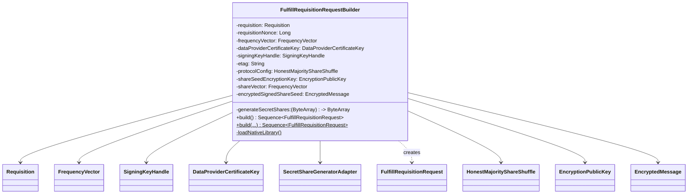

# org.wfanet.measurement.eventdataprovider.requisition.v2alpha.shareshuffle

## Overview

This package implements the Honest Majority Share Shuffle (HMSS) protocol for fulfilling measurement requisitions. It generates secret shares from frequency vectors and creates encrypted, signed requisition fulfillment requests that Event Data Providers (EDPs) send to Duchies. The package handles cryptographic operations including share generation, seed encryption, and chunked data transmission.

## Components

### FulfillRequisitionRequestBuilder

Builds a sequence of FulfillRequisitionRequest messages for the Honest Majority Share Shuffle protocol. Validates requisition parameters, generates secret shares from frequency vectors using native cryptographic libraries, encrypts share seeds, and packages the results into chunked RPC messages.

| Method | Parameters | Returns | Description |
|--------|------------|---------|-------------|
| build | - | `Sequence<FulfillRequisitionRequest>` | Generates header and chunked body requests for requisition fulfillment |

#### Constructor Parameters

| Parameter | Type | Description |
|-----------|------|-------------|
| requisition | `Requisition` | The requisition being fulfilled |
| requisitionNonce | `Long` | Nonce value for the requisition |
| frequencyVector | `FrequencyVector` | Payload containing frequency data to be shared |
| dataProviderCertificateKey | `DataProviderCertificateKey` | Certificate key of the fulfilling data provider |
| signingKeyHandle | `SigningKeyHandle` | Key handle for signing the random seed |
| etag | `String` | Entity tag for optimistic concurrency control |
| generateSecretShares | `(ByteArray) -> ByteArray` | Function for generating secret shares (defaults to native adapter) |

#### Companion Object

| Method | Parameters | Returns | Description |
|--------|------------|---------|-------------|
| build | `requisition: Requisition, requisitionNonce: Long, frequencyVector: FrequencyVector, dataProviderCertificateKey: DataProviderCertificateKey, signingKeyHandle: SigningKeyHandle, etag: String, generateSecretShares: (ByteArray) -> ByteArray` | `Sequence<FulfillRequisitionRequest>` | Convenience factory method for building requests |
| loadNativeLibrary | - | `Unit` | Loads secret share generator native library at initialization |

#### Constants

| Name | Value | Description |
|------|-------|-------------|
| RPC_CHUNK_SIZE_BYTES | 32768 | Chunk size for splitting share vector (32 KiB) |
| NATIVE_LIB_NAME | "secret_share_generator_adapter" | Name of native library for share generation |
| NATIVE_LOADER_OBJECT_NAME | "org.wfanet.measurement.eventdataprovider.requisition.Native" | Fully qualified name of native loader object |

## Key Functionality

### Protocol Validation

- Extracts and validates exactly one HonestMajorityShareShuffle protocol configuration from the requisition
- Verifies ring modulus is greater than 1
- Validates exactly two duchy entries in the requisition
- Ensures exactly one duchy provides the encryption public key

### Secret Share Generation

- Converts frequency vector data into secret shares using the native `secret_share_generator_adapter` library
- Applies the configured ring modulus from the HMSS protocol configuration
- Extracts share vector and share seed from the generated secret share
- Validates frequency vector contains at least one data element

### Cryptographic Operations

- Signs the share seed using the data provider's signing key handle
- Encrypts the signed share seed using the duchy's public encryption key
- Computes requisition fingerprint for integrity verification
- Packages encrypted seed into the request header

### Request Serialization

- Creates a header request containing metadata: requisition name, fingerprint, nonce, protocol config, encrypted seed, register count, and certificate
- Serializes share vector to bytes and splits into 32 KiB chunks
- Yields a sequence of requests: one header followed by multiple body chunks
- Each body chunk contains a portion of the share vector data

### Native Library Loading

- Attempts to load native library via `NativeLibraryLoader` by name
- Falls back to system library path if named loader is unavailable
- Loads library in static initializer block to ensure availability before use

## Dependencies

- `org.wfanet.frequencycount` - Secret share generation, frequency vector structures
- `org.wfanet.measurement.api.v2alpha` - Protocol buffers for requisitions, encryption keys, fulfillment requests
- `org.wfanet.measurement.common.crypto` - Signing key handles for cryptographic operations
- `org.wfanet.measurement.common` - Native library loading utilities
- `org.wfanet.measurement.consent.client.dataprovider` - Requisition fingerprinting, seed encryption and signing

## Usage Example

```kotlin
import org.wfanet.frequencycount.frequencyVector
import org.wfanet.measurement.api.v2alpha.DataProviderCertificateKey
import org.wfanet.measurement.api.v2alpha.Requisition
import org.wfanet.measurement.common.crypto.SigningKeyHandle
import org.wfanet.measurement.eventdataprovider.requisition.v2alpha.shareshuffle.FulfillRequisitionRequestBuilder

// Prepare frequency vector from event data
val frequencyVector = frequencyVector {
  data += listOf(1L, 2L, 3L, 5L, 8L)
}

// Build fulfillment requests
val requests = FulfillRequisitionRequestBuilder.build(
  requisition = requisition,
  requisitionNonce = 12345L,
  frequencyVector = frequencyVector,
  dataProviderCertificateKey = certificateKey,
  signingKeyHandle = signingKeyHandle,
  etag = "current-etag-value"
)

// Send requests to requisition fulfillment service
requisitionFulfillmentStub.fulfillRequisition(requests.asFlow())
```

## Class Diagram



## Native Library Dependency

This package requires the `libsecret_share_generator_adapter.so` native library for secret share generation. The library is loaded automatically on class initialization. Deployment options include:

- Use the `org.wfanet.measurement.eventdataprovider:requisition-native` Maven artifact containing precompiled libraries
- Build the library using Bazel target `@any_sketch_java//src/main/java/org/wfanet/frequencycount:secret_share_generator_adapter`
- Add the compiled library to the Java library path

## Error Conditions

The constructor throws `IllegalArgumentException` when:

- Zero or multiple HonestMajorityShareShuffle protocol configurations are found (expects exactly one)
- Ring modulus is less than or equal to 1
- Requisition does not contain exactly two duchy entries
- Zero or multiple duchies provide encryption public keys (expects exactly one)
- Frequency vector is empty (size must be greater than 0)
