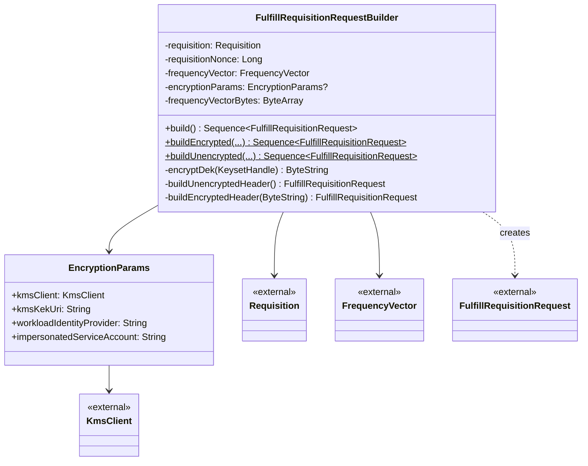

# org.wfanet.measurement.eventdataprovider.requisition.v2alpha.trustee

## Overview
This package provides requisition fulfillment functionality for the TrusTEE protocol within the Event Data Provider system. It handles the construction of FulfillRequisitionRequest messages with both encrypted and unencrypted frequency vector payloads, supporting envelope encryption via KMS for secure data transmission.

## Components

### FulfillRequisitionRequestBuilder
Builder class that constructs a sequence of FulfillRequisitionRequest messages for requisition fulfillment in the TrusTEE protocol. Supports both encrypted and unencrypted payload transmission with automatic chunking for streaming RPC delivery.

| Method | Parameters | Returns | Description |
|--------|------------|---------|-------------|
| build | None | `Sequence<FulfillRequisitionRequest>` | Generates sequence of chunked fulfillment requests |
| buildEncrypted | `requisition: Requisition`, `requisitionNonce: Long`, `frequencyVector: FrequencyVector`, `encryptionParams: EncryptionParams` | `Sequence<FulfillRequisitionRequest>` | Creates encrypted request sequence (companion) |
| buildUnencrypted | `requisition: Requisition`, `requisitionNonce: Long`, `frequencyVector: FrequencyVector` | `Sequence<FulfillRequisitionRequest>` | Creates unencrypted request sequence (companion) |

**Constructor Parameters:**
- `requisition: Requisition` - The requisition being fulfilled
- `requisitionNonce: Long` - Nonce value from encrypted_requisition_spec
- `frequencyVector: FrequencyVector` - Payload data for fulfillment
- `encryptionParams: EncryptionParams?` - Encryption parameters (null for unencrypted mode)

**Behavior:**
- Validates exactly one TrusTEE protocol configuration exists
- Validates frequency vector size > 0 and values in range [0, 255]
- Chunks payload into 32 KiB segments for streaming
- Registers Tink AEAD and StreamingAEAD configurations on initialization
- Uses AES256_GCM_HKDF_1MB key template for encryption

## Data Structures

### EncryptionParams
| Property | Type | Description |
|----------|------|-------------|
| kmsClient | `KmsClient` | Key management system client |
| kmsKekUri | `String` | Key encryption key URI |
| workloadIdentityProvider | `String` | Workload identity provider resource name |
| impersonatedServiceAccount | `String` | Service account name to impersonate |

## Dependencies

- `com.google.crypto.tink.*` - Cryptographic key management and encryption operations
- `org.wfanet.frequencycount.FrequencyVector` - Frequency count payload data structure
- `org.wfanet.measurement.api.v2alpha.*` - Kingdom API protobuf definitions for requisitions and encryption
- `org.wfanet.measurement.common.crypto.tink.StreamingEncryption` - Streaming encryption utilities for chunked data
- `org.wfanet.measurement.consent.client.dataprovider` - Requisition fingerprint computation

## Usage Example

```kotlin
// Unencrypted fulfillment
val requisition: Requisition = // ... obtained from Kingdom
val nonce: Long = // ... extracted from encrypted requisition spec
val frequencyVector: FrequencyVector = // ... computed from event data

val requests = FulfillRequisitionRequestBuilder.buildUnencrypted(
  requisition = requisition,
  requisitionNonce = nonce,
  frequencyVector = frequencyVector
)

// Stream to Kingdom API
requests.forEach { request ->
  kingdomApiClient.fulfillRequisition(request)
}

// Encrypted fulfillment with KMS
val kmsClient: KmsClient = // ... configured KMS client
val encryptionParams = FulfillRequisitionRequestBuilder.EncryptionParams(
  kmsClient = kmsClient,
  kmsKekUri = "gcp-kms://projects/my-project/locations/us/keyRings/ring/cryptoKeys/key",
  workloadIdentityProvider = "//iam.googleapis.com/projects/123/locations/global/workloadIdentityPools/pool/providers/provider",
  impersonatedServiceAccount = "tee-workload@project.iam.gserviceaccount.com"
)

val encryptedRequests = FulfillRequisitionRequestBuilder.buildEncrypted(
  requisition = requisition,
  requisitionNonce = nonce,
  frequencyVector = frequencyVector,
  encryptionParams = encryptionParams
)

encryptedRequests.forEach { request ->
  kingdomApiClient.fulfillRequisition(request)
}
```

## Class Diagram


