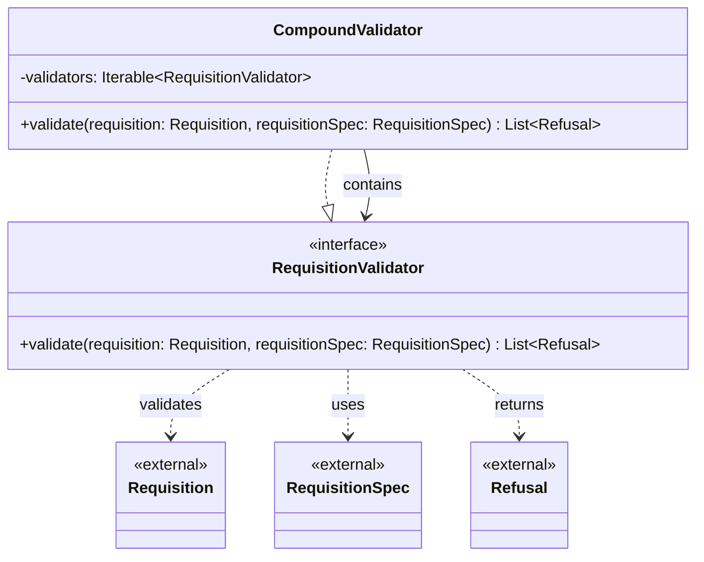

# org.wfanet.measurement.eventdataprovider.validation

## Overview
This package provides validation infrastructure for requisitions in the Event Data Provider system. It defines interfaces and implementations for validating requisitions against their specifications, with support for composing multiple validators and generating structured refusal results when validation fails.

## Components

### RequisitionValidator
Functional interface for validating requisitions against their specifications. Requisitions that fail validation will be refused and no result will be computed for them.

| Method | Parameters | Returns | Description |
|--------|------------|---------|-------------|
| validate | `requisition: Requisition`, `requisitionSpec: RequisitionSpec` | `List<Requisition.Refusal>` | Validates the requisition and returns refusal reasons if invalid, empty list if valid |

### CompoundValidator
Composite validator that applies multiple validators sequentially to a requisition. Validators are applied in order, and all refusals from all validators are collected and returned.

| Method | Parameters | Returns | Description |
|--------|------------|---------|-------------|
| validate | `requisition: Requisition`, `requisitionSpec: RequisitionSpec` | `List<Requisition.Refusal>` | Applies all validators and aggregates their refusal results |

**Constructor Parameters:**
| Parameter | Type | Description |
|-----------|------|-------------|
| validators | `Iterable<RequisitionValidator>` | Collection of validators to apply in sequence |

## Dependencies
- `org.wfanet.measurement.api.v2alpha` - Provides Requisition and RequisitionSpec data types and Requisition.Refusal result type

## Usage Example
```kotlin
// Create individual validators
val validator1 = RequisitionValidator { req, spec ->
  // validation logic
  emptyList()
}
val validator2 = RequisitionValidator { req, spec ->
  // validation logic
  listOf(Requisition.Refusal.newBuilder().build())
}

// Compose validators
val compoundValidator = CompoundValidator(listOf(validator1, validator2))

// Validate a requisition
val requisition = Requisition.newBuilder().build()
val spec = RequisitionSpec.newBuilder().build()
val refusals = compoundValidator.validate(requisition, spec)

if (refusals.isEmpty()) {
  // Process valid requisition
} else {
  // Handle validation failures
}
```

## Class Diagram

