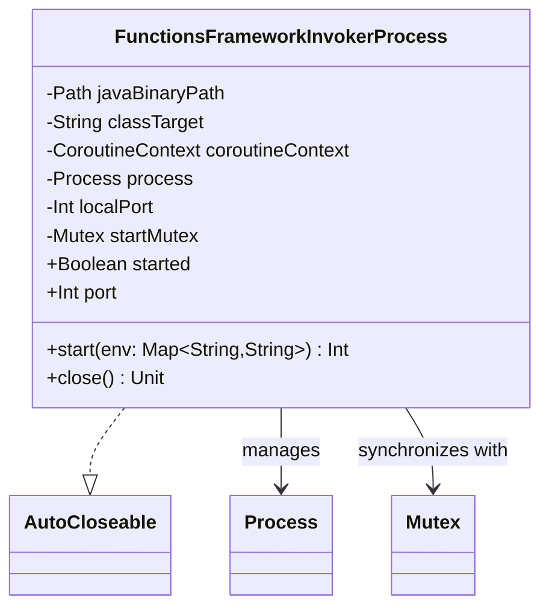

# org.wfanet.measurement.gcloud.testing

## Overview
Provides testing utilities for Google Cloud Functions by wrapping Cloud Function binary processes in a test-friendly interface. The package enables automated testing of Cloud Functions by managing process lifecycle, port allocation, and startup synchronization.

## Components

### FunctionsFrameworkInvokerProcess
Wrapper for a Cloud Function binary process that exposes a port for receiving data. Manages the complete lifecycle of a Cloud Function process for testing purposes, including startup, port allocation, readiness detection, and graceful shutdown.

| Method | Parameters | Returns | Description |
|--------|------------|---------|-------------|
| start | `env: Map<String, String>` | `suspend Int` | Starts the Cloud Function process with environment variables and waits until ready |
| close | - | `Unit` | Terminates the process gracefully or forcibly if needed |

**Properties:**

| Property | Type | Description |
|----------|------|-------------|
| started | `Boolean` | Indicates whether the process has been initialized |
| port | `Int` | Returns the HTTP port the process is listening on |

**Constructor Parameters:**

| Parameter | Type | Description |
|-----------|------|-------------|
| javaBinaryPath | `Path` | Runfiles-relative path to the Cloud Run Invoker binary |
| classTarget | `String` | Class name the invoker will execute (must be in binary's classpath) |
| coroutineContext | `CoroutineContext` | Context for process execution (defaults to Dispatchers.IO) |

## Dependencies
- `java.io` - IOException handling for process I/O operations
- `java.net` - ServerSocket for port allocation and availability checking
- `java.nio.file` - File system path operations and existence checks
- `java.util.concurrent` - TimeUnit for process termination timeouts
- `java.util.logging` - Logger for process output and diagnostic messages
- `kotlin.coroutines` - CoroutineContext for asynchronous process management
- `kotlin.time` - Duration and TimeSource for startup timeout handling
- `kotlinx.coroutines` - Coroutine primitives (Mutex, CoroutineScope, withLock) for thread-safe operations
- `org.jetbrains.annotations` - BlockingExecutor annotation for coroutine context
- `org.wfanet.measurement.common` - getRuntimePath utility for resolving runfiles paths

## Usage Example
```kotlin
// Create invoker for a Cloud Function
val invoker = FunctionsFrameworkInvokerProcess(
    javaBinaryPath = Paths.get("path/to/invoker"),
    classTarget = "com.example.MyCloudFunction"
)

// Start the process with environment variables
val port = invoker.start(mapOf("API_KEY" to "test-key"))

// Use the function at localhost:$port
val url = "http://localhost:$port"
// ... make HTTP requests to the function ...

// Clean up
invoker.close()
```

## Implementation Details

### Process Lifecycle Management
- **Port Allocation**: Uses `ServerSocket(0)` to dynamically allocate an available port, avoiding conflicts
- **Double-Checked Locking**: Thread-safe startup using Mutex to prevent multiple initializations
- **Readiness Detection**: Monitors process output for "Serving function..." pattern before returning from start()
- **Timeout Handling**: Enforces 10-second startup timeout with elapsedNow() checks
- **Graceful Shutdown**: Attempts normal termination with 5-second timeout before forcibly destroying process

### Thread Safety
- Uses `@Volatile` for process field to ensure visibility across threads
- `Mutex` protects the critical section during startup
- Delegates.notNull ensures port is initialized before access
- `check()` calls validate preconditions (started state, process alive, binary exists)

### Process Output Handling
- Redirects stdout and stderr to a single stream for unified logging
- Launches coroutine on Dispatchers.IO to continuously read and log process output
- Buffered reader wraps input stream for efficient line-by-line processing
- IOException handling prevents crashes from broken pipe scenarios

## Class Diagram

