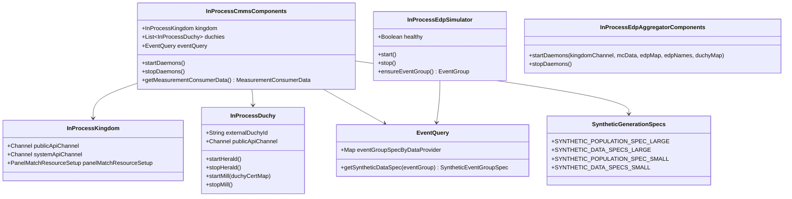

# org.wfanet.measurement.integration.common

## Overview
Provides in-process integration testing infrastructure for the Cross-Media Measurement system. This package contains TestRule implementations and supporting components for orchestrating Kingdom, Duchy, EDP simulators, and other system services in isolated test environments.

## Components

### AccessServicesFactory
Factory interface for creating access control internal services in test environments

| Method | Parameters | Returns | Description |
|--------|------------|---------|-------------|
| create | `permissionMapping: PermissionMapping`, `tlsClientMapping: TlsClientPrincipalMapping` | `AccessInternalServices` | Creates access internal services with specified mappings |

### EventQuery
Synthetic event query implementation for test environments with EDP simulators

| Method | Parameters | Returns | Description |
|--------|------------|---------|-------------|
| getSyntheticDataSpec | `eventGroup: EventGroup` | `SyntheticEventGroupSpec` | Retrieves synthetic data spec for event group |

| Property | Type | Description |
|----------|------|-------------|
| eventGroupSpecByDataProvider | `Map<DataProviderKey, SyntheticEventGroupSpec>` | Maps data providers to event group specs |

### InProcessAccess
In-process access service for testing with internal and public API servers

| Property | Type | Description |
|----------|------|-------------|
| channel | `Channel` | gRPC channel to access server |

### InProcessDuchy
Manages all Duchy gRPC services and daemons for testing

| Method | Parameters | Returns | Description |
|--------|------------|---------|-------------|
| startHerald | - | `Unit` | Starts the Herald daemon for computation synchronization |
| stopHerald | - | `Unit` (suspend) | Stops the Herald daemon |
| startMill | `duchyCertMap: Map<String, String>` | `Unit` | Starts Mill daemons for computation processing |
| stopMill | - | `Unit` (suspend) | Stops all Mill daemons |

| Property | Type | Description |
|----------|------|-------------|
| externalDuchyId | `String` | External identifier for this Duchy |
| publicApiChannel | `Channel` | gRPC channel to Duchy public API |

### InProcessEdpAggregatorSystemApi
Manages EDP Aggregator system API services backed by Spanner

| Property | Type | Description |
|----------|------|-------------|
| publicApiChannel | `Channel` | gRPC channel to EDP Aggregator public API |
| verboseGrpcLogging | `Boolean` | Whether verbose gRPC logging is enabled |

### InProcessEdpSimulator
In-process Event Data Provider simulator for testing

| Method | Parameters | Returns | Description |
|--------|------------|---------|-------------|
| start | - | `Unit` | Starts the EDP simulator daemon |
| stop | - | `Unit` (suspend) | Stops the EDP simulator daemon |
| ensureEventGroup | - | `EventGroup` (suspend) | Ensures event group exists and returns it |
| waitUntilHealthy | - | `Unit` (suspend) | Waits until simulator is healthy |

| Property | Type | Description |
|----------|------|-------------|
| healthy | `Boolean` | Whether simulator is currently healthy |

### InProcessPopulationRequisitionFulfiller
Manages population requisition fulfillment daemon for testing

| Method | Parameters | Returns | Description |
|--------|------------|---------|-------------|
| start | - | `Unit` | Starts the requisition fulfiller daemon |
| stop | - | `Unit` (suspend) | Stops the requisition fulfiller daemon |

### InProcessSecureComputationPublicApi
Manages Secure Computation Control Plane services

| Property | Type | Description |
|----------|------|-------------|
| publicApiChannel | `Channel` | gRPC channel to Control Plane public API |

### InProcessKingdom
Manages all Kingdom gRPC services including public, system, and internal APIs

| Method | Parameters | Returns | Description |
|--------|------------|---------|-------------|
| apply | `statement: Statement`, `description: Description` | `Statement` | Applies test rule to statement |

| Property | Type | Description |
|----------|------|-------------|
| publicApiChannel | `Channel` | gRPC channel to Kingdom public API |
| systemApiChannel | `Channel` | gRPC channel to Kingdom system API |
| internalAccountsClient | `InternalAccountsCoroutineStub` | Internal accounts service client |
| internalDataProvidersClient | `InternalDataProvidersCoroutineStub` | Internal data providers service client |
| internalCertificatesClient | `InternalCertificatesCoroutineStub` | Internal certificates service client |
| panelMatchResourceSetup | `PanelMatchResourceSetup` | Resource setup for panel match testing |
| knownEventGroupMetadataTypes | `Iterable<Descriptors.FileDescriptor>` | Known event group metadata types |

### InProcessCmmsComponents
Orchestrates complete CMMS integration test environment with Kingdom, Duchies, and EDPs

| Method | Parameters | Returns | Description |
|--------|------------|---------|-------------|
| startDaemons | - | `Unit` | Creates resources and starts all daemons |
| stopDaemons | - | `Unit` | Stops all running daemons |
| stopEdpSimulators | - | `Unit` | Stops only EDP simulator daemons |
| stopDuchyDaemons | - | `Unit` | Stops only Duchy daemons |
| getMeasurementConsumerData | - | `MeasurementConsumerData` | Retrieves measurement consumer data |
| getPopulationData | - | `PopulationData` | Retrieves population data |
| getDataProviderDisplayNameFromDataProviderName | `dataProviderName: String` | `String?` | Finds display name for data provider |
| getDataProviderResourceNames | - | `List<String>` | Returns all data provider resource names |

| Property | Type | Description |
|----------|------|-------------|
| kingdom | `InProcessKingdom` | Kingdom instance |
| duchies | `List<InProcessDuchy>` | All Duchy instances |
| eventQuery | `EventQuery` | Event query for synthetic data |
| mcResourceName | `String` | Measurement consumer resource name |
| populationResourceName | `String` | Population resource name |
| modelProviderResourceName | `String` | Model provider resource name |
| modelLineResourceName | `String` | Model line resource name |

### InProcessEdpAggregatorComponents
Manages EDP Aggregator components including Control Plane and Results Fulfiller

| Method | Parameters | Returns | Description |
|--------|------------|---------|-------------|
| startDaemons | `kingdomChannel: Channel`, `measurementConsumerData: MeasurementConsumerData`, `edpDisplayNameToResourceMap: Map<String, Resource>`, `edpAggregatorShortNames: List<String>`, `duchyMap: Map<String, Channel>` | `Unit` (suspend) | Starts all aggregator daemons |
| stopDaemons | - | `Unit` | Stops all running daemons |

## Data Structures

### InProcessDuchy.DuchyDependencies
| Property | Type | Description |
|----------|------|-------------|
| duchyDataServices | `DuchyDataServices` | Duchy internal data services |
| storageClient | `StorageClient` | Storage client for Duchy data |

### InProcessEdpSimulator.EventGroupOptions
| Property | Type | Description |
|----------|------|-------------|
| referenceIdSuffix | `String` | Reference ID suffix for event group |
| syntheticDataSpec | `SyntheticEventGroupSpec` | Synthetic event group specification |
| mediaTypes | `Set<MediaType>` | Supported media types |
| metadata | `EventGroupMetadata` | Event group metadata |

### SyntheticGenerationSpecs
Object containing predefined synthetic population and event group specifications

| Property | Type | Description |
|----------|------|-------------|
| SYNTHETIC_POPULATION_SPEC_LARGE | `SyntheticPopulationSpec` | Population spec for ~34,000,000 population |
| SYNTHETIC_DATA_SPECS_LARGE | `List<SyntheticEventGroupSpec>` | Event group specs for large population |
| SYNTHETIC_DATA_SPECS_LARGE_2M | `List<SyntheticEventGroupSpec>` | Event group specs with ~2,000,000 reach |
| SYNTHETIC_POPULATION_SPEC_SMALL | `SyntheticPopulationSpec` | Population spec for ~100,000 population |
| SYNTHETIC_DATA_SPECS_SMALL | `List<SyntheticEventGroupSpec>` | Event group specs for small population |
| SYNTHETIC_DATA_SPECS_SMALL_36K | `List<SyntheticEventGroupSpec>` | Event group specs for 36K reach |

## Configuration Objects

### Configs.kt
Provides configuration loading and test resource management

| Function | Parameters | Returns | Description |
|----------|------------|---------|-------------|
| loadTextProto | `fileName: String`, `default: T` | `T` | Loads text proto from secret files path |
| loadTestCertDerFile | `fileName: String` | `ByteString` | Loads certificate DER file as ByteString |
| loadTestCertCollection | `fileName: String` | `Collection<X509Certificate>` | Loads X509 certificate collection |
| loadSigningKey | `certDerFileName: String`, `privateKeyDerFileName: String` | `SigningKeyHandle` | Loads signing key from cert and private key |
| loadEncryptionPrivateKey | `fileName: String` | `TinkPrivateKeyHandle` | Loads Tink private encryption key |
| loadEncryptionPublicKey | `fileName: String` | `TinkPublicKeyHandle` | Loads Tink public encryption key |
| createEntityContent | `displayName: String` | `EntityContent` | Creates entity content for test entity |
| getResultsFulfillerParams | `edpDisplayName: String`, `edpResourceName: String`, `edpCertificateKey: DataProviderCertificateKey`, `labeledImpressionBlobUriPrefix: String`, `noiseType: NoiseType` | `ResultsFulfillerParams` | Creates results fulfiller parameters |
| getDataWatcherResultFulfillerParamsConfig | `blobPrefix: String`, `edpResultFulfillerConfigs: Map<String, ResultsFulfillerParams>` | `List<WatchedPath>` | Creates data watcher watched paths |
| getDataProviderPrivateEncryptionKey | `edpShortName: String` | `PrivateKeyHandle` | Retrieves private encryption key for EDP |

### Global Configuration Constants

| Constant | Type | Description |
|----------|------|-------------|
| SECRET_FILES_PATH | `Path` | Path to test secret files directory |
| AGGREGATOR_PROTOCOLS_SETUP_CONFIG | `ProtocolsSetupConfig` | Aggregator duchy protocol setup |
| WORKER1_PROTOCOLS_SETUP_CONFIG | `ProtocolsSetupConfig` | Worker1 duchy protocol setup |
| WORKER2_PROTOCOLS_SETUP_CONFIG | `ProtocolsSetupConfig` | Worker2 duchy protocol setup |
| LLV2_PROTOCOL_CONFIG_CONFIG | `Llv2ProtocolConfigConfig` | Liquid Legions V2 protocol config |
| RO_LLV2_PROTOCOL_CONFIG_CONFIG | `Llv2ProtocolConfigConfig` | Reach-only LLV2 protocol config |
| HMSS_PROTOCOL_CONFIG_CONFIG | `HmssProtocolConfigConfig` | Honest Majority Share Shuffle config |
| DUCHY_ID_CONFIG | `DuchyIdConfig` | Duchy identifier configuration |
| ALL_DUCHY_NAMES | `List<String>` | All configured duchy names |
| ALL_DUCHIES | `List<DuchyIds.Entry>` | All duchy entries with time ranges |
| PERMISSIONS_CONFIG | `PermissionsConfig` | Permissions configuration |
| DUCHY_MILL_PARALLELISM | `Int` | Parallelism level for mills (3) |
| MC_DISPLAY_NAME | `String` | Measurement consumer display name |
| ALL_EDP_DISPLAY_NAMES | `List<String>` | All EDP display names |
| QUEUES_CONFIG | `QueuesConfig` | Secure computation queues config |

## Dependencies
- `org.wfanet.measurement.kingdom.deploy.common` - Kingdom service deployment
- `org.wfanet.measurement.duchy.deploy.common` - Duchy service deployment
- `org.wfanet.measurement.api.v2alpha` - Public API definitions
- `org.wfanet.measurement.system.v1alpha` - System API definitions
- `org.wfanet.measurement.internal.duchy` - Duchy internal API
- `org.wfanet.measurement.internal.kingdom` - Kingdom internal API
- `org.wfanet.measurement.loadtest.dataprovider` - Synthetic data generation
- `org.wfanet.measurement.common.crypto` - Cryptographic utilities
- `org.wfanet.measurement.common.grpc.testing` - gRPC testing utilities
- `org.wfanet.measurement.gcloud.spanner.testing` - Spanner emulator support
- `com.google.crypto.tink` - Tink encryption library
- `io.grpc` - gRPC framework
- `org.junit` - JUnit testing framework
- `kotlinx.coroutines` - Kotlin coroutines support

## Usage Example
```kotlin
// Initialize test configuration
InProcessCmmsComponents.initConfig()

// Create in-process kingdom
val kingdom = InProcessKingdom(
  dataServicesProvider = { kingdomDataServices },
  redirectUri = "https://localhost:2048",
  verboseGrpcLogging = false
)

// Create CMMS components
val cmmsComponents = InProcessCmmsComponents(
  kingdomDataServicesRule = kingdomDataServicesRule,
  duchyDependenciesRule = duchyDependenciesRule,
  syntheticPopulationSpec = SyntheticGenerationSpecs.SYNTHETIC_POPULATION_SPEC_SMALL,
  syntheticEventGroupSpecs = SyntheticGenerationSpecs.SYNTHETIC_DATA_SPECS_SMALL,
  useEdpSimulators = true
)

// Start daemons
cmmsComponents.startDaemons()

// Access components
val mcData = cmmsComponents.getMeasurementConsumerData()
val publicApiChannel = cmmsComponents.kingdom.publicApiChannel

// Cleanup
cmmsComponents.stopDaemons()
```

## Class Diagram

