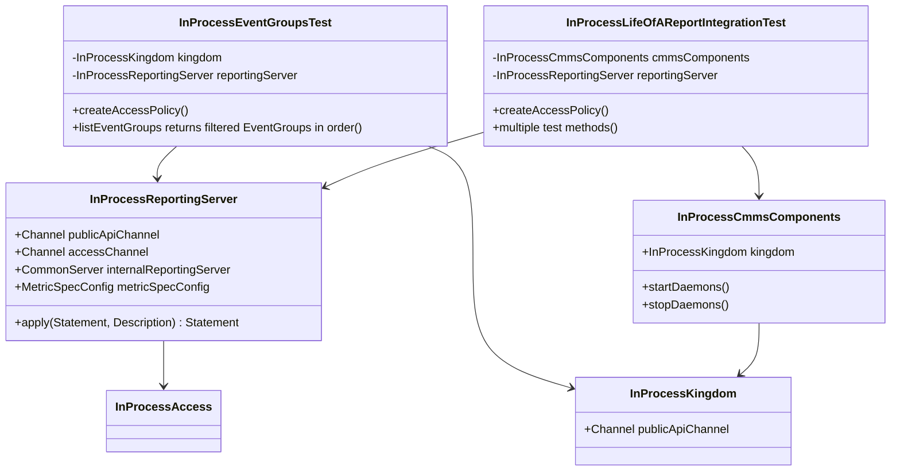

# org.wfanet.measurement.integration.common.reporting.v2

## Overview
Integration testing package for the Reporting v2 API containing test infrastructure and comprehensive end-to-end tests. Provides in-process test servers for the Reporting system and validates complete workflows from event group creation through metric computation and report generation. Tests cover population metrics, reach-and-frequency measurements, impression counts, watch duration, and BasicReport workflows with both HMSS and LLv2 measurement protocols.

## Components

### InProcessReportingServer
TestRule that orchestrates all Reporting Server gRPC services for integration testing.

| Method | Parameters | Returns | Description |
|--------|------------|---------|-------------|
| apply | `base: Statement, description: Description` | `Statement` | Implements TestRule lifecycle management |
| publicApiChannel | - | `Channel` | Returns gRPC channel to Reporting public API |
| accessChannel | - | `Channel` | Returns gRPC channel to Access API |

**Properties:**
| Property | Type | Description |
|----------|------|-------------|
| internalReportingServer | `CommonServer` | Internal reporting server instance |
| metricSpecConfig | `MetricSpecConfig` | Configuration for metric specifications |
| internalMetricCalculationSpecsClient | `InternalMetricCalculationSpecsCoroutineStub` | Client for metric calculation specs |
| internalBasicReportsClient | `InternalBasicReportsCoroutineStub` | Client for basic reports |
| internalReportResultsClient | `ReportResultsCoroutineStub` | Client for report results |

**Constructor Parameters:**
- `internalReportingServerServices: Services` - Internal reporting server service implementations
- `accessServicesFactory: AccessServicesFactory` - Factory for access control services
- `kingdomPublicApiChannel: Channel` - Kingdom public API channel
- `encryptionKeyPairConfig: EncryptionKeyPairConfig` - Encryption key pair configuration
- `signingPrivateKeyDir: File` - Directory containing signing private keys
- `measurementConsumerConfig: MeasurementConsumerConfig` - Measurement consumer configuration
- `trustedCertificates: Map<ByteString, X509Certificate>` - Map of trusted certificates
- `knownEventGroupMetadataTypes: Iterable<Descriptors.FileDescriptor>` - Known event group metadata types
- `eventDescriptor: Descriptors.Descriptor` - Event descriptor
- `defaultModelLineName: String` - Default model line name
- `populationDataProviderName: String` - Population data provider name
- `verboseGrpcLogging: Boolean` - Enable verbose gRPC logging (default: true)

**Services Configured:**
- DataProvidersService
- EventGroupMetadataDescriptorsService
- EventGroupsService
- MetricCalculationSpecsService
- MetricsService
- ReportingSetsService
- ReportsService
- BasicReportsService
- ImpressionQualificationFiltersService

### InProcessEventGroupsTest
Abstract test class validating EventGroups filtering and listing functionality.

| Method | Parameters | Returns | Description |
|--------|------------|---------|-------------|
| createAccessPolicy | - | `Unit` | Sets up access policies for event group reader role |
| listEventGroups returns filtered EventGroups in order | - | `Unit` | Tests filtering by data provider, media type, and metadata search |
| populateTestEventGroups | `now: Instant` | `List<CmmsEventGroup>` | Creates test event groups with varying properties |

**Constructor Parameters:**
- `kingdomInternalServicesRule: ProviderRule<KingdomInternalServices>` - Kingdom internal services provider
- `reportingInternalServicesRule: ProviderRule<ReportingInternalServices>` - Reporting internal services provider
- `accessServicesFactory: AccessServicesFactory` - Access services factory

**Test Coverage:**
- Filtering by CMMS data provider
- Media type intersection filtering (DISPLAY, VIDEO)
- Metadata search query matching
- Ordering by data availability start time
- Access control validation

### InProcessLifeOfAReportIntegrationTest
Comprehensive end-to-end integration test suite covering full reporting workflows.

**Constructor Parameters:**
- `kingdomDataServicesRule: ProviderRule<DataServices>` - Kingdom data services provider
- `duchyDependenciesRule: ProviderRule<DuchyDependencies>` - Duchy dependencies provider
- `accessServicesFactory: AccessServicesFactory` - Access services factory
- `reportingDataServicesProviderRule: ProviderRule<Services>` - Reporting services provider

**Test Methods:**

| Test | Purpose |
|------|---------|
| population metric for union has correct result | Validates union operation on reporting sets with population count |
| population metric for difference has correct result | Validates difference operation on reporting sets |
| population metric with no reporting set filters has correct result | Tests population metrics without filtering |
| reporting set is created and then retrieved | Validates ReportingSet CRUD operations |
| report with LLv2 union reach across 2 edps has the expected result | Tests LLv2 reach measurement across multiple EDPs |
| report with HMSS union reach across 2 edps has the expected result | Tests HMSS reach measurement across multiple EDPs |
| report with unique reach has the expected result | Validates unique reach measurement computation |
| report with intersection reach has the expected result | Tests reach intersection across reporting sets |
| report with 2 reporting metric entries has the expected result | Validates multi-metric reports |
| report across two time intervals has the expected result | Tests time-based report segmentation |
| report with invalidated Metric has state FAILED | Validates error handling for invalidated metrics |
| report with reporting interval has the expected result | Tests periodic reporting intervals |
| report with reporting interval doesn't create metric beyond report_end | Validates interval boundary handling |
| report with group by has the expected result | Tests dimensional grouping functionality |
| creating 3 reports at once succeeds | Validates concurrent report creation |
| reach metric result has the expected result | Tests reach metric computation |
| reach metric with single edp params result has the expected result | Validates single-EDP reach measurement |
| reach-and-frequency metric has the expected result | Tests combined reach and frequency metrics |
| reach-and-frequency metric with no data has a result of 0 | Validates zero-data handling for reach-frequency |
| impression count metric has the expected result | Tests impression counting functionality |
| impression count metric with no data has a result of 0 | Validates zero-data handling for impressions |
| watch duration metric has the expected result | Tests watch duration measurement |
| reach metric with filter has the expected result | Validates filtered reach measurements |
| reach metric with no data has a result of 0 | Tests zero-data reach scenarios |
| retrieving data provider succeeds | Validates DataProvider retrieval |
| getBasicReport returns SUCCEEDED multi edp basic report | Tests multi-EDP BasicReport completion |
| getBasicReport returns SUCCEEDED single edp basic report | Tests single-EDP BasicReport completion |
| getBasicReport returns basic report when model line system specified | Validates model line integration |
| getImpressionQualificationFilter retrives ImpressionQualificationFilter | Tests impression filter retrieval |
| listImpressionQualificationFilters with page size and page token | Tests paginated filter listing |

## Data Structures

### Test Configuration Constants

| Constant | Type | Description |
|----------|------|-------------|
| METRIC_SPEC_CONFIG | `MetricSpecConfig` | Metric specification configuration with privacy parameters |
| NUMBER_VID_BUCKETS | `Int` | Number of VID sampling buckets (300) |
| SECRETS_DIR | `File` | Directory containing test secret files |
| SIGNING_CERTS | `SigningCerts` | TLS signing certificates |

### Metric Privacy Parameters

**Reach Parameters:**
- Epsilon: 0.0041
- Delta: 1e-12
- VID Sampling: 0.0 start, 0.01 width

**Reach-and-Frequency Parameters:**
- Reach Epsilon: 0.0033, Delta: 1e-12
- Frequency Epsilon: 0.0033, Delta: 1e-12
- VID Sampling: 0.16 start, 0.0167 width
- Maximum Frequency: 10

**Impression Count Parameters:**
- Epsilon: 0.0011, Delta: 1e-12
- VID Sampling: 0.477 start, 0.207 width
- Maximum Frequency Per User: 60

**Watch Duration Parameters:**
- Epsilon: 0.001, Delta: 1e-12
- VID Sampling: 0.683 start, 0.317 width
- Maximum Duration Per User: 4000 seconds

## Dependencies

### External Dependencies
- `org.wfanet.measurement.access.client.v1alpha` - Access control client
- `org.wfanet.measurement.access.v1alpha` - Access control API
- `org.wfanet.measurement.api.v2alpha` - CMMS public API (Kingdom)
- `org.wfanet.measurement.reporting.v2alpha` - Reporting public API
- `org.wfanet.measurement.internal.reporting.v2` - Reporting internal API
- `org.wfanet.measurement.config.reporting` - Reporting configuration protos
- `org.wfanet.measurement.integration.common` - Common integration test infrastructure
- `org.wfanet.measurement.loadtest.dataprovider` - Synthetic data generation
- `org.wfanet.measurement.kingdom.deploy.common.service` - Kingdom internal services
- `org.wfanet.measurement.reporting.deploy.v2.common.service` - Reporting internal services
- `org.wfanet.measurement.reporting.service.api.v2alpha` - Reporting API service implementations

### Internal Service Dependencies
- `InProcessKingdom` - In-process Kingdom server for testing
- `InProcessCmmsComponents` - Complete CMMS system (Kingdom + Duchies + EDPs)
- `InProcessAccess` - In-process Access server
- `ResourceSetup` - Test resource creation utilities

## Test Infrastructure Architecture



## Usage Example

```kotlin
// Test implementation extending InProcessLifeOfAReportIntegrationTest
class PostgresLifeOfAReportIntegrationTest : InProcessLifeOfAReportIntegrationTest(
  kingdomDataServicesRule = postgresKingdomServicesRule,
  duchyDependenciesRule = duchyDependenciesProviderRule,
  accessServicesFactory = inProcessAccessServicesFactory,
  reportingDataServicesProviderRule = postgresReportingServicesRule
)

// Creating a report with reach metric
@Test
fun `reach metric has correct result`() = runBlocking {
  val measurementConsumerData = getMeasurementConsumerData()
  val eventGroups = listEventGroups()

  // Create reporting set
  val reportingSet = publicReportingSetsClient
    .withCallCredentials(credentials)
    .createReportingSet(createReportingSetRequest {
      parent = measurementConsumerData.name
      reportingSet = reportingSet {
        primitive = ReportingSetKt.primitive {
          eventGroupKeys += eventGroups.map { it.name }
        }
      }
    })

  // Create reach metric
  val metric = publicMetricsClient
    .withCallCredentials(credentials)
    .createMetric(createMetricRequest {
      parent = measurementConsumerData.name
      metric = metric {
        this.reportingSet = reportingSet.name
        timeInterval = interval {
          startTime = timestamp { seconds = 1615791600 }
          endTime = timestamp { seconds = 1615964400 }
        }
        metricSpec = metricSpec {
          reach = MetricSpec.ReachParams.getDefaultInstance()
        }
      }
    })

  // Poll for completion
  val completedMetric = pollForCompletedMetric(metric.name)
  assertThat(completedMetric.state).isEqualTo(Metric.State.SUCCEEDED)
}
```

## Testing Workflow

1. **Setup Phase**
   - Create in-process Kingdom, Duchies, and EDPs via `InProcessCmmsComponents`
   - Initialize `InProcessReportingServer` with required configurations
   - Configure Access policies for test principals

2. **Resource Creation**
   - Create measurement consumers and data providers
   - Generate synthetic event groups with test data
   - Configure encryption keys and signing certificates

3. **Metric/Report Execution**
   - Create ReportingSets with event group references
   - Create Metrics with desired metric specifications
   - Create Reports with multiple metrics and time intervals
   - Poll for metric/report completion

4. **Validation**
   - Assert metric states (SUCCEEDED/FAILED)
   - Validate computed results against expected values
   - Verify measurement protocol selection (LLv2 vs HMSS)
   - Check dimensional grouping and filtering

## Key Functionality

### Access Control Integration
- Configures role-based access control (RBAC) for measurement consumers
- Creates principals, roles, and policies for test scenarios
- Validates permission checking across Reporting API operations

### Metric Specification Configuration
- Pre-configured differential privacy parameters for all metric types
- VID sampling intervals with non-overlapping buckets
- Maximum frequency/duration limits for count-based metrics

### Multi-Protocol Support
- LLv2 (Liquid Legions v2) reach measurements
- HMSS (Honest Majority Secret Sharing) reach measurements
- Automatic protocol selection based on EDP capabilities

### Report Generation
- Time-interval based reporting with multiple periods
- Dimensional grouping (group_by) for result segmentation
- Reporting intervals with configurable start time and increment
- Support for multiple metric types in single report

### BasicReport Workflows
- Multi-EDP and single-EDP basic reports
- Dimension specifications with custom field mappings
- Impression qualification filters
- Integration with model lines for VID assignment

## File Locations
- `/Users/mmg/xmm/src/main/kotlin/org/wfanet/measurement/integration/common/reporting/v2/InProcessEventGroupsTest.kt` (435 lines)
- `/Users/mmg/xmm/src/main/kotlin/org/wfanet/measurement/integration/common/reporting/v2/InProcessLifeOfAReportIntegrationTest.kt` (3389 lines)
- `/Users/mmg/xmm/src/main/kotlin/org/wfanet/measurement/integration/common/reporting/v2/InProcessReportingServer.kt` (506 lines)
