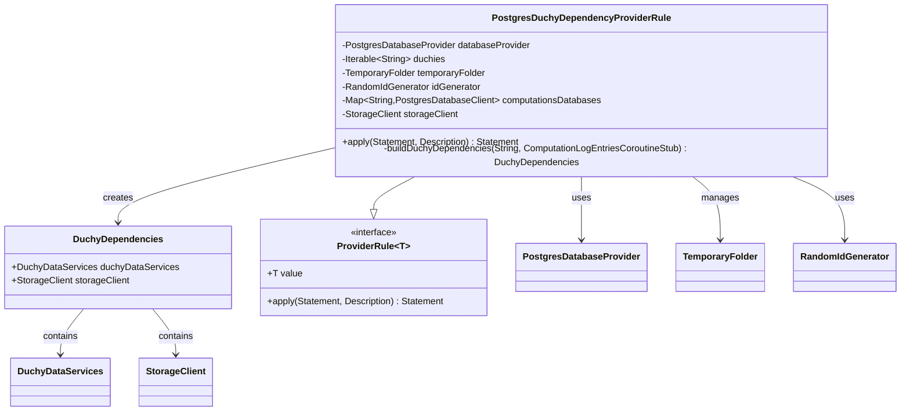

# org.wfanet.measurement.integration.deploy.common.postgres

## Overview
Provides PostgreSQL-based integration testing infrastructure for Duchy components in the Cross-Media Measurement system. This package contains JUnit test rules that configure and manage Postgres database instances, storage clients, and dependency injection for Duchy data services during integration testing.

## Components

### PostgresDuchyDependencyProviderRule
JUnit TestRule providing factory functions for creating InProcessDuchy.DuchyDependencies instances backed by PostgreSQL databases.

| Method | Parameters | Returns | Description |
|--------|------------|---------|-------------|
| apply | `base: Statement`, `description: Description` | `Statement` | Initializes databases and storage before test execution |
| buildDuchyDependencies | `duchyId: String`, `logEntryClient: ComputationLogEntriesCoroutineStub` | `InProcessDuchy.DuchyDependencies` | Creates duchy dependencies for specified duchy ID |

**Constructor Parameters:**
| Parameter | Type | Description |
|-----------|------|-------------|
| databaseProvider | `PostgresDatabaseProvider` | Provides PostgreSQL database instances for testing |
| duchies | `Iterable<String>` | Collection of duchy identifiers to provision |

**Internal State:**
| Property | Type | Description |
|----------|------|-------------|
| temporaryFolder | `TemporaryFolder` | JUnit rule managing temporary file system storage |
| idGenerator | `RandomIdGenerator` | Generates random IDs using system UTC clock |
| computationsDatabases | `Map<String, PostgresDatabaseClient>` | Maps duchy IDs to their PostgreSQL database clients |
| storageClient | `StorageClient` | File system-based storage for blob data |

## Data Structures

### InProcessDuchy.DuchyDependencies
Data class encapsulating dependencies required by in-process Duchy instances.

| Property | Type | Description |
|----------|------|-------------|
| duchyDataServices | `DuchyDataServices` | Aggregates gRPC services for computations, stats, and tokens |
| storageClient | `StorageClient` | Storage client for requisitions and computation blobs |

## Dependencies

### Database Layer
- `org.wfanet.measurement.common.db.r2dbc.postgres.PostgresDatabaseClient` - R2DBC-based reactive PostgreSQL client
- `org.wfanet.measurement.common.db.r2dbc.postgres.testing.PostgresDatabaseProvider` - Creates isolated database instances for tests

### Duchy Services
- `org.wfanet.measurement.duchy.deploy.common.service.PostgresDuchyDataServices` - Factory for Postgres-backed duchy services
- `org.wfanet.measurement.integration.common.InProcessDuchy` - Test infrastructure for running duchies in-process

### Storage
- `org.wfanet.measurement.storage.StorageClient` - Abstract blob storage interface
- `org.wfanet.measurement.storage.filesystem.FileSystemStorageClient` - File system implementation for test storage

### gRPC
- `org.wfanet.measurement.system.v1alpha.ComputationLogEntriesGrpcKt.ComputationLogEntriesCoroutineStub` - Client for computation log entries service

### Utilities
- `org.wfanet.measurement.common.identity.RandomIdGenerator` - Cryptographically random ID generation
- `org.wfanet.measurement.common.testing.ProviderRule` - Base interface for JUnit provider rules
- `org.junit.rules.TemporaryFolder` - JUnit rule for temporary directories
- `kotlinx.coroutines.Dispatchers` - Coroutine dispatcher for default background execution

## Usage Example
```kotlin
// In a test class
class DuchyIntegrationTest {
  private val databaseProvider = PostgresDatabaseProvider()
  private val duchies = listOf("duchy1", "duchy2", "duchy3")

  @get:Rule
  val duchyDependencyProvider = PostgresDuchyDependencyProviderRule(
    databaseProvider = databaseProvider,
    duchies = duchies
  )

  @Test
  fun testDuchyOperations() {
    // Create dependencies for a specific duchy
    val logEntriesStub = ComputationLogEntriesCoroutineStub(channel)
    val dependencies = duchyDependencyProvider.value("duchy1", logEntriesStub)

    // Use the duchy data services
    val computationsService = dependencies.duchyDataServices.computationsService
    val storageClient = dependencies.storageClient

    // Perform test operations...
  }
}
```

## Class Diagram


## Architecture Notes

### Test Isolation
Each duchy receives an isolated PostgreSQL database instance created by the `databaseProvider`. The `TemporaryFolder` rule ensures file system storage is cleaned up after tests complete.

### Service Configuration
The rule delegates to `PostgresDuchyDataServices.create()` to construct properly configured gRPC services including:
- `PostgresComputationsService` - Manages computation lifecycle and state
- `PostgresComputationStatsService` - Provides computation statistics
- `PostgresContinuationTokensService` - Manages pagination tokens

### Coroutine Context
All duchy data services execute with `Dispatchers.Default` as the coroutine context, providing a shared thread pool for asynchronous operations.

### ID Generation
Uses `RandomIdGenerator` with UTC clock to ensure unique, non-colliding identifiers across test executions.
