# org.wfanet.measurement.integration.deploy.gcloud

## Overview
This package provides JUnit test rule implementations for integration testing with Google Cloud Spanner and related services. It orchestrates the setup and teardown of emulated Spanner databases for Kingdom, Duchy, Reporting, Secure Computation, and Access services, enabling comprehensive integration tests in isolated environments.

## Components

### InternalReportingServicesProviderRule
JUnit rule that provisions Reporting internal services with Spanner and PostgreSQL backends for testing.

| Method | Parameters | Returns | Description |
|--------|------------|---------|-------------|
| apply | `base: Statement`, `description: Description` | `Statement` | Wraps test statement with database initialization |

**Constructor Parameters:**
| Parameter | Type | Description |
|-----------|------|-------------|
| emulatorDatabaseAdmin | `SpannerDatabaseAdmin` | Admin for Spanner emulator |
| postgresDatabaseProvider | `PostgresDatabaseProviderRule` | Provides PostgreSQL database instances |
| impressionQualificationFilterMapping | `ImpressionQualificationFilterMapping` | Maps impression qualification filters |

**Properties:**
| Property | Type | Description |
|----------|------|-------------|
| value | `Services` | Initialized reporting services instance |

---

### KingdomDataServicesProviderRule
JUnit rule that creates Kingdom data services backed by Spanner emulator for integration testing.

| Method | Parameters | Returns | Description |
|--------|------------|---------|-------------|
| apply | `base: Statement`, `description: Description` | `Statement` | Wraps test with Spanner database lifecycle |

**Constructor Parameters:**
| Parameter | Type | Description |
|-----------|------|-------------|
| emulatorDatabaseAdmin | `SpannerDatabaseAdmin` | Spanner emulator admin interface |

**Properties:**
| Property | Type | Description |
|----------|------|-------------|
| value | `DataServices` | Initialized Kingdom data services |

---

### SecureComputationServicesProviderRule
JUnit rule providing secure computation internal services with Spanner backend.

| Method | Parameters | Returns | Description |
|--------|------------|---------|-------------|
| apply | `base: Statement`, `description: Description` | `Statement` | Integrates Spanner database setup with test execution |

**Constructor Parameters:**
| Parameter | Type | Description |
|-----------|------|-------------|
| workItemPublisher | `WorkItemPublisher` | Publishes work items for processing |
| queueMapping | `QueueMapping` | Maps computation queues |
| emulatorDatabaseAdmin | `SpannerDatabaseAdmin` | Spanner emulator administrator |

**Properties:**
| Property | Type | Description |
|----------|------|-------------|
| value | `InternalApiServices` | Secure computation internal services |

---

### SpannerAccessServicesFactory
Factory that creates Access API internal services using Spanner emulator, implementing AccessServicesFactory interface.

| Method | Parameters | Returns | Description |
|--------|------------|---------|-------------|
| create | `permissionMapping: PermissionMapping`, `tlsClientMapping: TlsClientPrincipalMapping` | `AccessInternalServices` | Builds Access internal services with mappings |
| apply | `base: Statement`, `description: Description` | `Statement` | Applies Spanner database rule to test |

**Constructor Parameters:**
| Parameter | Type | Description |
|-----------|------|-------------|
| emulatorDatabaseAdmin | `SpannerDatabaseAdmin` | Spanner emulator database admin |

---

### SpannerDuchyDependencyProviderRule
JUnit rule providing factory functions for creating Duchy dependencies with Spanner-backed data services and filesystem storage.

| Method | Parameters | Returns | Description |
|--------|------------|---------|-------------|
| apply | `base: Statement`, `description: Description` | `Statement` | Chains database and filesystem rules sequentially |

**Constructor Parameters:**
| Parameter | Type | Description |
|-----------|------|-------------|
| emulatorDatabaseAdmin | `SpannerDatabaseAdmin` | Spanner emulator admin |
| duchies | `Iterable<String>` | Collection of duchy identifiers |

**Properties:**
| Property | Type | Description |
|----------|------|-------------|
| value | `(String, ComputationLogEntriesCoroutineStub) -> InProcessDuchy.DuchyDependencies` | Factory function for building duchy dependencies |

## Dependencies

- `org.wfanet.measurement.gcloud.spanner.testing` - Spanner emulator database rules and admin interfaces
- `org.wfanet.measurement.common.testing` - Base ProviderRule interface for test resource provision
- `org.wfanet.measurement.kingdom.deploy.gcloud.spanner` - Kingdom Spanner data service implementations
- `org.wfanet.measurement.duchy.deploy.gcloud.service` - Duchy Spanner data services
- `org.wfanet.measurement.reporting.deploy.v2.gcloud.spanner` - Reporting service Spanner implementations
- `org.wfanet.measurement.securecomputation.deploy.gcloud.spanner` - Secure computation Spanner services
- `org.wfanet.measurement.access.deploy.gcloud.spanner` - Access control Spanner services
- `org.wfanet.measurement.common.db.r2dbc.postgres.testing` - PostgreSQL test database provider
- `org.wfanet.measurement.storage.filesystem` - Filesystem-based storage client
- `org.junit` - JUnit testing framework rules and interfaces

## Usage Example

```kotlin
class IntegrationTest {
  private val spannerAdmin = SpannerDatabaseAdmin()

  @get:Rule
  val kingdomServices = KingdomDataServicesProviderRule(spannerAdmin)

  @get:Rule
  val accessServices = SpannerAccessServicesFactory(spannerAdmin)

  @Test
  fun testKingdomDataServices() = runBlocking {
    val services = kingdomServices.value
    // Use services for integration testing
    val measurement = services.measurementsService.createMeasurement(request)
    assertNotNull(measurement)
  }
}
```

## Class Diagram

```mermaid
classDiagram
    class InternalReportingServicesProviderRule {
        +apply(base: Statement, description: Description) Statement
        +value: Services
    }
    class KingdomDataServicesProviderRule {
        +apply(base: Statement, description: Description) Statement
        +value: DataServices
    }
    class SecureComputationServicesProviderRule {
        +apply(base: Statement, description: Description) Statement
        +value: InternalApiServices
    }
    class SpannerAccessServicesFactory {
        +create(permissionMapping: PermissionMapping, tlsClientMapping: TlsClientPrincipalMapping) AccessInternalServices
        +apply(base: Statement, description: Description) Statement
    }
    class SpannerDuchyDependencyProviderRule {
        +apply(base: Statement, description: Description) Statement
        +value: Function
    }
    class ProviderRule~T~ {
        <<interface>>
        +value: T
        +apply(base: Statement, description: Description) Statement
    }
    class AccessServicesFactory {
        <<interface>>
        +create(permissionMapping: PermissionMapping, tlsClientMapping: TlsClientPrincipalMapping) AccessInternalServices
    }
    class SpannerEmulatorDatabaseRule {
        +databaseClient: DatabaseClient
    }

    InternalReportingServicesProviderRule --|> ProviderRule
    KingdomDataServicesProviderRule --|> ProviderRule
    SecureComputationServicesProviderRule --|> ProviderRule
    SpannerDuchyDependencyProviderRule --|> ProviderRule
    SpannerAccessServicesFactory --|> AccessServicesFactory
    InternalReportingServicesProviderRule --> SpannerEmulatorDatabaseRule
    KingdomDataServicesProviderRule --> SpannerEmulatorDatabaseRule
    SecureComputationServicesProviderRule --> SpannerEmulatorDatabaseRule
    SpannerAccessServicesFactory --> SpannerEmulatorDatabaseRule
    SpannerDuchyDependencyProviderRule --> SpannerEmulatorDatabaseRule
```



## Architecture Notes

All provider rules in this package follow the JUnit TestRule pattern, implementing either `ProviderRule<T>` or specific factory interfaces. They manage the lifecycle of Spanner emulator databases through `SpannerEmulatorDatabaseRule`, ensuring proper initialization before tests and cleanup afterward. The rules are designed to be composable, allowing multiple services to share a single `SpannerDatabaseAdmin` instance while maintaining isolated database schemas.

The package serves as the integration layer between the Cross-Media Measurement system components (Kingdom, Duchy, Reporting, Access, Secure Computation) and Google Cloud Spanner storage in test environments, utilizing Spanner changelog-based schema migrations for database initialization.
