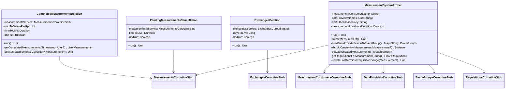

# org.wfanet.measurement.kingdom.batch

## Overview
Provides batch processing operations for Kingdom system maintenance including retention policies and system health monitoring. Implements scheduled jobs for data lifecycle management (deletion, cancellation) and continuous measurement system probing. All classes emit OpenTelemetry metrics for operational observability.

## Components

### CompletedMeasurementsDeletion
Deletes completed measurements that exceed the configured time-to-live threshold based on retention policies.

| Method | Parameters | Returns | Description |
|--------|------------|---------|-------------|
| run | - | `Unit` | Executes deletion loop for expired completed measurements |
| getCompletedMeasurements | `updatedBefore: Timestamp`, `previousPageEnd: StreamMeasurementsRequest.Filter.After?` | `List<Measurement>` | Retrieves paginated completed measurements updated before timestamp |
| deleteMeasurements | `measurements: Collection<Measurement>` | `Unit` | Batch deletes measurements via gRPC service |

**Constructor Parameters:**
- `measurementsService: MeasurementsCoroutineStub` - gRPC client for measurement operations
- `maxToDeletePerRpc: Int` - Maximum measurements to delete per RPC call
- `timeToLive: Duration` - Retention period for completed measurements
- `dryRun: Boolean = false` - Logs actions without executing deletions
- `clock: Clock = Clock.systemUTC()` - Clock for timestamp calculations

**Metrics:**
- `wfanet.measurement.retention.deleted_measurements` - Counter tracking deleted measurements

### ExchangesDeletion
Removes exchange records older than the configured days-to-live retention threshold.

| Method | Parameters | Returns | Description |
|--------|------------|---------|-------------|
| run | - | `Unit` | Executes batch deletion of expired exchanges |

**Constructor Parameters:**
- `exchangesService: ExchangesCoroutineStub` - gRPC client for exchange operations
- `daysToLive: Long` - Number of days to retain exchanges
- `dryRun: Boolean = false` - Logs exchanges without deleting

**Metrics:**
- `wfanet.measurement.retention.deleted_exchanges` - Counter tracking deleted exchanges

**Implementation Details:**
- Batches deletions in chunks of 1000 exchanges
- Filters exchanges by date before current date minus daysToLive

### MeasurementSystemProber
Continuously monitors measurement system health by creating test measurements and tracking their lifecycle through terminal states.

| Method | Parameters | Returns | Description |
|--------|------------|---------|-------------|
| run | - | `Unit` | Checks last measurement status and creates new if needed |
| createMeasurement | - | `Unit` | Creates reach-and-frequency prober measurement with configured EDPs |
| buildDataProviderNameToEventGroup | - | `Map<String, EventGroup>` | Maps data provider names to their event groups |
| shouldCreateNewMeasurement | `lastUpdatedMeasurement: Measurement?` | `Boolean` | Determines if new measurement creation is required |
| getLastUpdatedMeasurement | - | `Measurement?` | Retrieves most recently updated measurement within lookback window |
| getRequisitionsForMeasurement | `measurementName: String` | `Flow<Requisition>` | Streams requisitions for specified measurement |
| getDataProviderEntry | `dataProviderName: String`, `eventGroup: EventGroup`, `measurementConsumerSigningKey: SigningKeyHandle`, `packedMeasurementEncryptionPublicKey: Any` | `Measurement.DataProviderEntry` | Constructs encrypted data provider entry with signed requisition spec |
| updateLastTerminalRequisitionGauge | `lastUpdatedMeasurement: Measurement` | `Unit` | Updates gauge metrics for requisition completion states |

**Constructor Parameters:**
- `measurementConsumerName: String` - Resource name of measurement consumer
- `dataProviderNames: List<String>` - Resource names of data providers to include
- `apiAuthenticationKey: String` - API authentication key for gRPC calls
- `privateKeyDerFile: File` - Measurement consumer's private key for signing
- `measurementLookbackDuration: Duration` - Event collection interval lookback
- `durationBetweenMeasurement: Duration` - Minimum interval between prober measurements
- `measurementUpdateLookbackDuration: Duration` - Window for querying recent measurements
- Multiple gRPC stubs for API interactions
- `clock: Clock = Clock.systemUTC()` - Clock for timestamp calculations
- `secureRandom: SecureRandom = SecureRandom()` - Random generator for nonces

**Metrics:**
- `wfanet.measurement.prober.last_terminal_measurement.timestamp` - Gauge tracking last completed measurement update time
- `wfanet.measurement.prober.last_terminal_requisition.timestamp` - Gauge tracking requisition update times per data provider

**Measurement Specification:**
- Measurement type: Reach and Frequency
- VID sampling: Full sampling (start=0, width=1)
- Privacy parameters: epsilon=0.005, delta=1e-15
- Maximum frequency: 10

### PendingMeasurementsCancellation
Cancels pending measurements that have exceeded the configured time-to-live without completing.

| Method | Parameters | Returns | Description |
|--------|------------|---------|-------------|
| run | - | `Unit` | Executes batch cancellation loop for stale pending measurements |

**Constructor Parameters:**
- `measurementsService: MeasurementsCoroutineStub` - gRPC client for measurement operations
- `timeToLive: Duration` - Maximum age for pending measurements before cancellation
- `dryRun: Boolean = false` - Logs measurements without cancelling
- `clock: Clock = Clock.systemUTC()` - Clock for timestamp calculations

**Metrics:**
- `wfanet.measurement.retention.cancelled_measurements` - Counter tracking cancelled measurements

**Pending States:**
- `PENDING_COMPUTATION`
- `PENDING_PARTICIPANT_CONFIRMATION`
- `PENDING_REQUISITION_FULFILLMENT`
- `PENDING_REQUISITION_PARAMS`

**Implementation Details:**
- Batches cancellations in chunks of 1000 measurements
- Filters by creation time before (current time - timeToLive)
- Loops until all stale pending measurements are cancelled

## Data Structures

### Constants

| Constant | Value | Description |
|----------|-------|-------------|
| COMPLETED_MEASUREMENT_STATES | `[SUCCEEDED, FAILED, CANCELLED]` | Terminal measurement states for retention |
| PENDING_MEASUREMENT_STATES | `[PENDING_COMPUTATION, PENDING_PARTICIPANT_CONFIRMATION, PENDING_REQUISITION_FULFILLMENT, PENDING_REQUISITION_PARAMS]` | Non-terminal states subject to cancellation |
| MAX_BATCH_DELETE | `1000` | Maximum exchanges per batch delete operation |
| MAX_BATCH_CANCEL | `1000` | Maximum measurements per batch cancel operation |

## Dependencies
- `org.wfanet.measurement.internal.kingdom` - Internal Kingdom gRPC services and message types
- `org.wfanet.measurement.api.v2alpha` - Public API v2alpha services and types
- `org.wfanet.measurement.common` - Common utilities for instrumentation, time conversion, cryptography
- `org.wfanet.measurement.consent.client.measurementconsumer` - Encryption and signing utilities
- `io.opentelemetry.api.metrics` - Metrics instrumentation for observability
- `com.google.protobuf` - Protocol buffer types (Timestamp, Any)
- `io.grpc` - gRPC framework for service communication
- `kotlinx.coroutines` - Coroutine support for asynchronous operations

## Usage Example

```kotlin
// Completed Measurements Deletion
val deletionJob = CompletedMeasurementsDeletion(
  measurementsService = measurementsStub,
  maxToDeletePerRpc = 500,
  timeToLive = Duration.ofDays(90),
  dryRun = false
)
deletionJob.run()

// Pending Measurements Cancellation
val cancellationJob = PendingMeasurementsCancellation(
  measurementsService = measurementsStub,
  timeToLive = Duration.ofDays(7),
  dryRun = false
)
cancellationJob.run()

// Exchanges Deletion
val exchangesDeletionJob = ExchangesDeletion(
  exchangesService = exchangesStub,
  daysToLive = 30L,
  dryRun = false
)
exchangesDeletionJob.run()

// Measurement System Prober
val prober = MeasurementSystemProber(
  measurementConsumerName = "measurementConsumers/mc-1",
  dataProviderNames = listOf("dataProviders/edp-1", "dataProviders/edp-2"),
  apiAuthenticationKey = "api-key",
  privateKeyDerFile = File("/path/to/mc_private.der"),
  measurementLookbackDuration = Duration.ofDays(1),
  durationBetweenMeasurement = Duration.ofHours(1),
  measurementUpdateLookbackDuration = Duration.ofHours(2),
  measurementConsumersStub = measurementConsumersStub,
  measurementsStub = measurementsStub,
  dataProvidersStub = dataProvidersStub,
  eventGroupsStub = eventGroupsStub,
  requisitionsStub = requisitionsStub
)
prober.run()
```

## Class Diagram


