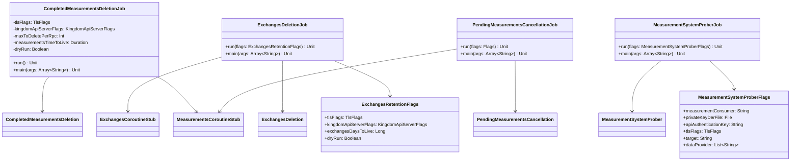

# org.wfanet.measurement.kingdom.deploy.common.job

## Overview
This package provides scheduled job implementations for Kingdom deployment operations. It includes maintenance jobs for deleting completed measurements, removing expired exchanges, cancelling stale pending measurements, and probing the measurement system health. All jobs are command-line applications built with PicoCLI that establish secure gRPC connections to Kingdom API servers.

## Components

### CompletedMeasurementsDeletionJob
Command-line job that removes completed measurements after their time-to-live expires.

| Method | Parameters | Returns | Description |
|--------|------------|---------|-------------|
| run | - | `Unit` | Establishes gRPC connection and executes deletion |
| main | `args: Array<String>` | `Unit` | Entry point for command-line execution |

**Configuration Options:**
| Flag | Type | Default | Description |
|------|------|---------|-------------|
| --max-to-delete-per-rpc | `Int` | 25 | Maximum measurements deleted per API call |
| --time-to-live | `Duration` | 100d | TTL for completed measurements since last update |
| --dry-run | `Boolean` | false | Print deletions without executing |

### ExchangesDeletionJob
Removes expired Exchange entities based on scheduled date retention policy.

| Function | Parameters | Returns | Description |
|----------|------------|---------|-------------|
| run | `flags: ExchangesRetentionFlags` | `Unit` | Executes exchange deletion logic |
| main | `args: Array<String>` | `Unit` | Entry point for command-line execution |

**Configuration Options:**
| Flag | Type | Default | Description |
|------|------|---------|-------------|
| --days-to-live | `Long` | 100 | Days to retain exchanges since scheduled date |
| --dry-run | `Boolean` | false | Print deletions without executing |

### MeasurementSystemProberJob
Monitors measurement system health by periodically creating probe measurements and tracking their completion.

| Function | Parameters | Returns | Description |
|----------|------------|---------|-------------|
| run | `flags: MeasurementSystemProberFlags` | `Unit` | Executes system probing with coroutines |
| main | `args: Array<String>` | `Unit` | Entry point for command-line execution |

**Configuration Options:**
| Flag | Type | Default | Description |
|------|------|---------|-------------|
| --measurement-consumer | `String` | required | MeasurementConsumer resource name |
| --private-key-der-file | `File` | required | Private key for authentication |
| --api-key | `String` | required | API authentication key |
| --kingdom-public-api-target | `String` | required | gRPC target for Kingdom public API |
| --kingdom-public-api-cert-host | `String?` | null | TLS certificate hostname override |
| --debug-verbose-grpc-client-logging | `Boolean` | false | Enable full gRPC logging |
| --data-provider | `List<String>` | required | One or more DataProvider resource names |
| --measurement-lookback-duration | `Duration` | 1d | Time window for event data collection |
| --duration-between-measurements | `Duration` | 1d | Minimum interval between probe measurements |
| --measurement-update-lookback-duration | `Duration` | 2h | Window for checking recent measurements |

### PendingMeasurementsCancellationJob
Cancels measurements stuck in pending state beyond their TTL threshold.

| Function | Parameters | Returns | Description |
|----------|------------|---------|-------------|
| run | `flags: Flags` | `Unit` | Executes pending measurement cancellation |
| main | `args: Array<String>` | `Unit` | Entry point for command-line execution |

**Configuration Options:**
| Flag | Type | Default | Description |
|------|------|---------|-------------|
| --time-to-live | `Duration` | 30d | TTL for pending measurements since creation |
| --dry-run | `Boolean` | false | Print cancellations without executing |

## Data Structures

### ExchangesRetentionFlags
| Property | Type | Description |
|----------|------|-------------|
| tlsFlags | `TlsFlags` | TLS certificate configuration |
| kingdomApiServerFlags | `KingdomApiServerFlags` | Kingdom API server connection settings |
| exchangesDaysToLive | `Long` | Retention period for exchanges |
| dryRun | `Boolean` | Dry-run execution mode |

### MeasurementSystemProberFlags
| Property | Type | Description |
|----------|------|-------------|
| measurementConsumer | `String` | MeasurementConsumer API resource name |
| privateKeyDerFile | `File` | Private key file for signing |
| apiAuthenticationKey | `String` | API authentication credential |
| tlsFlags | `TlsFlags` | TLS certificate configuration |
| target | `String` | Kingdom public API gRPC target |
| certHost | `String?` | TLS certificate hostname |
| debugVerboseGrpcClientLogging | `Boolean` | gRPC logging verbosity |
| dataProvider | `List<String>` | DataProvider resource names |
| measurementLookbackDuration | `Duration` | Event collection time window |
| durationBetweenMeasurement | `Duration` | Interval between probe measurements |
| measurementUpdateLookbackDuration | `Duration` | Recent measurement check window |

### Flags (PendingMeasurementsCancellationJob)
| Property | Type | Description |
|----------|------|-------------|
| tlsFlags | `TlsFlags` | TLS certificate configuration |
| kingdomApiServerFlags | `KingdomApiServerFlags` | Kingdom API server connection settings |
| measurementsTimeToLive | `Duration` | TTL for pending measurements |
| dryRun | `Boolean` | Dry-run execution mode |

## Dependencies

- `org.wfanet.measurement.common` - Common utilities for command-line execution and cryptography
- `org.wfanet.measurement.common.crypto` - SigningCerts for TLS certificate management
- `org.wfanet.measurement.common.grpc` - gRPC channel building and configuration
- `org.wfanet.measurement.internal.kingdom` - Internal Kingdom gRPC service stubs
- `org.wfanet.measurement.api.v2alpha` - Public Kingdom API v2alpha service stubs
- `org.wfanet.measurement.kingdom.batch` - Core batch processing logic implementations
- `org.wfanet.measurement.kingdom.deploy.common.server` - Server configuration flags
- `picocli` - Command-line interface framework
- `java.time` - Duration and Clock for time-based operations
- `kotlinx.coroutines` - Coroutine support for async operations

## Usage Example

```kotlin
// CompletedMeasurementsDeletionJob execution
fun main(args: Array<String>) {
    commandLineMain(CompletedMeasurementsDeletionJob(), args)
}

// Command-line invocation
// java -jar job.jar \
//   --tls-cert-file=/path/to/cert.pem \
//   --tls-private-key-file=/path/to/key.pem \
//   --tls-cert-collection-file=/path/to/ca.pem \
//   --kingdom-internal-api-target=kingdom:8443 \
//   --max-to-delete-per-rpc=50 \
//   --time-to-live=90d \
//   --dry-run=false
```

```kotlin
// MeasurementSystemProberJob execution
fun main(args: Array<String>) {
    commandLineMain(::run, args)
}

// Command-line invocation
// java -jar prober.jar \
//   --measurement-consumer=measurementConsumers/123 \
//   --private-key-der-file=/path/to/key.der \
//   --api-key=secret-key \
//   --kingdom-public-api-target=kingdom-public:8443 \
//   --data-provider=dataProviders/456 \
//   --data-provider=dataProviders/789 \
//   --measurement-lookback-duration=1d \
//   --duration-between-measurements=1d
```

## Class Diagram


