# org.wfanet.measurement.kingdom.deploy.common

## Overview

This package provides common deployment infrastructure for the Kingdom system, including protocol configuration, server initialization, batch jobs, and shared utilities. It serves as the foundational layer for deploying Kingdom API servers and automated maintenance tasks across the Cross-Media Measurement system.

## Components

### DuchyIds

Singleton object managing mappings between internal and external Duchy identifiers with time-based activation ranges.

| Method | Parameters | Returns | Description |
|--------|------------|---------|-------------|
| initializeFromFlags | `flags: DuchyIdsFlags` | `Unit` | Initializes Duchy ID configuration from file |
| getInternalId | `externalDuchyId: String` | `Long?` | Retrieves internal ID for external Duchy ID |
| getExternalId | `internalDuchyId: Long` | `String?` | Retrieves external ID for internal Duchy ID |
| setForTest | `duchyIds: List<Entry>` | `Unit` | Sets Duchy IDs for testing purposes |

### DuchyIds.Entry

| Property | Type | Description |
|----------|------|-------------|
| internalDuchyId | `Long` | Internal numeric identifier |
| externalDuchyId | `String` | External string identifier |
| activeRange | `ClosedRange<Instant>` | Time range when this Duchy is active |

| Method | Parameters | Returns | Description |
|--------|------------|---------|-------------|
| isActive | `instant: Instant` | `Boolean` | Checks if Duchy is active at given time |

### HmssProtocolConfig

Singleton configuration for Honest Majority Share Shuffle (HMSS) protocol with three-duchy architecture.

| Method | Parameters | Returns | Description |
|--------|------------|---------|-------------|
| initializeFromFlags | `flags: HmssProtocolConfigFlags` | `Unit` | Initializes HMSS configuration from file |
| setForTest | `protocolConfig: ProtocolConfig.HonestMajorityShareShuffle, firstNonAggregatorDuchyId: String, secondNonAggregatorDuchyId: String, aggregatorDuchyId: String` | `Unit` | Sets configuration for testing |

**Constants:**
- `NAME = "hmss"`
- `DUCHY_COUNT = 3`

### Llv2ProtocolConfig

Singleton configuration for Liquid Legions V2 (LLv2) protocol with multi-duchy participation requirements.

| Method | Parameters | Returns | Description |
|--------|------------|---------|-------------|
| initializeFromFlags | `flags: Llv2ProtocolConfigFlags` | `Unit` | Initializes LLv2 configuration from file |
| setForTest | `protocolConfig: ProtocolConfig.LiquidLegionsV2, duchyProtocolConfig: DuchyProtocolConfig.LiquidLegionsV2, requiredExternalDuchyIds: Set<String>, minimumNumberOfRequiredDuchies: Int` | `Unit` | Sets configuration for testing |

**Constants:**
- `NAME = "llv2"`

### RoLlv2ProtocolConfig

Singleton configuration for Reach-Only Liquid Legions V2 (RoLLv2) protocol variant.

| Method | Parameters | Returns | Description |
|--------|------------|---------|-------------|
| initializeFromFlags | `flags: RoLlv2ProtocolConfigFlags` | `Unit` | Initializes RoLLv2 configuration from file |
| setForTest | `protocolConfig: ProtocolConfig.LiquidLegionsV2, duchyProtocolConfig: DuchyProtocolConfig.LiquidLegionsV2, requiredExternalDuchyIds: Set<String>, minimumNumberOfRequiredDuchies: Int` | `Unit` | Sets configuration for testing |

**Constants:**
- `NAME = "rollv2"`

### TrusTeeProtocolConfig

Singleton configuration for TrusTEE (Trusted Execution Environment) protocol with single duchy execution.

| Method | Parameters | Returns | Description |
|--------|------------|---------|-------------|
| initializeFromFlags | `flags: TrusTeeProtocolConfigFlags` | `Unit` | Initializes TrusTEE configuration from file |
| setForTest | `protocolConfig: ProtocolConfig.TrusTee, duchyId: String` | `Unit` | Sets configuration for testing |

**Constants:**
- `NAME = "trustee"`

### InternalApiFlags

Command-line flags for configuring Kingdom internal API client connections.

| Property | Type | Description |
|----------|------|-------------|
| target | `String` | gRPC target authority of internal API |
| certHost | `String?` | Expected TLS certificate hostname |
| defaultDeadlineDuration | `Duration` | Default RPC deadline (30s default) |

### KingdomApiServerFlags

Common flags for Kingdom API server configurations including internal API connection settings.

| Property | Type | Description |
|----------|------|-------------|
| internalApiFlags | `InternalApiFlags` | Internal API connection configuration |
| debugVerboseGrpcClientLogging | `Boolean` | Enables full gRPC request/response logging |

### runKingdomApiServer

Top-level utility function for bootstrapping Kingdom API servers with common infrastructure.

| Parameter | Type | Description |
|-----------|------|-------------|
| kingdomApiServerFlags | `KingdomApiServerFlags` | Server configuration flags |
| serverName | `String` | Name of the server instance |
| duchyInfoFlags | `DuchyInfoFlags` | Duchy identity configuration |
| commonServerFlags | `CommonServer.Flags` | Common server flags |
| serviceFactory | `(Channel) -> Iterable<BindableService>` | Factory producing gRPC services |

### KingdomDataServer

Abstract base class for Kingdom internal data layer servers.

| Method | Parameters | Returns | Description |
|--------|------------|---------|-------------|
| run | `dataServices: DataServices` | `suspend Unit` | Initializes all configurations and starts server |

### DataServices

Interface defining the contract for building Kingdom internal data layer services.

| Method | Parameters | Returns | Description |
|--------|------------|---------|-------------|
| buildDataServices | `coroutineContext: CoroutineContext` | `KingdomDataServices` | Builds all internal data services |

| Property | Type | Description |
|----------|------|-------------|
| knownEventGroupMetadataTypes | `Iterable<Descriptors.FileDescriptor>` | Known EventGroup metadata type descriptors |

### KingdomDataServices

Data class containing all Kingdom internal gRPC service implementations.

**Services included:**
- accountsService
- apiKeysService
- certificatesService
- dataProvidersService
- modelProvidersService
- eventGroupMetadataDescriptorsService
- eventGroupActivitiesService
- eventGroupsService
- measurementConsumersService
- measurementsService
- publicKeysService
- requisitionsService
- computationParticipantsService
- measurementLogEntriesService
- recurringExchangesService
- exchangesService
- exchangeStepsService
- exchangeStepAttemptsService
- modelSuitesService
- modelLinesService
- modelOutagesService
- modelReleasesService
- modelShardsService
- modelRolloutsService
- populationsService

### Extensions

| Method | Parameters | Returns | Description |
|--------|------------|---------|-------------|
| toList | `this: KingdomDataServices` | `List<BindableService>` | Converts data services to list of bindable services |

## Job Components

### CompletedMeasurementsDeletionJob

Command-line job for deleting completed measurements past their retention period.

| Flag | Type | Default | Description |
|------|------|---------|-------------|
| --max-to-delete-per-rpc | `Int` | 25 | Maximum deletions per RPC call |
| --time-to-live | `Duration` | 100d | Retention period for completed measurements |
| --dry-run | `Boolean` | false | Preview mode without actual deletion |

### ExchangesDeletionJob

Command-line job for removing expired exchange records.

| Flag | Type | Default | Description |
|------|------|---------|-------------|
| --days-to-live | `Long` | 100 | Days to retain exchanges after scheduled date |
| --dry-run | `Boolean` | false | Preview mode without actual deletion |

### PendingMeasurementsCancellationJob

Command-line job for cancelling measurements stuck in pending state.

| Flag | Type | Default | Description |
|------|------|---------|-------------|
| --time-to-live | `Duration` | 30d | Maximum time in pending state |
| --dry-run | `Boolean` | false | Preview mode without actual cancellation |

### MeasurementSystemProberJob

Command-line job for probing measurement system health by creating test measurements.

| Flag | Type | Description |
|------|------|-------------|
| --measurement-consumer | `String` | API resource name of MeasurementConsumer |
| --private-key-der-file | `File` | Private key for MeasurementConsumer |
| --api-key | `String` | API authentication key |
| --data-provider | `List<String>` | Data provider resource names |
| --measurement-lookback-duration | `Duration` | Event collection start time offset (1d default) |
| --duration-between-measurements | `Duration` | Minimum time between measurements (1d default) |
| --measurement-update-lookback-duration | `Duration` | Window for checking recent updates (2h default) |

## Server Components

### SystemApiServer

Command-line server daemon for Kingdom system API (v1alpha) services including computations, participants, and requisitions.

**Exposed Services:**
- ComputationsService
- ComputationParticipantsService
- ComputationLogEntriesService
- RequisitionsService

### V2alphaPublicApiServer

Command-line server daemon for Kingdom v2alpha public API with comprehensive entity management and authentication.

**Key Features:**
- Multi-protocol support (LLv2, RoLLv2, HMSS, TrusTEE)
- Rate limiting per client certificate
- Account and API key authentication
- Authority key-based principal identification
- API change metrics collection

**Exposed Services:**
- AccountsService
- ApiKeysService
- CertificatesService
- DataProvidersService
- EventGroupsService
- EventGroupMetadataDescriptorsService
- MeasurementsService
- MeasurementConsumersService
- PublicKeysService
- RequisitionsService
- ExchangesService
- ExchangeStepsService
- ExchangeStepAttemptsService
- ModelProvidersService
- ModelLinesService
- ModelShardsService
- ModelSuitesService
- ModelReleasesService
- ModelOutagesService
- ModelRolloutsService
- PopulationsService

## Testing Components

### DuchyIdSetter

JUnit test rule for configuring global Duchy IDs in test environments.

| Constructor | Parameters | Description |
|-------------|------------|-------------|
| DuchyIdSetter | `duchyIds: List<DuchyIds.Entry>` | Creates rule with Duchy ID list |
| DuchyIdSetter | `vararg duchyIds: DuchyIds.Entry` | Creates rule with varargs |

## Dependencies

- `org.wfanet.measurement.common` - Common utilities, gRPC infrastructure, crypto
- `org.wfanet.measurement.internal.kingdom` - Internal Kingdom protobuf definitions
- `org.wfanet.measurement.api.v2alpha` - Public API v2alpha definitions
- `org.wfanet.measurement.kingdom.service` - Kingdom service implementations
- `org.wfanet.measurement.kingdom.batch` - Batch processing implementations
- `org.wfanet.measurement.common.identity` - Identity and Duchy information
- `picocli` - Command-line interface framework
- `kotlinx.coroutines` - Coroutine support for async operations
- `io.grpc` - gRPC framework
- `com.google.protobuf` - Protocol Buffers

## Usage Example

```kotlin
// Initialize protocol configurations
DuchyIds.initializeFromFlags(duchyIdsFlags)
Llv2ProtocolConfig.initializeFromFlags(llv2Flags)
HmssProtocolConfig.initializeFromFlags(hmssFlags)
TrusTeeProtocolConfig.initializeFromFlags(trusteeFlags)

// Start a Kingdom API server
runKingdomApiServer(
  kingdomApiServerFlags = apiServerFlags,
  serverName = "MyKingdomServer",
  duchyInfoFlags = duchyFlags,
  commonServerFlags = serverFlags
) { channel ->
  listOf(
    ComputationsService(MeasurementsCoroutineStub(channel), dispatcher),
    RequisitionsService(RequisitionsCoroutineStub(channel), dispatcher)
  )
}

// Retrieve Duchy ID mappings
val internalId = DuchyIds.getInternalId("duchy-1")
val externalId = DuchyIds.getExternalId(123L)
```

## Class Diagram

```mermaid
classDiagram
    class DuchyIds {
        +List~Entry~ entries
        +initializeFromFlags(flags: DuchyIdsFlags)
        +getInternalId(externalDuchyId: String) Long?
        +getExternalId(internalDuchyId: Long) String?
        +setForTest(duchyIds: List~Entry~)
    }

    class DuchyIdsEntry {
        +Long internalDuchyId
        +String externalDuchyId
        +ClosedRange~Instant~ activeRange
        +isActive(instant: Instant) Boolean
    }

    class HmssProtocolConfig {
        +ProtocolConfig.HonestMajorityShareShuffle protocolConfig
        +String firstNonAggregatorDuchyId
        +String secondNonAggregatorDuchyId
        +String aggregatorDuchyId
        +initializeFromFlags(flags: HmssProtocolConfigFlags)
    }

    class Llv2ProtocolConfig {
        +ProtocolConfig.LiquidLegionsV2 protocolConfig
        +DuchyProtocolConfig.LiquidLegionsV2 duchyProtocolConfig
        +Set~String~ requiredExternalDuchyIds
        +Int minimumNumberOfRequiredDuchies
        +initializeFromFlags(flags: Llv2ProtocolConfigFlags)
    }

    class TrusTeeProtocolConfig {
        +ProtocolConfig.TrusTee protocolConfig
        +String duchyId
        +initializeFromFlags(flags: TrusTeeProtocolConfigFlags)
    }

    class KingdomApiServerFlags {
        +InternalApiFlags internalApiFlags
        +Boolean debugVerboseGrpcClientLogging
    }

    class InternalApiFlags {
        +String target
        +String? certHost
        +Duration defaultDeadlineDuration
    }

    class KingdomDataServer {
        <<abstract>>
        +run(dataServices: DataServices)
    }

    class DataServices {
        <<interface>>
        +buildDataServices(coroutineContext: CoroutineContext) KingdomDataServices
        +Iterable~FileDescriptor~ knownEventGroupMetadataTypes
    }

    class KingdomDataServices {
        +AccountsCoroutineImplBase accountsService
        +ApiKeysCoroutineImplBase apiKeysService
        +MeasurementsCoroutineImplBase measurementsService
    }

    class CompletedMeasurementsDeletionJob {
        +run()
    }

    class MeasurementSystemProberJob {
        +run()
    }

    class SystemApiServer {
        +run()
    }

    class V2alphaPublicApiServer {
        +run()
    }

    DuchyIds --> DuchyIdsEntry
    KingdomApiServerFlags --> InternalApiFlags
    KingdomDataServer --> DataServices
    DataServices --> KingdomDataServices
    SystemApiServer ..> KingdomApiServerFlags
    V2alphaPublicApiServer ..> KingdomApiServerFlags
    V2alphaPublicApiServer ..> Llv2ProtocolConfig
    V2alphaPublicApiServer ..> HmssProtocolConfig
    V2alphaPublicApiServer ..> TrusTeeProtocolConfig
    KingdomDataServer ..> DuchyIds
    KingdomDataServer ..> Llv2ProtocolConfig
    KingdomDataServer ..> HmssProtocolConfig
    KingdomDataServer ..> TrusTeeProtocolConfig
```


