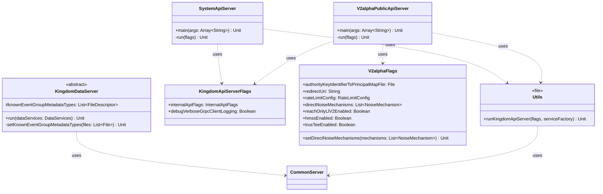

# org.wfanet.measurement.kingdom.deploy.common.server

## Overview
This package provides server deployment infrastructure for the Kingdom component of the Cross-Media Measurement system. It contains abstract server implementations for data services, system APIs, and public APIs, along with utility functions for configuring and launching gRPC servers with authentication, authorization, rate limiting, and protocol configuration support.

## Components

### KingdomDataServer
Abstract base class for deploying Kingdom internal data services with protocol configuration.

| Method | Parameters | Returns | Description |
|--------|------------|---------|-------------|
| run | `dataServices: DataServices` | `Unit` (suspend) | Initializes protocol configs, builds services, and starts server |
| setKnownEventGroupMetadataTypes | `fileDescriptorSetFiles: List<File>` | `Unit` | Loads FileDescriptorSets for known EventGroup metadata types |

**Properties:**
- `knownEventGroupMetadataTypes: List<Descriptors.FileDescriptor>` - Parsed metadata type descriptors

**Command-Line Flags:**
- `--known-event-group-metadata-type` - Path to FileDescriptorSet for EventGroup metadata types (repeatable)

### SystemApiServer
Executable server for Kingdom system API services (v1alpha) used by Duchies.

| Service | Internal Stub | Description |
|---------|---------------|-------------|
| ComputationsService | InternalMeasurementsCoroutineStub | Exposes computation operations to Duchies |
| ComputationParticipantsService | InternalComputationParticipantsCoroutineStub | Manages computation participant lifecycle |
| ComputationLogEntriesService | InternalMeasurementLogEntriesCoroutineStub | Provides computation logging functionality |
| RequisitionsService | InternalRequisitionsCoroutineStub | Manages requisition operations |

| Function | Parameters | Returns | Description |
|----------|------------|---------|-------------|
| main | `args: Array<String>` | `Unit` | Entry point for SystemApiServer daemon |
| run | `kingdomApiServerFlags: KingdomApiServerFlags`, `duchyInfoFlags: DuchyInfoFlags`, `commonServerFlags: CommonServer.Flags`, `serviceFlags: ServiceFlags` | `Unit` | Configures and starts system API server |

### V2alphaPublicApiServer
Executable server for Kingdom v2alpha public API services with comprehensive authentication and rate limiting.

**Supported Services (20 total):**
- AccountsService - Account management with OpenID authentication
- ApiKeysService - API key lifecycle management
- CertificatesService - Certificate management for entities
- DataProvidersService - Data provider resource management
- EventGroupsService - Event group operations
- EventGroupMetadataDescriptorsService - Metadata descriptor management
- MeasurementsService - Measurement creation and management with protocol support
- MeasurementConsumersService - Measurement consumer operations
- PublicKeysService - Public key management
- RequisitionsService - Requisition lifecycle management
- ExchangesService, ExchangeStepsService, ExchangeStepAttemptsService - Data exchange workflow
- ModelProvidersService, ModelLinesService, ModelShardsService, ModelSuitesService, ModelReleasesService, ModelOutagesService, ModelRolloutsService - Model management APIs
- PopulationsService - Population management

| Function | Parameters | Returns | Description |
|----------|------------|---------|-------------|
| main | `args: Array<String>` | `Unit` | Entry point for V2alphaPublicApiServer daemon |
| run | `kingdomApiServerFlags: KingdomApiServerFlags`, `commonServerFlags: CommonServer.Flags`, `serviceFlags: ServiceFlags`, `llv2ProtocolConfigFlags: Llv2ProtocolConfigFlags`, `roLlv2ProtocolConfigFlags: RoLlv2ProtocolConfigFlags`, `hmssProtocolConfigFlags: HmssProtocolConfigFlags`, `v2alphaFlags: V2alphaFlags`, `trusteeProtocolConfigFlags: TrusTeeProtocolConfigFlags`, `duchyInfoFlags: DuchyInfoFlags` | `Unit` | Configures and starts v2alpha public API server |

**Authentication Mechanisms:**
- AccountAuthenticationServerInterceptor - OpenID-based account authentication
- ApiKeyAuthenticationServerInterceptor - API key validation
- AkidPrincipalServerInterceptor - Authority Key Identifier principal lookup
- AuthorityKeyServerInterceptor - Client certificate AKID extraction

**Rate Limiting:**
- Per-client rate limiting based on certificate AKID
- Configurable via RateLimitConfig textproto
- Default: unlimited requests, 1.0 average rate

### V2alphaFlags
Configuration flags for v2alpha API server behavior.

| Property | Type | Description |
|----------|------|-------------|
| authorityKeyIdentifierToPrincipalMapFile | `File` | Maps certificate AKIDs to principals |
| redirectUri | `String` | OpenID redirect URI for authentication |
| rateLimitConfig | `RateLimitConfig` | Rate limiting configuration (lazy-loaded) |
| directNoiseMechanisms | `List<NoiseMechanism>` | Allowed noise mechanisms for direct computation |
| reachOnlyLlV2Enabled | `Boolean` | Enables Reach-Only Liquid Legions v2 protocol |
| hmssEnabled | `Boolean` | Enables Honest Majority Share Shuffle protocol |
| hmssEnabledMeasurementConsumers | `List<String>` | Force-enable HMSS for specific consumers |
| trusTeeEnabled | `Boolean` | Enables TrusTEE protocol |
| trusTeeEnabledMeasurementConsumers | `List<String>` | Force-enable TrusTEE for specific consumers |

| Method | Parameters | Returns | Description |
|--------|------------|---------|-------------|
| setDirectNoiseMechanisms | `noiseMechanisms: List<NoiseMechanism>` | `Unit` | Validates and sets allowed direct noise mechanisms |

**Validation Rules:**
- Rejects GEOMETRIC and DISCRETE_GAUSSIAN for direct computation
- Accepts NONE, CONTINUOUS_LAPLACE, CONTINUOUS_GAUSSIAN

### KingdomApiServerFlags
Shared configuration flags for Kingdom API servers.

| Property | Type | Description |
|----------|------|-------------|
| internalApiFlags | `InternalApiFlags` | Internal API connection configuration |
| debugVerboseGrpcClientLogging | `Boolean` | Enables verbose gRPC client logging |

### Utils.kt Functions

| Function | Parameters | Returns | Description |
|----------|------------|---------|-------------|
| runKingdomApiServer | `kingdomApiServerFlags: KingdomApiServerFlags`, `serverName: String`, `duchyInfoFlags: DuchyInfoFlags`, `commonServerFlags: CommonServer.Flags`, `serviceFactory: (Channel) -> Iterable<BindableService>` | `Unit` | Builds mutual TLS channel, initializes services, starts server |

**Channel Configuration:**
- Mutual TLS with certificate validation
- Configurable default deadline
- Optional verbose logging
- Duchy identity interceptor injection

## Dependencies

### External Libraries
- `picocli.CommandLine` - Command-line argument parsing with annotations
- `io.grpc` - gRPC server and channel infrastructure
- `com.google.protobuf` - Protocol buffer descriptor handling
- `kotlinx.coroutines` - Asynchronous execution with coroutine dispatchers

### Internal Measurement System Packages
- `org.wfanet.measurement.common.grpc` - Common server, channel builders, interceptors
- `org.wfanet.measurement.common.identity` - DuchyInfo initialization and identity management
- `org.wfanet.measurement.common.crypto` - Certificate loading and TLS configuration
- `org.wfanet.measurement.kingdom.deploy.common` - Protocol configs (Llv2, RoLlv2, HMSS, TrusTEE), DuchyIds
- `org.wfanet.measurement.kingdom.service.api.v2alpha` - Public API service implementations
- `org.wfanet.measurement.kingdom.service.system.v1alpha` - System API service implementations
- `org.wfanet.measurement.internal.kingdom.*` - Internal gRPC stubs for backend communication
- `org.wfanet.measurement.api.v2alpha` - API context keys and principal types
- `org.wfanet.measurement.config` - Rate limit configuration protos

## Usage Example

```kotlin
// Launching SystemApiServer
fun main(args: Array<String>) = commandLineMain(::run, args)

// Extending KingdomDataServer
class CustomDataServer : KingdomDataServer() {
  override fun run() = runBlocking {
    val dataServices = DataServices(
      // Service implementations
    )
    run(dataServices)
  }
}

// Using runKingdomApiServer utility
runKingdomApiServer(
  kingdomApiServerFlags = kingdomFlags,
  serverName = "CustomServer",
  duchyInfoFlags = duchyFlags,
  commonServerFlags = serverFlags
) { channel ->
  listOf(
    CustomService(SomeStub(channel), dispatcher)
  )
}
```

## Class Diagram



## Architecture Notes

**Server Initialization Flow:**
1. Parse command-line flags with Picocli
2. Initialize protocol configurations (Llv2, RoLlv2, HMSS, TrusTEE)
3. Initialize DuchyInfo and DuchyIds singletons
4. Build mutual TLS channel to internal API
5. Create service instances with internal stubs
6. Apply interceptors (authentication, rate limiting, metrics)
7. Start CommonServer with configured services

**Security Layers:**
- Mutual TLS authentication at transport layer
- Certificate-based principal extraction (AKID)
- API key authentication for certain services
- Account-based authentication with OpenID
- Rate limiting per client certificate

**Protocol Support:**
- Liquid Legions v2 (standard and reach-only variants)
- Honest Majority Share Shuffle (HMSS)
- TrusTEE secure computation
- Per-consumer protocol override capability
