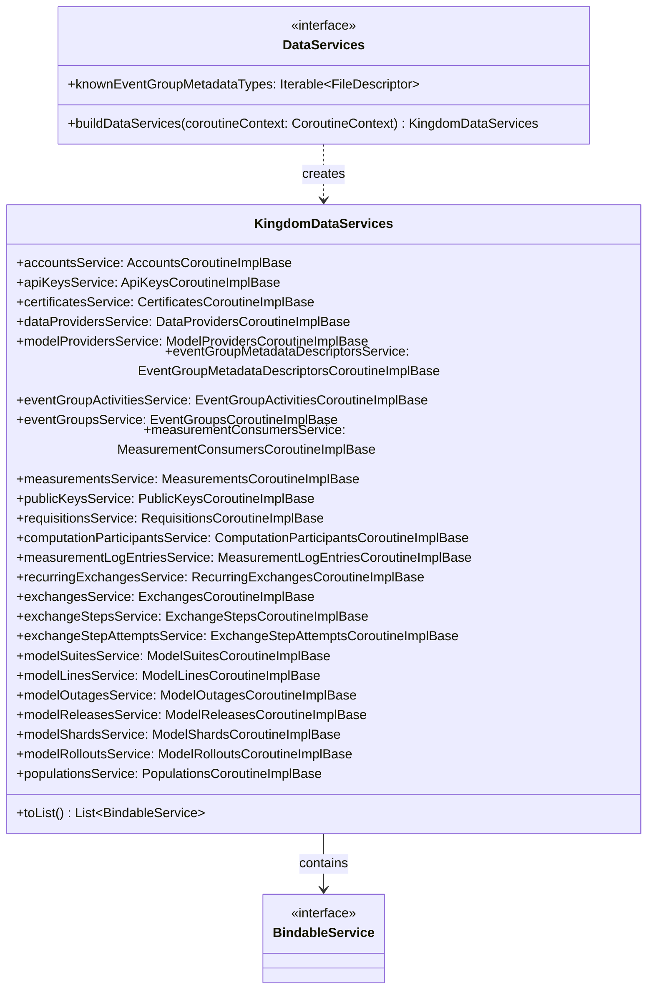

# org.wfanet.measurement.kingdom.deploy.common.service

## Overview
This package provides service factory interfaces and data structures for managing the Kingdom's internal data-layer gRPC services. It centralizes the initialization and configuration of all internal Kingdom services, enabling consistent deployment across different storage backends and infrastructure environments.

## Components

### DataServices
Factory interface for constructing Kingdom internal data-layer services.

| Method | Parameters | Returns | Description |
|--------|------------|---------|-------------|
| buildDataServices | `coroutineContext: CoroutineContext` (default: EmptyCoroutineContext) | `KingdomDataServices` | Builds and configures all Kingdom internal services with specified coroutine context |

| Property | Type | Description |
|----------|------|-------------|
| knownEventGroupMetadataTypes | `Iterable<Descriptors.FileDescriptor>` | Protobuf file descriptors for EventGroup metadata types beyond standard well-known types |

### KingdomDataServices
Data class aggregating all Kingdom internal gRPC service implementations.

| Property | Type | Description |
|----------|------|-------------|
| accountsService | `AccountsCoroutineImplBase` | Manages user account operations |
| apiKeysService | `ApiKeysCoroutineImplBase` | Handles API key lifecycle and validation |
| certificatesService | `CertificatesCoroutineImplBase` | Manages X.509 certificates for encryption and signing |
| dataProvidersService | `DataProvidersCoroutineImplBase` | Handles data provider registration and management |
| modelProvidersService | `ModelProvidersCoroutineImplBase` | Manages model provider entities |
| eventGroupMetadataDescriptorsService | `EventGroupMetadataDescriptorsCoroutineImplBase` | Manages protobuf descriptors for event group metadata |
| eventGroupActivitiesService | `EventGroupActivitiesCoroutineImplBase` | Tracks event group activity logs |
| eventGroupsService | `EventGroupsCoroutineImplBase` | Manages collections of events for measurements |
| measurementConsumersService | `MeasurementConsumersCoroutineImplBase` | Handles measurement consumer registration and operations |
| measurementsService | `MeasurementsCoroutineImplBase` | Core measurement lifecycle management |
| publicKeysService | `PublicKeysCoroutineImplBase` | Manages public keys for cryptographic operations |
| requisitionsService | `RequisitionsCoroutineImplBase` | Handles measurement requisition workflow |
| computationParticipantsService | `ComputationParticipantsCoroutineImplBase` | Manages participants in multi-party computations |
| measurementLogEntriesService | `MeasurementLogEntriesCoroutineImplBase` | Tracks measurement execution logs |
| recurringExchangesService | `RecurringExchangesCoroutineImplBase` | Manages recurring data exchange schedules |
| exchangesService | `ExchangesCoroutineImplBase` | Handles individual data exchange operations |
| exchangeStepsService | `ExchangeStepsCoroutineImplBase` | Manages steps within data exchange workflows |
| exchangeStepAttemptsService | `ExchangeStepAttemptsCoroutineImplBase` | Tracks execution attempts for exchange steps |
| modelSuitesService | `ModelSuitesCoroutineImplBase` | Manages suites of machine learning models |
| modelLinesService | `ModelLinesCoroutineImplBase` | Handles model line definitions and configurations |
| modelOutagesService | `ModelOutagesCoroutineImplBase` | Tracks model availability and outage periods |
| modelReleasesService | `ModelReleasesCoroutineImplBase` | Manages versioned model releases |
| modelShardsService | `ModelShardsCoroutineImplBase` | Handles model sharding for distributed storage |
| modelRolloutsService | `ModelRolloutsCoroutineImplBase` | Manages gradual deployment of model versions |
| populationsService | `PopulationsCoroutineImplBase` | Manages population definitions for measurements |

## Extensions

### toList
Converts KingdomDataServices instance to a list of BindableService objects.

| Function | Receiver | Parameters | Returns | Description |
|----------|----------|------------|---------|-------------|
| toList | `KingdomDataServices` | None | `List<BindableService>` | Extracts all service properties as bindable gRPC services using reflection |

## Dependencies
- `com.google.protobuf` - Protobuf descriptor handling for metadata types
- `io.grpc` - gRPC service binding interface
- `kotlin.coroutines` - Coroutine context propagation for async operations
- `kotlin.reflect` - Runtime reflection for service property extraction
- `org.wfanet.measurement.internal.kingdom` - Internal Kingdom gRPC service base classes

## Usage Example
```kotlin
// Implement DataServices for a specific storage backend
class PostgresDataServices(
  private val connectionPool: ConnectionPool
) : DataServices {

  override fun buildDataServices(
    coroutineContext: CoroutineContext
  ): KingdomDataServices {
    return KingdomDataServices(
      accountsService = AccountsService(connectionPool, coroutineContext),
      apiKeysService = ApiKeysService(connectionPool, coroutineContext),
      // ... configure remaining services
    )
  }

  override val knownEventGroupMetadataTypes = listOf(
    CustomMetadata.getDescriptor()
  )
}

// Build and bind services to gRPC server
val dataServices: DataServices = PostgresDataServices(pool)
val kingdomServices = dataServices.buildDataServices(Dispatchers.IO)
val serviceList = kingdomServices.toList()

serviceList.forEach { service ->
  grpcServer.addService(service)
}
```

## Class Diagram


## Architecture Notes

### Design Pattern
This package implements the **Abstract Factory** pattern, allowing different storage backend implementations (e.g., PostgreSQL, Spanner) to provide their own concrete service instances while maintaining a consistent interface.

### Service Organization
Services are categorized into functional domains:
- **Identity & Access**: Accounts, API Keys, Certificates, Public Keys
- **Entity Management**: Data Providers, Measurement Consumers, Model Providers
- **Measurement Workflow**: Measurements, Requisitions, Computation Participants, Measurement Log Entries
- **Event Data**: Event Groups, Event Group Activities, Event Group Metadata Descriptors
- **Data Exchange**: Recurring Exchanges, Exchanges, Exchange Steps, Exchange Step Attempts
- **Model Management**: Model Suites, Model Lines, Model Releases, Model Shards, Model Rollouts, Model Outages
- **Populations**: Population definitions for measurement targeting

### Extensibility
The `knownEventGroupMetadataTypes` property enables custom protobuf message types for EventGroup metadata, allowing deployments to extend the schema with domain-specific metadata structures without modifying core service logic.
