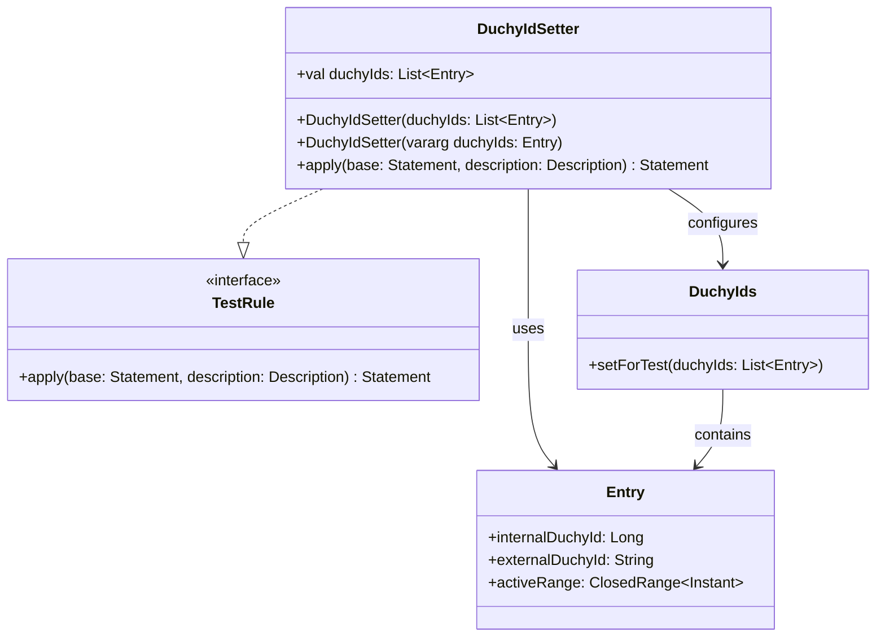

# org.wfanet.measurement.kingdom.deploy.common.testing

## Overview
This package provides testing utilities for the Kingdom deployment common module. It contains JUnit test rules for configuring test environments with specific Duchy ID configurations.

## Components

### DuchyIdSetter
JUnit rule that sets the global list of valid Duchy IDs for testing purposes.

| Method | Parameters | Returns | Description |
|--------|------------|---------|-------------|
| `<init>` | `duchyIds: List<DuchyIds.Entry>` | `DuchyIdSetter` | Primary constructor accepting a list of Duchy ID entries |
| `<init>` | `vararg duchyIds: DuchyIds.Entry` | `DuchyIdSetter` | Secondary constructor accepting variable arguments |
| apply | `base: Statement`, `description: Description` | `Statement` | Applies the test rule by setting Duchy IDs before test execution |

## Data Structures

### DuchyIdSetter Constructor Parameters
| Property | Type | Description |
|----------|------|-------------|
| duchyIds | `List<DuchyIds.Entry>` | List of Duchy ID entries to set for the test |

## Dependencies
- `org.junit.rules.TestRule` - JUnit test rule interface implementation
- `org.junit.runner.Description` - JUnit test description metadata
- `org.junit.runners.model.Statement` - JUnit statement execution model
- `org.wfanet.measurement.kingdom.deploy.common.DuchyIds` - Global Duchy ID registry being configured

## Usage Example
```kotlin
import org.junit.Rule
import org.wfanet.measurement.kingdom.deploy.common.DuchyIds
import org.wfanet.measurement.kingdom.deploy.common.testing.DuchyIdSetter
import java.time.Instant

class MyKingdomTest {
  @get:Rule
  val duchyIdSetter = DuchyIdSetter(
    DuchyIds.Entry(
      internalDuchyId = 1L,
      externalDuchyId = "duchy1",
      activeRange = Instant.EPOCH..Instant.MAX
    ),
    DuchyIds.Entry(
      internalDuchyId = 2L,
      externalDuchyId = "duchy2",
      activeRange = Instant.EPOCH..Instant.MAX
    )
  )

  @Test
  fun testWithConfiguredDuchies() {
    // Test code that depends on specific Duchy IDs
    val internalId = DuchyIds.getInternalId("duchy1")
    assertEquals(1L, internalId)
  }
}
```

## Class Diagram

