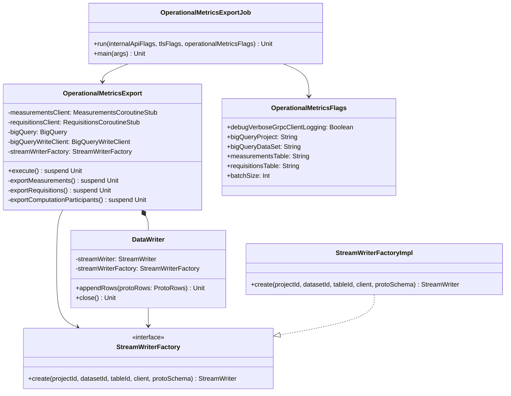

# org.wfanet.measurement.kingdom.deploy.gcloud.job

## Overview
This package provides a batch job system for exporting operational metrics from the Kingdom Internal Server to Google Cloud BigQuery. It streams measurement, requisition, and computation data incrementally, maintaining state to enable resumable exports of completed measurements and their associated metadata.

## Components

### OperationalMetricsExport
Orchestrates the export of operational metrics data to BigQuery tables through incremental streaming with state tracking.

| Method | Parameters | Returns | Description |
|--------|------------|---------|-------------|
| execute | - | `suspend Unit` | Exports all operational metrics in sequence |
| exportMeasurements | - | `suspend Unit` | Streams completed measurements to BigQuery |
| exportRequisitions | - | `suspend Unit` | Streams fulfilled/refused requisitions to BigQuery |
| exportComputationParticipants | - | `suspend Unit` | Streams computation stage metrics to BigQuery |

**Constructor Parameters:**
| Parameter | Type | Description |
|-----------|------|-------------|
| measurementsClient | `MeasurementsCoroutineStub` | gRPC client for measurement data |
| requisitionsClient | `RequisitionsCoroutineStub` | gRPC client for requisition data |
| bigQuery | `BigQuery` | BigQuery client for querying state |
| bigQueryWriteClient | `BigQueryWriteClient` | BigQuery write client for streaming inserts |
| projectId | `String` | GCP project identifier |
| datasetId | `String` | BigQuery dataset identifier |
| latestMeasurementReadTableId | `String` | Table tracking last processed measurement |
| latestRequisitionReadTableId | `String` | Table tracking last processed requisition |
| latestComputationReadTableId | `String` | Table tracking last processed computation |
| measurementsTableId | `String` | Target table for measurement metrics |
| requisitionsTableId | `String` | Target table for requisition metrics |
| computationParticipantStagesTableId | `String` | Target table for computation stage metrics |
| streamWriterFactory | `StreamWriterFactory` | Factory for creating BigQuery stream writers |
| batchSize | `Int` | Number of records per batch (default: 1000) |

### OperationalMetricsExport.DataWriter
Internal auto-closeable wrapper for BigQuery StreamWriter with retry logic and automatic stream recreation.

| Method | Parameters | Returns | Description |
|--------|------------|---------|-------------|
| appendRows | `protoRows: ProtoRows` | `Unit` | Writes protobuf rows with retry on transient failures |
| close | - | `Unit` | Closes the underlying stream writer |

### OperationalMetricsExportJob
Command-line executable entry point for the operational metrics export job.

| Function | Parameters | Returns | Description |
|----------|------------|---------|-------------|
| run | `internalApiFlags: InternalApiFlags, tlsFlags: TlsFlags, operationalMetricsFlags: OperationalMetricsFlags` | `Unit` | Configures clients and executes the export |
| main | `args: Array<String>` | `Unit` | Application entry point |

## Data Structures

### OperationalMetricsFlags
Command-line configuration flags for the operational metrics job.

| Property | Type | Description |
|----------|------|-------------|
| debugVerboseGrpcClientLogging | `Boolean` | Enables detailed gRPC request/response logging |
| bigQueryProject | `String` | BigQuery project ID (required) |
| bigQueryDataSet | `String` | BigQuery dataset ID (required) |
| measurementsTable | `String` | Measurements table ID (required) |
| requisitionsTable | `String` | Requisitions table ID (required) |
| computationParticipantStagesTable | `String` | Computation stages table ID (required) |
| latestMeasurementReadTable | `String` | Latest measurement read table ID (required) |
| latestRequisitionReadTable | `String` | Latest requisition read table ID (required) |
| latestComputationReadTable | `String` | Latest computation read table ID (required) |
| batchSize | `Int` | Number of rows per insert batch (default: 1000) |

### StreamWriterFactory
Functional interface for creating configured BigQuery StreamWriter instances.

| Method | Parameters | Returns | Description |
|--------|------------|---------|-------------|
| create | `projectId: String, datasetId: String, tableId: String, client: BigQueryWriteClient, protoSchema: ProtoSchema` | `StreamWriter` | Creates a configured StreamWriter for the specified table |

### StreamWriterFactoryImpl
Default implementation of StreamWriterFactory with connection pooling and default value handling.

| Method | Parameters | Returns | Description |
|--------|------------|---------|-------------|
| create | `projectId: String, datasetId: String, tableId: String, client: BigQueryWriteClient, protoSchema: ProtoSchema` | `StreamWriter` | Creates StreamWriter with thread pool executor and connection pooling |

## Dependencies

- `com.google.cloud.bigquery` - BigQuery client for state queries and configuration
- `com.google.cloud.bigquery.storage.v1` - BigQuery Write API for streaming inserts
- `org.wfanet.measurement.internal.kingdom` - Kingdom internal API gRPC clients and protobuf definitions
- `org.wfanet.measurement.common.grpc` - Common gRPC utilities for TLS and channel configuration
- `org.wfanet.measurement.api.v2alpha` - Public API measurement specifications
- `picocli` - Command-line argument parsing framework

## Usage Example

```kotlin
// Configure and run the operational metrics export job
val measurementsClient = MeasurementsGrpcKt.MeasurementsCoroutineStub(channel)
val requisitionsClient = RequisitionsGrpcKt.RequisitionsCoroutineStub(channel)
val bigQuery = BigQueryOptions.newBuilder().setProjectId(projectId).build().service

BigQueryWriteClient.create().use { bigQueryWriteClient ->
  val exporter = OperationalMetricsExport(
    measurementsClient = measurementsClient,
    requisitionsClient = requisitionsClient,
    bigQuery = bigQuery,
    bigQueryWriteClient = bigQueryWriteClient,
    projectId = "my-project",
    datasetId = "operational_metrics",
    latestMeasurementReadTableId = "latest_measurement_read",
    latestRequisitionReadTableId = "latest_requisition_read",
    latestComputationReadTableId = "latest_computation_read",
    measurementsTableId = "measurements",
    requisitionsTableId = "requisitions",
    computationParticipantStagesTableId = "computation_stages",
    batchSize = 1000
  )

  exporter.execute()
}
```

## Architecture

### Export Flow
1. Query BigQuery state tables to determine the last processed record
2. Stream data from Kingdom Internal Server starting after last processed record
3. Transform internal protobuf models to BigQuery table row protos
4. Write data batches to BigQuery using streaming inserts
5. Update state tables with latest processed record identifiers
6. Repeat until no more records are available

### Incremental Processing
Each export method maintains resumability by:
- Querying the corresponding `latest_*_read` table for the most recent export position
- Using `after` filters in streaming requests to fetch only new records
- Updating state tables after each successful batch write
- Processing data in configurable batch sizes to manage memory and API quotas

### Error Handling
The DataWriter implements retry logic with:
- Up to 3 retry attempts for transient errors (Code.INTERNAL)
- Automatic stream writer recreation (up to 3 times) on stream closure
- Detailed logging of serialization errors with row-level error messages
- Non-retriable errors immediately propagate to halt the job

## Class Diagram


