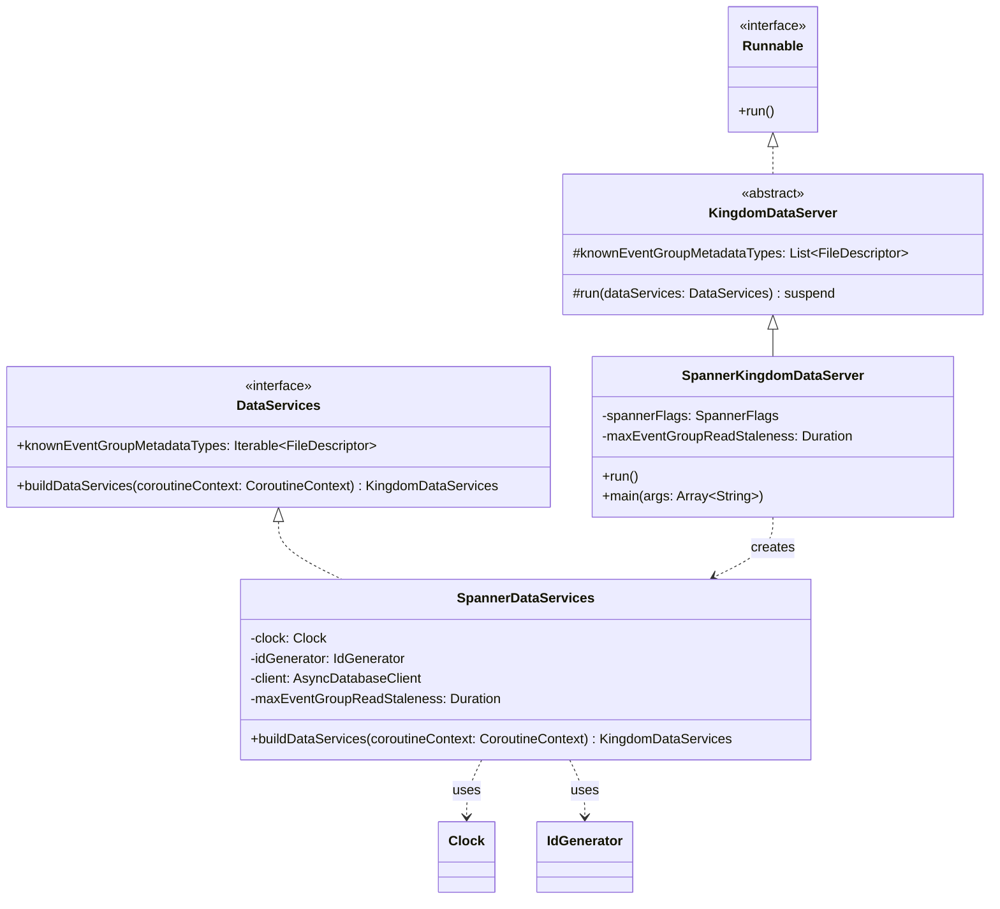

# org.wfanet.measurement.kingdom.deploy.gcloud.server

## Overview
This package provides the Google Cloud Spanner implementation of the Kingdom data-layer server. It contains the main executable server class that bootstraps and runs all internal Kingdom data services using Spanner as the persistence layer. The server is designed to be launched as a standalone blocking process with command-line configuration.

## Components

### SpannerKingdomDataServer
Command-line executable server that starts internal Kingdom data-layer services backed by Google Cloud Spanner.

| Method | Parameters | Returns | Description |
|--------|------------|---------|-------------|
| run | None | `Unit` | Initializes Spanner client and launches data services |
| main | `args: Array<String>` | `Unit` | Entry point for command-line execution |

**Command-Line Options:**
- `--max-event-group-read-staleness` - Maximum staleness for stale EventGroup reads (default: 30s)
- Inherits options from `KingdomDataServer` parent class
- Includes `SpannerFlags` mixin for Spanner configuration

**Annotations:**
- `@CommandLine.Command` - Configures PicoCLI command with name "SpannerKingdomDataServer"

## Class Hierarchy

```
Runnable (interface)
    └── KingdomDataServer (abstract)
        └── SpannerKingdomDataServer
```

SpannerKingdomDataServer extends the abstract `KingdomDataServer` class and implements Spanner-specific initialization logic.

## Dependencies

- `org.wfanet.measurement.common` - Command-line utilities and ID generation
  - `commandLineMain` - Main method wrapper for command execution
  - `RandomIdGenerator` - Generates unique identifiers using system clock

- `org.wfanet.measurement.gcloud.spanner` - Spanner client utilities
  - `SpannerFlags` - Command-line flags for Spanner configuration
  - `usingSpanner` - Resource management for Spanner connections

- `org.wfanet.measurement.kingdom.deploy.common.server` - Base server abstraction
  - `KingdomDataServer` - Abstract parent class with shared configuration

- `org.wfanet.measurement.kingdom.deploy.gcloud.spanner` - Spanner service implementations
  - `SpannerDataServices` - Factory for creating Spanner-backed data services

- `picocli.CommandLine` - Command-line parsing framework

- `kotlinx.coroutines` - Coroutine support for async operations
  - `runBlocking` - Bridges blocking main execution with suspending functions

- `java.time` - Time and duration handling
  - `Clock.systemUTC()` - System clock for timestamps
  - `Duration` - Time span configuration

## Configuration

### Inherited from KingdomDataServer
The server inherits extensive configuration from its parent class including:
- `CommonServer.Flags` - Server host, port, and TLS settings
- `ServiceFlags` - Thread pool executor configuration
- `DuchyInfoFlags` - Duchy (computation node) configuration
- `DuchyIdsFlags` - Duchy identifier mappings
- Protocol configuration flags:
  - `Llv2ProtocolConfigFlags` - Liquid Legions V2 protocol
  - `RoLlv2ProtocolConfigFlags` - Reach-only Liquid Legions V2
  - `HmssProtocolConfigFlags` - Honest Majority Secret Sharing
  - `TrusTeeProtocolConfigFlags` - Trusted Execution Environment
- `--known-event-group-metadata-type` - Paths to EventGroup metadata type descriptors

### Spanner-Specific Configuration
- `SpannerFlags` mixin provides:
  - Database connection strings
  - Credentials configuration
  - Connection pool settings
- `maxEventGroupReadStaleness` - Controls read freshness for EventGroup queries

## Usage Example

```kotlin
// Command-line execution
fun main(args: Array<String>) = commandLineMain(SpannerKingdomDataServer(), args)

// Typical command-line invocation:
// SpannerKingdomDataServer \
//   --spanner-project=my-project \
//   --spanner-instance=my-instance \
//   --spanner-database=kingdom \
//   --port=8080 \
//   --max-event-group-read-staleness=30s
```

## Runtime Behavior

1. **Initialization Phase:**
   - Parses command-line arguments via PicoCLI
   - Establishes Spanner database client connection
   - Creates system UTC clock and random ID generator

2. **Service Construction:**
   - Instantiates `SpannerDataServices` with:
     - Clock and ID generator
     - Spanner database client
     - Known EventGroup metadata type descriptors
     - EventGroup read staleness configuration
   - Builds 25+ internal data services (Accounts, ApiKeys, Certificates, DataProviders, Measurements, etc.)

3. **Server Launch:**
   - Initializes protocol configurations (Duchy info, protocol configs)
   - Creates gRPC server with built services
   - Starts server and blocks until shutdown signal

## Data Services Provided

The `SpannerDataServices` factory creates Spanner-backed implementations for:
- Account management
- API key management
- Certificate management
- Data Provider and Model Provider management
- EventGroup operations with configurable staleness
- Measurement Consumer operations
- Measurement and Requisition tracking
- Public key management
- Computation participant tracking
- Measurement logging
- Recurring exchange scheduling
- Exchange and exchange step execution
- Model suite, line, release, shard, and rollout management
- Population management

## Class Diagram


