# org.wfanet.measurement.kingdom.deploy.gcloud.spanner.common

## Overview
This package provides common utilities and exception types for the Kingdom service's Google Cloud Spanner deployment layer. It centralizes error handling through a comprehensive hierarchy of domain-specific exceptions and offers utility functions for entity tag (ETag) computation based on RFC 7232 standards.

## Components

### ETags
Utility object for computing RFC 7232 compliant entity tags from Spanner timestamps.

| Method | Parameters | Returns | Description |
|--------|------------|---------|-------------|
| computeETag | `updateTime: Timestamp` | `String` | Converts Spanner timestamp to RFC 7232 entity tag |

### KingdomInternalException
Base sealed class for all Kingdom internal API service errors, providing structured error codes and gRPC StatusRuntimeException conversion.

| Method | Parameters | Returns | Description |
|--------|------------|---------|-------------|
| asStatusRuntimeException | `statusCode: Status.Code, message: String` | `StatusRuntimeException` | Converts exception to gRPC status with error metadata |
| toString | - | `String` | Returns exception string representation with context |

**Properties:**
- `code: ErrorCode` - Internal error code enum value
- `context: Map<String, String>` - Contextual metadata for debugging

## Exception Hierarchy

### Validation Exceptions

#### RequiredFieldNotSetException
Thrown when a required protobuf field is not set.

| Property | Type | Description |
|----------|------|-------------|
| fieldName | `String` | Name of the missing required field |

#### InvalidFieldValueException
Thrown when a field contains an invalid value.

| Property | Type | Description |
|----------|------|-------------|
| fieldName | `String` | Name of the field with invalid value |

### Entity Not Found Exceptions

#### MeasurementConsumerNotFoundException
| Property | Type | Description |
|----------|------|-------------|
| externalMeasurementConsumerId | `ExternalId` | External ID of missing consumer |

#### ModelSuiteNotFoundException
| Property | Type | Description |
|----------|------|-------------|
| externalModelProviderId | `ExternalId` | External ID of model provider |
| externalModelSuiteId | `ExternalId` | External ID of missing suite |

#### ModelLineNotFoundException
| Property | Type | Description |
|----------|------|-------------|
| externalModelProviderId | `ExternalId` | External ID of model provider |
| externalModelSuiteId | `ExternalId` | External ID of model suite |
| externalModelLineId | `ExternalId` | External ID of missing line |

#### ModelReleaseNotFoundException
| Property | Type | Description |
|----------|------|-------------|
| externalModelProviderId | `ExternalId` | External ID of model provider |
| externalModelSuiteId | `ExternalId` | External ID of model suite |
| externalModelReleaseId | `ExternalId` | External ID of missing release |

#### ModelRolloutNotFoundException
| Property | Type | Description |
|----------|------|-------------|
| externalModelProviderId | `ExternalId` | External ID of model provider |
| externalModelSuiteId | `ExternalId` | External ID of model suite |
| externalModelLineId | `ExternalId` | External ID of model line |
| externalModelRolloutId | `ExternalId?` | External ID of missing rollout (nullable) |

#### DataProviderNotFoundException
| Property | Type | Description |
|----------|------|-------------|
| externalDataProviderId | `ExternalId` | External ID of missing data provider |

#### ModelProviderNotFoundException
| Property | Type | Description |
|----------|------|-------------|
| externalModelProviderId | `ExternalId` | External ID of missing model provider |

#### DuchyNotFoundException
| Property | Type | Description |
|----------|------|-------------|
| externalDuchyId | `String` | External ID of missing duchy |

#### MeasurementNotFoundException
Base exception for measurement not found errors (open class for inheritance).

#### MeasurementNotFoundByComputationException
| Property | Type | Description |
|----------|------|-------------|
| externalComputationId | `ExternalId` | External computation ID used in lookup |

#### MeasurementNotFoundByMeasurementConsumerException
| Property | Type | Description |
|----------|------|-------------|
| externalMeasurementConsumerId | `ExternalId` | External consumer ID used in lookup |
| externalMeasurementId | `ExternalId` | External measurement ID not found |

#### CertificateNotFoundException
Base exception for certificate not found errors.

| Property | Type | Description |
|----------|------|-------------|
| externalCertificateId | `ExternalId` | External ID of missing certificate |

#### DataProviderCertificateNotFoundException
Extends CertificateNotFoundException with data provider context.

#### MeasurementConsumerCertificateNotFoundException
Extends CertificateNotFoundException with measurement consumer context.

#### DuchyCertificateNotFoundException
Extends CertificateNotFoundException with duchy context.

#### ModelProviderCertificateNotFoundException
Extends CertificateNotFoundException with model provider context.

#### ComputationParticipantNotFoundException
Base exception for computation participant not found errors.

#### ComputationParticipantNotFoundByComputationException
| Property | Type | Description |
|----------|------|-------------|
| externalComputationId | `ExternalId` | External computation ID |
| externalDuchyId | `String` | External duchy ID |

#### ComputationParticipantNotFoundByMeasurementException
| Property | Type | Description |
|----------|------|-------------|
| internalMeasurementConsumerId | `InternalId` | Internal consumer ID |
| internalMeasurementId | `InternalId` | Internal measurement ID |
| internalDuchyId | `InternalId` | Internal duchy ID |

#### RequisitionNotFoundException
Abstract base exception for requisition not found errors.

| Property | Type | Description |
|----------|------|-------------|
| externalRequisitionId | `ExternalId` | External requisition ID |

#### RequisitionNotFoundByComputationException
Extends RequisitionNotFoundException with computation context.

#### RequisitionNotFoundByDataProviderException
Extends RequisitionNotFoundException with data provider context.

#### AccountNotFoundException
| Property | Type | Description |
|----------|------|-------------|
| externalAccountId | `ExternalId` | External account ID |

#### ApiKeyNotFoundException
| Property | Type | Description |
|----------|------|-------------|
| externalApiKeyId | `ExternalId` | External API key ID |

#### EventGroupNotFoundException
| Property | Type | Description |
|----------|------|-------------|
| externalDataProviderId | `ExternalId` | External data provider ID |
| externalEventGroupId | `ExternalId` | External event group ID |

#### EventGroupNotFoundByMeasurementConsumerException
| Property | Type | Description |
|----------|------|-------------|
| externalMeasurementConsumerId | `ExternalId` | External consumer ID |
| externalEventGroupId | `ExternalId` | External event group ID |

#### EventGroupActivityNotFoundException
| Property | Type | Description |
|----------|------|-------------|
| externalDataProviderId | `ExternalId` | External data provider ID |
| externalEventGroupId | `ExternalId` | External event group ID |
| activityDate | `Date` | Date of missing activity |

#### EventGroupMetadataDescriptorNotFoundException
| Property | Type | Description |
|----------|------|-------------|
| externalDataProviderId | `ExternalId` | External data provider ID |
| externalEventGroupMetadataDescriptorId | `ExternalId` | External metadata descriptor ID |

#### RecurringExchangeNotFoundException
| Property | Type | Description |
|----------|------|-------------|
| externalRecurringExchangeId | `ExternalId` | External recurring exchange ID |

#### ExchangeNotFoundException
| Property | Type | Description |
|----------|------|-------------|
| externalRecurringExchangeId | `ExternalId` | External recurring exchange ID |
| date | `Date` | Exchange date |

#### ExchangeStepNotFoundException
| Property | Type | Description |
|----------|------|-------------|
| externalRecurringExchangeId | `ExternalId` | External recurring exchange ID |
| date | `Date` | Exchange date |
| stepIndex | `Int` | Index of missing step |

#### ExchangeStepAttemptNotFoundException
| Property | Type | Description |
|----------|------|-------------|
| externalRecurringExchangeId | `ExternalId` | External recurring exchange ID |
| date | `Date` | Exchange date |
| stepIndex | `Int` | Step index |
| attemptNumber | `Int` | Attempt number |

#### ModelOutageNotFoundException
| Property | Type | Description |
|----------|------|-------------|
| externalModelProviderId | `ExternalId` | External model provider ID |
| externalModelSuiteId | `ExternalId` | External model suite ID |
| externalModelLineId | `ExternalId` | External model line ID |
| externalModelOutageId | `ExternalId` | External model outage ID |

#### ModelShardNotFoundException
| Property | Type | Description |
|----------|------|-------------|
| externalDataProviderId | `ExternalId` | External data provider ID |
| externalModelShardId | `ExternalId` | External model shard ID |

#### PopulationNotFoundException
| Property | Type | Description |
|----------|------|-------------|
| externalDataProviderId | `ExternalId` | External data provider ID |
| externalPopulationId | `ExternalId` | External population ID |

### State Validation Exceptions

#### MeasurementStateIllegalException
Thrown when a measurement is in an invalid state for the requested operation.

| Property | Type | Description |
|----------|------|-------------|
| externalMeasurementConsumerId | `ExternalId` | External consumer ID |
| externalMeasurementId | `ExternalId` | External measurement ID |
| state | `Measurement.State` | Current illegal state |

#### CertificateRevocationStateIllegalException
| Property | Type | Description |
|----------|------|-------------|
| externalCertificateId | `ExternalId` | External certificate ID |
| state | `Certificate.RevocationState` | Current revocation state |

#### ComputationParticipantStateIllegalException
| Property | Type | Description |
|----------|------|-------------|
| externalComputationId | `ExternalId` | External computation ID |
| externalDuchyId | `String` | External duchy ID |
| state | `ComputationParticipant.State` | Current illegal state |

#### RequisitionStateIllegalException
| Property | Type | Description |
|----------|------|-------------|
| externalRequisitionId | `ExternalId` | External requisition ID |
| state | `Requisition.State` | Current illegal state |

#### AccountActivationStateIllegalException
| Property | Type | Description |
|----------|------|-------------|
| externalAccountId | `ExternalId` | External account ID |
| state | `Account.ActivationState` | Current activation state |

#### EventGroupStateIllegalException
| Property | Type | Description |
|----------|------|-------------|
| externalDataProviderId | `ExternalId` | External data provider ID |
| externalEventGroupId | `ExternalId` | External event group ID |
| state | `EventGroup.State` | Current illegal state |

#### ModelOutageStateIllegalException
| Property | Type | Description |
|----------|------|-------------|
| externalModelProviderId | `ExternalId` | External model provider ID |
| externalModelSuiteId | `ExternalId` | External model suite ID |
| externalModelLineId | `ExternalId` | External model line ID |
| externalModelOutageId | `ExternalId` | External model outage ID |
| state | `ModelOutage.State` | Current illegal state |

#### DuchyNotActiveException
| Property | Type | Description |
|----------|------|-------------|
| externalDuchyId | `String` | External duchy ID that is inactive |

### ETag Mismatch Exceptions

#### MeasurementEtagMismatchException
| Property | Type | Description |
|----------|------|-------------|
| requestedMeasurementEtag | `String` | ETag from request |
| actualMeasurementEtag | `String` | Actual entity ETag |

#### ComputationParticipantETagMismatchException
| Property | Type | Description |
|----------|------|-------------|
| requestETag | `String` | ETag from request |
| actualETag | `String` | Actual entity ETag |

#### RequisitionEtagMismatchException
| Property | Type | Description |
|----------|------|-------------|
| requestedEtag | `String` | ETag from request |
| actualEtag | `String` | Actual entity ETag |

### Model-Specific Exceptions

#### ModelLineTypeIllegalException
| Property | Type | Description |
|----------|------|-------------|
| externalModelProviderId | `ExternalId` | External model provider ID |
| externalModelSuiteId | `ExternalId` | External model suite ID |
| externalModelLineId | `ExternalId` | External model line ID |
| type | `ModelLine.Type` | Illegal model line type |

#### ModelLineInvalidArgsException
| Property | Type | Description |
|----------|------|-------------|
| externalModelProviderId | `ExternalId` | External model provider ID |
| externalModelSuiteId | `ExternalId` | External model suite ID |
| externalModelLineId | `ExternalId` | External model line ID |

#### ModelLineNotActiveException
| Property | Type | Description |
|----------|------|-------------|
| externalModelProviderId | `ExternalId` | External model provider ID |
| externalModelSuiteId | `ExternalId` | External model suite ID |
| externalModelLineId | `ExternalId` | External model line ID |
| activeRange | `OpenEndRange<Instant>` | Active time range |

#### ModelRolloutOlderThanPreviousException
| Property | Type | Description |
|----------|------|-------------|
| externalModelProviderId | `ExternalId` | External model provider ID |
| externalModelSuiteId | `ExternalId` | External model suite ID |
| externalModelLineId | `ExternalId` | External model line ID |
| previousExternalModelRolloutId | `ExternalId` | Previous rollout ID |

#### ModelRolloutAlreadyStartedException
| Property | Type | Description |
|----------|------|-------------|
| rolloutPeriodStartTime | `Instant` | Rollout start timestamp |

#### ModelRolloutFreezeScheduledException
| Property | Type | Description |
|----------|------|-------------|
| rolloutFreezeTime | `Instant` | Scheduled freeze timestamp |

#### ModelRolloutFreezeTimeOutOfRangeException
| Property | Type | Description |
|----------|------|-------------|
| rolloutPeriodStartTime | `Instant` | Rollout period start |
| rolloutPeriodEndTime | `Instant` | Rollout period end |

#### ModelOutageInvalidArgsException
| Property | Type | Description |
|----------|------|-------------|
| externalModelProviderId | `ExternalId` | External model provider ID |
| externalModelSuiteId | `ExternalId` | External model suite ID |
| externalModelLineId | `ExternalId` | External model line ID |
| externalModelOutageId | `ExternalId?` | External outage ID (nullable) |

#### ModelShardInvalidArgsException
| Property | Type | Description |
|----------|------|-------------|
| externalDataProviderId | `ExternalId` | External data provider ID |
| externalModelShardId | `ExternalId` | External model shard ID |
| externalModelProviderId | `ExternalId` | External model provider ID |

### Miscellaneous Exceptions

#### CertSubjectKeyIdAlreadyExistsException
Thrown when attempting to create a certificate with a duplicate subject key identifier.

#### CertificateIsInvalidException
Thrown when a certificate fails validation checks.

#### DuplicateAccountIdentityException
| Property | Type | Description |
|----------|------|-------------|
| externalAccountId | `ExternalId` | External account ID |
| issuer | `String` | OIDC issuer |
| subject | `String` | OIDC subject |

#### PermissionDeniedException
Thrown when the caller lacks required permissions for an operation.

#### EventGroupInvalidArgsException
| Property | Type | Description |
|----------|------|-------------|
| originalExternalMeasurementConsumerId | `ExternalId` | Original consumer ID |
| providedExternalMeasurementConsumerId | `ExternalId` | Provided consumer ID |

#### EventGroupMetadataDescriptorAlreadyExistsWithTypeException
Thrown when a metadata descriptor with the same protobuf type already exists.

## Dependencies
- `com.google.cloud.Timestamp` - Google Cloud Spanner timestamp type
- `com.google.rpc.errorInfo` - gRPC error metadata structures
- `com.google.type.Date` - Google common date type
- `io.grpc.Status` - gRPC status codes
- `io.grpc.StatusRuntimeException` - gRPC exception type
- `org.wfanet.measurement.gcloud.common.toInstant` - Timestamp conversion utilities
- `org.wfanet.measurement.common.api.ETags` - Core ETag computation logic
- `org.wfanet.measurement.common.grpc.Errors` - gRPC error construction utilities
- `org.wfanet.measurement.common.identity.ExternalId` - External identifier wrapper
- `org.wfanet.measurement.common.identity.InternalId` - Internal identifier wrapper
- `org.wfanet.measurement.internal.kingdom.*` - Kingdom internal API protobuf types

## Usage Example
```kotlin
import com.google.cloud.Timestamp
import org.wfanet.measurement.common.identity.ExternalId
import org.wfanet.measurement.kingdom.deploy.gcloud.spanner.common.*

// Compute ETag from Spanner timestamp
val updateTime = Timestamp.now()
val etag = ETags.computeETag(updateTime)

// Throw and catch domain-specific exceptions
fun findMeasurementConsumer(id: ExternalId) {
    throw MeasurementConsumerNotFoundException(id)
}

try {
    findMeasurementConsumer(ExternalId(123L))
} catch (e: MeasurementConsumerNotFoundException) {
    val statusException = e.asStatusRuntimeException(
        Status.Code.NOT_FOUND,
        "Consumer ${e.externalMeasurementConsumerId.value} not found"
    )
    throw statusException
}
```

## Class Diagram

```mermaid
classDiagram
    class KingdomInternalException {
        <<sealed>>
        +code: ErrorCode
        #context: Map~String,String~
        +asStatusRuntimeException(statusCode, message) StatusRuntimeException
        +toString() String
    }

    class RequiredFieldNotSetException {
        +fieldName: String
    }

    class InvalidFieldValueException {
        +fieldName: String
    }

    class MeasurementConsumerNotFoundException {
        +externalMeasurementConsumerId: ExternalId
    }

    class MeasurementNotFoundException {
        <<open>>
    }

    class CertificateNotFoundException {
        <<open>>
        +externalCertificateId: ExternalId
    }

    class ComputationParticipantNotFoundException {
        <<open>>
    }

    class RequisitionNotFoundException {
        <<abstract>>
        +externalRequisitionId: ExternalId
    }

    class ETags {
        <<object>>
        +computeETag(updateTime) String
    }

    KingdomInternalException <|-- RequiredFieldNotSetException
    KingdomInternalException <|-- InvalidFieldValueException
    KingdomInternalException <|-- MeasurementConsumerNotFoundException
    KingdomInternalException <|-- MeasurementNotFoundException
    KingdomInternalException <|-- CertificateNotFoundException
    KingdomInternalException <|-- ComputationParticipantNotFoundException
    KingdomInternalException <|-- RequisitionNotFoundException
    MeasurementNotFoundException <|-- MeasurementNotFoundByComputationException
    MeasurementNotFoundException <|-- MeasurementNotFoundByMeasurementConsumerException
    CertificateNotFoundException <|-- DataProviderCertificateNotFoundException
    CertificateNotFoundException <|-- MeasurementConsumerCertificateNotFoundException
    CertificateNotFoundException <|-- DuchyCertificateNotFoundException
    CertificateNotFoundException <|-- ModelProviderCertificateNotFoundException
    ComputationParticipantNotFoundException <|-- ComputationParticipantNotFoundByComputationException
    ComputationParticipantNotFoundException <|-- ComputationParticipantNotFoundByMeasurementException
    RequisitionNotFoundException <|-- RequisitionNotFoundByComputationException
    RequisitionNotFoundException <|-- RequisitionNotFoundByDataProviderException
```

