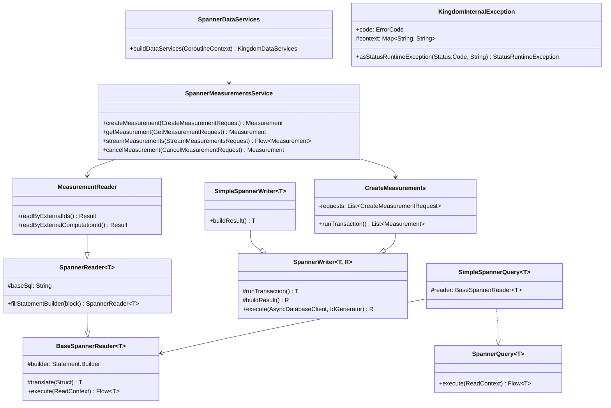

# org.wfanet.measurement.kingdom.deploy.gcloud.spanner

## Overview
Provides Google Cloud Spanner-based data persistence layer for the Kingdom service in the Cross-Media Measurement system. Implements the complete data access layer using the reader-writer-query pattern with support for measurements, data providers, model management, exchanges, and related entities. Includes comprehensive exception handling, transaction management, and ETa
g-based optimistic concurrency control.

## Architecture

### Package Structure

| Subpackage | Purpose |
|------------|---------|
| `common` | Shared utilities for exception handling and ETag computation |
| `readers` | Query execution for reading entities from Spanner |
| `writers` | Transaction management for creating and updating entities |
| `queries` | Streaming query implementations for listing entities |
| `testing` | Test infrastructure and database schema utilities |
| `tools` | Administrative utilities for data management |

### Core Pattern

The package follows a strict separation of concerns:

1. **Readers** execute SELECT queries and transform Spanner rows to protobuf messages
2. **Writers** execute INSERT/UPDATE/DELETE operations within read-write transactions
3. **Queries** combine readers with filtering and pagination logic
4. **Services** expose gRPC endpoints that orchestrate readers/writers

## Core Components

### Service Layer

#### SpannerDataServices
Entry point for constructing all Kingdom data services with shared dependencies.

| Constructor Parameter | Type | Description |
|----------------------|------|-------------|
| `clock` | `Clock` | Time source for timestamp generation |
| `idGenerator` | `IdGenerator` | Generates internal and external IDs |
| `client` | `AsyncDatabaseClient` | Spanner database client |
| `knownEventGroupMetadataTypes` | `Iterable<Descriptors.FileDescriptor>` | Protobuf descriptors for event metadata |
| `maxEventGroupReadStaleness` | `Duration` | Staleness tolerance for event group reads |

| Method | Returns | Description |
|--------|---------|-------------|
| `buildDataServices(coroutineContext: CoroutineContext)` | `KingdomDataServices` | Constructs all service implementations |

### Spanner Service Implementations

| Service | Entity | Key Operations |
|---------|--------|----------------|
| `SpannerMeasurementsService` | Measurement | Create, get, stream, cancel, batch operations, set result |
| `SpannerDataProvidersService` | DataProvider | Create, get, stream, update capabilities |
| `SpannerEventGroupsService` | EventGroup | Create, get, stream, update, delete, batch operations |
| `SpannerRequisitionsService` | Requisition | Get, stream, fulfill, refuse, update |
| `SpannerCertificatesService` | Certificate | Create, get, stream, revoke, release hold |
| `SpannerMeasurementConsumersService` | MeasurementConsumer | Create, get, stream, manage owners |
| `SpannerExchangesService` | Exchange | Create, get, stream, batch delete |
| `SpannerModelLinesService` | ModelLine | Create, get, stream, set type |
| `SpannerModelRolloutsService` | ModelRollout | Create, get, stream, delete, schedule freeze |
| `SpannerPopulationsService` | Population | Create, get, stream |
| `SpannerAccountsService` | Account | Create, activate, generate auth params |
| `SpannerApiKeysService` | ApiKey | Create, delete, authenticate |

### Base Abstractions

#### BaseSpannerReader&lt;T&gt;
Abstract base for all Spanner read operations.

| Method | Parameters | Returns | Description |
|--------|------------|---------|-------------|
| `execute(readContext: AsyncDatabaseClient.ReadContext)` | - | `Flow<T>` | Executes query and streams results |
| `translate(struct: Struct)` | `struct: Struct` | `T` | Transforms Spanner row to domain object |

#### SpannerReader&lt;T&gt;
Query-based reader with SQL statement building.

| Property | Type | Description |
|----------|------|-------------|
| `baseSql` | `String` | Base SQL query template |
| `builder` | `Statement.Builder` | Statement builder for parameter binding |

| Method | Parameters | Returns | Description |
|--------|------------|---------|-------------|
| `fillStatementBuilder(block: Statement.Builder.() -> Unit)` | - | `SpannerReader<T>` | Fills statement with parameters |

#### SpannerWriter&lt;T, R&gt;
Transaction orchestration for write operations.

| Nested Type | Description |
|-------------|-------------|
| `TransactionScope` | Provides access to transaction context and ID generator |
| `ResultScope<T>` | Contains transaction result and commit timestamp |

| Method | Parameters | Returns | Description |
|--------|------------|---------|-------------|
| `execute(databaseClient: AsyncDatabaseClient, idGenerator: IdGenerator)` | - | `R` | Executes transaction and builds result |
| `runTransaction()` | - | `T` | Override to implement transaction logic |
| `buildResult()` | - | `R` | Override to transform transaction result |
| `handleSpannerException(e: SpannerException)` | - | `T?` | Override to handle Spanner errors |

#### SimpleSpannerWriter&lt;T&gt;
Simplified writer where result equals transaction result.

#### SpannerQuery&lt;T&gt;
Interface for read-only streaming queries.

| Method | Parameters | Returns | Description |
|--------|------------|---------|-------------|
| `execute(readContext: AsyncDatabaseClient.ReadContext)` | - | `Flow<T>` | Executes streaming query |

#### SimpleSpannerQuery&lt;T&gt;
Query implementation that wraps a BaseSpannerReader.

## Key Reader Implementations

### MeasurementReader
Reads measurements with multiple view configurations.

| Enum | Description |
|------|-------------|
| `View.DEFAULT` | Measurement with requisitions and data providers |
| `View.COMPUTATION` | Includes computation participants and detailed requisition info |
| `View.COMPUTATION_STATS` | Includes all log entries for computation debugging |
| `Index.NONE` | No index hint |
| `Index.CREATE_REQUEST_ID` | Forces index on create request ID for idempotency |
| `Index.CONTINUATION_TOKEN` | Forces index on external computation ID |

| Method | Parameters | Returns | Description |
|--------|------------|---------|-------------|
| `readByExternalIds(readContext, externalMeasurementConsumerId, externalMeasurementId)` | - | `Result?` | Reads single measurement |
| `readByExternalIds(readContext, externalMeasurementConsumerId, externalMeasurementIds)` | - | `List<Result>` | Reads multiple measurements |
| `readByExternalComputationId(readContext, externalComputationId)` | - | `Result?` | Reads measurement by computation ID |

### DataProviderReader
Reads data provider information with certificate validation.

| Method | Parameters | Returns | Description |
|--------|------------|---------|-------------|
| `readByExternalDataProviderId(readContext, externalDataProviderId)` | - | `Result?` | Reads single data provider |
| `readByExternalDataProviderIds(readContext, externalDataProviderIds)` | - | `List<Result>` | Reads multiple data providers |

### CertificateReader
Reads certificates with revocation state and validity checking.

| Enum ParentType | Description |
|-----------------|-------------|
| `DATA_PROVIDER` | Certificate owned by data provider |
| `MEASUREMENT_CONSUMER` | Certificate owned by measurement consumer |
| `DUCHY` | Certificate owned by duchy |
| `MODEL_PROVIDER` | Certificate owned by model provider |

| Method | Parameters | Returns | Description |
|--------|------------|---------|-------------|
| `bindWhereClause(internalParentId, externalCertificateIds)` | - | `CertificateReader` | Filters by parent and certificate IDs |

### RequisitionReader
Reads requisitions with associated measurement and participant data.

| Enum Parent | Description |
|-------------|-------------|
| `MEASUREMENT` | Query scoped to specific measurement |
| `DATA_PROVIDER` | Query scoped to specific data provider |
| `NONE` | Unscoped query |

| Method | Parameters | Returns | Description |
|--------|------------|---------|-------------|
| `readByExternalDataProviderId(readContext, externalDataProviderId, externalRequisitionId)` | - | `Result?` | Reads requisition by data provider |
| `readByExternalComputationId(readContext, externalComputationId, externalRequisitionId)` | - | `Result?` | Reads requisition by computation |

## Key Writer Implementations

### CreateMeasurements
Creates one or more measurements with requisitions and computation participants.

**Transaction Logic:**
1. Validates measurement consumer exists
2. Checks for existing measurements by request ID (idempotency)
3. Validates measurement consumer certificates
4. Validates data provider certificates
5. Determines required duchies based on protocol
6. Creates measurement record
7. Creates computation participants
8. Creates requisitions

**Supported Protocols:**
- Liquid Legions V2 (LLv2)
- Reach-Only Liquid Legions V2 (RO-LLv2)
- Honest Majority Share Shuffle (HMSS)
- TrusTEE
- Direct

### SetMeasurementResult
Sets encrypted result for completed measurement.

**Transaction Logic:**
1. Reads measurement by external computation ID
2. Validates measurement state allows result setting
3. Validates duchy certificate
4. Inserts duchy measurement result
5. Updates measurement state to SUCCEEDED

### CancelMeasurement
Cancels pending measurement.

**Transaction Logic:**
1. Reads measurement
2. Validates measurement state is cancellable
3. Updates measurement state to CANCELLED
4. Records state transition log entry

### CreateMeasurements
Batch creates measurements with deduplication.

### BatchDeleteMeasurements
Deletes multiple measurements with etag validation.

### FulfillRequisition
Marks requisition as fulfilled by data provider.

**Transaction Logic:**
1. Reads requisition
2. Validates requisition state
3. Updates requisition with encrypted data
4. Updates requisition state to FULFILLED
5. Checks if all requisitions fulfilled to advance measurement

### CreateCertificate
Creates new certificate for entity.

**Transaction Logic:**
1. Validates parent entity exists
2. Checks subject key identifier uniqueness
3. Inserts certificate record
4. Links certificate to parent entity

### RevokeCertificate
Revokes certificate by setting revocation state.

## Key Query Implementations

### StreamMeasurements
Streams measurements with filtering and pagination.

**Supported Filters:**
- External measurement consumer ID
- External measurement consumer certificate ID
- Measurement states
- Update time range (before/after)
- Create time range (before/after)
- External duchy ID
- Continuation token (after measurement/computation)

**Ordering:**
- DEFAULT view: UpdateTime ASC, ExternalMeasurementConsumerId ASC, ExternalMeasurementId ASC
- COMPUTATION views: UpdateTime ASC, ExternalComputationId ASC

### StreamRequisitions
Streams requisitions with filtering.

**Supported Filters:**
- External measurement consumer ID
- External data provider ID
- Measurement states
- Requisition states
- Update time range

### StreamEventGroups
Streams event groups with filtering.

**Supported Filters:**
- External data provider ID
- External measurement consumer ID
- Update time range
- Continuation token

## Common Utilities

### ETags
Computes RFC 7232 entity tags from Spanner timestamps.

| Method | Parameters | Returns | Description |
|--------|------------|---------|-------------|
| `computeETag(updateTime: Timestamp)` | - | `String` | Computes ETag from update timestamp |

### KingdomInternalException
Base exception type for all Kingdom internal errors with structured error context.

| Property | Type | Description |
|----------|------|-------------|
| `code` | `ErrorCode` | Enumerated error code |
| `context` | `Map<String, String>` | Structured error metadata |

| Method | Parameters | Returns | Description |
|--------|------------|---------|-------------|
| `asStatusRuntimeException(statusCode: Status.Code, message: String)` | - | `StatusRuntimeException` | Converts to gRPC exception |

### Exception Hierarchy

| Exception Type | Error Code | Use Case |
|----------------|------------|----------|
| `RequiredFieldNotSetException` | `REQUIRED_FIELD_NOT_SET` | Required protobuf field missing |
| `InvalidFieldValueException` | `INVALID_FIELD_VALUE` | Field value violates constraints |
| `MeasurementNotFoundException` | `MEASUREMENT_NOT_FOUND` | Measurement not found |
| `MeasurementStateIllegalException` | `MEASUREMENT_STATE_ILLEGAL` | Operation invalid for current state |
| `MeasurementEtagMismatchException` | `MEASUREMENT_ETAG_MISMATCH` | Optimistic concurrency conflict |
| `CertificateNotFoundException` | `CERTIFICATE_NOT_FOUND` | Certificate not found |
| `CertificateIsInvalidException` | `CERTIFICATE_IS_INVALID` | Certificate revoked or expired |
| `CertificateRevocationStateIllegalException` | `CERTIFICATE_REVOCATION_STATE_ILLEGAL` | Cannot change revocation state |
| `DataProviderNotFoundException` | `DATA_PROVIDER_NOT_FOUND` | Data provider not found |
| `EventGroupNotFoundException` | `EVENT_GROUP_NOT_FOUND` | Event group not found |
| `EventGroupStateIllegalException` | `EVENT_GROUP_STATE_ILLEGAL` | Operation invalid for event group state |
| `RequisitionNotFoundException` | `REQUISITION_NOT_FOUND` | Requisition not found |
| `RequisitionStateIllegalException` | `REQUISITION_STATE_ILLEGAL` | Operation invalid for requisition state |
| `ComputationParticipantNotFoundException` | `COMPUTATION_PARTICIPANT_NOT_FOUND` | Computation participant not found |
| `ComputationParticipantStateIllegalException` | `COMPUTATION_PARTICIPANT_STATE_ILLEGAL` | Operation invalid for participant state |
| `DuchyNotFoundException` | `DUCHY_NOT_FOUND` | Duchy not found |
| `DuchyNotActiveException` | `DUCHY_NOT_ACTIVE` | Required duchy inactive |
| `ModelLineNotFoundException` | `MODEL_LINE_NOT_FOUND` | Model line not found |
| `ModelRolloutNotFoundException` | `MODEL_ROLLOUT_NOT_FOUND` | Model rollout not found |
| `AccountNotFoundException` | `ACCOUNT_NOT_FOUND` | Account not found |
| `AccountActivationStateIllegalException` | `ACCOUNT_ACTIVATION_STATE_ILLEGAL` | Cannot activate/deactivate account |
| `PermissionDeniedException` | `PERMISSION_DENIED` | Insufficient permissions |

## Data Structures

### Reader Results

#### MeasurementReader.Result
| Property | Type | Description |
|----------|------|-------------|
| `measurementConsumerId` | `InternalId` | Internal measurement consumer ID |
| `measurementId` | `InternalId` | Internal measurement ID |
| `createRequestId` | `String?` | Idempotency key |
| `measurement` | `Measurement` | Measurement protobuf |

#### DataProviderReader.Result
| Property | Type | Description |
|----------|------|-------------|
| `dataProviderId` | `Long` | Internal data provider ID |
| `certificateId` | `Long` | Internal certificate ID |
| `dataProvider` | `DataProvider` | Data provider protobuf |
| `certificateValid` | `Boolean` | Certificate validity flag |

#### CertificateReader.Result
| Property | Type | Description |
|----------|------|-------------|
| `certificateId` | `InternalId` | Internal certificate ID |
| `certificate` | `Certificate` | Certificate protobuf |
| `isValid` | `Boolean` | Certificate not revoked and within validity period |

#### RequisitionReader.Result
| Property | Type | Description |
|----------|------|-------------|
| `measurementConsumerId` | `InternalId` | Internal measurement consumer ID |
| `measurementId` | `InternalId` | Internal measurement ID |
| `requisitionId` | `InternalId` | Internal requisition ID |
| `requisition` | `Requisition` | Requisition protobuf |
| `measurementDetails` | `MeasurementDetails` | Parent measurement details |

## Dependencies

- `org.wfanet.measurement.gcloud.spanner` - Spanner client abstractions and utilities
- `org.wfanet.measurement.common.identity` - ID generation and management
- `org.wfanet.measurement.internal.kingdom` - Kingdom internal API protobuf definitions
- `org.wfanet.measurement.kingdom.deploy.common` - Common deployment utilities (DuchyIds, protocol configs)
- `com.google.cloud.spanner` - Google Cloud Spanner client library
- `io.grpc` - gRPC framework for service implementation
- `kotlinx.coroutines` - Kotlin coroutines for async operations

## Usage Example

```kotlin
// Initialize data services
val clock = Clock.systemUTC()
val idGenerator = RandomIdGenerator(clock)
val spannerClient = AsyncDatabaseClient(databaseClient)

val dataServices = SpannerDataServices(
    clock = clock,
    idGenerator = idGenerator,
    client = spannerClient,
    knownEventGroupMetadataTypes = listOf(/* protobuf descriptors */),
    maxEventGroupReadStaleness = Duration.ofSeconds(1)
)

// Build service implementations
val coroutineContext = Dispatchers.IO
val kingdomServices = dataServices.buildDataServices(coroutineContext)

// Create a measurement
val createRequest = createMeasurementRequest {
    measurement = measurement {
        externalMeasurementConsumerId = 123L
        externalMeasurementConsumerCertificateId = 456L
        details = measurementDetails {
            apiVersion = "v2alpha"
            measurementSpec = /* encrypted spec */
            measurementSpecSignature = /* signature */
            protocolConfig = protocolConfig {
                liquidLegionsV2 = LiquidLegionsV2.getDefaultInstance()
            }
        }
        dataProviders.put(789L, dataProviderValue {
            dataProviderPublicKey = /* public key */
            encryptedRequisitionSpec = /* encrypted spec */
            nonceHash = /* hash */
        })
    }
}

val createdMeasurement = kingdomServices.measurementsService.createMeasurement(createRequest)

// Stream measurements
val streamRequest = streamMeasurementsRequest {
    measurementView = Measurement.View.DEFAULT
    filter = filter {
        externalMeasurementConsumerId = 123L
        states += Measurement.State.PENDING_REQUISITION_PARAMS
        updatedAfter = Instant.now().minus(Duration.ofHours(1)).toProtoTime()
    }
    limit = 50
}

kingdomServices.measurementsService.streamMeasurements(streamRequest)
    .collect { measurement ->
        println("Measurement: ${measurement.externalMeasurementId}")
    }
```

## Transaction Patterns

### Read-Modify-Write
```kotlin
class UpdateEntityWriter : SimpleSpannerWriter<Entity>() {
    override suspend fun TransactionScope.runTransaction(): Entity {
        // 1. Read current state
        val current = EntityReader()
            .readByExternalId(transactionContext, externalId)
            ?: throw EntityNotFoundException(externalId)

        // 2. Validate state transition
        require(current.state == State.READY) { "Invalid state" }

        // 3. Write updates
        transactionContext.bufferUpdateMutation("Entities") {
            set("EntityId" to current.internalId)
            set("State").toInt64(State.PROCESSING)
            set("UpdateTime" to Value.COMMIT_TIMESTAMP)
        }

        return current.entity.copy { state = State.PROCESSING }
    }
}
```

### Idempotent Creation
```kotlin
class CreateEntityWriter(
    private val requestId: String,
    private val request: CreateEntityRequest
) : SimpleSpannerWriter<Entity>() {
    override suspend fun TransactionScope.runTransaction(): Entity {
        // Check for existing entity by request ID
        val existing = EntityReader()
            .readByRequestId(transactionContext, requestId)

        if (existing != null) {
            return existing.entity
        }

        // Create new entity
        val entityId = idGenerator.generateInternalId()
        val externalEntityId = idGenerator.generateExternalId()

        transactionContext.bufferInsertMutation("Entities") {
            set("EntityId" to entityId)
            set("ExternalEntityId" to externalEntityId)
            set("RequestId" to requestId)
            set("CreateTime" to Value.COMMIT_TIMESTAMP)
            set("UpdateTime" to Value.COMMIT_TIMESTAMP)
        }

        return request.entity.copy {
            this.externalEntityId = externalEntityId.value
        }
    }
}
```

## Testing Support

### KingdomDatabaseTestBase
Base class for integration tests with Spanner emulator.

| Method | Description |
|--------|-------------|
| `beforeAll()` | Initializes Spanner emulator and creates database |
| `beforeEach()` | Clears all tables before each test |
| `afterAll()` | Shuts down Spanner emulator |

### Schemata
Provides access to Kingdom database schema DDL.

| Property | Type | Description |
|----------|------|-------------|
| `KINGDOM_CHANGELOG_PATH` | `String` | Path to Liquibase changelog |

## Class Diagram


