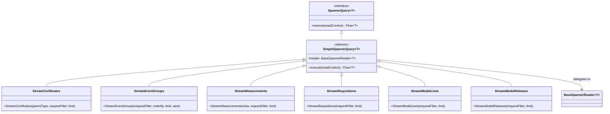

# org.wfanet.measurement.kingdom.deploy.gcloud.spanner.queries

## Overview
Provides type-safe query abstractions for streaming Kingdom entities from Google Cloud Spanner. Each query class encapsulates SQL statement construction with filtering, pagination, and ordering capabilities for specific entity types in the Cross-Media Measurement system.

## Components

### SpannerQuery
Base interface for all Spanner read-only queries.

| Method | Parameters | Returns | Description |
|--------|------------|---------|-------------|
| execute | `readContext: AsyncDatabaseClient.ReadContext` | `Flow<T>` | Executes query and returns result stream |

### SimpleSpannerQuery
Abstract implementation wrapping BaseSpannerReader for simplified query creation.

| Property | Type | Description |
|----------|------|-------------|
| reader | `BaseSpannerReader<T>` | Underlying reader executing the query |

| Method | Parameters | Returns | Description |
|--------|------------|---------|-------------|
| execute | `readContext: AsyncDatabaseClient.ReadContext` | `Flow<T>` | Delegates execution to wrapped reader |

### StreamCertificates
Queries certificates by parent type with filtering and pagination.

| Constructor Parameter | Type | Description |
|-----------------------|------|-------------|
| parentType | `CertificateReader.ParentType` | Parent entity type (DATA_PROVIDER, MEASUREMENT_CONSUMER, MODEL_PROVIDER, DUCHY) |
| requestFilter | `StreamCertificatesRequest.Filter` | Filter criteria including after cursor, subject key identifiers |
| limit | `Int` | Maximum results to return (0 = unlimited) |

**Query Features:**
- Orders by NotValidBefore DESC, external certificate ID, and parent ID
- Supports pagination via after cursor (notValidBefore + externalCertificateId + externalParentId)
- Filters by subject key identifiers using UNNEST

### StreamDataProviders
Queries DataProviders by external IDs.

| Constructor Parameter | Type | Description |
|-----------------------|------|-------------|
| externalDataProviderIds | `Iterable<ExternalId>` | List of external data provider IDs to retrieve |

**Query Features:**
- Uses UNNEST for IN clause filtering
- Simple direct ID matching

### StreamEventGroupMetadataDescriptors
Queries event group metadata descriptors with filtering and ordering.

| Constructor Parameter | Type | Description |
|-----------------------|------|-------------|
| requestFilter | `StreamEventGroupMetadataDescriptorsRequest.Filter` | Filter by IDs, data provider, and pagination cursor |
| limit | `Int` | Maximum results to return (0 = unlimited) |

**Query Features:**
- Orders by ExternalDataProviderId ASC, ExternalEventGroupMetadataDescriptorId ASC
- Supports filtering by descriptor IDs (UNNEST), data provider ID, and keyAfter pagination

### StreamEventGroups
Complex query for event groups with multi-field filtering and flexible ordering.

| Constructor Parameter | Type | Description |
|-----------------------|------|-------------|
| requestFilter | `StreamEventGroupsRequest.Filter` | Comprehensive filter including provider, consumer, date ranges, media types, metadata search |
| orderBy | `StreamEventGroupsRequest.OrderBy` | Sort field and direction (default or DATA_AVAILABILITY_START_TIME) |
| limit | `Int` | Maximum results to return (0 = unlimited) |
| view | `EventGroup.View` | Data view level to return |

**Query Features:**
- Orders by creation, data provider ID, event group ID, or data availability time
- Filters by data provider, measurement consumer, deleted state, media types intersection
- Supports date range filtering for data availability windows
- Full-text search on metadata tokens
- Activity date range containment checking
- Complex pagination with tie-breaking on multiple fields

### StreamExchanges
Queries exchanges filtered by date with ascending date ordering.

| Constructor Parameter | Type | Description |
|-----------------------|------|-------------|
| requestFilter | `StreamExchangesRequest.Filter` | Filter including dateBefore |
| limit | `Int` | Maximum results to return (0 = unlimited) |

**Query Features:**
- Orders by Exchanges.Date ASC
- Filters exchanges before a specified date

### StreamExchangeSteps
Streams exchange steps matching filters ordered by recurring exchange, date, and step index.

| Constructor Parameter | Type | Description |
|-----------------------|------|-------------|
| requestFilter | `StreamExchangeStepsRequest.Filter` | Filter by recurring exchange, dates, states, providers |
| limit | `Int` | Maximum results to return (0 = unlimited) |

**Query Features:**
- Orders by RecurringExchangeId, Date, StepIndex
- Filters by external recurring exchange ID, dates list, states list, data provider ID, model provider ID
- Pagination with after cursor on (externalRecurringExchangeId, date, stepIndex)
- Requires at least one filter constraint

### StreamMeasurements
Comprehensive measurement query with view-specific indexing and complex filtering.

| Constructor Parameter | Type | Description |
|-----------------------|------|-------------|
| view | `Measurement.View` | View type (DEFAULT, COMPUTATION, COMPUTATION_STATS) |
| requestFilter | `StreamMeasurementsRequest.Filter` | Filter by consumer, certificate, states, dates, duchy |
| limit | `Int` | Maximum results to return (0 = unlimited) |

**Query Features:**
- Uses CONTINUATION_TOKEN index when ExternalComputationId required
- View-specific ordering: by UpdateTime + ExternalComputationId for COMPUTATION views, by UpdateTime + consumer/measurement IDs for DEFAULT
- Filters by measurement consumer, consumer certificate (subquery), states, update/create time ranges, duchy participation
- Pagination with CASE short-circuiting for performance optimization
- Supports both measurement and computation pagination keys

### StreamMeasurementsByDataProviderCertificate
Queries pending measurements by data provider certificate.

| Constructor Parameter | Type | Description |
|-----------------------|------|-------------|
| dataProviderCertificateId | `InternalId` | Internal certificate ID |
| pendingMeasurementStates | `List<Measurement.State>` | Measurement states to filter by |

**Query Features:**
- Joins with Requisitions table
- Filters requisitions in PENDING_PARAMS or UNFULFILLED states
- Filters measurements by specified pending states

### StreamMeasurementsByDuchyCertificate
Queries pending measurements by duchy certificate.

| Constructor Parameter | Type | Description |
|-----------------------|------|-------------|
| duchyCertificateId | `InternalId` | Internal duchy certificate ID |
| pendingMeasurementStates | `List<Measurement.State>` | Measurement states to filter by |

**Query Features:**
- Joins with ComputationParticipants table
- Filters computation participants in REQUISITION_PARAMS_SET state
- Filters measurements by specified pending states

### StreamModelLines
Queries model lines with active interval filtering and multi-level ordering.

| Constructor Parameter | Type | Description |
|-----------------------|------|-------------|
| requestFilter | `StreamModelLinesRequest.Filter` | Filter by provider, suite, active interval, types |
| limit | `Int` | Maximum results to return (0 = unlimited) |

**Query Features:**
- Orders by CreateTime, ExternalModelProviderId, ExternalModelSuiteId, ExternalModelLineId
- Filters by model provider ID, model suite ID, active interval containment, types
- Pagination with nested after cursor comparisons
- Uses IFNULL for open-ended active intervals

### StreamModelOutages
Queries model outages with hierarchical filtering and ordering.

| Constructor Parameter | Type | Description |
|-----------------------|------|-------------|
| requestFilter | `StreamModelOutagesRequest.Filter` | Filter by provider, suite, line, outage interval, deleted state |
| limit | `Int` | Maximum results to return (0 = unlimited) |

**Query Features:**
- Orders by CreateTime, ExternalModelProviderId, ExternalModelSuiteId, ExternalModelLineId, ExternalModelOutageId
- Filters by model provider, suite, line, deleted state exclusion, outage time range
- Complex pagination with multi-level after cursor

### StreamModelReleases
Queries model releases with population filtering and hierarchical ordering.

| Constructor Parameter | Type | Description |
|-----------------------|------|-------------|
| requestFilter | `StreamModelReleasesRequest.Filter` | Filter by provider, suite, population keys |
| limit | `Int` | Maximum results to return (0 = unlimited) |

**Query Features:**
- Orders by CreateTime, ExternalModelProviderId, ExternalModelSuiteId, ExternalModelReleaseId
- Filters by model provider ID, model suite ID, population keys using STRUCT matching
- Pagination with nested after cursor comparisons
- Uses Spanner struct arrays for population key filtering

### StreamModelRollouts
Queries model rollouts filtered by release IDs and rollout periods.

| Constructor Parameter | Type | Description |
|-----------------------|------|-------------|
| requestFilter | `StreamModelRolloutsRequest.Filter` | Filter by provider, suite, line, release IDs, rollout period |
| limit | `Int` | Maximum results to return (0 = unlimited) |

**Query Features:**
- Orders by RolloutPeriodStartTime, ExternalModelProviderId, ExternalModelSuiteId, ExternalModelLineId, ExternalModelRolloutId
- Filters by model provider, suite, line, release ID list, rollout period range
- Pagination using rollout period start time as primary sort key

### StreamModelShards
Queries model shards by provider and data provider with temporal ordering.

| Constructor Parameter | Type | Description |
|-----------------------|------|-------------|
| requestFilter | `StreamModelShardsRequest.Filter` | Filter by data provider, model provider |
| limit | `Int` | Maximum results to return (0 = unlimited) |

**Query Features:**
- Orders by CreateTime, ExternalDataProviderId, ExternalModelShardId
- Filters by external data provider ID, external model provider ID
- Pagination with create time and provider ID cursor

### StreamModelSuites
Queries model suites by provider with temporal ordering.

| Constructor Parameter | Type | Description |
|-----------------------|------|-------------|
| requestFilter | `StreamModelSuitesRequest.Filter` | Filter by model provider and pagination |
| limit | `Int` | Maximum results to return (0 = unlimited) |

**Query Features:**
- Orders by CreateTime, ExternalModelProviderId, ExternalModelSuiteId
- Filters by external model provider ID
- Pagination with create time, provider ID, and suite ID cursor

### StreamPopulations
Queries populations with descending temporal ordering.

| Constructor Parameter | Type | Description |
|-----------------------|------|-------------|
| requestFilter | `StreamPopulationsRequest.Filter` | Filter by data provider and pagination |
| limit | `Int` | Maximum results to return (0 = unlimited) |

**Query Features:**
- Orders by CreateTime DESC, ExternalDataProviderId ASC, ExternalPopulationId ASC
- Filters by external data provider ID
- Pagination with descending create time cursor

### StreamRequisitions
Queries requisitions with parent-aware filtering and temporal ordering.

| Constructor Parameter | Type | Description |
|-----------------------|------|-------------|
| requestFilter | `StreamRequisitionsRequest.Filter` | Filter by measurement, data provider, consumer, states, update time |
| limit | `Int` | Maximum results to return (0 = unlimited) |

**Query Features:**
- Determines parent context (MEASUREMENT, DATA_PROVIDER, or NONE) from filter
- Orders by UpdateTime, ExternalDataProviderId, ExternalRequisitionId
- Filters by measurement consumer, measurement ID, data provider ID, states, updated after
- Pagination with CASE short-circuiting for performance

### StreamStateTransitionMeasurementLogEntries
Queries measurement log entries for state transitions ordered chronologically.

| Constructor Parameter | Type | Description |
|-----------------------|------|-------------|
| externalMeasurementId | `ExternalId` | External measurement identifier |
| externalMeasurementConsumerId | `ExternalId` | External measurement consumer identifier |

**Query Features:**
- Orders by CreateTime ASC
- Filters by exact measurement and consumer ID match
- No pagination support (intended for complete log retrieval)

## Data Structures

### Filter Objects
All query classes accept protocol buffer Filter messages defining query criteria:

| Filter Type | Key Parameters | Purpose |
|-------------|----------------|---------|
| StreamCertificatesRequest.Filter | after, subjectKeyIdentifiers, externalParentId | Certificate pagination and filtering |
| StreamEventGroupsRequest.Filter | dataProvider, consumer, dateRanges, mediaTypes, showDeleted, activityContains | Multi-dimensional event group filtering |
| StreamMeasurementsRequest.Filter | consumer, certificate, states, updateTime, duchy, after | Measurement filtering with view awareness |
| StreamModelLinesRequest.Filter | provider, suite, activeInterval, types | Model line filtering with temporal constraints |
| StreamRequisitionsRequest.Filter | measurement, dataProvider, consumer, states, updatedAfter | Requisition filtering with parent awareness |

### Pagination Cursors
Most filters contain an `after` field with entity-specific cursor structures:

| Entity | Cursor Fields | Ordering Strategy |
|--------|---------------|-------------------|
| Certificate | notValidBefore, externalCertificateId, externalParentId | Descending time, ascending IDs |
| EventGroup | dataAvailabilityStartTime, externalDataProviderId, externalEventGroupId | Configurable direction, tie-breaking on IDs |
| Measurement | updateTime, externalMeasurementConsumerId, externalMeasurementId OR updateTime, externalComputationId | View-dependent pagination |
| ModelLine | createTime, externalModelProviderId, externalModelSuiteId, externalModelLineId | Temporal with hierarchical tie-breaking |
| Requisition | updateTime, externalDataProviderId, externalRequisitionId | Temporal with provider tie-breaking |

## Dependencies
- `org.wfanet.measurement.gcloud.spanner` - Spanner client utilities, statement building extensions
- `org.wfanet.measurement.kingdom.deploy.gcloud.spanner.readers` - Entity reader implementations
- `org.wfanet.measurement.internal.kingdom` - Protocol buffer request/response definitions
- `org.wfanet.measurement.common.identity` - External and internal ID type wrappers
- `org.wfanet.measurement.gcloud.common` - Type conversion utilities (toGcloudTimestamp, toCloudDate, toGcloudByteArray)
- `org.wfanet.measurement.kingdom.deploy.common` - DuchyIds mapping utilities
- `kotlinx.coroutines.flow` - Reactive stream support for query results
- `com.google.cloud.spanner` - Google Cloud Spanner SDK types

## Usage Example
```kotlin
// Query event groups with filtering and pagination
val filter = StreamEventGroupsRequest.Filter.newBuilder().apply {
  externalDataProviderId = 12345L
  showDeleted = false
  dataAvailabilityStartTimeOnOrAfter = timestamp { seconds = 1609459200 }
}.build()

val orderBy = StreamEventGroupsRequest.OrderBy.newBuilder().apply {
  field = StreamEventGroupsRequest.OrderBy.Field.DATA_AVAILABILITY_START_TIME
  descending = false
}.build()

val query = StreamEventGroups(
  requestFilter = filter,
  orderBy = orderBy,
  limit = 50,
  view = EventGroup.View.DEFAULT
)

// Execute within transaction context
val results: Flow<EventGroupReader.Result> = query.execute(readContext)
results.collect { result ->
  println("EventGroup: ${result.eventGroup}")
}
```

```kotlin
// Query measurements by data provider certificate
val query = StreamMeasurementsByDataProviderCertificate(
  dataProviderCertificateId = InternalId(789L),
  pendingMeasurementStates = listOf(
    Measurement.State.PENDING_REQUISITION_PARAMS,
    Measurement.State.PENDING_REQUISITION_FULFILLMENT
  )
)

val pendingMeasurements: Flow<MeasurementDetailsReader.Result> = query.execute(readContext)
```

```kotlin
// Query model releases with population filtering
val filter = StreamModelReleasesRequest.Filter.newBuilder().apply {
  externalModelProviderId = 100L
  externalModelSuiteId = 200L
  addPopulationKeyIn(populationKey {
    externalDataProviderId = 300L
    externalPopulationId = 400L
  })
}.build()

val query = StreamModelReleases(requestFilter = filter, limit = 25)
val releases: Flow<ModelReleaseReader.Result> = query.execute(readContext)
```

## Class Diagram

