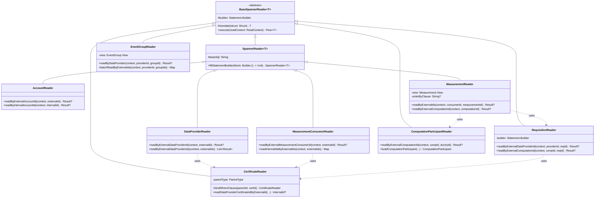

# org.wfanet.measurement.kingdom.deploy.gcloud.spanner.readers

## Overview
This package provides a comprehensive framework for reading data from Google Cloud Spanner in the Kingdom system. It implements a reader abstraction pattern that translates Spanner rows into domain-specific Protocol Buffer objects, supporting various entities including measurements, requisitions, data providers, certificates, and event groups.

## Components

### BaseSpannerReader

Abstract base class for all Spanner read operations.

| Method | Parameters | Returns | Description |
|--------|------------|---------|-------------|
| execute | `readContext: AsyncDatabaseClient.ReadContext` | `Flow<T>` | Executes query and transforms results |
| translate | `struct: Struct` | `T` | Transforms Spanner row into domain object |

### SpannerReader

Extended base reader providing SQL statement building capabilities.

| Method | Parameters | Returns | Description |
|--------|------------|---------|-------------|
| fillStatementBuilder | `block: Statement.Builder.() -> Unit` | `SpannerReader<T>` | Populates statement builder with custom logic |

### AccountReader

Reads account data with OpenID identity and ownership relationships.

| Method | Parameters | Returns | Description |
|--------|------------|---------|-------------|
| readByExternalAccountId | `readContext: AsyncDatabaseClient.ReadContext, externalAccountId: ExternalId` | `Result?` | Retrieves account by external ID |
| readByInternalAccountId | `readContext: AsyncDatabaseClient.ReadContext, internalAccountId: InternalId` | `Result?` | Retrieves account by internal ID |

**Result Structure**
| Property | Type | Description |
|----------|------|-------------|
| account | `Account` | Account protocol buffer |
| accountId | `InternalId` | Internal database identifier |

### CertificateReader

Reads X.509 certificates for data providers, measurement consumers, duchies, and model providers.

| Method | Parameters | Returns | Description |
|--------|------------|---------|-------------|
| bindWhereClause | `parentId: InternalId, externalCertificateId: ExternalId` | `CertificateReader` | Binds query by internal parent ID |
| bindWhereClause | `externalParentId: ExternalId, externalCertificateId: ExternalId` | `CertificateReader` | Binds query by external parent ID |
| readDataProviderCertificateIdByExternalId | `readContext: AsyncDatabaseClient.ReadContext, dataProviderId: InternalId, externalCertificateId: ExternalId` | `InternalId?` | Retrieves data provider certificate ID |
| readMeasurementConsumerCertificateIdByExternalId | `readContext: AsyncDatabaseClient.ReadContext, measurementConsumerId: InternalId, externalCertificateId: ExternalId` | `InternalId?` | Retrieves measurement consumer certificate ID |
| getDuchyCertificateId | `txn: AsyncDatabaseClient.TransactionContext, duchyId: InternalId, externalDuchyCertificateId: ExternalId` | `InternalId?` | Retrieves duchy certificate ID |

**Result Structure**
| Property | Type | Description |
|----------|------|-------------|
| certificate | `Certificate` | Certificate protocol buffer |
| certificateId | `InternalId` | Internal certificate identifier |
| isNotYetActive | `Boolean` | Whether certificate is before validity period |
| isExpired | `Boolean` | Whether certificate is past validity period |
| isValid | `Boolean` | Whether certificate is currently valid |

**ParentType Enum**
- `DATA_PROVIDER` - Certificates for data providers
- `MEASUREMENT_CONSUMER` - Certificates for measurement consumers
- `DUCHY` - Certificates for computation duchies
- `MODEL_PROVIDER` - Certificates for model providers

### MeasurementReader

Reads measurements with support for multiple views (DEFAULT, COMPUTATION, COMPUTATION_STATS).

| Method | Parameters | Returns | Description |
|--------|------------|---------|-------------|
| readByExternalIds | `readContext: AsyncDatabaseClient.ReadContext, externalMeasurementConsumerId: ExternalId, externalMeasurementId: ExternalId` | `Result?` | Retrieves measurement by external IDs |
| readByExternalIds | `readContext: AsyncDatabaseClient.ReadContext, externalMeasurementConsumerId: ExternalId, externalMeasurementIds: List<ExternalId>` | `List<Result>` | Retrieves multiple measurements by external IDs |
| readByExternalComputationId | `readContext: AsyncDatabaseClient.ReadContext, externalComputationId: ExternalId` | `Result?` | Retrieves measurement by computation ID |
| readMeasurementState | `readContext: AsyncDatabaseClient.ReadContext, measurementConsumerId: InternalId, measurementId: InternalId` | `Measurement.State` | Retrieves current measurement state |
| readKeyByExternalIds | `readContext: AsyncDatabaseClient.ReadContext, externalMeasurementConsumerId: ExternalId, externalMeasurementId: ExternalId` | `Key?` | Retrieves Spanner key for measurement |
| readEtag | `readContext: AsyncDatabaseClient.ReadContext, measurementKey: Key` | `String` | Retrieves ETag for optimistic locking |

**Result Structure**
| Property | Type | Description |
|----------|------|-------------|
| measurementConsumerId | `InternalId` | Internal measurement consumer ID |
| measurementId | `InternalId` | Internal measurement ID |
| createRequestId | `String?` | Idempotency token |
| measurement | `Measurement` | Measurement protocol buffer |

**Index Enum**
- `NONE` - No forced index
- `CREATE_REQUEST_ID` - Index on create request ID
- `CONTINUATION_TOKEN` - Index on continuation token

### DataProviderReader

Reads data provider entities with certificates and required duchies.

| Method | Parameters | Returns | Description |
|--------|------------|---------|-------------|
| readByExternalDataProviderId | `readContext: AsyncDatabaseClient.ReadContext, externalDataProviderId: ExternalId` | `Result?` | Retrieves data provider by external ID |
| readByExternalDataProviderIds | `readContext: AsyncDatabaseClient.ReadContext, externalDataProviderIds: Iterable<ExternalId>` | `List<Result>` | Retrieves multiple data providers by external IDs |
| readDataProviderId | `readContext: AsyncDatabaseClient.ReadContext, externalDataProviderId: ExternalId` | `InternalId?` | Retrieves internal data provider ID |

**Result Structure**
| Property | Type | Description |
|----------|------|-------------|
| dataProvider | `DataProvider` | Data provider protocol buffer |
| dataProviderId | `Long` | Internal data provider ID |
| certificateId | `Long` | Associated certificate ID |
| certificateValid | `Boolean` | Whether certificate is valid |

### MeasurementConsumerReader

Reads measurement consumer entities with certificates.

| Method | Parameters | Returns | Description |
|--------|------------|---------|-------------|
| readByExternalMeasurementConsumerId | `readContext: AsyncDatabaseClient.ReadContext, externalMeasurementConsumerId: ExternalId` | `Result?` | Retrieves measurement consumer by external ID |
| readMeasurementConsumerId | `readContext: AsyncDatabaseClient.ReadContext, externalMeasurementConsumerId: ExternalId` | `InternalId?` | Retrieves internal measurement consumer ID |
| readInternalIdsByExternalIds | `readContext: AsyncDatabaseClient.ReadContext, externalMeasurementConsumerIds: Collection<ExternalId>` | `Map<ExternalId, InternalId>` | Maps external IDs to internal IDs |

**Result Structure**
| Property | Type | Description |
|----------|------|-------------|
| measurementConsumer | `MeasurementConsumer` | Measurement consumer protocol buffer |
| measurementConsumerId | `Long` | Internal measurement consumer ID |
| externalMeasurementConsumerId | `Long` | External measurement consumer ID |

### RequisitionReader

Reads requisitions with support for different parent contexts (MEASUREMENT, DATA_PROVIDER, NONE).

| Method | Parameters | Returns | Description |
|--------|------------|---------|-------------|
| readByExternalDataProviderId | `readContext: AsyncDatabaseClient.ReadContext, externalDataProviderId: ExternalId, externalRequisitionId: ExternalId` | `Result?` | Retrieves requisition by data provider |
| readByExternalComputationId | `readContext: AsyncDatabaseClient.ReadContext, externalComputationId: ExternalId, externalRequisitionId: ExternalId` | `Result?` | Retrieves requisition by computation ID |
| buildRequisition | `measurementStruct: Struct, requisitionStruct: Struct, participantStructs: Map<String, Struct>, dataProviderCount: Int` | `Requisition` | Constructs requisition from Spanner structs |

**Result Structure**
| Property | Type | Description |
|----------|------|-------------|
| measurementConsumerId | `InternalId` | Internal measurement consumer ID |
| measurementId | `InternalId` | Internal measurement ID |
| requisitionId | `InternalId` | Internal requisition ID |
| requisition | `Requisition` | Requisition protocol buffer |
| measurementDetails | `MeasurementDetails` | Parent measurement details |

**Parent Enum**
- `MEASUREMENT` - Query within measurement context
- `DATA_PROVIDER` - Query within data provider context
- `NONE` - Query without parent filter

### EventGroupReader

Reads event groups with optional activity summary view.

| Method | Parameters | Returns | Description |
|--------|------------|---------|-------------|
| readByCreateRequestId | `readContext: AsyncDatabaseClient.ReadContext, dataProviderId: InternalId, createRequestId: String` | `Result?` | Retrieves event group by create request ID |
| readByCreateRequestIds | `readContext: AsyncDatabaseClient.ReadContext, dataProviderId: InternalId, createRequestIds: Collection<String>` | `Map<String, Result>` | Retrieves multiple event groups by create request IDs |
| readByDataProvider | `readContext: AsyncDatabaseClient.ReadContext, externalDataProviderId: ExternalId, externalEventGroupId: ExternalId` | `Result?` | Retrieves event group by data provider |
| batchReadByExternalIds | `readContext: AsyncDatabaseClient.ReadContext, externalDataProviderId: ExternalId, externalEventGroupIds: Collection<ExternalId>` | `Map<ExternalId, Result>` | Batch retrieves event groups |
| readByMeasurementConsumer | `readContext: AsyncDatabaseClient.ReadContext, externalMeasurementConsumerId: ExternalId, externalEventGroupId: ExternalId` | `Result?` | Retrieves event group by measurement consumer |
| readEventGroupId | `readContext: AsyncDatabaseClient.ReadContext, dataProviderId: InternalId, externalEventGroupId: ExternalId` | `InternalId?` | Retrieves internal event group ID |

**Result Structure**
| Property | Type | Description |
|----------|------|-------------|
| eventGroup | `EventGroup` | Event group protocol buffer |
| internalEventGroupId | `InternalId` | Internal event group ID |
| internalDataProviderId | `InternalId` | Internal data provider ID |
| createRequestId | `String?` | Idempotency token |

### ComputationParticipantReader

Reads computation participants (duchies) involved in measurements.

| Method | Parameters | Returns | Description |
|--------|------------|---------|-------------|
| readByExternalComputationId | `readContext: AsyncDatabaseClient.ReadContext, externalComputationId: ExternalId, duchyId: InternalId` | `Result?` | Retrieves participant by computation and duchy ID |
| readByExternalComputationId | `readContext: AsyncDatabaseClient.ReadContext, externalComputationId: ExternalId, externalDuchyId: String` | `Result?` | Retrieves participant by computation and duchy name |
| buildComputationParticipant | `externalMeasurementConsumerId: ExternalId, externalMeasurementId: ExternalId, externalDuchyId: String, externalComputationId: ExternalId, measurementDetails: MeasurementDetails, struct: Struct` | `ComputationParticipant` | Constructs participant from Spanner struct |
| readComputationParticipantState | `readContext: AsyncDatabaseClient.ReadContext, measurementConsumerId: InternalId, measurementId: InternalId, duchyId: InternalId` | `ComputationParticipant.State` | Retrieves participant state |
| computationParticipantsInState | `readContext: AsyncDatabaseClient.ReadContext, duchyIds: List<InternalId>, measurementConsumerId: InternalId, measurementId: InternalId, state: ComputationParticipant.State` | `Boolean` | Checks if all participants are in state |

**Result Structure**
| Property | Type | Description |
|----------|------|-------------|
| computationParticipant | `ComputationParticipant` | Participant protocol buffer |
| measurementId | `InternalId` | Internal measurement ID |
| measurementConsumerId | `InternalId` | Internal measurement consumer ID |
| measurementState | `Measurement.State` | Current measurement state |
| measurementDetails | `MeasurementDetails` | Measurement configuration |

### ExchangeReader

Reads exchange entities for recurring data exchanges.

| Method | Parameters | Returns | Description |
|--------|------------|---------|-------------|
| readKeyByExternalIds | `readContext: AsyncDatabaseClient.ReadContext, externalRecurringExchangeId: ExternalId, date: Date` | `Key?` | Retrieves Spanner key for exchange |

**Result Structure**
| Property | Type | Description |
|----------|------|-------------|
| exchange | `Exchange` | Exchange protocol buffer |
| recurringExchangeId | `Long` | Internal recurring exchange ID |

### ModelProviderReader

Reads model provider entities for machine learning models.

| Method | Parameters | Returns | Description |
|--------|------------|---------|-------------|
| readByExternalModelProviderId | `readContext: AsyncDatabaseClient.ReadContext, externalModelProviderId: ExternalId` | `Result?` | Retrieves model provider by external ID |
| readModelProviders | `readContext: AsyncDatabaseClient.ReadContext, limit: Int, after: ListModelProvidersPageToken.After?` | `List<Result>` | Lists model providers with pagination |

**Result Structure**
| Property | Type | Description |
|----------|------|-------------|
| modelProvider | `ModelProvider` | Model provider protocol buffer |
| modelProviderId | `Long` | Internal model provider ID |

### ExchangeStepReader

Reads individual steps within an exchange workflow.

### ExchangeStepAttemptReader

Reads retry attempts for exchange steps.

### RecurringExchangeReader

Reads recurring exchange schedules.

### PopulationReader

Reads population entities for privacy budgeting.

### MeasurementDetailsReader

Reads detailed measurement specifications.

### MeasurementConsumerApiKeyReader

Reads API keys for measurement consumer authentication.

### MeasurementConsumerCreationTokenReader

Reads creation tokens for new measurement consumers.

### MeasurementConsumerOwnerReader

Reads ownership relationships for measurement consumers.

### ModelLineReader

Reads model line entities within model suites.

### ModelOutageReader

Reads scheduled model outage periods.

### ModelReleaseReader

Reads model release information.

### ModelRolloutReader

Reads model rollout configurations.

### ModelShardReader

Reads model shard assignments.

### ModelSuiteReader

Reads model suite collections.

### OpenIdConnectIdentityReader

Reads OpenID Connect identity associations.

### OpenIdRequestParamsReader

Reads OpenID Connect request parameters.

### EventGroupMetadataDescriptorReader

Reads metadata descriptors for event groups.

### EventGroupActivityReader

Reads activity records for event groups.

### StateTransitionMeasurementLogEntryReader

Reads state transition log entries for measurements.

## Data Structures

### BaseSpannerReader.Result
All readers return domain-specific Result classes containing the translated protocol buffer and relevant internal IDs.

### Common Result Pattern
| Property | Type | Description |
|----------|------|-------------|
| entity | `T` | Domain protocol buffer object |
| internalId | `InternalId` | Spanner internal identifier |
| additionalContext | Various | Reader-specific metadata |

## Dependencies

- `com.google.cloud.spanner` - Google Cloud Spanner client library
- `org.wfanet.measurement.gcloud.spanner` - Internal Spanner utilities
- `org.wfanet.measurement.common.identity` - Identity management (ExternalId, InternalId)
- `org.wfanet.measurement.internal.kingdom` - Kingdom internal protocol buffers
- `org.wfanet.measurement.kingdom.deploy.common` - Common deployment utilities (DuchyIds, ETags)
- `kotlinx.coroutines.flow` - Asynchronous flow processing

## Usage Example

```kotlin
// Read a measurement by external IDs
val measurementReader = MeasurementReader(Measurement.View.DEFAULT)
val result = measurementReader.readByExternalIds(
  readContext = transactionContext,
  externalMeasurementConsumerId = ExternalId(12345L),
  externalMeasurementId = ExternalId(67890L)
)

if (result != null) {
  val measurement = result.measurement
  val internalId = result.measurementId
  println("Measurement state: ${measurement.state}")
}

// Read a data provider with certificate validation
val dataProviderReader = DataProviderReader()
val providerResult = dataProviderReader.readByExternalDataProviderId(
  readContext = transactionContext,
  externalDataProviderId = ExternalId(11111L)
)

if (providerResult != null && providerResult.certificateValid) {
  val provider = providerResult.dataProvider
  println("Valid certificate for: ${provider.externalDataProviderId}")
}

// Read requisitions by computation
val requisitionReader = RequisitionReader.build(Parent.MEASUREMENT) {
  whereClause = "WHERE ExternalComputationId = @computationId"
  bind("computationId").to(ExternalId(99999L))
}
val requisitions = requisitionReader.execute(readContext).toList()
```

## Class Diagram


