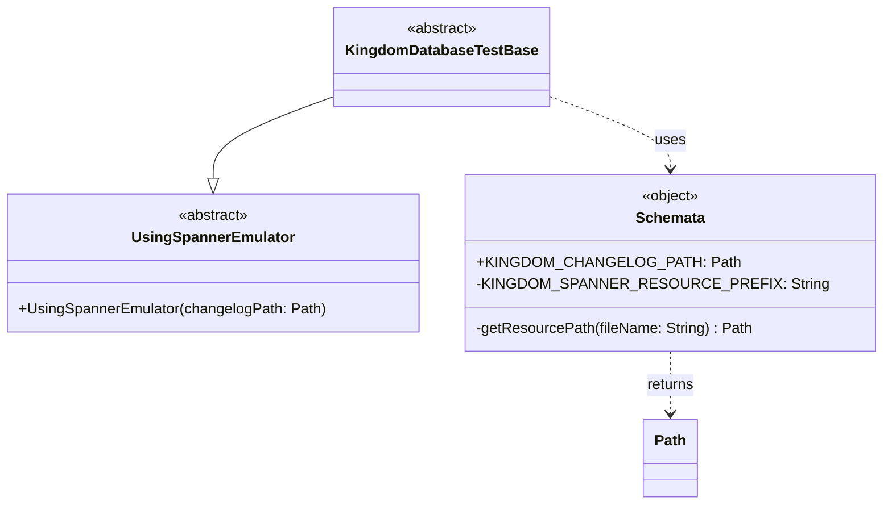

# org.wfanet.measurement.kingdom.deploy.gcloud.spanner.testing

## Overview
Provides testing utilities for Kingdom database integration tests using Google Cloud Spanner emulator. This package contains base test classes and schema resource management for Kingdom database testing scenarios.

## Components

### KingdomDatabaseTestBase
Deprecated abstract base class for Kingdom database tests using Spanner emulator

| Method | Parameters | Returns | Description |
|--------|------------|---------|-------------|
| *Inherited from UsingSpannerEmulator* | - | - | Configures Spanner emulator with Kingdom changelog |

**Note:** Marked for deletion (TODO: @yunyeng). This class is a thin wrapper around `UsingSpannerEmulator` configured with the Kingdom schema changelog.

**Constructor:**
- Inherits from `UsingSpannerEmulator(Schemata.KINGDOM_CHANGELOG_PATH)`

### Schemata
Singleton object managing Kingdom Spanner schema resource paths

| Property | Type | Description |
|----------|------|-------------|
| KINGDOM_CHANGELOG_PATH | `Path` | Path to the Kingdom Spanner database changelog YAML file |

| Method | Parameters | Returns | Description |
|--------|------------|---------|-------------|
| getResourcePath (private) | `fileName: String` | `Path` | Resolves resource file path from JAR resources |

**Constants:**
- `KINGDOM_SPANNER_RESOURCE_PREFIX` = "kingdom/spanner"

## Dependencies
- `org.wfanet.measurement.gcloud.spanner.testing.UsingSpannerEmulator` - Base class providing Spanner emulator test infrastructure
- `org.wfanet.measurement.common.getJarResourcePath` - Extension function for loading resources from JAR files
- `java.nio.file.Path` - Standard Java file path representation

## Usage Example
```kotlin
// Extend KingdomDatabaseTestBase for database tests (deprecated)
class MyKingdomDatabaseTest : KingdomDatabaseTestBase() {
    @Test
    fun testDatabaseOperation() {
        // Test code using the Spanner emulator
    }
}

// Access Kingdom schema changelog path
val changelogPath = Schemata.KINGDOM_CHANGELOG_PATH
```

## Class Diagram

