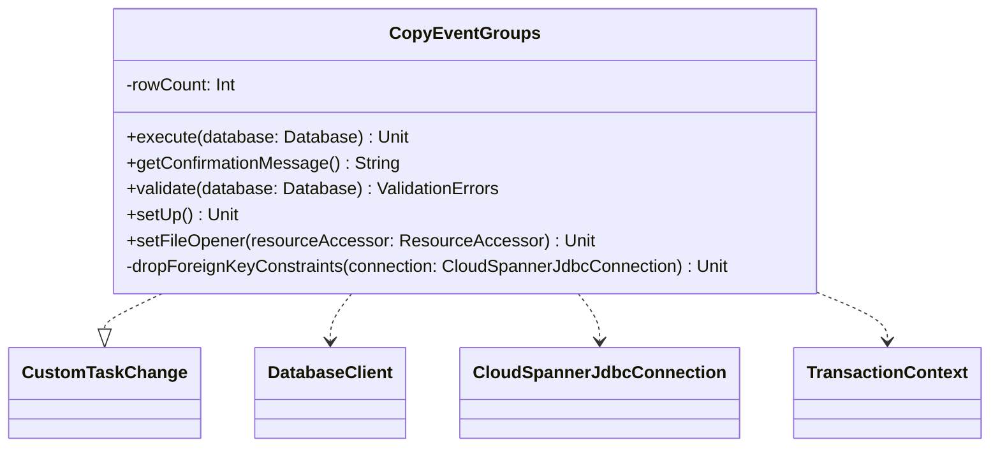

# org.wfanet.measurement.kingdom.deploy.gcloud.spanner.tools

## Overview
Provides database migration tools for Google Cloud Spanner in the Kingdom deployment. Contains custom Liquibase tasks for performing complex data transformations during schema migrations, specifically migrating EventGroups data to new table structures.

## Components

### CopyEventGroups
Liquibase custom task that copies EventGroups data to EventGroupsNew table while transforming the MediaTypes array into a separate join table.

| Method | Parameters | Returns | Description |
|--------|------------|---------|-------------|
| execute | `database: Database` | `Unit` | Performs batch migration of EventGroups to new schema |
| getConfirmationMessage | - | `String` | Returns success message with row count |
| validate | `database: Database` | `ValidationErrors` | Validates task configuration before execution |
| setUp | - | `Unit` | Initializes task (no-op) |
| setFileOpener | `resourceAccessor: ResourceAccessor` | `Unit` | Sets resource accessor (no-op) |
| dropForeignKeyConstraints | `connection: CloudSpannerJdbcConnection` | `Unit` | Drops foreign key constraints from EventGroups table |

## Implementation Details

### Migration Strategy
The `CopyEventGroups` task implements a paginated batch migration pattern:
- Processes data in batches of 100 rows to avoid transaction timeouts
- Uses composite key cursor (DataProviderId, EventGroupId) for pagination
- Transforms array column MediaTypes into normalized EventGroupMediaTypesNew rows
- Drops foreign key constraints to work around Spanner emulator limitations

### Transaction Management
- Each batch executes within a single read-write transaction
- Null values and the MediaTypes column are excluded from direct copying
- Uses `insertOrUpdateMutation` for idempotent operations

## Dependencies
- `com.google.cloud.spanner` - Cloud Spanner database client and connection management
- `liquibase.change.custom.CustomTaskChange` - Liquibase framework for custom database migrations
- `org.wfanet.measurement.gcloud.spanner` - Spanner utility functions for query building and mutations

## Usage Example
```kotlin
// Configured in Liquibase changelog XML:
// <customChange class="org.wfanet.measurement.kingdom.deploy.gcloud.spanner.tools.CopyEventGroups"/>

// The task executes automatically during Liquibase migration
// and migrates EventGroups data in batches of 100 rows,
// copying all columns except MediaTypes to EventGroupsNew,
// and normalizing MediaTypes into EventGroupMediaTypesNew.
```

## Configuration Constants

| Constant | Value | Description |
|----------|-------|-------------|
| BATCH_SIZE | 100 | Number of rows processed per transaction |
| INVALID_ID | 0L | Sentinel value indicating no more rows to process |
| BASE_SQL | SELECT with subquery | Query template fetching EventGroups with MediaTypes array |
| WHERE_CLAUSE | Composite key filter | Pagination clause for cursor-based iteration |
| ORDER_BY_CLAUSE | ORDER BY keys | Ensures deterministic pagination order |
| LIMIT_CLAUSE | LIMIT 100 | Restricts batch size |

## Class Diagram

