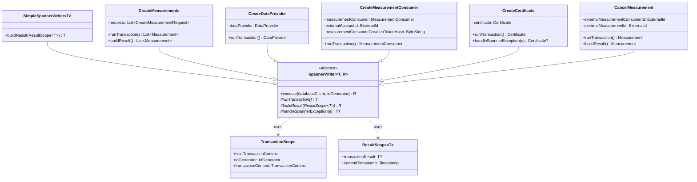

# org.wfanet.measurement.kingdom.deploy.gcloud.spanner.writers

## Overview
This package implements transactional write operations for the Kingdom service using Google Cloud Spanner. It provides a type-safe abstraction layer for read-modify-write (RMW) transactions through the SpannerWriter base class, enabling atomic database modifications for entities such as measurements, data providers, measurement consumers, requisitions, certificates, accounts, and exchanges.

## Components

### SpannerWriter
Abstract base class providing a common pattern for RMW transactions with automatic ID generation and commit timestamp handling.

| Method | Parameters | Returns | Description |
|--------|------------|---------|-------------|
| runTransaction | - | `T` | Executes the transaction body with access to TransactionContext and IdGenerator |
| buildResult | `ResultScope<T>` | `R` | Transforms transaction result and commit timestamp into final output |
| execute | `databaseClient: AsyncDatabaseClient`, `idGenerator: IdGenerator` | `R` | Runs the transaction and builds the result |
| handleSpannerException | `e: SpannerException` | `T?` | Handles Spanner exceptions, rethrows by default |

### SimpleSpannerWriter
Simplified SpannerWriter variant where the result directly equals the non-null transaction result.

| Method | Parameters | Returns | Description |
|--------|------------|---------|-------------|
| buildResult | `ResultScope<T>` | `T` | Returns checkNotNull transaction result |

### CreateMeasurements
Creates one or more measurements in the database with associated requisitions and computation participants.

| Method | Parameters | Returns | Description |
|--------|------------|---------|-------------|
| runTransaction | - | `List<Measurement>` | Creates measurements, requisitions, and participants based on protocol type |
| buildResult | `ResultScope<List<Measurement>>` | `List<Measurement>` | Adds commit timestamps and ETags to measurements |
| createComputedMeasurement | `CreateMeasurementRequest`, etc. | `Measurement` | Creates measurement for LLv2, RoLLv2, HMSS, or TrusTEE protocols |
| createDirectMeasurement | `CreateMeasurementRequest`, etc. | `Measurement` | Creates direct measurement without computation participants |
| insertRequisition | Various requisition parameters | - | Inserts requisition record with encrypted spec and public key |

### CreateDataProvider
Creates a data provider with certificates, required duchies, and data availability intervals.

| Method | Parameters | Returns | Description |
|--------|------------|---------|-------------|
| runTransaction | - | `DataProvider` | Inserts DataProvider, certificate, required duchies, and availability intervals |
| insertRequiredDuchies | `internalDataProviderId: InternalId` | - | Buffers insert mutations for required duchy associations |
| insertDataAvailabilityIntervals | `dataProviderId: InternalId` | - | Validates and inserts data availability intervals against model lines |

### CreateMeasurementConsumer
Creates a measurement consumer with certificate and owner account association.

| Method | Parameters | Returns | Description |
|--------|------------|---------|-------------|
| runTransaction | - | `MeasurementConsumer` | Creates MeasurementConsumer with certificate after validating creation token |
| readMeasurementConsumerCreationToken | `hash: ByteString` | `MeasurementConsumerCreationTokenReader.Result` | Validates creation token exists |
| readAccount | `externalAccountId: ExternalId` | `AccountReader.Result` | Validates account exists and is activated |

### CreateAccount
Creates an account with optional creator and owned measurement consumer associations.

| Method | Parameters | Returns | Description |
|--------|------------|---------|-------------|
| runTransaction | - | `Account` | Inserts account with activation token and optional ownership links |
| readAccount | `externalAccountId: ExternalId` | `AccountReader.Result` | Reads creator account for validation |

### CreateCertificate
Creates a certificate for DataProvider, MeasurementConsumer, Duchy, or ModelProvider.

| Method | Parameters | Returns | Description |
|--------|------------|---------|-------------|
| runTransaction | - | `Certificate` | Inserts certificate and mapping table entry for parent entity |
| getOwnerInternalId | `transactionContext: TransactionContext` | `InternalId` | Resolves parent entity internal ID based on certificate parent type |
| createCertificateMapTableMutation | IDs and ExternalId | `Mutation` | Generates mutation for owner-specific certificate mapping table |
| handleSpannerException | `e: SpannerException` | `Certificate?` | Converts ALREADY_EXISTS to CertSubjectKeyIdAlreadyExistsException |
| toInsertMutation | `internalId: InternalId` | `Mutation` | Extension function converting Certificate to Spanner insert mutation |

### CreateApiKey
Creates an API key for a measurement consumer with hashed authentication key.

| Method | Parameters | Returns | Description |
|--------|------------|---------|-------------|
| runTransaction | - | `ApiKey` | Generates API key with SHA-256 hashed authentication key |
| readInternalMeasurementConsumerId | `externalId: ExternalId` | `InternalId` | Validates measurement consumer exists |

### CancelMeasurement
Transitions a measurement to CANCELLED state and withdraws associated requisitions.

| Method | Parameters | Returns | Description |
|--------|------------|---------|-------------|
| runTransaction | - | `Measurement` | Validates state, withdraws requisitions, updates measurement to CANCELLED |
| buildResult | `ResultScope<Measurement>` | `Measurement` | Adds commit timestamp and ETag |

### CreateExchange
Creates an exchange associated with a recurring exchange.

| Method | Parameters | Returns | Description |
|--------|------------|---------|-------------|
| runTransaction | - | `Exchange` | Inserts exchange with ACTIVE initial state |

### UpdateRequisition Utilities
Helper functions for updating requisition state and withdrawing requisitions.

| Method | Parameters | Returns | Description |
|--------|------------|---------|-------------|
| updateRequisition | `readResult`, `state`, `details`, `fulfillingDuchyId?` | - | Buffers update mutation for requisition |
| withdrawRequisitions | `measurementConsumerId`, `measurementId`, `excludedRequisitionId?` | - | Sets PENDING_PARAMS/UNFULFILLED requisitions to WITHDRAWN |

### UpdateMeasurementState Utilities
Helper function for updating measurement state with log entries.

| Method | Parameters | Returns | Description |
|--------|------------|---------|-------------|
| updateMeasurementState | State IDs, states, log details, optional details | - | Updates measurement state and creates log entries |

### MeasurementLogEntries Utilities
Helper functions for inserting measurement log entries.

| Method | Parameters | Returns | Description |
|--------|------------|---------|-------------|
| insertMeasurementLogEntry | `measurementId`, `measurementConsumerId`, `logDetails` | - | Inserts general measurement log entry |
| insertStateTransitionMeasurementLogEntry | IDs and states | - | Inserts state transition log entry |
| insertDuchyMeasurementLogEntry | IDs and duchy log details | `ExternalId` | Inserts duchy-specific log entry with generated external ID |

### EventGroups Utilities
Helper function for validating certificate ownership.

| Method | Parameters | Returns | Description |
|--------|------------|---------|-------------|
| checkValidCertificate | `measurementConsumerCertificateId`, `measurementConsumerId`, `transactionContext` | `InternalId` | Validates certificate exists, is valid, and returns internal ID |

### Additional Writers

| Writer | Purpose |
|--------|---------|
| ActivateAccount | Activates an unactivated account using activation token |
| AddMeasurementConsumerOwner | Associates additional owner account with measurement consumer |
| BatchCancelMeasurements | Cancels multiple measurements in single transaction |
| BatchCreateEventGroups | Creates multiple event groups atomically |
| BatchDeleteEventGroupActivities | Deletes multiple event group activities |
| BatchDeleteExchanges | Deletes multiple exchanges |
| BatchDeleteMeasurements | Deletes multiple measurements |
| BatchUpdateEventGroupActivities | Updates multiple event group activities |
| BatchUpdateEventGroups | Updates multiple event groups |
| ClaimReadyExchangeStep | Claims an exchange step for processing |
| ConfirmComputationParticipant | Confirms duchy participation in computation |
| CreateDuchyMeasurementLogEntry | Creates duchy-specific measurement log entry |
| CreateEventGroup | Creates single event group |
| CreateEventGroupMetadataDescriptor | Creates metadata descriptor for event groups |
| CreateExchangesAndSteps | Creates exchanges with associated workflow steps |
| CreateMeasurementConsumerCreationToken | Creates token for measurement consumer creation |
| CreateModelLine | Creates model line for model provider |
| CreateModelOutage | Records model outage period |
| CreateModelProvider | Creates model provider entity |
| CreateModelRelease | Creates model release version |
| CreateModelRollout | Creates model rollout schedule |
| CreateModelShard | Creates model shard for distributed models |
| CreateModelSuite | Creates model suite container |
| CreatePopulation | Creates population for event groups |
| CreateRecurringExchange | Creates recurring exchange schedule |
| DeleteApiKey | Deletes measurement consumer API key |
| DeleteEventGroup | Soft-deletes event group |
| DeleteMeasurementConsumerCreationToken | Deletes used creation token |
| DeleteModelOutage | Removes model outage record |
| DeleteModelRollout | Deletes model rollout |
| DeleteModelShard | Deletes model shard |
| FailComputationParticipant | Marks computation participant as failed |
| FinishExchangeStepAttempt | Completes exchange step attempt |
| FulfillRequisition | Marks requisition as fulfilled with encrypted result |
| GenerateOpenIdRequestParams | Generates OpenID Connect authentication parameters |
| RefuseRequisition | Refuses requisition fulfillment |
| ReleaseCertificateHold | Releases hold on certificate |
| RemoveMeasurementConsumerOwner | Removes owner association from measurement consumer |
| ReplaceAccountIdentityWithNewOpenIdConnectIdentity | Updates account OpenID Connect identity |
| ReplaceDataAvailabilityInterval | Replaces single data availability interval |
| ReplaceDataAvailabilityIntervals | Replaces all data availability intervals for data provider |
| ReplaceDataProviderCapabilities | Updates data provider capabilities |
| ReplaceDataProviderRequiredDuchies | Updates required duchies for data provider |
| RevokeCertificate | Revokes certificate by updating revocation state |
| ScheduleModelRolloutFreeze | Schedules freeze time for model rollout |
| SetActiveEndTime | Sets end time for active period |
| SetMeasurementResult | Records final measurement result |
| SetModelLineHoldbackModelLine | Configures holdback model line |
| SetModelLineType | Updates model line type |
| SetParticipantRequisitionParams | Sets requisition parameters for computation participant |
| UpdateEventGroup | Updates event group properties |
| UpdateEventGroupMetadataDescriptor | Updates event group metadata descriptor |
| UpdateExchangeStep | Updates exchange step state |
| UpdatePublicKey | Updates public key for entity |

## Data Structures

### TransactionScope
| Property | Type | Description |
|----------|------|-------------|
| txn | `AsyncDatabaseClient.TransactionContext` | Active Spanner transaction context |
| idGenerator | `IdGenerator` | Generator for internal and external IDs |
| transactionContext | `AsyncDatabaseClient.TransactionContext` | Alias for txn (getter) |

### ResultScope
| Property | Type | Description |
|----------|------|-------------|
| transactionResult | `T?` | Result returned from runTransaction |
| commitTimestamp | `Timestamp` | Spanner commit timestamp |

## Dependencies
- `com.google.cloud.spanner` - Google Cloud Spanner client library
- `org.wfanet.measurement.gcloud.spanner` - Custom Spanner extensions for mutations and queries
- `org.wfanet.measurement.common.identity` - ID generation and external/internal ID wrappers
- `org.wfanet.measurement.internal.kingdom` - Protobuf definitions for Kingdom entities
- `org.wfanet.measurement.kingdom.deploy.gcloud.spanner.readers` - Reader implementations for querying entities
- `org.wfanet.measurement.kingdom.deploy.gcloud.spanner.common` - Common exception types and utilities
- `org.wfanet.measurement.kingdom.deploy.common` - Protocol configurations and duchy mappings

## Usage Example
```kotlin
// Creating a measurement consumer
val createMeasurementConsumer = CreateMeasurementConsumer(
  measurementConsumer = measurementConsumer {
    certificate = certificate { /* certificate details */ }
    details = measurementConsumerDetails { /* details */ }
  },
  externalAccountId = ExternalId(accountId),
  measurementConsumerCreationTokenHash = tokenHash
)

val result = createMeasurementConsumer.execute(databaseClient, idGenerator)
// result contains the created MeasurementConsumer with generated IDs

// Creating measurements
val createMeasurements = CreateMeasurements(
  requests = listOf(
    CreateMeasurementRequest.newBuilder()
      .setMeasurement(measurement {
        externalMeasurementConsumerId = consumerId
        externalMeasurementConsumerCertificateId = certId
        details = measurementDetails {
          protocolConfig = protocolConfig {
            liquidLegionsV2 = liquidLegionsV2 { /* config */ }
          }
        }
        putDataProviders(dataProviderId, dataProviderValue)
      })
      .setRequestId("unique-request-id")
      .build()
  )
)

val measurements = createMeasurements.execute(databaseClient, idGenerator)
// measurements contains created Measurement objects with generated external IDs
```

## Class Diagram

