# org.wfanet.measurement.kingdom.deploy.tools

## Overview
Provides command-line tools for managing Kingdom resources and Model Repository artifacts. CreateResource handles creation of foundational entities like accounts, data providers, model providers, and recurring exchanges. ModelRepository provides comprehensive CLI operations for managing model suites, populations, model lines, releases, and rollouts.

## Components

### CreateResource
Main command-line tool for creating core Kingdom resources via internal gRPC API.

| Method | Parameters | Returns | Description |
|--------|------------|---------|-------------|
| main | `args: Array<String>` | `Unit` | Entry point for resource creation tool |

**Subcommands:**
- `account` - Creates Account resources
- `mc-creation-token` - Creates MeasurementConsumer creation tokens
- `data-provider` - Creates DataProvider with encryption keys
- `model-provider` - Creates ModelProvider resources
- `duchy-certificate` - Creates Duchy certificates
- `recurring-exchange` - Creates RecurringExchange schedules

### CreateAccountCommand
Creates an Account and outputs the account name and activation token.

| Method | Parameters | Returns | Description |
|--------|------------|---------|-------------|
| run | - | `Unit` | Creates account and prints credentials |

**Output:**
- Account name in API resource format
- Activation token for account activation

### CreateMcCreationTokenCommand
Generates a MeasurementConsumer creation token.

| Method | Parameters | Returns | Description |
|--------|------------|---------|-------------|
| run | - | `Unit` | Creates and prints MC creation token |

### CreateDataProviderCommand
Creates a DataProvider with certificate and encryption public key.

| Method | Parameters | Returns | Description |
|--------|------------|---------|-------------|
| run | - | `Unit` | Creates DataProvider with encryption configuration |

**Required Parameters:**
- `--certificate-der-file` - X.509 certificate in DER format
- `--encryption-public-key-file` - Serialized EncryptionPublicKey
- `--encryption-public-key-signature-file` - Signature of public key
- `--encryption-public-key-signature-algorithm` - Signature algorithm
- `--encryption-public-key-api-version` - API version (default: v2alpha)

**Optional Parameters:**
- `--required-duchies` - Duchies required for computations

### CreateModelProviderCommand
Creates a ModelProvider resource.

| Method | Parameters | Returns | Description |
|--------|------------|---------|-------------|
| run | - | `Unit` | Creates ModelProvider and prints resource name |

### CreateDuchyCertificateCommand
Creates a Certificate for a Duchy.

| Method | Parameters | Returns | Description |
|--------|------------|---------|-------------|
| run | - | `Unit` | Creates Duchy certificate from X.509 file |

**Required Parameters:**
- `--certificate-file` or `--cert-file` - X.509 certificate (PEM or DER)
- Either `--duchy` (API resource name) or `--duchy-id` (public API ID)

### CreateRecurringExchangeCommand
Creates a RecurringExchange with scheduled workflow execution.

| Method | Parameters | Returns | Description |
|--------|------------|---------|-------------|
| run | - | `Unit` | Creates recurring exchange with daily schedule |

**Required Parameters:**
- `--model-provider` - ModelProvider API resource name
- `--data-provider` - DataProvider API resource name
- `--next-exchange-date` - First exchange execution date
- `--exchange-workflow-file` - Serialized ExchangeWorkflow

**Constants:**
- Cron schedule: `@daily`

### ModelRepository
Main command-line tool for managing Model Repository artifacts via public Kingdom API.

| Method | Parameters | Returns | Description |
|--------|------------|---------|-------------|
| main | `args: Array<String>` | `Unit` | Entry point for model repository management |

**Subcommands:**
- `model-providers` - Manage ModelProvider resources
- `model-suites` - Manage ModelSuite resources
- `populations` - Manage Population resources
- `model-lines` - Manage ModelLine, ModelRelease, and ModelRollout resources

**Configuration:**
- `--kingdom-public-api-target` - gRPC target for Kingdom public API
- `--kingdom-public-api-cert-host` - TLS certificate hostname override
- Channel shutdown timeout: 30 seconds

### Model Provider Operations

#### GetModelProvider
Retrieves a ModelProvider by resource name.

| Method | Parameters | Returns | Description |
|--------|------------|---------|-------------|
| run | - | `Unit` | Fetches and prints ModelProvider details |

**Parameters:**
- Position 0: API resource name of ModelProvider

#### ListModelProviders
Lists all ModelProvider resources with pagination.

| Method | Parameters | Returns | Description |
|--------|------------|---------|-------------|
| run | - | `Unit` | Lists ModelProviders with pagination support |

### Model Suite Operations

#### GetModelSuite
Retrieves a ModelSuite by resource name.

| Method | Parameters | Returns | Description |
|--------|------------|---------|-------------|
| run | - | `Unit` | Fetches and prints ModelSuite details |

**Parameters:**
- Position 0: API resource name of ModelSuite

#### CreateModelSuite
Creates a new ModelSuite under a ModelProvider.

| Method | Parameters | Returns | Description |
|--------|------------|---------|-------------|
| run | - | `Unit` | Creates ModelSuite with display name and description |

**Required Parameters:**
- `--parent` - Parent ModelProvider resource name
- `--display-name` - Human-readable nickname

**Optional Parameters:**
- `--description` - Usage description

#### ListModelSuites
Lists ModelSuites under a ModelProvider with pagination.

| Method | Parameters | Returns | Description |
|--------|------------|---------|-------------|
| run | - | `Unit` | Lists ModelSuites for specified parent |

**Required Parameters:**
- `--parent` - Parent ModelProvider resource name

### Population Operations

#### CreatePopulation
Creates a Population with validated PopulationSpec.

| Method | Parameters | Returns | Description |
|--------|------------|---------|-------------|
| run | - | `Unit` | Creates Population after validating spec against event schema |
| buildTypeRegistry | - | `TypeRegistry` | Builds type registry from descriptor sets |

**Required Parameters:**
- `--parent` - Parent DataProvider resource name
- `--population-spec` - File path to PopulationSpec message
- `--event-message-descriptor-set` - FileDescriptorSet files (repeatable)
- `--event-message-type-url` - Event message type URL

**Optional Parameters:**
- `--description` - Usage description

**Validation:**
- Parses PopulationSpec from file
- Builds TypeRegistry from descriptor sets with EventAnnotations support
- Validates PopulationSpec against event message descriptor

#### GetPopulation
Retrieves a Population by resource name.

| Method | Parameters | Returns | Description |
|--------|------------|---------|-------------|
| run | - | `Unit` | Fetches and prints Population details |

**Parameters:**
- Position 0: API resource name of Population

#### ListPopulations
Lists Populations under a DataProvider with pagination.

| Method | Parameters | Returns | Description |
|--------|------------|---------|-------------|
| run | - | `Unit` | Lists Populations for specified parent |

**Required Parameters:**
- `--parent` - Parent DataProvider resource name

### Model Line Operations

#### CreateModelLine
Creates a ModelLine with associated ModelRelease and instant ModelRollout.

| Method | Parameters | Returns | Description |
|--------|------------|---------|-------------|
| run | - | `Unit` | Creates ModelLine, ModelRelease, and ModelRollout atomically |

**Required Parameters:**
- `--parent` - Parent ModelSuite resource name
- `--active-start-time` - Start of active time range (Instant)
- `--type` - ModelLine type (PROD/HOLDBACK/etc.)
- `--population` - Population resource name for ModelRelease

**Optional Parameters:**
- `--display-name` - Human-readable nickname (default: empty)
- `--description` - Usage description (default: empty)
- `--active-end-time` - End of active time range (Instant)
- `--holdback-model-line` - Holdback ModelLine for PROD type (default: empty)

**Behavior:**
- Creates ModelLine with specified time range and type
- Creates ModelRelease referencing the population
- Creates instant ModelRollout scheduled for active start date

#### GetModelLine
Retrieves a ModelLine by resource name.

| Method | Parameters | Returns | Description |
|--------|------------|---------|-------------|
| run | - | `Unit` | Fetches and prints ModelLine details |

**Parameters:**
- Position 0: API resource name of ModelLine

#### ListModelLines
Lists ModelLines under a ModelSuite with type filtering and pagination.

| Method | Parameters | Returns | Description |
|--------|------------|---------|-------------|
| run | - | `Unit` | Lists ModelLines with optional type filter |

**Required Parameters:**
- `--parent` - Parent ModelSuite resource name

**Optional Parameters:**
- `--type` - ModelLine types to filter (repeatable)

#### SetModelLineActiveEndTime
Updates the active end time of an existing ModelLine.

| Method | Parameters | Returns | Description |
|--------|------------|---------|-------------|
| run | - | `Unit` | Sets ModelLine active end time |

**Required Parameters:**
- `--name` - API resource name of ModelLine
- `--active-end-time` - Timestamp in RFC3339 format

## Data Structures

### VersionConverter
Converts string to API Version enum.

| Property | Type | Description |
|----------|------|-------------|
| convert | `(String) -> Version` | Parses version string to Version enum |

### PageParams
Pagination parameters mixin for list operations.

| Property | Type | Description |
|----------|------|-------------|
| pageSize | `Int` | Maximum resources to return (default: 1000, max: 1000) |
| pageToken | `String` | Token for next page (default: empty) |

### Duchy (nested in CreateDuchyCertificateCommand)
Mutually exclusive duchy identification.

| Property | Type | Description |
|----------|------|-------------|
| duchyName | `String?` | API resource name of Duchy |
| duchyId | `String?` | Public API ID of Duchy |

## Dependencies

### gRPC Clients (Internal API)
- `org.wfanet.measurement.internal.kingdom.AccountsCoroutineStub` - Account management
- `org.wfanet.measurement.internal.kingdom.DataProvidersCoroutineStub` - DataProvider creation
- `org.wfanet.measurement.internal.kingdom.ModelProvidersCoroutineStub` - ModelProvider creation
- `org.wfanet.measurement.internal.kingdom.CertificatesCoroutineStub` - Certificate creation
- `org.wfanet.measurement.internal.kingdom.RecurringExchangesCoroutineStub` - RecurringExchange management

### gRPC Clients (Public API)
- `org.wfanet.measurement.api.v2alpha.ModelProvidersGrpc` - ModelProvider operations
- `org.wfanet.measurement.api.v2alpha.ModelSuitesGrpc` - ModelSuite operations
- `org.wfanet.measurement.api.v2alpha.PopulationsGrpc` - Population operations
- `org.wfanet.measurement.api.v2alpha.ModelLinesGrpc` - ModelLine operations
- `org.wfanet.measurement.api.v2alpha.ModelReleasesGrpc` - ModelRelease operations
- `org.wfanet.measurement.api.v2alpha.ModelRolloutsGrpc` - ModelRollout operations

### Core Libraries
- `org.wfanet.measurement.common.crypto` - Certificate and signature handling
- `org.wfanet.measurement.common.grpc` - Mutual TLS channel construction
- `org.wfanet.measurement.common.identity` - External/API ID conversion
- `org.wfanet.measurement.kingdom.service.api.v2alpha` - Certificate filling utilities

### External Dependencies
- `picocli` - Command-line interface framework
- `com.google.protobuf` - Protocol buffer support with TypeRegistry
- `io.grpc` - gRPC channel and stub management
- `kotlinx.coroutines` - Asynchronous execution with runBlocking

## Usage Examples

### Creating a DataProvider
```kotlin
// Command-line usage
./CreateResource data-provider \
  --certificate-der-file=/path/to/cert.der \
  --encryption-public-key-file=/path/to/pubkey.bin \
  --encryption-public-key-signature-file=/path/to/signature.bin \
  --encryption-public-key-signature-algorithm=SHA256withECDSA \
  --required-duchies=duchy1,duchy2
```

### Creating a ModelLine with Release
```kotlin
// Command-line usage
./model-repository model-lines create \
  --parent=modelProviders/123/modelSuites/456 \
  --display-name="Production Model v1" \
  --type=PROD \
  --active-start-time=2026-01-01T00:00:00Z \
  --population=dataProviders/789/populations/101
```

### Listing ModelSuites
```kotlin
// Command-line usage
./model-repository model-suites list \
  --parent=modelProviders/123 \
  --page-size=50 \
  --page-token=<previous-token>
```

### Creating a Population
```kotlin
// Command-line usage
./model-repository populations create \
  --parent=dataProviders/123 \
  --description="Mobile app users" \
  --population-spec=/path/to/spec.pb \
  --event-message-descriptor-set=/path/to/descriptors1.pb \
  --event-message-descriptor-set=/path/to/descriptors2.pb \
  --event-message-type-url=type.googleapis.com/example.Event
```

## Class Diagram

```mermaid
classDiagram
    class CreateResource {
        +main(args: Array~String~)
        +run()
        +channel: Channel
    }

    class ModelRepository {
        +main(args: Array~String~)
        +run()
        +channel: ManagedChannel
    }

    class CreateAccountCommand {
        +run()
    }

    class CreateDataProviderCommand {
        +run()
        -certificate: Certificate
        -serializedEncryptionPublicKey: ByteString
    }

    class CreateModelProviderCommand {
        +run()
    }

    class CreateRecurringExchangeCommand {
        +run()
    }

    class CreateDuchyCertificateCommand {
        +run()
        -duchyId: String
    }

    class CreateModelLine {
        +run()
    }

    class CreatePopulation {
        +run()
        -buildTypeRegistry(): TypeRegistry
    }

    class PageParams {
        +pageSize: Int
        +pageToken: String
    }

    CreateResource --> CreateAccountCommand
    CreateResource --> CreateDataProviderCommand
    CreateResource --> CreateModelProviderCommand
    CreateResource --> CreateRecurringExchangeCommand
    CreateResource --> CreateDuchyCertificateCommand

    ModelRepository --> CreateModelLine
    ModelRepository --> CreatePopulation

    CreateModelLine --> PageParams
    CreatePopulation --> PageParams

    CreateResource --> AccountsCoroutineStub
    CreateResource --> DataProvidersCoroutineStub
    CreateResource --> ModelProvidersCoroutineStub
    CreateResource --> RecurringExchangesCoroutineStub
    CreateResource --> CertificatesCoroutineStub

    ModelRepository --> ModelProvidersBlockingStub
    ModelRepository --> ModelSuitesBlockingStub
    ModelRepository --> PopulationsBlockingStub
    ModelRepository --> ModelLinesBlockingStub
    ModelRepository --> ModelReleasesBlockingStub
    ModelRepository --> ModelRolloutsBlockingStub
```


## Security Considerations

### TLS Configuration
Both tools require mutual TLS authentication:
- Client certificates and private keys via `TlsFlags`
- Trusted certificate collection for server verification
- Optional certificate hostname override for non-standard deployments

### Cryptographic Operations
- DataProvider creation validates signature algorithms (OID-based)
- EncryptionPublicKey parsing ensures well-formed protobuf messages
- X.509 certificates read and validated before storage

### Identity Management
- External IDs converted to API IDs using bidirectional mapping
- Activation tokens generated for accounts
- Creation tokens provided for MeasurementConsumer provisioning

## Error Handling

### Validation Errors
- PopulationSpec validation against event message descriptors
- Resource name parsing with null checks
- File existence and readability checks

### Runtime Errors
- gRPC errors propagated from service calls
- Coroutine execution in IO dispatcher for blocking operations
- Channel shutdown timeout enforced (30 seconds)
