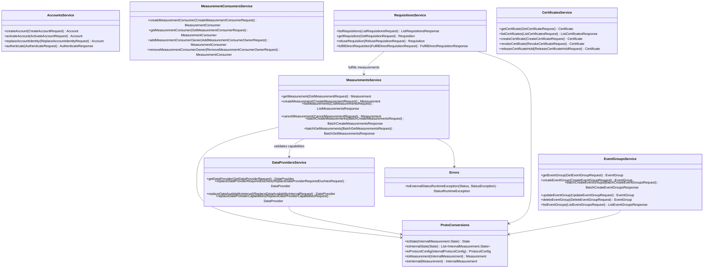

# org.wfanet.measurement.kingdom.service.api.v2alpha

## Overview

This package provides the Kingdom API v2alpha service layer for the Cross-Media Measurement system. It implements gRPC service handlers that translate public API requests to internal Kingdom operations, managing authentication, authorization, resource conversions, and error handling for measurement consumers, data providers, measurements, requisitions, certificates, event groups, accounts, and model management.

## Architecture

The package follows a layered architecture pattern where public API services delegate to internal Kingdom services via gRPC stubs. Each service handles request validation, principal authentication, resource key parsing, protocol buffer conversions between public and internal formats, and standardized error mapping.

## Core Services

### AccountsService
Manages user account lifecycle including creation, activation, identity management, and OpenID Connect authentication.

| Method | Parameters | Returns | Description |
|--------|------------|---------|-------------|
| createAccount | `CreateAccountRequest` | `Account` | Creates new account with owned measurement consumer |
| activateAccount | `ActivateAccountRequest` | `Account` | Activates account using token and ID token |
| replaceAccountIdentity | `ReplaceAccountIdentityRequest` | `Account` | Updates account OpenID identity |
| authenticate | `AuthenticateRequest` | `AuthenticateResponse` | Generates OpenID authentication request URI |

**Key Features:**
- Self-issued OpenID Connect identity validation
- JWT signature verification with public key handling
- Activation token-based account verification
- Nonce and state parameter management for OIDC flows

### MeasurementsService
Core service for creating and managing privacy-preserving measurements across multiple data providers.

| Method | Parameters | Returns | Description |
|--------|------------|---------|-------------|
| getMeasurement | `GetMeasurementRequest` | `Measurement` | Retrieves single measurement by key |
| createMeasurement | `CreateMeasurementRequest` | `Measurement` | Creates new measurement with requisitions |
| listMeasurements | `ListMeasurementsRequest` | `ListMeasurementsResponse` | Lists measurements with pagination |
| cancelMeasurement | `CancelMeasurementRequest` | `Measurement` | Cancels pending measurement |
| batchCreateMeasurements | `BatchCreateMeasurementsRequest` | `BatchCreateMeasurementsResponse` | Creates multiple measurements atomically |
| batchGetMeasurements | `BatchGetMeasurementsRequest` | `BatchGetMeasurementsResponse` | Retrieves multiple measurements |

**Protocol Configuration:**
- Supports Liquid Legions V2, Reach-only LLv2, Honest Majority Share Shuffle, TrusTEE, and Direct protocols
- Dynamic protocol selection based on data provider count and capabilities
- Noise mechanism configuration (Geometric, Discrete Gaussian, Continuous Laplace/Gaussian)
- Privacy budget validation for differential privacy parameters

**Measurement Types:**
- Reach (unique user count)
- Reach and Frequency (distribution of exposure frequencies)
- Impression (total impression count)
- Duration (total watch duration)
- Population (population counts for model evaluation)

### DataProvidersService
Manages data provider resources, capabilities, and data availability windows.

| Method | Parameters | Returns | Description |
|--------|------------|---------|-------------|
| getDataProvider | `GetDataProviderRequest` | `DataProvider` | Retrieves data provider details |
| replaceDataProviderRequiredDuchies | `ReplaceDataProviderRequiredDuchiesRequest` | `DataProvider` | Updates required duchy list |
| replaceDataAvailabilityInterval | `ReplaceDataAvailabilityIntervalRequest` | `DataProvider` | Sets data availability time window |
| replaceDataAvailabilityIntervals | `ReplaceDataAvailabilityIntervalsRequest` | `DataProvider` | Sets availability per model line |
| replaceDataProviderCapabilities | `ReplaceDataProviderCapabilitiesRequest` | `DataProvider` | Updates protocol capabilities |

**Capabilities:**
- Honest Majority Share Shuffle support flag
- TrusTEE protocol support flag

### MeasurementConsumersService
Handles measurement consumer registration, public key management, and ownership.

| Method | Parameters | Returns | Description |
|--------|------------|---------|-------------|
| createMeasurementConsumer | `CreateMeasurementConsumerRequest` | `MeasurementConsumer` | Registers new measurement consumer |
| getMeasurementConsumer | `GetMeasurementConsumerRequest` | `MeasurementConsumer` | Retrieves consumer details |
| addMeasurementConsumerOwner | `AddMeasurementConsumerOwnerRequest` | `MeasurementConsumer` | Adds account as owner |
| removeMeasurementConsumerOwner | `RemoveMeasurementConsumerOwnerRequest` | `MeasurementConsumer` | Removes account ownership |

### RequisitionsService
Manages requisition lifecycle for measurement data from data providers.

| Method | Parameters | Returns | Description |
|--------|------------|---------|-------------|
| listRequisitions | `ListRequisitionsRequest` | `ListRequisitionsResponse` | Lists requisitions with filtering |
| getRequisition | `GetRequisitionRequest` | `Requisition` | Retrieves single requisition |
| refuseRequisition | `RefuseRequisitionRequest` | `Requisition` | Refuses requisition with justification |
| fulfillDirectRequisition | `FulfillDirectRequisitionRequest` | `FulfillDirectRequisitionResponse` | Fulfills direct measurement requisition |

**Refusal Justifications:**
- Consent signal invalid
- Specification invalid
- Insufficient privacy budget
- Unfulfillable
- Declined

**States:**
- Unfulfilled (pending params or fulfillment)
- Fulfilled
- Refused
- Withdrawn

### CertificatesService
Certificate lifecycle management for all principals (data providers, measurement consumers, duchies, model providers).

| Method | Parameters | Returns | Description |
|--------|------------|---------|-------------|
| getCertificate | `GetCertificateRequest` | `Certificate` | Retrieves certificate by key |
| listCertificates | `ListCertificatesRequest` | `ListCertificatesResponse` | Lists certificates with filtering |
| createCertificate | `CreateCertificateRequest` | `Certificate` | Creates X.509 certificate |
| revokeCertificate | `RevokeCertificateRequest` | `Certificate` | Revokes or holds certificate |
| releaseCertificateHold | `ReleaseCertificateHoldRequest` | `Certificate` | Releases certificate hold |

**Certificate Validation:**
- X.509 DER format parsing
- Subject Key Identifier (SKID) extraction
- Validity period enforcement
- Revocation state management (revoked, hold)

### EventGroupsService
Manages event groups representing collections of measurement events.

| Method | Parameters | Returns | Description |
|--------|------------|---------|-------------|
| getEventGroup | `GetEventGroupRequest` | `EventGroup` | Retrieves event group |
| createEventGroup | `CreateEventGroupRequest` | `EventGroup` | Creates new event group |
| batchCreateEventGroups | `BatchCreateEventGroupsRequest` | `BatchCreateEventGroupsResponse` | Creates multiple event groups |
| updateEventGroup | `UpdateEventGroupRequest` | `EventGroup` | Updates event group properties |
| batchUpdateEventGroups | `BatchUpdateEventGroupsRequest` | `BatchUpdateEventGroupsResponse` | Updates multiple event groups |
| deleteEventGroup | `DeleteEventGroupRequest` | `EventGroup` | Soft-deletes event group |
| listEventGroups | `ListEventGroupsRequest` | `ListEventGroupsResponse` | Lists event groups with filters |

**Event Group Features:**
- Encrypted metadata with measurement consumer public key
- Media type classification (video, display, other)
- Data availability time intervals
- Event templates for type definitions
- VID model line associations
- Metadata search capabilities

### ExchangesService
Coordinates recurring data exchanges between model providers and data providers.

| Method | Parameters | Returns | Description |
|--------|------------|---------|-------------|
| createRecurringExchange | `CreateRecurringExchangeRequest` | `RecurringExchange` | Sets up recurring exchange workflow |
| getExchange | `GetExchangeRequest` | `Exchange` | Retrieves exchange instance |

### ExchangeStepsService
Manages individual steps within exchange workflows.

| Method | Parameters | Returns | Description |
|--------|------------|---------|-------------|
| getExchangeStep | `GetExchangeStepRequest` | `ExchangeStep` | Retrieves exchange step details |
| claimReadyExchangeStep | `ClaimReadyExchangeStepRequest` | `ExchangeStep` | Claims step for execution |
| finishExchangeStep | `FinishExchangeStepRequest` | `ExchangeStep` | Marks step complete |
| finishExchangeStepAttempt | `FinishExchangeStepAttemptRequest` | `ExchangeStepAttempt` | Records attempt completion |

### ExchangeStepAttemptsService
Tracks execution attempts for exchange steps with debug logging.

| Method | Parameters | Returns | Description |
|--------|------------|---------|-------------|
| getExchangeStepAttempt | `GetExchangeStepAttemptRequest` | `ExchangeStepAttempt` | Retrieves attempt details |
| appendExchangeStepAttemptLogEntry | `AppendLogEntryRequest` | `ExchangeStepAttempt` | Adds debug log entry |

## Model Management Services

### ModelProvidersService
Manages model provider registrations.

| Method | Parameters | Returns | Description |
|--------|------------|---------|-------------|
| getModelProvider | `GetModelProviderRequest` | `ModelProvider` | Retrieves provider details |

### ModelSuitesService
Manages collections of related models.

| Method | Parameters | Returns | Description |
|--------|------------|---------|-------------|
| createModelSuite | `CreateModelSuiteRequest` | `ModelSuite` | Creates model suite |
| getModelSuite | `GetModelSuiteRequest` | `ModelSuite` | Retrieves suite details |
| listModelSuites | `ListModelSuitesRequest` | `ListModelSuitesResponse` | Lists suites with pagination |

### ModelLinesService
Manages model deployment lines (dev, prod, holdback).

| Method | Parameters | Returns | Description |
|--------|------------|---------|-------------|
| createModelLine | `CreateModelLineRequest` | `ModelLine` | Creates deployment line |
| getModelLine | `GetModelLineRequest` | `ModelLine` | Retrieves line details |
| listModelLines | `ListModelLinesRequest` | `ListModelLinesResponse` | Lists lines |
| setModelLineActiveEndTime | `SetModelLineActiveEndTimeRequest` | `ModelLine` | Sets deactivation time |

**Line Types:**
- DEV (development)
- PROD (production)
- HOLDBACK (control group)

### ModelReleasesService
Manages model release artifacts.

| Method | Parameters | Returns | Description |
|--------|------------|---------|-------------|
| createModelRelease | `CreateModelReleaseRequest` | `ModelRelease` | Publishes model release |
| listModelReleases | `ListModelReleasesRequest` | `ListModelReleasesResponse` | Lists releases |

### ModelRolloutsService
Controls gradual deployment of model releases.

| Method | Parameters | Returns | Description |
|--------|------------|---------|-------------|
| createModelRollout | `CreateModelRolloutRequest` | `ModelRollout` | Schedules rollout |
| scheduleModelRolloutFreeze | `ScheduleModelRolloutFreezeRequest` | `ModelRollout` | Freezes rollout progression |
| deleteModelRollout | `DeleteModelRolloutRequest` | `ModelRollout` | Cancels scheduled rollout |
| listModelRollouts | `ListModelRolloutsRequest` | `ListModelRolloutsResponse` | Lists rollouts |

### ModelOutagesService
Tracks model availability disruptions.

| Method | Parameters | Returns | Description |
|--------|------------|---------|-------------|
| createModelOutage | `CreateModelOutageRequest` | `ModelOutage` | Records outage period |
| deleteModelOutage | `DeleteModelOutageRequest` | `ModelOutage` | Removes outage record |
| listModelOutages | `ListModelOutagesRequest` | `ListModelOutagesResponse` | Lists outages |

### ModelShardsService
Manages model distribution shards for data providers.

| Method | Parameters | Returns | Description |
|--------|------------|---------|-------------|
| createModelShard | `CreateModelShardRequest` | `ModelShard` | Creates shard |
| deleteModelShard | `DeleteModelShardRequest` | `ModelShard` | Removes shard |
| listModelShards | `ListModelShardsRequest` | `ListModelShardsResponse` | Lists shards |

### PopulationsService
Manages population definitions for model evaluation.

| Method | Parameters | Returns | Description |
|--------|------------|---------|-------------|
| createPopulation | `CreatePopulationRequest` | `Population` | Defines population |
| getPopulation | `GetPopulationRequest` | `Population` | Retrieves definition |
| listPopulations | `ListPopulationsRequest` | `ListPopulationsResponse` | Lists populations |

## Supporting Services

### ApiKeysService
API key management for programmatic access.

| Method | Parameters | Returns | Description |
|--------|------------|---------|-------------|
| createApiKey | `CreateApiKeyRequest` | `ApiKey` | Generates API key |
| deleteApiKey | `DeleteApiKeyRequest` | `ApiKey` | Revokes API key |

### EventGroupMetadataDescriptorsService
Schema definitions for event group metadata.

| Method | Parameters | Returns | Description |
|--------|------------|---------|-------------|
| createEventGroupMetadataDescriptor | `CreateEventGroupMetadataDescriptorRequest` | `EventGroupMetadataDescriptor` | Registers schema |
| getEventGroupMetadataDescriptor | `GetEventGroupMetadataDescriptorRequest` | `EventGroupMetadataDescriptor` | Retrieves schema |
| batchCreateEventGroupMetadataDescriptors | `BatchCreateEventGroupMetadataDescriptorsRequest` | `BatchCreateEventGroupMetadataDescriptorsResponse` | Registers multiple schemas |
| updateEventGroupMetadataDescriptor | `UpdateEventGroupMetadataDescriptorRequest` | `EventGroupMetadataDescriptor` | Updates schema |
| listEventGroupMetadataDescriptors | `ListEventGroupMetadataDescriptorsRequest` | `ListEventGroupMetadataDescriptorsResponse` | Lists schemas |

### PublicKeysService
Public key management for duchies.

| Method | Parameters | Returns | Description |
|--------|------------|---------|-------------|
| updatePublicKey | `UpdatePublicKeyRequest` | `PublicKey` | Updates duchy public key |

## Utility Components

### ProtoConversions
Bidirectional conversion functions between public API and internal Kingdom protocol buffer types.

**Key Conversions:**
- `InternalMeasurement.State.toState()`: Maps internal states to public API states
- `State.toInternalState()`: Converts public states to internal states list
- `InternalProtocolConfig.toProtocolConfig()`: Builds public protocol config with methodology details
- `InternalMeasurement.toMeasurement()`: Complete measurement object conversion
- `Measurement.toInternal()`: Creates internal measurement for persistence
- Model management conversions (suites, lines, releases, rollouts, outages, shards)
- Exchange workflow conversions
- Event group conversions with encrypted metadata handling
- Population and requisition conversions

**Default Protocol Configurations:**
- `DEFAULT_DIRECT_NOISE_MECHANISMS`: Standard noise options (None, Geometric, Discrete Gaussian, Continuous Laplace/Gaussian)
- `DEFAULT_DIRECT_REACH_PROTOCOL_CONFIG`: Backward-compatible reach protocol
- `DEFAULT_DIRECT_REACH_AND_FREQUENCY_PROTOCOL_CONFIG`: Reach-and-frequency protocol
- `DEFAULT_DIRECT_IMPRESSION_PROTOCOL_CONFIG`: Impression measurement protocol
- `DEFAULT_DIRECT_WATCH_DURATION_PROTOCOL_CONFIG`: Duration measurement protocol
- `DEFAULT_DIRECT_POPULATION_PROTOCOL_CONFIG`: Population measurement protocol

### Errors
Comprehensive error mapping between internal Kingdom errors and public API errors.

**Error Domain:** `halo.wfanet.org`

**ServiceException Hierarchy:**
- `ModelLineNotFoundException`: Model line lookup failure
- `ModelLineTypeIllegalException`: Invalid model line type for operation
- `ModelLineInvalidArgsException`: State incompatible with request

**Error Conversion:**
- `Status.toExternalStatusRuntimeException()`: Converts internal StatusException with metadata to public API error format
- Error code mapping with resource name translation (external ID to API ID)
- Contextual error messages with affected resource names
- Metadata preservation for debugging

**Supported Error Codes:**
- Resource not found (measurements, data providers, certificates, accounts, model entities)
- State validation (measurement state, certificate revocation, account activation)
- Permission denied
- Invalid arguments (field validation, etag mismatch)
- Precondition failures (duplicate identity, certificate already exists)

### Certificates
Certificate parsing and validation utilities.

| Function | Parameters | Returns | Description |
|----------|------------|---------|-------------|
| parseCertificateDer | `certificateDer: ByteString` | `InternalCertificate` | Parses X.509 DER certificate |
| fillCertificateFromDer | `certificateDer: ByteString` | `Unit` | Populates certificate builder |
| fillFromX509 | `x509Certificate: X509Certificate, encoded: ByteString?` | `Unit` | Extracts certificate fields |

**Validation:**
- X.509 DER format parsing
- Subject Key Identifier (SKID) extraction and validation
- Validity period extraction (notValidBefore, notValidAfter)
- Certificate encoding preservation

### AccountAuthenticationServerInterceptor
gRPC interceptor for account-based authentication using OpenID Connect ID tokens.

**Features:**
- ID token extraction from metadata
- Account principal population in context
- Token validation coordination

### ApiKeyAuthenticationServerInterceptor
gRPC interceptor for API key authentication.

**Features:**
- API key extraction from authorization header
- Principal resolution from API key
- Authentication bypass for unauthenticated methods

## Data Structures

### Protocol Configuration Types

| Type | Description |
|------|-------------|
| `ProtocolConfig.Direct` | Single data provider direct measurement |
| `ProtocolConfig.LiquidLegionsV2` | Multi-party reach and frequency MPC protocol |
| `ProtocolConfig.ReachOnlyLiquidLegionsV2` | Optimized reach-only MPC protocol |
| `ProtocolConfig.HonestMajorityShareShuffle` | HMSS protocol for reach and frequency |
| `ProtocolConfig.TrusTee` | Trusted execution environment protocol |

### Measurement States

| State | Description |
|-------|-------------|
| `AWAITING_REQUISITION_FULFILLMENT` | Waiting for data providers |
| `COMPUTING` | Computation in progress |
| `SUCCEEDED` | Completed successfully |
| `FAILED` | Failed with error |
| `CANCELLED` | Cancelled by measurement consumer |

### Page Tokens

| Token | Purpose |
|-------|---------|
| `ListMeasurementsPageToken` | Measurement list pagination state |
| `ListRequisitionsPageToken` | Requisition list pagination state |
| `ListCertificatesPageToken` | Certificate list pagination state |
| `ListEventGroupsPageToken` | Event group list pagination state |
| `ListModelSuitesPageToken` | Model suite pagination |
| `ListModelLinesPageToken` | Model line pagination |
| `ListModelRolloutsPageToken` | Model rollout pagination |

## Dependencies

- `org.wfanet.measurement.api.v2alpha` - Public API protocol buffer definitions
- `org.wfanet.measurement.internal.kingdom` - Internal Kingdom service stubs and protos
- `org.wfanet.measurement.common` - Shared utilities (identity, crypto, gRPC helpers)
- `org.wfanet.measurement.kingdom.deploy.common` - Protocol configuration defaults
- `io.grpc` - gRPC framework for service implementation
- `com.google.protobuf` - Protocol buffer runtime
- `kotlinx.coroutines` - Coroutine support for async operations

## Authentication & Authorization

**Principal Types:**
- `DataProviderPrincipal`: Data provider identity
- `MeasurementConsumerPrincipal`: Measurement consumer identity
- `DuchyPrincipal`: Duchy (computation participant) identity
- `ModelProviderPrincipal`: Model provider identity

**Authentication Methods:**
- Account-based: OpenID Connect ID tokens (self-issued)
- API Key-based: Bearer token authentication
- Certificate-based: X.509 certificate verification

**Authorization Model:**
- Resource-based access control
- Principal must own or be authorized for resources
- Cross-resource read permissions (e.g., consumers can read data provider certificates)
- Permission denied returns generic error to prevent resource enumeration

## Error Handling

All services follow consistent error handling patterns:

1. Validate request parameters using `grpcRequire` and `grpcRequireNotNull`
2. Parse resource keys and verify principal authorization
3. Convert public API request to internal format
4. Call internal service via gRPC stub with try-catch
5. Map internal StatusException to external status using `toExternalStatusRuntimeException`
6. Convert internal response to public API format

**Common Error Patterns:**
- `INVALID_ARGUMENT`: Malformed request, validation failure
- `NOT_FOUND`: Resource doesn't exist or permission denied
- `PERMISSION_DENIED`: Explicit authorization failure
- `FAILED_PRECONDITION`: State or prerequisite violation
- `DEADLINE_EXCEEDED`: Operation timeout
- `UNKNOWN`: Unexpected internal error

## Pagination

Services use continuation token-based pagination:

1. Client specifies `page_size` (default 10-50, max 50-1000 depending on service)
2. Server returns up to `page_size + 1` items
3. If extra item exists, server generates `next_page_token` with last visible item metadata
4. Client passes `page_token` in subsequent request
5. Server validates token parameters match original request
6. Token encoding: base64url-encoded protocol buffer

## Usage Example

```kotlin
// Create measurement consumer
val measurementConsumersService = MeasurementConsumersService(
  internalClient = measurementConsumersStub
)

val createConsumerRequest = createMeasurementConsumerRequest {
  measurementConsumer = measurementConsumer {
    certificateDer = certificateBytes
    publicKey = signedMessage {
      setMessage(encryptionPublicKey)
      signature = publicKeySignature
      signatureAlgorithmOid = "1.2.840.113549.1.1.11" // SHA256withRSA
    }
    measurementConsumerCreationToken = creationToken
  }
}

val consumer = measurementConsumersService.createMeasurementConsumer(createConsumerRequest)

// Create measurement
val measurementsService = MeasurementsService(
  internalMeasurementsStub = measurementsStub,
  internalDataProvidersStub = dataProvidersStub,
  noiseMechanisms = listOf(NoiseMechanism.GEOMETRIC),
  trusTeeEnabled = true
)

val createMeasurementRequest = createMeasurementRequest {
  parent = consumer.name
  measurement = measurement {
    measurementConsumerCertificate = consumer.certificate
    measurementSpec = signedMessage {
      setMessage(measurementSpec {
        measurementPublicKey = any { /* ... */ }
        reach = reachParams {
          privacyParams = differentialPrivacyParams {
            epsilon = 0.1
            delta = 1e-12
          }
        }
        vidSamplingInterval = vidSamplingInterval {
          start = 0.0
          width = 1.0
        }
        nonceHashes += listOf(nonceHash1, nonceHash2)
      })
      signature = specSignature
      signatureAlgorithmOid = "1.2.840.113549.1.1.11"
    }
    dataProviders += dataProviderEntry {
      key = dataProviderName
      value = value {
        dataProviderCertificate = dpCertName
        dataProviderPublicKey = any { /* ... */ }
        encryptedRequisitionSpec = encryptedMessage {
          ciphertext = encryptedSpec
          typeUrl = ProtoReflection.getTypeUrl(SignedMessage.getDescriptor())
        }
        nonceHash = nonceHash1
      }
    }
    measurementReferenceId = "measurement-ref-123"
  }
  requestId = "unique-request-id"
}

val measurement = measurementsService.createMeasurement(createMeasurementRequest)

// List requisitions for data provider
val requisitionsService = RequisitionsService(internalRequisitionStub)

val listRequisitionsRequest = listRequisitionsRequest {
  parent = dataProviderName
  filter = filter {
    states += State.UNFULFILLED
  }
  pageSize = 50
}

val response = requisitionsService.listRequisitions(listRequisitionsRequest)
for (requisition in response.requisitionsList) {
  // Process requisition
  println("Requisition ${requisition.name}: ${requisition.state}")
}
```

## Class Diagram


