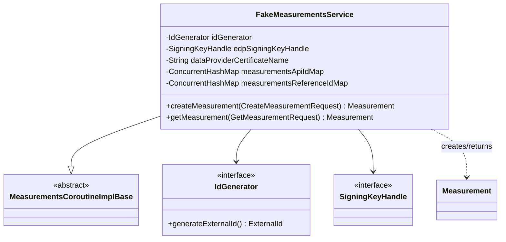

# org.wfanet.measurement.kingdom.service.api.v2alpha.testing

## Overview
This package provides test doubles and fake implementations for the Kingdom API v2alpha Measurements service. The primary component is a fake gRPC service implementation that simulates measurement creation and retrieval with in-memory storage, enabling integration testing without dependencies on real Kingdom backends.

## Components

### FakeMeasurementsService
In-memory gRPC service implementation for testing Measurements API interactions. Extends `MeasurementsCoroutineImplBase` to provide fake implementations of measurement lifecycle operations with concurrent-safe storage.

| Method | Parameters | Returns | Description |
|--------|------------|---------|-------------|
| createMeasurement | `request: CreateMeasurementRequest` | `Measurement` | Creates measurement with generated ID or returns existing by reference ID |
| getMeasurement | `request: GetMeasurementRequest` | `Measurement` | Retrieves measurement by key and returns with fake encrypted results |

**Constructor Parameters:**
| Parameter | Type | Description |
|-----------|------|-------------|
| idGenerator | `IdGenerator` | Generates unique external IDs for new measurements |
| edpSigningKeyHandle | `SigningKeyHandle` | Signs measurement results as EDP |
| dataProviderCertificateName | `String` | Certificate name for result outputs |

**Internal State:**
- `measurementsApiIdMap`: `ConcurrentHashMap<String, Measurement>` - Maps API IDs to measurements
- `measurementsReferenceIdMap`: `ConcurrentHashMap<String, Measurement>` - Maps reference IDs to measurements

## Key Functionality

### Measurement Creation
- Generates unique external IDs for new measurements
- Deduplicates by `measurementReferenceId` - returns existing measurement if reference ID matches
- Extracts measurement consumer ID from certificate resource name
- Sets initial state to `AWAITING_REQUISITION_FULFILLMENT`
- Stores measurement in both API ID and reference ID maps

### Measurement Retrieval with Fake Results
- Validates measurement key and retrieves from storage
- Generates fake results based on measurement type:
  - **Impression**: Returns value of 100
  - **Duration**: Returns 100 seconds watch duration
  - **Population**: Returns value of 100
  - **Reach/ReachAndFrequency**: Throws UNIMPLEMENTED exception
- Signs results using EDP signing key
- Encrypts signed results with measurement public key
- Returns measurement in SUCCEEDED state with encrypted result output

### Error Handling
- Returns `NOT_FOUND` status when measurement doesn't exist
- Returns `INVALID_ARGUMENT` when measurement type not set
- Validates resource names are properly formatted

## Dependencies

### gRPC and Protobuf
- `org.wfanet.measurement.api.v2alpha` - V2Alpha API protocol buffers (Measurement, MeasurementSpec, requests)
- `io.grpc` - gRPC status codes and service base implementation

### Kingdom Domain
- `org.wfanet.measurement.common.identity.IdGenerator` - External ID generation for measurements
- `org.wfanet.measurement.common.crypto.SigningKeyHandle` - Cryptographic signing operations
- `org.wfanet.measurement.common.grpc` - gRPC utilities (failGrpc, grpcRequireNotNull)

### Consent Signaling
- `org.wfanet.measurement.consent.client.duchy` - Result encryption and signing utilities

### Standard Libraries
- `java.util.concurrent.ConcurrentHashMap` - Thread-safe in-memory storage
- `com.google.protobuf` - Protobuf utilities (duration, unpack)

## Usage Example

```kotlin
import org.wfanet.measurement.common.identity.RandomIdGenerator
import org.wfanet.measurement.common.crypto.SigningKeyHandle
import org.wfanet.measurement.api.v2alpha.createMeasurementRequest
import org.wfanet.measurement.api.v2alpha.measurement

// Initialize fake service for testing
val idGenerator = RandomIdGenerator()
val signingKey: SigningKeyHandle = loadTestSigningKey()
val fakeMeasurementsService = FakeMeasurementsService(
  idGenerator = idGenerator,
  edpSigningKeyHandle = signingKey,
  dataProviderCertificateName = "dataProviders/123/certificates/456"
)

// Create a measurement
val createRequest = createMeasurementRequest {
  parent = "measurementConsumers/AAA"
  measurement = measurement {
    measurementConsumerCertificate = "measurementConsumers/AAA/certificates/BBB"
    measurementReferenceId = "test-ref-123"
    // ... other measurement fields
  }
}
val created = fakeMeasurementsService.createMeasurement(createRequest)

// Retrieve with fake results
val getRequest = getMeasurementRequest {
  name = created.name
}
val withResults = fakeMeasurementsService.getMeasurement(getRequest)
// withResults.state == SUCCEEDED
// withResults.results contains encrypted fake data
```

## Class Diagram



## Testing Scenarios

This fake service supports testing:

1. **Measurement Creation Flow**: Verify measurement creation with proper ID generation and state initialization
2. **Reference ID Deduplication**: Test that duplicate reference IDs return the same measurement
3. **Measurement Type Handling**: Validate different measurement types produce appropriate fake results
4. **Result Encryption**: Confirm results are properly signed and encrypted before return
5. **Error Conditions**: Test NOT_FOUND and INVALID_ARGUMENT scenarios
6. **Concurrent Access**: Thread-safe operations via ConcurrentHashMap backing stores

## Limitations

- **No Persistence**: All data stored in-memory, lost when service terminates
- **Limited Measurement Types**: Reach and ReachAndFrequency throw UNIMPLEMENTED
- **Hardcoded Result Values**: All fake results return fixed values (100 for impressions/population, 100 seconds for duration)
- **No List/Stream Operations**: Only implements create and get, not list, batch, or streaming endpoints
- **Simplified State Machine**: Measurements jump directly from AWAITING_REQUISITION_FULFILLMENT to SUCCEEDED
- **Single Result Output**: Returns only one result output per measurement, real service may return multiple
