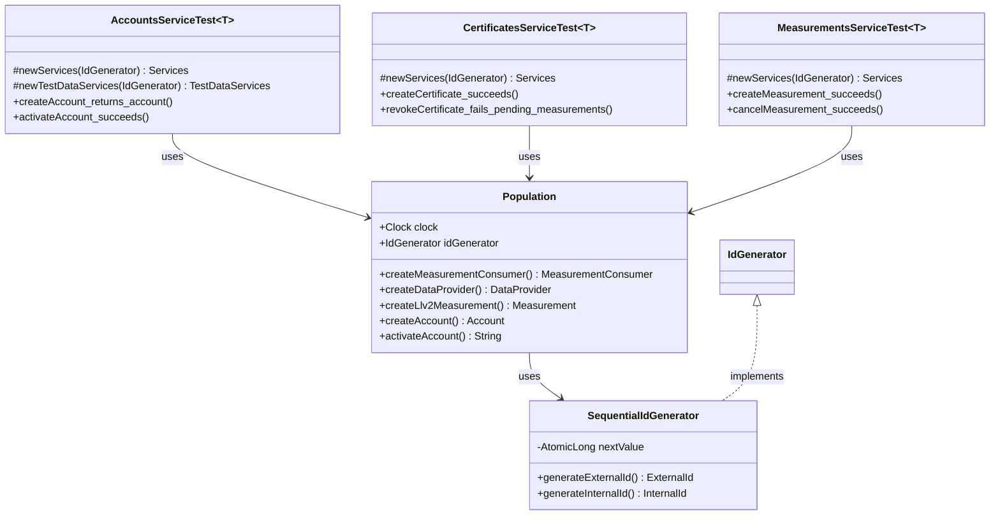

# org.wfanet.measurement.kingdom.service.internal.testing

## Overview
This package provides a comprehensive testing framework for Kingdom internal services in the Cross-Media Measurement system. It contains abstract test suites, test data population utilities, assertion helpers, and ID generation tools that enable consistent and reusable testing across different storage backend implementations (e.g., Spanner, Postgres).

## Core Components

### Population
Test data factory for creating Kingdom entities with realistic relationships.

| Method | Parameters | Returns | Description |
|--------|------------|---------|-------------|
| createMeasurementConsumer | `measurementConsumersService: MeasurementConsumersCoroutineImplBase`, `accountsService: AccountsCoroutineImplBase`, `notValidBefore: Instant`, `notValidAfter: Instant` | `MeasurementConsumer` | Creates measurement consumer with certificate and account |
| createDataProvider | `dataProvidersService: DataProvidersCoroutineImplBase`, `requiredDuchiesList: List<String>`, `notValidBefore: Instant`, `notValidAfter: Instant`, `customize: (DataProviderKt.Dsl.() -> Unit)?` | `DataProvider` | Creates data provider with optional customization |
| createModelProvider | `modelProvidersService: ModelProvidersCoroutineImplBase` | `ModelProvider` | Creates model provider entity |
| createModelSuite | `modelSuitesService: ModelSuitesCoroutineImplBase`, `modelProvider: ModelProvider` | `ModelSuite` | Creates model suite under provider |
| createModelLine | `modelLinesService: ModelLinesCoroutineImplBase`, `modelSuite: ModelSuite`, `modelLineType: ModelLine.Type`, `holdbackModelLine: ModelLine?`, `activeInterval: Interval` | `ModelLine` | Creates model line with optional holdback |
| createModelRelease | `modelSuite: ModelSuite`, `population: Population`, `modelReleasesService: ModelReleasesCoroutineImplBase` | `ModelRelease` | Creates model release linking suite and population |
| createPopulation | `dataProvider: DataProvider`, `populationsService: PopulationsCoroutineImplBase`, `populationSpec: PopulationDetails.PopulationSpec` | `Population` | Creates population with VID ranges |
| createLlv2Measurement | `measurementsService: MeasurementsCoroutineImplBase`, `measurementConsumer: MeasurementConsumer`, `providedMeasurementId: String`, `vararg dataProviders: DataProvider` | `Measurement` | Creates Liquid Legions v2 measurement |
| createHmssMeasurement | `measurementsService: MeasurementsCoroutineImplBase`, `measurementConsumer: MeasurementConsumer`, `providedMeasurementId: String`, `vararg dataProviders: DataProvider` | `Measurement` | Creates Honest Majority Share Shuffle measurement |
| createTrusTeeMeasurement | `measurementsService: MeasurementsCoroutineImplBase`, `measurementConsumer: MeasurementConsumer`, `providedMeasurementId: String`, `vararg dataProviders: DataProvider` | `Measurement` | Creates TrusTee protocol measurement |
| createDirectMeasurement | `measurementsService: MeasurementsCoroutineImplBase`, `measurementConsumer: MeasurementConsumer`, `providedMeasurementId: String`, `vararg dataProviders: DataProvider` | `Measurement` | Creates direct measurement without MPC |
| createDuchyCertificate | `certificatesService: CertificatesCoroutineImplBase`, `externalDuchyId: String`, `notValidBefore: Instant`, `notValidAfter: Instant` | `Certificate` | Creates duchy certificate with validity period |
| createMeasurementConsumerCertificate | `certificatesService: CertificatesCoroutineImplBase`, `parent: MeasurementConsumer`, `notValidBefore: Instant`, `notValidAfter: Instant` | `Certificate` | Creates certificate for measurement consumer |
| createDataProviderCertificate | `certificatesService: CertificatesCoroutineImplBase`, `parent: DataProvider`, `notValidBefore: Instant`, `notValidAfter: Instant` | `Certificate` | Creates certificate for data provider |
| createAccount | `accountsService: AccountsCoroutineImplBase`, `externalCreatorAccountId: Long`, `externalOwnedMeasurementConsumerId: Long` | `Account` | Creates account with optional ownership |
| activateAccount | `accountsService: AccountsCoroutineImplBase`, `account: Account` | `String` | Activates account using self-issued ID token |
| parseIdToken | `idToken: String`, `redirectUri: String` | `Account.OpenIdConnectIdentity` | Parses and validates OpenID Connect ID token |
| createMeasurementConsumerCreationToken | `accountsService: AccountsCoroutineImplBase` | `Long` | Creates token for measurement consumer creation |

### SequentialIdGenerator
Test ID generator producing sequential identifiers starting from configurable value.

| Method | Parameters | Returns | Description |
|--------|------------|---------|-------------|
| generateExternalId | - | `ExternalId` | Generates sequential external ID |
| generateInternalId | - | `InternalId` | Generates sequential internal ID |

### Assertion
Exchange and exchange step state assertion utilities.

| Method | Parameters | Returns | Description |
|--------|------------|---------|-------------|
| assertTestExchangeHasState | `exchangeState: Exchange.State` | `Unit` | Verifies exchange has expected state |
| assertTestExchangeStepHasState | `exchangeStepState: ExchangeStep.State`, `exchangeStepIndex: Int` | `Unit` | Verifies exchange step has expected state |

### Extension Functions

| Function | Parameters | Returns | Description |
|----------|------------|---------|-------------|
| DataProvider.toDataProviderValue | `nonce: Long` | `dataProviderValue` | Converts DataProvider to measurement value |

## Abstract Test Suites

### AccountsServiceTest
Validates account creation, activation, identity management, and authentication flows.

### ApiKeysServiceTest
Tests API key creation, deletion, and authentication for measurement consumers.

### CertificatesServiceTest
Comprehensive certificate lifecycle testing including creation, retrieval, streaming, revocation, and hold release for all entity types (Duchy, DataProvider, MeasurementConsumer, ModelProvider).

### DataProvidersServiceTest
Tests data provider CRUD operations, capability management, and required duchy configuration.

### MeasurementsServiceTest
Tests measurement creation, cancellation, state transitions, result setting, and batch operations for all protocol types.

### PopulationsServiceTest
Tests population creation, retrieval, and streaming with VID range specifications.

### ComputationParticipantsServiceTest
Tests duchy participation in computations and requisition parameter setting.

### EventGroupsServiceTest
Tests event group lifecycle and metadata management.

### EventGroupMetadataDescriptorsServiceTest
Tests metadata descriptor management for event groups.

### EventGroupActivitiesServiceTest
Tests event group activity tracking.

### ExchangesServiceTest
Tests recurring exchange creation and state management.

### ExchangeStepsServiceTest
Tests exchange workflow step execution and transitions.

### ExchangeStepAttemptsServiceTest
Tests retry logic for exchange step execution.

### MeasurementConsumersServiceTest
Tests measurement consumer registration and management.

### MeasurementLogEntriesServiceTest
Tests logging of measurement state transitions and duchy operations.

### ModelLinesServiceTest
Tests model line creation with active intervals and holdback configurations.

### ModelOutagesServiceTest
Tests model outage tracking and management.

### ModelProvidersServiceTest
Tests model provider registration.

### ModelReleasesServiceTest
Tests model release creation linking suites to populations.

### ModelRolloutsServiceTest
Tests gradual model deployment strategies.

### ModelShardsServiceTest
Tests model distribution across populations.

### ModelSuitesServiceTest
Tests model suite creation and management.

### PublicKeysServiceTest
Tests public key registration for cryptographic operations.

### RecurringExchangesServiceTest
Tests recurring exchange schedule configuration.

### RequisitionsServiceTest
Tests requisition state transitions, fulfillment, and refusal flows.

## Data Structures

### Population.Companion
| Property | Type | Description |
|----------|------|-------------|
| AGGREGATOR_DUCHY | `DuchyIds.Entry` | Aggregator duchy configuration for tests |
| WORKER1_DUCHY | `DuchyIds.Entry` | First worker duchy configuration |
| WORKER2_DUCHY | `DuchyIds.Entry` | Second worker duchy configuration |
| DUCHIES | `List<DuchyIds.Entry>` | Complete list of test duchies |
| DEFAULT_POPULATION_SPEC | `PopulationSpec` | Default population with VID range 1-10,000 |

### Test Data Services Pattern
Each test suite defines a `Services` data class containing all required service stubs:

```kotlin
data class Services<T>(
  val primaryService: T,
  val dependencyService1: ServiceType1,
  val dependencyService2: ServiceType2,
  // ...
)
```

## Dependencies
- `org.wfanet.measurement.internal.kingdom` - Kingdom internal protocol buffers
- `org.wfanet.measurement.common.identity` - ID generation abstractions
- `org.wfanet.measurement.common.crypto` - Cryptographic utilities for hashing and token generation
- `org.wfanet.measurement.common.openid` - OpenID Connect support
- `org.wfanet.measurement.kingdom.deploy.common` - Protocol configuration
- `com.google.common.truth` - Assertion library with protobuf support
- `io.grpc` - gRPC framework for service testing
- `kotlinx.coroutines` - Coroutine support for async testing
- `org.junit` - JUnit 4 testing framework

## Usage Example

```kotlin
class SpannerCertificatesServiceTest : CertificatesServiceTest<SpannerCertificatesService>() {

  private val clock = Clock.systemUTC()
  private val idGenerator = RandomIdGenerator(clock)
  private val population = Population(clock, idGenerator)

  override fun newServices(idGenerator: IdGenerator): Services<SpannerCertificatesService> {
    return Services(
      certificatesService = SpannerCertificatesService(database, idGenerator),
      measurementConsumersService = SpannerMeasurementConsumersService(database, idGenerator),
      dataProvidersService = SpannerDataProvidersService(database, idGenerator),
      // ... other services
    )
  }

  @Test
  fun customTest() = runBlocking {
    val measurementConsumer = population.createMeasurementConsumer(
      measurementConsumersService,
      accountsService
    )
    val certificate = population.createMeasurementConsumerCertificate(
      certificatesService,
      measurementConsumer
    )
    // Assertions...
  }
}
```

## Class Diagram



## Testing Patterns

### Abstract Test Class Pattern
All test suites are abstract classes with type parameter `T` representing the service under test. Concrete implementations provide storage-specific service instances via `newServices()`.

### Population-Based Test Data
The `Population` class centralizes test data creation with:
- Realistic entity relationships
- Configurable validity periods
- Support for all protocol types
- Automatic ID generation

### Assertion Helpers
Package provides domain-specific assertion functions for:
- Exchange state verification
- Certificate validation
- Measurement state transitions
- Protobuf field filtering

### Service Dependency Injection
Tests declare dependencies in `Services` data classes, enabling:
- Clear dependency visibility
- Easy mock injection
- Consistent service initialization

## Notes
- All test classes use JUnit 4 framework
- Tests extensively use `runBlocking` for coroutine execution
- Truth assertions provide readable error messages
- Field scope filtering excludes non-deterministic fields (timestamps, generated IDs)
- Tests validate both success paths and error conditions
- Certificate tests verify measurement failure on revocation
- Account tests validate OpenID Connect self-issued ID tokens
