# org.wfanet.measurement.kingdom.service.system.v1alpha

## Overview
This package provides gRPC service implementations that expose the Kingdom's system API (v1alpha) to Duchies for managing computations, requisitions, and participants. These services act as a translation layer between the external system API and the internal Kingdom storage services, handling authentication, authorization, and data conversion.

## Components

### ComputationLogEntriesService
Manages computation log entries created by Duchies to track computation progress and errors.

| Method | Parameters | Returns | Description |
|--------|------------|---------|-------------|
| createComputationLogEntry | `request: CreateComputationLogEntryRequest` | `ComputationLogEntry` | Creates a duchy measurement log entry with error details and stage information |

**Constructor Parameters:**
- `measurementLogEntriesService: MeasurementLogEntriesCoroutineStub` - Internal service for log storage
- `coroutineContext: CoroutineContext` - Coroutine execution context (default: EmptyCoroutineContext)
- `duchyIdentityProvider: () -> DuchyIdentity` - Provider for authenticated duchy identity

### ComputationsService
Primary service for Duchies to retrieve and update computation state.

| Method | Parameters | Returns | Description |
|--------|------------|---------|-------------|
| getComputation | `request: GetComputationRequest` | `Computation` | Retrieves a single computation by ID |
| streamActiveComputations | `request: StreamActiveComputationsRequest` | `Flow<StreamActiveComputationsResponse>` | Continuously streams active computations for a duchy with polling |
| setComputationResult | `request: SetComputationResultRequest` | `Computation` | Sets encrypted computation result with aggregator certificate |

**Constructor Parameters:**
- `measurementsClient: MeasurementsCoroutineStub` - Internal measurements service client
- `coroutineContext: CoroutineContext` - Coroutine execution context (default: EmptyCoroutineContext)
- `duchyIdentityProvider: () -> DuchyIdentity` - Provider for authenticated duchy identity
- `streamingTimeout: Duration` - Maximum duration for streaming (default: 10 minutes)
- `streamingThrottle: Duration` - Delay between polling requests (default: 1 second)
- `streamingLimit: Int` - Maximum items per stream batch (default: 50)

**Key Features:**
- Implements continuation token-based streaming with automatic pagination
- Filters measurements by duchy identity and state
- Converts between internal and system API representations

### RequisitionsService
Handles requisition fulfillment operations for Duchies.

| Method | Parameters | Returns | Description |
|--------|------------|---------|-------------|
| fulfillRequisition | `request: FulfillRequisitionRequest` | `Requisition` | Fulfills a requisition with nonce and optional context |

**Constructor Parameters:**
- `internalRequisitionsClient: InternalRequisitionsCoroutineStub` - Internal requisitions service client
- `coroutineContext: CoroutineContext` - Coroutine execution context (default: EmptyCoroutineContext)
- `duchyIdentityProvider: () -> DuchyIdentity` - Provider for authenticated duchy identity

### ComputationParticipantsService
Manages computation participant lifecycle and requisition parameters.

| Method | Parameters | Returns | Description |
|--------|------------|---------|-------------|
| getComputationParticipant | `request: GetComputationParticipantRequest` | `ComputationParticipant` | Retrieves participant information by computation and duchy |
| setParticipantRequisitionParams | `request: SetParticipantRequisitionParamsRequest` | `ComputationParticipant` | Sets cryptographic parameters for requisitions |
| confirmComputationParticipant | `request: ConfirmComputationParticipantRequest` | `ComputationParticipant` | Confirms participant readiness for computation |
| failComputationParticipant | `request: FailComputationParticipantRequest` | `ComputationParticipant` | Marks participant as failed with error details |

**Constructor Parameters:**
- `internalComputationParticipantsClient: InternalComputationParticipantsCoroutineStub` - Internal participants service client
- `coroutineContext: CoroutineContext` - Coroutine execution context (default: EmptyCoroutineContext)
- `duchyIdentityProvider: () -> DuchyIdentity` - Provider for authenticated duchy identity

**Key Features:**
- Validates duchy ownership of participants and certificates
- Supports multiple MPC protocols: Liquid Legions V2, HMSS, TrusTEE
- Handles protocol-specific cryptographic parameters

### ProtoConversions (Extension Functions)

Collection of conversion functions between internal Kingdom proto models and system API models.

| Function | Parameters | Returns | Description |
|----------|------------|---------|-------------|
| toSystemRequisition | `InternalRequisition` | `Requisition` | Converts internal requisition to system API format |
| toSystemComputationParticipant | `InternalComputationParticipant` | `ComputationParticipant` | Converts internal participant to system API format |
| toSystemComputation | `InternalMeasurement` | `Computation` | Converts internal measurement to system computation |
| toSystemRequisitionState | `InternalRequisition.State` | `Requisition.State` | Converts requisition state enumeration |
| toSystemComputationState | `InternalMeasurement.State` | `Computation.State` | Converts measurement state enumeration |
| toSystemStageAttempt | `InternalStageAttempt` | `StageAttempt` | Converts stage attempt details |
| toInternalStageAttempt | `StageAttempt` | `InternalStageAttempt` | Converts system stage attempt to internal format |
| toSystemDifferentialPrivacyParams | `InternalDifferentialPrivacyParams` | `DifferentialPrivacyParams` | Converts differential privacy parameters |
| toSystemLogErrorDetails | `MeasurementLogEntryError` | `ComputationLogEntry.ErrorDetails` | Converts error details to system format |
| toInternalLogErrorDetails | `ComputationLogEntry.ErrorDetails` | `MeasurementLogEntryError` | Converts system error details to internal format |
| toSystemComputationLogEntry | `DuchyMeasurementLogEntry`, `apiComputationId: String` | `ComputationLogEntry` | Converts duchy log entry to system format |
| toSystemNoiseMechanism | `InternalNoiseMechanism` | `NoiseMechanism` | Converts noise mechanism enumeration |

**Protocol Support:**
- Liquid Legions V2 (frequency estimation with ElGamal encryption)
- Reach-Only Liquid Legions V2 (reach measurement variant)
- Honest Majority Share Shuffle (HMSS with Tink public keys)
- TrusTEE (trusted execution environment)

## Data Structures

### ContinuationTokenConverter
Internal object for encoding/decoding streaming continuation tokens.

| Method | Parameters | Returns | Description |
|--------|------------|---------|-------------|
| encode | `token: StreamActiveComputationsContinuationToken` | `String` | Base64-URL encodes token to string |
| decode | `token: String` | `StreamActiveComputationsContinuationToken` | Decodes base64-URL string to token |

## Dependencies

- `org.wfanet.measurement.internal.kingdom` - Internal Kingdom service stubs and proto models
- `org.wfanet.measurement.system.v1alpha` - System API v1alpha proto definitions
- `org.wfanet.measurement.common.grpc` - gRPC utilities for validation and error handling
- `org.wfanet.measurement.common.identity` - Duchy identity and API ID conversion utilities
- `org.wfanet.measurement.common.crypto` - Cryptographic hashing (SHA-256)
- `org.wfanet.measurement.api.v2alpha` - Certificate key definitions from public API v2alpha
- `io.grpc` - gRPC status and exception handling
- `kotlinx.coroutines` - Coroutine flows and context management

## Usage Example

```kotlin
// Initialize service with internal client
val computationsService = ComputationsService(
  measurementsClient = measurementsStub,
  duchyIdentityProvider = { DuchyIdentity("worker1") }
)

// Get a specific computation
val computation = computationsService.getComputation(
  GetComputationRequest.newBuilder()
    .setName(ComputationKey("computation-123").toName())
    .build()
)

// Stream active computations
computationsService.streamActiveComputations(
  StreamActiveComputationsRequest.getDefaultInstance()
).collect { response ->
  println("Computation: ${response.computation.name}")
  println("State: ${response.computation.state}")
}

// Set computation result
val result = computationsService.setComputationResult(
  SetComputationResultRequest.newBuilder()
    .setName(ComputationKey("computation-123").toName())
    .setPublicApiVersion("v2alpha")
    .setAggregatorCertificate(certKey.toName())
    .setEncryptedResult(encryptedBytes)
    .build()
)
```

## Class Diagram

```mermaid
classDiagram
    class ComputationsService {
        +getComputation(request) Computation
        +streamActiveComputations(request) Flow~StreamActiveComputationsResponse~
        +setComputationResult(request) Computation
        -streamMeasurements(token) Flow~Measurement~
    }
    class ComputationParticipantsService {
        +getComputationParticipant(request) ComputationParticipant
        +setParticipantRequisitionParams(request) ComputationParticipant
        +confirmComputationParticipant(request) ComputationParticipant
        +failComputationParticipant(request) ComputationParticipant
        -getAndVerifyComputationParticipantKey(name) ComputationParticipantKey
    }
    class RequisitionsService {
        +fulfillRequisition(request) Requisition
    }
    class ComputationLogEntriesService {
        +createComputationLogEntry(request) ComputationLogEntry
    }

    ComputationsService --> MeasurementsCoroutineStub
    ComputationParticipantsService --> InternalComputationParticipantsCoroutineStub
    RequisitionsService --> InternalRequisitionsCoroutineStub
    ComputationLogEntriesService --> MeasurementLogEntriesCoroutineStub

    ComputationsService ..> ProtoConversions
    ComputationParticipantsService ..> ProtoConversions
    RequisitionsService ..> ProtoConversions
    ComputationLogEntriesService ..> ProtoConversions
```


