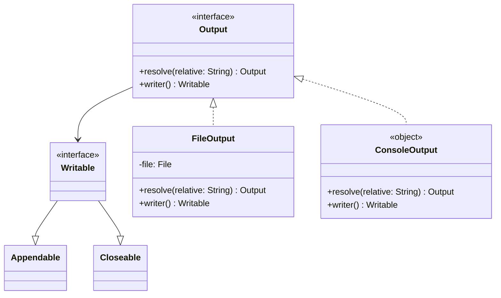

# org.wfanet.measurement.loadtest.common

## Overview
Common utilities for load testing in the Cross-Media Measurement system. Provides abstractions for file and console output operations, and VID (Virtual ID) sampling functionality for event data filtering during load tests.

## Components

### Output
Sealed interface providing unified abstraction for outputting data to files or console.

| Method | Parameters | Returns | Description |
|--------|------------|---------|-------------|
| resolve | `relative: String` | `Output` | Resolves a relative path to create new Output |
| writer | - | `Writable` | Creates a writable destination for output |

### Writable
Interface combining appendable and closeable behavior for writing operations.

**Extends:** `Appendable`, `Closeable`

### FileOutput
Output implementation that writes data to a file system destination.

| Method | Parameters | Returns | Description |
|--------|------------|---------|-------------|
| FileOutput (constructor) | `file: File` | - | Creates file-based output for specified file |
| resolve | `relative: String` | `Output` | Resolves relative path against parent file |
| writer | - | `Writable` | Creates buffered writer for the file |

### ConsoleOutput
Output implementation that writes data to standard output (STDOUT).

| Method | Parameters | Returns | Description |
|--------|------------|---------|-------------|
| resolve | `relative: String` | `Output` | Prints relative path label to console |
| writer | - | `Writable` | Creates writable wrapper around System.out |

## Functions

### sampleVids
Filters virtual IDs from event groups based on sampling interval parameters.

| Parameter | Type | Description |
|-----------|------|-------------|
| eventQuery | `EventQuery<Message>` | Query interface for retrieving event data |
| eventGroupSpecs | `Iterable<EventQuery.EventGroupSpec>` | Specifications of event groups to query |
| vidSamplingIntervalStart | `Float` | Start of sampling interval [0, 1) |
| vidSamplingIntervalWidth | `Float` | Width of sampling interval (0, 1] |

**Returns:** `Iterable<Long>` - Filtered virtual IDs within sampling bucket

**Validation:**
- `vidSamplingIntervalStart` must be in range [0, 1)
- `vidSamplingIntervalWidth` must be in range (0, 1]
- Throws `IllegalArgumentException` if constraints violated

## Dependencies
- `org.wfanet.measurement.loadtest.config.VidSampling` - Provides VID sampling algorithm
- `org.wfanet.measurement.loadtest.dataprovider.EventQuery` - Event data query interface
- `java.io.File` - File system operations
- `com.google.protobuf.Message` - Protocol buffer message type

## Usage Example
```kotlin
// File output
val fileOutput = FileOutput(File("/path/to/output.txt"))
fileOutput.writer().use { writer ->
    writer.append("Load test results\n")
}

// Console output
val consoleOutput = ConsoleOutput
consoleOutput.resolve("Results")
consoleOutput.writer().use { writer ->
    writer.append("Metrics: 100ms avg latency\n")
}

// VID sampling
val vids = sampleVids(
    eventQuery = myEventQuery,
    eventGroupSpecs = listOf(eventGroupSpec),
    vidSamplingIntervalStart = 0.0f,
    vidSamplingIntervalWidth = 0.1f
)
```

## Class Diagram

