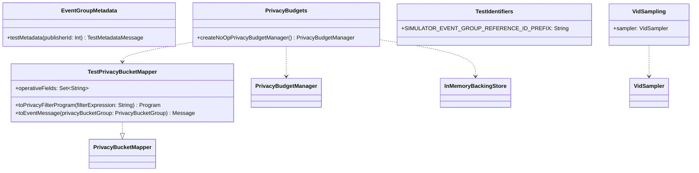

# org.wfanet.measurement.loadtest.config

## Overview
Configuration utilities and helpers for load testing the Cross-Media Measurement system. This package provides test-specific implementations for event group metadata, privacy budget management, test identifiers, and VID sampling functionality used during load testing scenarios.

## Components

### EventGroupMetadata
Singleton object providing factory methods for creating test EventGroup metadata.

| Method | Parameters | Returns | Description |
|--------|------------|---------|-------------|
| testMetadata | `publisherId: Int` | `TestMetadataMessage` | Creates test metadata message for specified publisher |

### PrivacyBudgets
Singleton object for creating no-op privacy budget managers for testing.

| Method | Parameters | Returns | Description |
|--------|------------|---------|-------------|
| createNoOpPrivacyBudgetManager | - | `PrivacyBudgetManager` | Builds manager with in-memory backing store |

### TestPrivacyBucketMapper
Privacy bucket mapper implementation that does not charge any privacy buckets during testing.

| Method | Parameters | Returns | Description |
|--------|------------|---------|-------------|
| toPrivacyFilterProgram | `filterExpression: String` | `Program` | Compiles CEL program that filters non-filterable events |
| toEventMessage | `privacyBucketGroup: PrivacyBucketGroup` | `Message` | Converts bucket group to non-filterable event message |

**Properties:**
- `operativeFields`: Set of field paths used in privacy filtering (`privacy.filterable`)

### TestIdentifiers
Singleton object containing constant identifiers used in load testing.

| Constant | Type | Value | Description |
|----------|------|-------|-------------|
| SIMULATOR_EVENT_GROUP_REFERENCE_ID_PREFIX | `String` | `"sim-eg"` | Prefix for simulator-created EventGroup IDs |

### VidSampling
Singleton object providing VID sampling functionality for load tests.

| Property | Type | Description |
|----------|------|-------------|
| sampler | `VidSampler` | VID sampler using FarmHash fingerprint64 algorithm |

## Dependencies
- `org.wfanet.measurement.api.v2alpha.event_group_metadata.testing` - Test metadata message builders
- `org.wfanet.measurement.eventdataprovider.eventfiltration` - CEL event filtering and compilation
- `org.wfanet.measurement.eventdataprovider.privacybudgetmanagement` - Privacy budget management components
- `org.projectnessie.cel` - Common Expression Language program execution
- `org.wfanet.sampling` - VID sampling utilities
- `com.google.common.hash` - Hashing functions for sampling
- `com.google.protobuf` - Protocol buffer message handling

## Usage Example
```kotlin
// Create test metadata for a publisher
val metadata = EventGroupMetadata.testMetadata(publisherId = 123)

// Create a no-op privacy budget manager for testing
val budgetManager = PrivacyBudgets.createNoOpPrivacyBudgetManager()

// Use VID sampler
val vid = "sample-vid"
val samplingRate = 0.5
val isSampled = VidSampling.sampler.isSampled(vid, samplingRate)

// Reference test EventGroup IDs
val eventGroupId = "${TestIdentifiers.SIMULATOR_EVENT_GROUP_REFERENCE_ID_PREFIX}-001"
```

## Class Diagram

