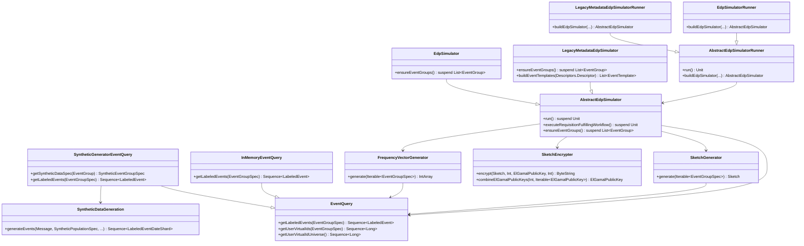

# org.wfanet.measurement.loadtest.dataprovider

## Overview
This package provides a comprehensive EDP (Event Data Provider) simulation framework for load testing the Cross-Media Measurement system. It generates synthetic event data, fulfills measurement requisitions using multiple cryptographic protocols (Liquid Legions V2, Reach-Only LL V2, Honest Majority Share Shuffle, TrusTEE), and manages privacy budgets for differential privacy guarantees.

## Components

### AbstractEdpSimulator
Core simulator handling EDP business logic for requisition fulfillment across multiple protocols.

| Method | Parameters | Returns | Description |
|--------|------------|---------|-------------|
| run | - | `suspend Unit` | Executes simulator sequence: updates provider, ensures event groups, polls requisitions |
| executeRequisitionFulfillingWorkflow | - | `suspend Unit` | Fetches unfulfilled requisitions and processes them |
| ensureEventGroups | - | `suspend List<EventGroup>` | Ensures appropriate EventGroups exist for configured options |
| buildEventGroupSpecs | `requisitionSpec: RequisitionSpec` | `suspend List<EventQuery.EventGroupSpec>` | Builds EventGroupSpecs from requisition by fetching EventGroups |

### EdpSimulator
Standard EDP simulator implementation with EventGroup metadata support.

| Method | Parameters | Returns | Description |
|--------|------------|---------|-------------|
| ensureEventGroups | - | `suspend List<EventGroup>` | Creates or updates EventGroups with media types and metadata |

### LegacyMetadataEdpSimulator
EDP simulator using legacy encrypted metadata on EventGroups.

| Method | Parameters | Returns | Description |
|--------|------------|---------|-------------|
| ensureEventGroups | - | `suspend List<EventGroup>` | Creates EventGroups with encrypted metadata descriptors |
| buildEventTemplates | `eventMessageDescriptor: Descriptors.Descriptor` | `List<EventGroup.EventTemplate>` | Builds EventTemplate messages from event message descriptor |

### EventQuery
Interface for querying user virtual IDs for requisitions with event filtering support.

| Method | Parameters | Returns | Description |
|--------|------------|---------|-------------|
| getLabeledEvents | `eventGroupSpec: EventGroupSpec` | `Sequence<LabeledEvent<T>>` | Returns sequence of labeled events matching the spec |
| getUserVirtualIds | `eventGroupSpec: EventGroupSpec` | `Sequence<Long>` | Returns VIDs for matching events (may repeat) |
| getUserVirtualIdUniverse | - | `Sequence<Long>` | Returns complete VID universe represented |
| compileProgram | `eventFilter: EventFilter, eventMessageDescriptor: Descriptors.Descriptor` | `Program` | Compiles CEL program from event filter expression |

### InMemoryEventQuery
In-memory event query implementation using preloaded test events.

| Method | Parameters | Returns | Description |
|--------|------------|---------|-------------|
| getLabeledEvents | `eventGroupSpec: EventGroupSpec` | `Sequence<LabeledTestEvent>` | Filters events by time range and CEL expression |
| getUserVirtualIdUniverse | - | `Sequence<Long>` | Returns VID range from 1 to maxVidValue |

### SyntheticGeneratorEventQuery
Abstract EventQuery using synthetic data generation from population specs.

| Method | Parameters | Returns | Description |
|--------|------------|---------|-------------|
| getSyntheticDataSpec | `eventGroup: EventGroup` | `SyntheticEventGroupSpec` | Returns synthetic data spec for event group |
| getLabeledEvents | `eventGroupSpec: EventGroupSpec` | `Sequence<LabeledEvent<DynamicMessage>>` | Generates synthetic events filtered by spec |
| getUserVirtualIdUniverse | - | `Sequence<Long>` | Returns VID universe from population spec |

### SyntheticDataGeneration
Object providing deterministic synthetic event generation from specifications.

| Method | Parameters | Returns | Description |
|--------|------------|---------|-------------|
| generateEvents | `messageInstance: T, populationSpec: SyntheticPopulationSpec, syntheticEventGroupSpec: SyntheticEventGroupSpec, timeRange: OpenEndTimeRange, zoneId: ZoneId` | `Sequence<LabeledEventDateShard<T>>` | Generates events deterministically across date period |

### SketchGenerator
Generates cryptographic sketches from event queries using AnySketch library.

| Method | Parameters | Returns | Description |
|--------|------------|---------|-------------|
| generate | `eventGroupSpecs: Iterable<EventGroupSpec>` | `Sketch` | Generates sketch for specified event groups |

### SketchEncrypter
Interface for encrypting sketches with ElGamal public keys.

| Method | Parameters | Returns | Description |
|--------|------------|---------|-------------|
| encrypt | `sketch: Sketch, ellipticCurveId: Int, encryptionKey: ElGamalPublicKey, maximumValue: Int` | `ByteString` | Encrypts sketch with maximum frequency value |
| encrypt | `sketch: Sketch, ellipticCurveId: Int, encryptionKey: ElGamalPublicKey` | `ByteString` | Encrypts sketch without maximum value |
| combineElGamalPublicKeys | `ellipticCurveId: Int, keys: Iterable<ElGamalPublicKey>` | `ElGamalPublicKey` | Combines multiple ElGamal public keys into one |

### FrequencyVectorGenerator
Generates frequency vectors for Honest Majority Share Shuffle protocol.

| Method | Parameters | Returns | Description |
|--------|------------|---------|-------------|
| generate | `eventGroupSpecs: Iterable<EventGroupSpec>` | `IntArray` | Generates frequency vector for event groups |

### VidToIndexMapGenerator
Generates deterministic VID-to-index mappings using SHA256 hashing.

| Method | Parameters | Returns | Description |
|--------|------------|---------|-------------|
| generateMapping | `vidUniverse: Sequence<Long>, salt: ByteString` | `Map<Long, IndexedValue>` | Generates VID to (index, normalized hash) map |

### PopulationSpecConverter
Extension functions for converting synthetic population specs.

| Method | Parameters | Returns | Description |
|--------|------------|---------|-------------|
| toPopulationSpecWithoutAttributes | `this: SyntheticPopulationSpec` | `PopulationSpec` | Converts to PopulationSpec without attributes |
| toPopulationSpec | `this: SyntheticPopulationSpec, eventMessageDescriptor: Descriptors.Descriptor` | `PopulationSpec` | Converts to full PopulationSpec with attributes |

### AbstractEdpSimulatorRunner
Base class for EDP simulator command-line runners.

| Method | Parameters | Returns | Description |
|--------|------------|---------|-------------|
| run | - | `Unit` | Initializes channels, builds simulator, runs workflow |
| buildEdpSimulator | `edpDisplayName: String, measurementConsumerName: String, ...` | `AbstractEdpSimulator` | Builds concrete simulator implementation |

### EdpSimulatorRunner
Standard simulator runner with media type support and optional TrusTEE encryption.

| Method | Parameters | Returns | Description |
|--------|------------|---------|-------------|
| buildEdpSimulator | `edpDisplayName: String, measurementConsumerName: String, ...` | `AbstractEdpSimulator` | Builds EdpSimulator with TrusTEE params if configured |

### LegacyMetadataEdpSimulatorRunner
Simulator runner for legacy encrypted metadata on EventGroups.

| Method | Parameters | Returns | Description |
|--------|------------|---------|-------------|
| buildEdpSimulator | `edpDisplayName: String, measurementConsumerName: String, ...` | `AbstractEdpSimulator` | Builds LegacyMetadataEdpSimulator instance |

## Data Structures

### LabeledEvent
| Property | Type | Description |
|----------|------|-------------|
| timestamp | `Instant` | Event timestamp |
| vid | `Long` | Virtual person ID |
| message | `T: Message` | Event message payload |

### LabeledEventDateShard
| Property | Type | Description |
|----------|------|-------------|
| localDate | `LocalDate` | Date for this shard |
| labeledEvents | `Sequence<LabeledEvent<T>>` | Events in this date shard |

### EventQuery.EventGroupSpec
| Property | Type | Description |
|----------|------|-------------|
| eventGroup | `EventGroup` | Dereferenced EventGroup |
| spec | `RequisitionSpec.EventGroupEntry.Value` | Event specification |

### IndexedValue
| Property | Type | Description |
|----------|------|-------------|
| index | `Int` | Bucket index in sorted array |
| value | `Double` | Normalized hash value |

### EdpSimulatorFlags
| Property | Type | Description |
|----------|------|-------------|
| dataProviderResourceName | `String` | Public API resource name of provider |
| dataProviderDisplayName | `String` | Display name of provider |
| mcResourceName | `String` | Measurement consumer resource name |
| populationSpecFile | `File` | Path to SyntheticPopulationSpec |
| syntheticDataTimeZone | `ZoneId` | Timezone for data generation |
| supportHmss | `Boolean` | Whether to support HMSS protocol |
| logSketchDetails | `Boolean` | Whether to log sketch contents |
| randomSeed | `Long?` | Random seed for DP noisers |

## Dependencies
- `org.wfanet.measurement.api.v2alpha` - Kingdom public API protobuf definitions and gRPC stubs
- `org.wfanet.measurement.dataprovider` - Core data provider data structures and requisition fulfillment
- `org.wfanet.measurement.eventdataprovider.privacybudgetmanagement` - Privacy budget management for ACDP
- `org.wfanet.measurement.eventdataprovider.eventfiltration` - CEL-based event filtering and validation
- `org.wfanet.measurement.eventdataprovider.noiser` - Differential privacy noise mechanisms
- `org.wfanet.measurement.eventdataprovider.requisition.v2alpha` - Protocol-specific requisition builders
- `org.wfanet.measurement.consent.client` - Consent signaling verification utilities
- `org.wfanet.measurement.common` - Common utilities for crypto, throttling, health checks
- `org.wfanet.anysketch` - Sketch generation and encryption library
- `org.projectnessie.cel` - Common Expression Language evaluation
- `com.google.protobuf` - Protocol buffers support
- `io.grpc` - gRPC communication framework
- `picocli` - Command-line interface parsing

## Usage Example
```kotlin
// Configure simulator runner
val runner = EdpSimulatorRunner()
runner.apply {
  dataProviderResourceName = "dataProviders/AAAAAAAAAHs"
  dataProviderDisplayName = "edp1"
  mcResourceName = "measurementConsumers/AAAAAAAAAHs"
  populationSpecFile = File("population_spec.textproto")
  syntheticDataTimeZone = ZoneId.of("America/Los_Angeles")
  supportHmss = true
}

// Run simulator (blocking)
runner.run()
```

## Protocol Support

### Liquid Legions V2
- Generates encrypted sketches with frequency histograms
- Supports reach and reach-and-frequency measurements
- Uses discrete Gaussian noise for ACDP composition

### Reach-Only Liquid Legions V2
- Generates encrypted sketches without frequency data
- Optimized for reach-only measurements
- Smaller sketch size and faster processing

### Honest Majority Share Shuffle
- Generates frequency vectors from VID index maps
- Requires exactly 2 duchy entries with 1 encryption key
- Supports reach and reach-and-frequency measurements

### TrusTEE
- Generates frequency vectors with optional KMS encryption
- Single duchy entry required
- Supports reach and reach-and-frequency measurements

### Direct Protocols
- Computes reach, frequency, impression, and duration directly
- Supports continuous Laplace and Gaussian noise mechanisms
- No duchy interaction required

## Class Diagram

