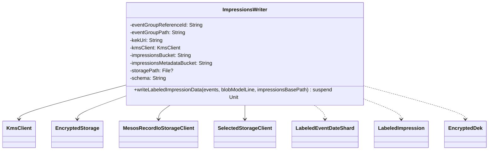

# org.wfanet.measurement.loadtest.edpaggregator.testing

## Overview
This package provides testing utilities for the EDP (Event Data Provider) aggregator load testing framework. It handles the encryption and storage of labeled impression data using KMS-based envelope encryption and outputs data in Mesos Record IO format. The package facilitates writing test impression data to various storage backends (Google Cloud Storage or local filesystem) along with metadata required for subsequent processing.

## Components

### ImpressionsWriter
Writes labeled impression data to storage with KMS-based envelope encryption and generates metadata for ResultsFulfiller processing.

**Constructor Parameters**

| Parameter | Type | Description |
|-----------|------|-------------|
| eventGroupReferenceId | `String` | Identifier for the event group |
| eventGroupPath | `String` | Path where impressions are stored |
| kekUri | `String` | URI of the Key Encryption Key for envelope encryption |
| kmsClient | `KmsClient` | KMS client for encryption operations |
| impressionsBucket | `String` | Storage bucket for encrypted impressions |
| impressionsMetadataBucket | `String` | Storage bucket for impression metadata |
| storagePath | `File?` | Optional local file path for storage (default: null) |
| schema | `String` | URI schema for storage paths (default: "file:///") |

**Methods**

| Method | Parameters | Returns | Description |
|--------|------------|---------|-------------|
| writeLabeledImpressionData | `events: Sequence<LabeledEventDateShard<T>>`, `blobModelLine: String`, `impressionsBasePath: String?` | `suspend Unit` | Encrypts labeled events and writes to storage with metadata |

## Data Processing Flow

1. **Encryption Key Generation**: Generates a serialized encryption key using KMS with AES128_GCM_HKDF_1MB algorithm
2. **Event Processing**: Processes events grouped by date shard
3. **Impression Conversion**: Converts labeled events to LabeledImpression protobuf format with VID, event data, and timestamp
4. **Encrypted Storage**: Writes impressions using Mesos Record IO format with envelope encryption
5. **Metadata Generation**: Creates BlobDetails metadata containing blob URI, encrypted DEK, event group reference, time interval, and model line
6. **Metadata Storage**: Writes metadata to separate storage location for ResultsFulfiller consumption

## Dependencies

- `com.google.crypto.tink` - KMS client and encryption operations
- `com.google.protobuf` - Protocol buffer serialization (Any, Message)
- `kotlinx.coroutines.flow` - Asynchronous data streaming
- `org.wfanet.measurement.common.crypto.tink` - Envelope encryption utilities
- `org.wfanet.measurement.edpaggregator` - Encrypted storage utilities
- `org.wfanet.measurement.edpaggregator.v1alpha` - EncryptedDek and LabeledImpression protobuf definitions
- `org.wfanet.measurement.loadtest.dataprovider` - LabeledEvent and LabeledEventDateShard data structures
- `org.wfanet.measurement.storage` - MesosRecordIoStorageClient and SelectedStorageClient

## Usage Example

```kotlin
import com.google.crypto.tink.KmsClient
import java.io.File
import org.wfanet.measurement.loadtest.edpaggregator.testing.ImpressionsWriter
import org.wfanet.measurement.loadtest.dataprovider.LabeledEventDateShard

suspend fun writeTestImpressions(
  events: Sequence<LabeledEventDateShard<MyEventType>>,
  kmsClient: KmsClient
) {
  val writer = ImpressionsWriter(
    eventGroupReferenceId = "test-event-group-123",
    eventGroupPath = "events/test-group",
    kekUri = "gcp-kms://projects/my-project/locations/us/keyRings/my-ring/cryptoKeys/my-key",
    kmsClient = kmsClient,
    impressionsBucket = "my-impressions-bucket",
    impressionsMetadataBucket = "my-metadata-bucket",
    storagePath = File("/tmp/storage"),
    schema = "gs://"
  )

  writer.writeLabeledImpressionData(
    events = events,
    blobModelLine = "test-model-v1"
  )
}
```

## Storage Format

### Impressions Path Structure
```
[schema][bucket]/[impressionsBasePath]/ds/[YYYY-MM-DD]/[eventGroupPath]/impressions
```

### Metadata Path Structure
```
[schema][bucket]/[impressionsBasePath]/ds/[YYYY-MM-DD]/[eventGroupPath]/metadata.binpb
```

## Class Diagram


