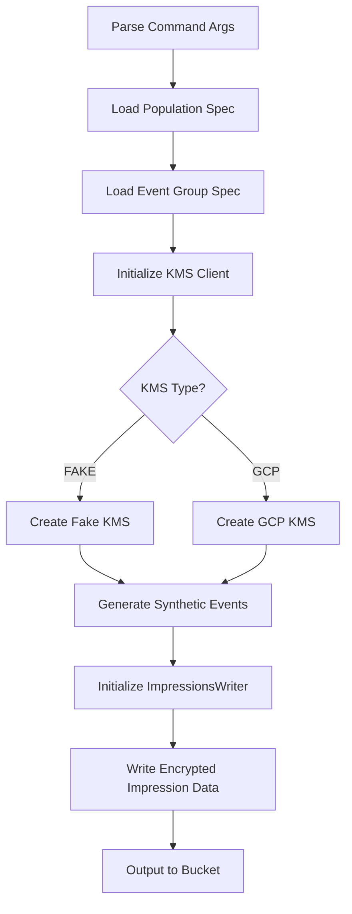
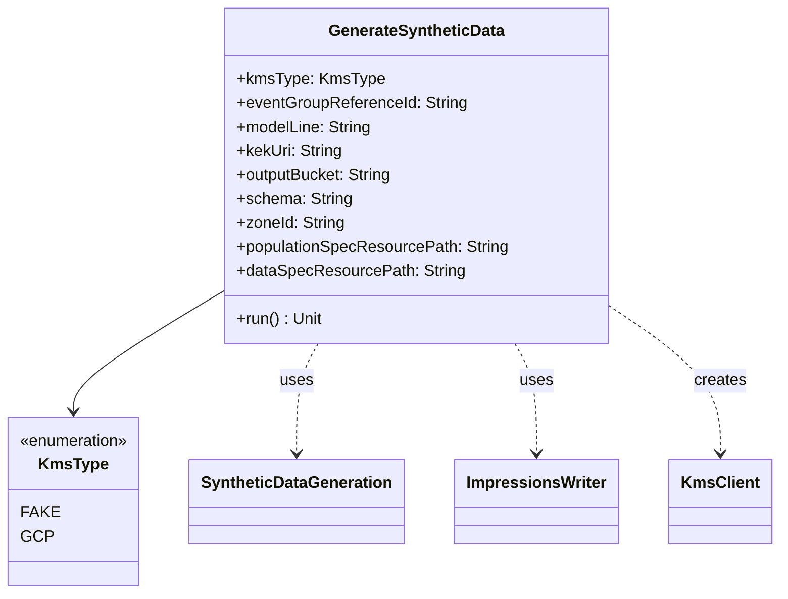

# org.wfanet.measurement.loadtest.edpaggregator.tools

## Overview
This package provides command-line tools for generating synthetic test data for Panel Match load testing in the EDP Aggregator system. The primary tool creates encrypted synthetic event data and impressions data for testing campaigns with configurable population and event specifications.

## Components

### GenerateSyntheticData
Command-line tool that generates synthetic Panel Match data including encrypted impressions and event metadata.

| Method | Parameters | Returns | Description |
|--------|------------|---------|-------------|
| run | - | `Unit` | Generates synthetic data based on configured population and event specs |

#### Configuration Options

| Option | Type | Required | Default | Description |
|--------|------|----------|---------|-------------|
| kms-type | `KmsType` | Yes | - | KMS provider (FAKE or GCP) |
| local-storage-path | `File?` | No | null | Local storage path for file:/// schema |
| event-group-reference-id | `String` | Yes | - | EDP-generated event group reference ID |
| model-line | `String` | Yes | - | Model line identifier for the campaign |
| kek-uri | `String` | Yes | FakeKmsClient default | KMS key encryption key URI |
| output-bucket | `String` | Yes | - | Destination bucket for metadata and impressions |
| schema | `String` | Yes | file:/// | Storage schema (gs:// or file:///) |
| zone-id | `String` | Yes | UTC | Time zone for event generation |
| population-spec-resource-path | `String` | Yes | - | Path to population spec textproto |
| data-spec-resource-path | `String` | Yes | - | Path to data spec textproto |
| impression-metadata-base-path | `String` | No | - | Base path for impression files |

## Data Structures

### KmsType
Enum defining supported KMS providers.

| Value | Description |
|-------|-------------|
| FAKE | Fake KMS client for testing |
| GCP | Google Cloud Platform KMS |

## Dependencies
- `com.google.crypto.tink.*` - Cryptographic operations for encrypting synthetic data
- `org.wfanet.measurement.loadtest.dataprovider.SyntheticDataGeneration` - Core synthetic event generation logic
- `org.wfanet.measurement.loadtest.edpaggregator.testing.ImpressionsWriter` - Writes encrypted impression data to storage
- `org.wfanet.measurement.api.v2alpha.event_group_metadata.testing.*` - Population and event group specifications
- `org.wfanet.measurement.api.v2alpha.event_templates.testing.TestEvent` - Test event message definitions
- `picocli.CommandLine.*` - Command-line argument parsing framework

## Usage Example
```kotlin
// Run via command line
fun main(args: Array<String>) = commandLineMain(GenerateSyntheticData(), args)

// Example command invocation:
// generate-synthetic-data \
//   --kms-type=FAKE \
//   --event-group-reference-id=campaign123 \
//   --model-line=modelLines/ml1 \
//   --kek-uri=fake-kms://key1 \
//   --output-bucket=gs://my-bucket \
//   --schema=gs:// \
//   --zone-id=America/New_York \
//   --population-spec-resource-path=population_spec.textproto \
//   --data-spec-resource-path=data_spec.textproto \
//   --impression-metadata-base-path=impressions/
```

## Process Flow


## Class Diagram

