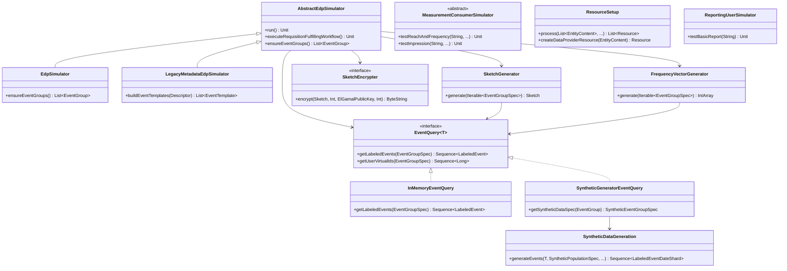

# org.wfanet.measurement.loadtest

## Overview
The loadtest package provides comprehensive load testing and simulation capabilities for the Cross-Media Measurement System. It includes simulators for Event Data Providers (EDPs), Measurement Consumers (MCs), and reporting users, along with synthetic data generation, event query processing, and resource management for testing CMMS deployments at scale.

## Components

### ServiceFlags

Configuration flags for external service connections in load tests.

| Property | Type | Description |
|----------|------|-------------|
| target | `String` | gRPC target authority of the API server |
| certHost | `String?` | Expected hostname in server TLS certificate |

#### KingdomPublicApiFlags
Configures connection to Kingdom public API server with target and optional certificate hostname override.

#### RequisitionFulfillmentServiceFlags
Configures connection to Duchy RequisitionFulfillment server including duchy ID, target, and optional certificate hostname.

#### KingdomInternalApiFlags
Configures connection to Kingdom internal API server with target, certificate hostname, and default RPC deadline duration.

## Data Provider Simulation

### AbstractEdpSimulator

Base simulator for Event Data Provider operations that fulfills requisitions and manages event groups.

| Method | Parameters | Returns | Description |
|--------|------------|---------|-------------|
| run | - | `Unit` | Executes requisition fulfillment workflow |
| ensureEventGroups | - | `List<EventGroup>` | Creates or updates event groups |
| executeRequisitionFulfillingWorkflow | - | `Unit` | Processes unfulfilled requisitions |

**Key responsibilities:**
- Requisition fulfillment for multiple protocols (LLv2, ROLLV2, HMSS, TrusTee)
- Privacy budget management
- Sketch generation and encryption
- Direct measurement computation
- Certificate verification and consent signaling

### EdpSimulator

Concrete EDP simulator with EventGroup metadata support.

| Method | Parameters | Returns | Description |
|--------|------------|---------|-------------|
| ensureEventGroups | - | `List<EventGroup>` | Creates event groups with metadata |

**Configuration:**
- `mediaTypes`: Set of media types for event groups
- `metadata`: EventGroupMetadata to attach

### LegacyMetadataEdpSimulator

EDP simulator that sets legacy encrypted metadata on EventGroups using EventGroupMetadataDescriptor.

| Method | Parameters | Returns | Description |
|--------|------------|---------|-------------|
| buildEventTemplates | `eventMessageDescriptor: Descriptor` | `List<EventGroup.EventTemplate>` | Builds event templates from descriptor |

**Key features:**
- Creates EventGroupMetadataDescriptor from protobuf descriptors
- Encrypts metadata using MC public key
- Verifies MC encryption public key signatures

## Event Querying

### EventQuery

Interface for querying virtual person IDs from event groups with filtering support.

| Method | Parameters | Returns | Description |
|--------|------------|---------|-------------|
| getLabeledEvents | `eventGroupSpec: EventGroupSpec` | `Sequence<LabeledEvent<T>>` | Returns labeled events matching spec |
| getUserVirtualIds | `eventGroupSpec: EventGroupSpec` | `Sequence<Long>` | Returns VIDs for matching events |
| getUserVirtualIdUniverse | - | `Sequence<Long>` | Returns complete VID universe |
| compileProgram | `eventFilter: EventFilter, descriptor: Descriptor` | `Program` | Compiles CEL filter expression |

#### EventGroupSpec
Data class combining EventGroup with requisition specification.

| Property | Type | Description |
|----------|------|-------------|
| eventGroup | `EventGroup` | The event group resource |
| spec | `RequisitionSpec.EventGroupEntry.Value` | Event specification from requisition |

### InMemoryEventQuery

In-memory implementation that filters events using time ranges and CEL programs.

| Method | Parameters | Returns | Description |
|--------|------------|---------|-------------|
| getLabeledEvents | `eventGroupSpec: EventGroupSpec` | `Sequence<LabeledTestEvent>` | Filters events by time and expression |
| getUserVirtualIdUniverse | - | `Sequence<Long>` | Returns VID range 1 to maxVidValue |

### SyntheticGeneratorEventQuery

Abstract EventQuery implementation using synthetic data generation.

| Method | Parameters | Returns | Description |
|--------|------------|---------|-------------|
| getSyntheticDataSpec | `eventGroup: EventGroup` | `SyntheticEventGroupSpec` | Returns synthetic spec for event group |
| getLabeledEvents | `eventGroupSpec: EventGroupSpec` | `Sequence<LabeledEvent<DynamicMessage>>` | Generates synthetic events |

## Data Structures

### LabeledEvent
Event message with timestamp and VID labels.

| Property | Type | Description |
|----------|------|-------------|
| timestamp | `Instant` | Event occurrence time |
| vid | `Long` | Virtual person identifier |
| message | `T: Message` | Event data message |

### LabeledEventDateShard
Collection of labeled events for a specific date.

| Property | Type | Description |
|----------|------|-------------|
| localDate | `LocalDate` | Date for this shard |
| labeledEvents | `Sequence<LabeledEvent<T>>` | Events in shard |

### IndexedValue
Maps VID to bucket index and normalized hash value.

| Property | Type | Description |
|----------|------|-------------|
| index | `Int` | Bucket index in sorted order |
| value | `Double` | Normalized hash value in [0,1] |

## Synthetic Data Generation

### SyntheticDataGeneration

Generates deterministic synthetic events from population and event group specifications.

| Method | Parameters | Returns | Description |
|--------|------------|---------|-------------|
| generateEvents | `messageInstance: T, populationSpec: SyntheticPopulationSpec, syntheticEventGroupSpec: SyntheticEventGroupSpec, timeRange: OpenEndTimeRange, zoneId: ZoneId` | `Sequence<LabeledEventDateShard<T>>` | Generates deterministic events |

**Algorithm:**
- Distributes events uniformly across date range using hash functions
- Supports VID sampling with configurable rates
- Handles population fields and non-population fields
- Ensures deterministic output for reproducible testing

## Sketch Generation and Encryption

### SketchGenerator

Generates AnySketch instances from event queries for MPC protocols.

| Method | Parameters | Returns | Description |
|--------|------------|---------|-------------|
| generate | `eventGroupSpecs: Iterable<EventGroupSpec>` | `Sketch` | Generates sketch from events |

**Extension functions:**
- `LiquidLegionsSketchParams.toSketchConfig()`: Converts LL params to sketch config
- `ReachOnlyLiquidLegionsSketchParams.toSketchConfig()`: Converts ROLL params to sketch config

### SketchEncrypter

Interface for encrypting Sketch instances with ElGamal encryption.

| Method | Parameters | Returns | Description |
|--------|------------|---------|-------------|
| encrypt | `sketch: Sketch, ellipticCurveId: Int, encryptionKey: ElGamalPublicKey, maximumValue: Int` | `ByteString` | Encrypts sketch with max value |
| encrypt | `sketch: Sketch, ellipticCurveId: Int, encryptionKey: ElGamalPublicKey` | `ByteString` | Encrypts sketch without max value |
| combineElGamalPublicKeys | `ellipticCurveId: Int, keys: Iterable<ElGamalPublicKey>` | `ElGamalPublicKey` | Combines multiple public keys |

**Native library dependency:** `sketch_encrypter_adapter`

## Frequency Vector Generation

### FrequencyVectorGenerator

Generates frequency vectors for honest majority share shuffle protocol.

| Method | Parameters | Returns | Description |
|--------|------------|---------|-------------|
| generate | `eventGroupSpecs: Iterable<EventGroupSpec>` | `IntArray` | Generates frequency vector array |

**Features:**
- Handles VID sampling interval with wrap-around support
- Maps VIDs to bucket indices using normalized hash values
- Counts event frequency per VID bucket

### VidToIndexMapGenerator

Generates deterministic VID to bucket index mappings using SHA-256 hashing.

| Method | Parameters | Returns | Description |
|--------|------------|---------|-------------|
| generateMapping | `vidUniverse: Sequence<Long>, salt: ByteString` | `Map<Long, IndexedValue>` | Generates VID to index map |

**Algorithm:**
1. Hash each VID concatenated with salt using SHA-256
2. Sort VIDs by hash value
3. Assign bucket index based on sorted position
4. Normalize hash values to [0,1] interval

## Population Specification

### PopulationSpecConverter

Converts synthetic population specifications to PopulationSpec format.

| Method | Parameters | Returns | Description |
|--------|------------|---------|-------------|
| toPopulationSpec | `eventMessageDescriptor: Descriptor` | `PopulationSpec` | Converts with attributes |
| toPopulationSpecWithoutAttributes | - | `PopulationSpec` | Converts without attributes |

**Conversion includes:**
- VID range mapping to PopulationSpec.VidRange
- Population field values by template type
- Dynamic message construction from field descriptors

## Measurement Consumer Simulation

### MeasurementConsumerSimulator

Abstract simulator for Measurement Consumer operations on CMMS public API.

| Method | Parameters | Returns | Description |
|--------|------------|---------|-------------|
| testReachAndFrequency | `runId: String, requiredCapabilities: Capabilities, vidSamplingInterval: VidSamplingInterval, eventGroupFilter: (EventGroup) -> Boolean` | `Unit` | Tests reach and frequency measurement |
| testReachOnly | `runId: String, requiredCapabilities: Capabilities, vidSamplingInterval: VidSamplingInterval, eventGroupFilter: (EventGroup) -> Boolean` | `Unit` | Tests reach-only measurement |
| testImpression | `runId: String, eventGroupFilter: (EventGroup) -> Boolean` | `Unit` | Tests impression measurement |
| testDuration | `runId: String, eventGroupFilter: (EventGroup) -> Boolean` | `Unit` | Tests duration measurement |
| testPopulation | `runId: String, populationData: PopulationData, modelLineName: String, populationFilterExpression: String, eventMessageDescriptor: Descriptor` | `Unit` | Tests population measurement |
| testDirectReachAndFrequency | `runId: String, numMeasurements: Int, eventGroupFilter: (EventGroup) -> Boolean` | `Unit` | Tests direct protocol measurements |

**Abstract methods:**
- `filterEventGroups()`: Filters event groups for measurement
- `getFilteredVids()`: Returns filtered VIDs for expected results
- `buildRequisitionInfo()`: Builds requisition info for data provider

### MeasurementConsumerData
Configuration for measurement consumer.

| Property | Type | Description |
|----------|------|-------------|
| name | `String` | MC public API resource name |
| signingKey | `SigningKeyHandle` | Consent signaling signing key |
| encryptionKey | `PrivateKeyHandle` | Encryption private key |
| apiAuthenticationKey | `String` | API authentication key |

## Resource Setup

### ResourceSetup

Manages resource creation for load testing environments.

| Method | Parameters | Returns | Description |
|--------|------------|---------|-------------|
| process | `dataProviderContents: List<EntityContent>, measurementConsumerContent: EntityContent, duchyCerts: List<DuchyCert>, modelProviderAkid: ByteString` | `List<Resources.Resource>` | Creates all test resources |
| createDataProviderResource | `dataProviderContent: EntityContent` | `Resources.Resource` | Creates DataProvider resource |
| createMeasurementConsumer | `measurementConsumerContent: EntityContent, internalAccount: InternalAccount` | `MeasurementConsumerAndKey` | Creates MC with API key |
| createDuchyCertificate | `duchyCert: DuchyCert` | `Certificate` | Creates Duchy certificate |

**Output files generated:**
- `resources.textproto`: Resource definitions
- `authority_key_identifier_to_principal_map.textproto`: AKID to principal mapping
- `resource-setup.bazelrc`: Bazel configuration
- `measurement_consumer_config.textproto`: MC configuration
- `encryption_key_pair_config.textproto`: Encryption key pairs

### EntityContent
Configuration for creating EDP or MC entities.

| Property | Type | Description |
|----------|------|-------------|
| displayName | `String` | Entity display name |
| encryptionPublicKey | `EncryptionPublicKey` | Consent signaling encryption key |
| signingKey | `SigningKeyHandle` | Consent signaling signing key |

### DuchyCert
Duchy certificate configuration.

| Property | Type | Description |
|----------|------|-------------|
| duchyId | `String` | External duchy identifier |
| consentSignalCertificateDer | `ByteString` | Certificate in DER format |

## Reporting Simulation

### ReportingUserSimulator

Simulator for Reporting API operations via HTTP gateway.

| Method | Parameters | Returns | Description |
|--------|------------|---------|-------------|
| testBasicReport | `runId: String` | `Unit` | Creates and validates basic report |

**Features:**
- Creates reporting sets from event groups
- Submits basic reports via HTTP/JSON API
- Polls for report completion
- Validates report results against expected values

## Configuration

### EventGroupMetadata

Test metadata for EventGroups.

| Method | Parameters | Returns | Description |
|--------|------------|---------|-------------|
| testMetadata | `publisherId: Int` | `TestMetadataMessage` | Creates test metadata message |

### PrivacyBudgets

Privacy budget management utilities.

| Method | Parameters | Returns | Description |
|--------|------------|---------|-------------|
| createNoOpPrivacyBudgetManager | - | `PrivacyBudgetManager` | Creates no-op PBM for testing |

**TestPrivacyBucketMapper:** Mapper implementation that does not charge privacy budget.

### TestIdentifiers

Test resource identifier constants.

| Property | Type | Description |
|----------|------|-------------|
| SIMULATOR_EVENT_GROUP_REFERENCE_ID_PREFIX | `String` | Prefix for simulator event groups |

### VidSampling

VID sampling utilities using farmhash fingerprint.

| Property | Type | Description |
|----------|------|-------------|
| sampler | `VidSampler` | Configured VID sampler instance |

## Common Utilities

### Output

Sealed interface for file or console output handling.

| Method | Parameters | Returns | Description |
|----------|------|-------------|
| resolve | `relative: String` | `Output` | Resolves relative path |
| writer | - | `Writable` | Creates writer instance |

#### FileOutput
Writes to file system at specified path.

#### ConsoleOutput
Writes to standard output with path prefixes.

### SampleVids

Utility function for VID sampling from event queries.

| Function | Parameters | Returns | Description |
|----------|------------|---------|-------------|
| sampleVids | `eventQuery: EventQuery<Message>, eventGroupSpecs: Iterable<EventGroupSpec>, vidSamplingIntervalStart: Float, vidSamplingIntervalWidth: Float` | `Iterable<Long>` | Samples VIDs from event groups |

## Dependencies

- `org.wfanet.measurement.api.v2alpha` - CMMS public API types
- `org.wfanet.measurement.internal.kingdom` - Kingdom internal API
- `org.wfanet.measurement.dataprovider` - Data provider utilities
- `org.wfanet.measurement.eventdataprovider` - Event data processing
- `org.wfanet.measurement.consent.client` - Consent signaling
- `org.wfanet.anysketch` - Sketch generation and encryption
- `com.google.protobuf` - Protocol buffer support
- `io.grpc` - gRPC communication
- `kotlinx.coroutines` - Asynchronous operations
- `org.projectnessie.cel` - CEL expression evaluation
- `okhttp3` - HTTP client for reporting API

## Usage Example

```kotlin
// Create EDP simulator
val edpSimulator = EdpSimulator(
  edpData = dataProviderData,
  edpDisplayName = "test-edp",
  measurementConsumerName = "measurementConsumers/123",
  certificatesStub = certificatesStub,
  modelLinesStub = modelLinesStub,
  dataProvidersStub = dataProvidersStub,
  eventGroupsStub = eventGroupsStub,
  requisitionsStub = requisitionsStub,
  requisitionFulfillmentStubsByDuchyId = duchyStubs,
  syntheticDataTimeZone = ZoneId.of("America/New_York"),
  eventGroupsOptions = listOf(eventGroupOptions),
  eventQuery = syntheticEventQuery,
  throttler = throttler,
  privacyBudgetManager = privacyBudgetManager,
  trustedCertificates = trustedCerts
)

// Run EDP simulator
edpSimulator.run()

// Create MC simulator and test measurement
val mcSimulator = EventQueryMeasurementConsumerSimulator(
  measurementConsumerData = mcData,
  outputDpParams = dpParams,
  dataProvidersClient = dataProvidersClient,
  eventGroupsClient = eventGroupsClient,
  measurementsClient = measurementsClient,
  measurementConsumersClient = mcConsumersClient,
  certificatesClient = certificatesClient,
  trustedCertificates = trustedCerts,
  syntheticGeneratorEventQuery = eventQuery
)

mcSimulator.testReachAndFrequency(runId = "test-run-123")
```

## Class Diagram


