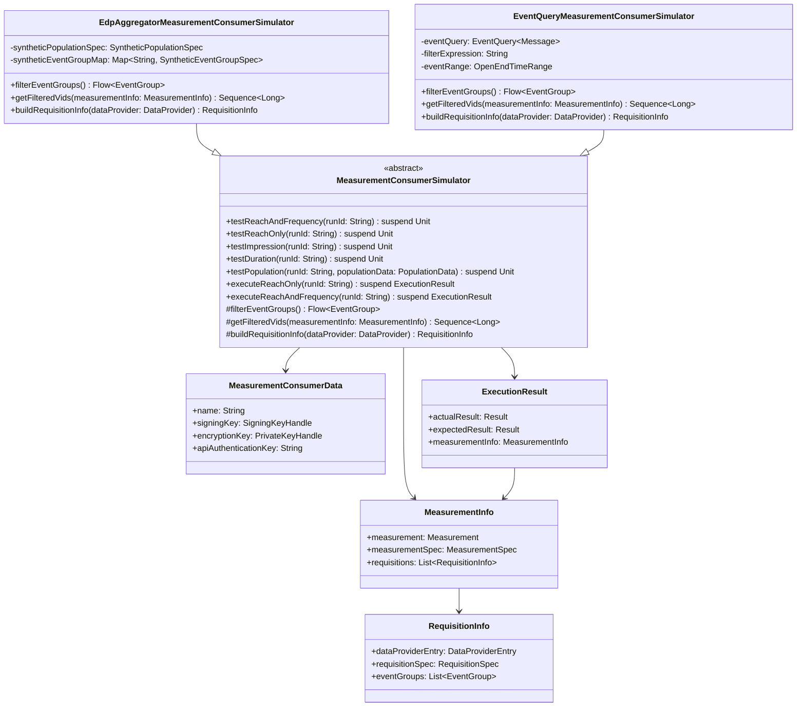

# org.wfanet.measurement.loadtest.measurementconsumer

## Overview
This package provides simulator implementations for testing Measurement Consumer operations on the CMMS public API. It includes abstract base classes and concrete implementations for simulating reach, frequency, impression, duration, and population measurements with synthetic data generation and event queries.

## Components

### MeasurementConsumerSimulator
Abstract base class for simulating MeasurementConsumer operations on the CMMS public API.

| Method | Parameters | Returns | Description |
|--------|------------|---------|-------------|
| testReachAndFrequency | `runId: String`, `requiredCapabilities: DataProvider.Capabilities`, `vidSamplingInterval: VidSamplingInterval`, `eventGroupFilter: ((EventGroup) -> Boolean)?` | `suspend Unit` | Creates and validates reach-and-frequency measurement with variance analysis |
| testInvalidReachAndFrequency | `runId: String`, `requiredCapabilities: DataProvider.Capabilities`, `vidSamplingInterval: VidSamplingInterval`, `eventGroupFilter: ((EventGroup) -> Boolean)?` | `suspend Unit` | Tests measurement failure with invalid privacy parameters |
| testDirectReachAndFrequency | `runId: String`, `numMeasurements: Int`, `eventGroupFilter: ((EventGroup) -> Boolean)?` | `suspend Unit` | Creates and validates multiple direct reach-and-frequency measurements |
| testDirectReachOnly | `runId: String`, `numMeasurements: Int`, `eventGroupFilter: ((EventGroup) -> Boolean)?` | `suspend Unit` | Creates and validates multiple direct reach-only measurements |
| executeReachOnly | `runId: String`, `requiredCapabilities: DataProvider.Capabilities`, `vidSamplingInterval: VidSamplingInterval`, `eventGroupFilter: ((EventGroup) -> Boolean)?` | `suspend ExecutionResult` | Executes reach-only measurement and returns result without validation |
| executeReachAndFrequency | `runId: String`, `requiredCapabilities: DataProvider.Capabilities`, `vidSamplingInterval: VidSamplingInterval`, `eventGroupFilter: ((EventGroup) -> Boolean)?` | `suspend ExecutionResult` | Executes reach-and-frequency measurement and returns result without validation |
| testReachOnly | `runId: String`, `requiredCapabilities: DataProvider.Capabilities`, `vidSamplingInterval: VidSamplingInterval`, `eventGroupFilter: ((EventGroup) -> Boolean)?` | `suspend Unit` | Creates and validates reach-only measurement |
| testImpression | `runId: String`, `eventGroupFilter: ((EventGroup) -> Boolean)?` | `suspend Unit` | Creates and validates impression measurement per data provider |
| testDuration | `runId: String`, `eventGroupFilter: ((EventGroup) -> Boolean)?` | `suspend Unit` | Creates and validates duration measurement per data provider |
| testPopulation | `runId: String`, `populationData: PopulationData`, `modelLineName: String`, `populationFilterExpression: String`, `eventMessageDescriptor: Descriptors.Descriptor` | `suspend Unit` | Creates and validates population measurement |
| filterEventGroups | - | `Flow<EventGroup>` | Abstract method to filter event groups based on implementation |
| getFilteredVids | `measurementInfo: MeasurementInfo` | `Sequence<Long>` | Abstract method to retrieve filtered virtual IDs for measurement |
| getFilteredVids | `measurementInfo: MeasurementInfo`, `targetDataProviderId: String` | `Sequence<Long>` | Abstract method to retrieve filtered VIDs for specific data provider |
| buildRequisitionInfo | `dataProvider: DataProvider`, `eventGroups: List<EventGroup>`, `measurementConsumer: MeasurementConsumer`, `nonce: Long`, `percentage: Double` | `RequisitionInfo` | Abstract method to build requisition specification and metadata |
| getMeasurementConsumer | `name: String` | `suspend MeasurementConsumer` | Retrieves measurement consumer resource by name |

### EdpAggregatorMeasurementConsumerSimulator
Concrete implementation for use with EDP Aggregator and synthetic data generation.

| Method | Parameters | Returns | Description |
|--------|------------|---------|-------------|
| filterEventGroups | - | `Flow<EventGroup>` | Filters event groups matching synthetic event group specs |
| getFilteredVids | `measurementInfo: MeasurementInfo` | `Sequence<Long>` | Generates and filters VIDs using synthetic data generation |
| getFilteredVids | `measurementInfo: MeasurementInfo`, `targetDataProviderId: String` | `Sequence<Long>` | Generates and filters VIDs for specific data provider |
| buildRequisitionInfo | `dataProvider: DataProvider`, `eventGroups: List<EventGroup>`, `measurementConsumer: MeasurementConsumer`, `nonce: Long`, `percentage: Double` | `RequisitionInfo` | Builds requisition with collection intervals based on percentage |

### EventQueryMeasurementConsumerSimulator
Implementation using synthetic EventQuery for controlled load testing environments.

| Method | Parameters | Returns | Description |
|--------|------------|---------|-------------|
| filterEventGroups | - | `Flow<EventGroup>` | Filters event groups by simulator reference ID prefix |
| getFilteredVids | `measurementInfo: MeasurementInfo` | `Sequence<Long>` | Retrieves VIDs from EventQuery based on event group specs |
| getFilteredVids | `measurementInfo: MeasurementInfo`, `targetDataProviderId: String` | `Sequence<Long>` | Retrieves VIDs from EventQuery for specific data provider |
| buildRequisitionInfo | `dataProvider: DataProvider`, `eventGroups: List<EventGroup>`, `measurementConsumer: MeasurementConsumer`, `nonce: Long`, `percentage: Double` | `RequisitionInfo` | Builds requisition with fixed event range and filter expression |

## Data Structures

### MeasurementConsumerData
| Property | Type | Description |
|----------|------|-------------|
| name | `String` | MC's public API resource name |
| signingKey | `SigningKeyHandle` | Consent signaling signing key |
| encryptionKey | `PrivateKeyHandle` | Encryption private key |
| apiAuthenticationKey | `String` | API authentication key |

### PopulationData
| Property | Type | Description |
|----------|------|-------------|
| populationDataProviderName | `String` | Name of population data provider |
| populationSpec | `PopulationSpec` | Population specification |

### MeasurementInfo
| Property | Type | Description |
|----------|------|-------------|
| measurement | `Measurement` | Created measurement resource |
| measurementSpec | `MeasurementSpec` | Measurement specification |
| requisitions | `List<RequisitionInfo>` | List of requisition metadata |

### RequisitionInfo
| Property | Type | Description |
|----------|------|-------------|
| dataProviderEntry | `DataProviderEntry` | Data provider entry for measurement |
| requisitionSpec | `RequisitionSpec` | Requisition specification |
| eventGroups | `List<EventGroup>` | Associated event groups |

### ExecutionResult
| Property | Type | Description |
|----------|------|-------------|
| actualResult | `Result` | Result computed by CMMS |
| expectedResult | `Result` | Expected result from simulation |
| measurementInfo | `MeasurementInfo` | Measurement metadata |

## Dependencies
- `org.wfanet.measurement.api.v2alpha` - CMMS public API protobuf definitions and gRPC stubs
- `org.wfanet.measurement.consent.client.measurementconsumer` - Encryption, signing, and verification utilities
- `org.wfanet.measurement.measurementconsumer.stats` - Statistical variance computation and methodology implementations
- `org.wfanet.measurement.dataprovider` - Measurement result computation utilities
- `org.wfanet.measurement.loadtest.dataprovider` - Synthetic data generation and event query interfaces
- `org.wfanet.measurement.common.crypto` - Cryptographic key handling and certificate management
- `org.wfanet.measurement.eventdataprovider.eventfiltration` - CEL expression compilation and event filtering
- `com.google.protobuf` - Protocol buffer message handling
- `kotlinx.coroutines` - Asynchronous coroutine support
- `com.google.common.truth` - Assertion library for testing

## Usage Example
```kotlin
// Create measurement consumer data
val measurementConsumerData = MeasurementConsumerData(
    name = "measurementConsumers/some-mc-id",
    signingKey = signingKeyHandle,
    encryptionKey = privateKeyHandle,
    apiAuthenticationKey = "api-key"
)

// Initialize simulator with event query
val simulator = EventQueryMeasurementConsumerSimulator(
    measurementConsumerData = measurementConsumerData,
    outputDpParams = differentialPrivacyParams { epsilon = 0.1; delta = 1e-9 },
    dataProvidersClient = dataProvidersStub,
    eventGroupsClient = eventGroupsStub,
    measurementsClient = measurementsStub,
    measurementConsumersClient = measurementConsumersStub,
    certificatesClient = certificatesStub,
    trustedCertificates = trustedCertsMap,
    eventQuery = syntheticEventQuery,
    expectedDirectNoiseMechanism = NoiseMechanism.DISCRETE_GAUSSIAN
)

// Execute reach and frequency test
simulator.testReachAndFrequency(
    runId = "test-run-001",
    requiredCapabilities = DataProviderKt.capabilities {
        honestMajorityShareShuffleSupported = true
    }
)

// Execute multiple direct measurements
simulator.testDirectReachOnly(
    runId = "test-run-002",
    numMeasurements = 5
)
```

## Class Diagram


## Key Functionality

### Measurement Creation and Validation
The simulators create various types of measurements (reach, frequency, impression, duration, population) and validate results against expected values computed from synthetic data or event queries. They support:
- VID sampling intervals
- Differential privacy parameters
- Multiple protocol configurations (LiquidLegions V2, Honest Majority Share Shuffle, Direct)
- Event filtering with CEL expressions

### Variance and Error Margin Computation
Statistical variance computation for reach, frequency, and impression measurements using:
- `VariancesImpl` from measurement consumer stats library
- Methodology-specific parameters (LiquidLegions V2, HMSS, Deterministic)
- 99.9999% confidence interval error margins (5.0σ)

### Polling and Result Retrieval
Exponential backoff polling mechanism for measurement results with:
- Configurable initial and maximum polling delays
- Automatic retry with backoff
- State validation (SUCCEEDED, FAILED, CANCELLED)

### Cryptographic Operations
- Requisition spec signing with consent signaling keys
- Requisition spec encryption with data provider public keys
- Result decryption with measurement consumer private keys
- Certificate path validation and signature verification

## Extensions

### RequisitionSpec.eventGroupsMap
Extension property that converts the `eventGroupsList` to a map for convenient lookup.

| Property | Type | Description |
|----------|------|-------------|
| eventGroupsMap | `Map<String, RequisitionSpec.EventGroupEntry.Value>` | Event group name to value map |

### DifferentialPrivacyParams.toNoiserDpParams
Converts API DP params to noiser library DP params.

| Method | Parameters | Returns | Description |
|--------|------------|---------|-------------|
| toNoiserDpParams | - | `NoiserDpParams` | Converts epsilon and delta to noiser format |

### DataProvider.toDataProviderEntry
Creates a DataProviderEntry with encrypted and signed requisition spec.

| Method | Parameters | Returns | Description |
|--------|------------|---------|-------------|
| toDataProviderEntry | `signedRequisitionSpec: SignedMessage`, `nonceHash: ByteString` | `DataProviderEntry` | Builds encrypted data provider entry |
