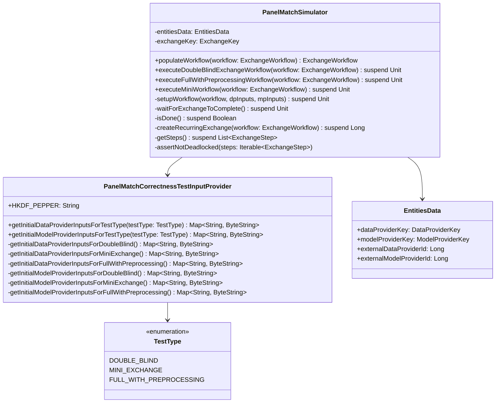

# org.wfanet.measurement.loadtest.panelmatch

## Overview
This package provides simulation and testing infrastructure for PanelMatch workflows, enabling correctness validation of privacy-preserving data exchange protocols between data providers and model providers. It orchestrates the setup, execution, and verification of various exchange workflow types including double-blind matching, mini exchanges, and full preprocessing workflows.

## Components

### PanelMatchSimulator
Orchestrates end-to-end execution of PanelMatch exchange workflows, managing storage setup, workflow lifecycle, and result validation.

| Method | Parameters | Returns | Description |
|--------|------------|---------|-------------|
| populateWorkflow | `workflow: ExchangeWorkflow` | `ExchangeWorkflow` | Populates workflow with entity identifiers and schedule configuration |
| executeDoubleBlindExchangeWorkflow | `workflow: ExchangeWorkflow` | `Unit` (suspend) | Executes double-blind key exchange and validates decrypted join keys |
| executeFullWithPreprocessingWorkflow | `workflow: ExchangeWorkflow` | `Unit` (suspend) | Executes full workflow with event preprocessing and validates decrypted events |
| executeMiniWorkflow | `workflow: ExchangeWorkflow` | `Unit` (suspend) | Executes minimal exchange workflow and validates HKDF pepper transfer |

### PanelMatchCorrectnessTestInputProvider
Singleton object providing test data generation utilities for different workflow types.

| Method | Parameters | Returns | Description |
|--------|------------|---------|-------------|
| getInitialDataProviderInputsForTestType | `testType: TestType` | `Map<String, ByteString>` | Returns initial storage inputs for data provider based on test type |
| getInitialModelProviderInputsForTestType | `testType: TestType` | `Map<String, ByteString>` | Returns initial storage inputs for model provider based on test type |

## Data Structures

### EntitiesData
Encapsulates provider entity identifiers for exchange workflows.

| Property | Type | Description |
|----------|------|-------------|
| dataProviderKey | `DataProviderKey` | API key identifying the data provider |
| modelProviderKey | `ModelProviderKey` | API key identifying the model provider |
| externalDataProviderId | `Long` (computed) | External ID derived from data provider API ID |
| externalModelProviderId | `Long` (computed) | External ID derived from model provider API ID |

### TestType (Enum)
Defines supported workflow test scenarios.

| Value | Description |
|-------|-------------|
| DOUBLE_BLIND | Double-blind cryptographic key exchange workflow |
| MINI_EXCHANGE | Minimal exchange workflow for basic validation |
| FULL_WITH_PREPROCESSING | Complete workflow including event preprocessing and encryption |

## Constants

| Name | Value | Description |
|------|-------|-------------|
| HKDF_PEPPER | `"some-hkdf-pepper"` | Test value for HKDF pepper used in cryptographic operations |

## Dependencies
- `org.wfanet.measurement.api.v2alpha` - Public API models for exchanges, workflows, and entity keys
- `org.wfanet.measurement.internal.kingdom` - Internal Kingdom service for recurring exchange management
- `org.wfanet.measurement.storage` - Storage client abstractions for blob management
- `org.wfanet.panelmatch.client.exchangetasks` - Panel match exchange task definitions and data structures
- `org.wfanet.panelmatch.client.storage` - Storage configuration and details
- `org.wfanet.panelmatch.client.deploy` - Daemon storage client defaults and configuration
- `org.wfanet.panelmatch.common` - Common utilities for compression, serialization, and parsing
- `com.google.protobuf` - Protocol buffer serialization
- `io.grpc` - gRPC client communication

## Usage Example
```kotlin
// Initialize entity data
val entities = EntitiesData(
    dataProviderKey = DataProviderKey(dataProviderId = "dp-123"),
    modelProviderKey = ModelProviderKey(modelProviderId = "mp-456")
)

// Create simulator with required dependencies
val simulator = PanelMatchSimulator(
    entitiesData = entities,
    recurringExchangeClient = recurringExchangeStub,
    exchangeClient = exchangeStub,
    exchangeStepsClient = exchangeStepsStub,
    schedule = "0 0 * * *",
    publicApiVersion = "v2alpha",
    exchangeDate = LocalDate.now(),
    dataProviderPrivateStorageDetails = dpPrivateStorage,
    modelProviderPrivateStorageDetails = mpPrivateStorage,
    dataProviderSharedStorageDetails = dpSharedStorage,
    modelProviderSharedStorageDetails = mpSharedStorage,
    dpForwardedStorage = dpStorageClient,
    mpForwardedStorage = mpStorageClient,
    dataProviderDefaults = dpDefaults,
    modelProviderDefaults = mpDefaults
)

// Execute a workflow
val workflow = buildExchangeWorkflow()
val populatedWorkflow = simulator.populateWorkflow(workflow)
simulator.executeDoubleBlindExchangeWorkflow(populatedWorkflow)
```

## Class Diagram


## Implementation Details

### Workflow Execution Flow
1. **Setup Phase**: `setupWorkflow()` creates recurring exchange, configures storage clients, and writes initial test data
2. **Execution Phase**: Workflow-specific execute methods initialize test inputs and trigger exchange execution
3. **Monitoring Phase**: `waitForExchangeToComplete()` polls exchange state every 10 seconds until terminal state
4. **Validation Phase**: Each workflow type validates specific output artifacts (join keys, decrypted events, etc.)

### Test Data Generation
The `PanelMatchCorrectnessTestInputProvider` generates type-specific test data:
- **DOUBLE_BLIND**: Commutative deterministic keys and plaintext join key collections
- **MINI_EXCHANGE**: HKDF pepper for cryptographic operations
- **FULL_WITH_PREPROCESSING**: Compressed event data with 100 join keys (2 payloads each) plus compression parameters

### State Management
The simulator tracks exchange progress through multiple state sets:
- **Terminal Step States**: `SUCCEEDED`, `FAILED`
- **Ready Step States**: `IN_PROGRESS`, `READY`, `READY_FOR_RETRY`
- **Terminal Exchange States**: `SUCCEEDED`, `FAILED`

Deadlock detection ensures at least one step is in a ready state if any steps remain non-terminal.
