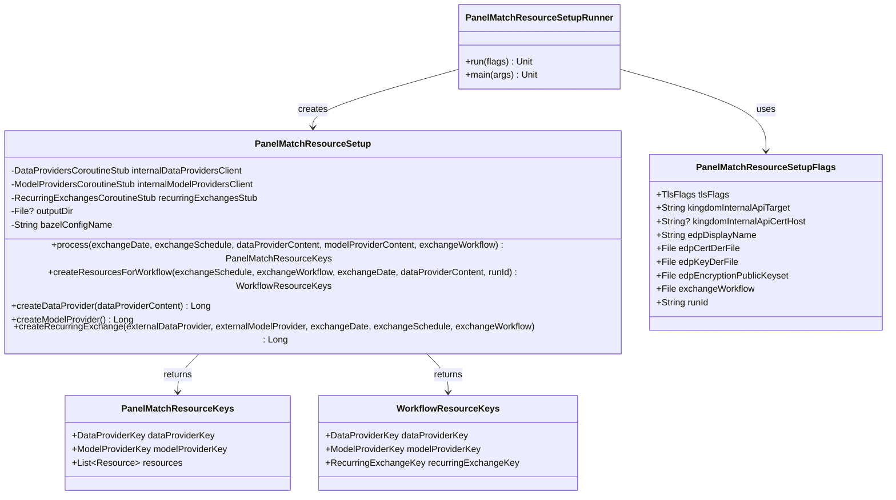

# org.wfanet.measurement.loadtest.panelmatchresourcesetup

## Overview
This package provides infrastructure for setting up Panel Match resources in load testing scenarios. It orchestrates the creation of data providers, model providers, and recurring exchanges in the Kingdom system, managing certificates, encryption keys, and workflow configurations. The package outputs resource metadata files and Bazel configuration for use in subsequent testing phases.

## Components

### PanelMatchResourceSetup
Core orchestration class that creates and configures panel match resources via Kingdom internal APIs.

| Method | Parameters | Returns | Description |
|--------|------------|---------|-------------|
| process | `exchangeDate: Date`, `exchangeSchedule: String`, `dataProviderContent: EntityContent`, `modelProviderContent: EntityContent?`, `exchangeWorkflow: ExchangeWorkflow?` | `PanelMatchResourceKeys` | Creates data provider, model provider, and optionally recurring exchange |
| createResourcesForWorkflow | `exchangeSchedule: String`, `exchangeWorkflow: ExchangeWorkflow`, `exchangeDate: Date`, `dataProviderContent: EntityContent`, `runId: String` | `WorkflowResourceKeys` | Creates complete workflow resources with identifiers |
| createDataProvider | `dataProviderContent: EntityContent` | `Long` | Creates data provider with signed encryption public key |
| createModelProvider | - | `Long` | Creates model provider and returns external ID |
| createRecurringExchange | `externalDataProvider: Long`, `externalModelProvider: Long`, `exchangeDate: Date`, `exchangeSchedule: String`, `exchangeWorkflow: ExchangeWorkflow` | `Long` | Creates active recurring exchange with cron schedule |

**Constructor Variants:**
- Primary: Accepts individual stub instances, optional output directory, and Bazel config name
- Secondary: Accepts `Channel` and creates stubs internally
- Tertiary: Accepts `ManagedChannel` and creates stubs internally

**Output Files Generated:**
- `resources.textproto` - Resource definitions
- `authority_key_identifier_to_principal_map.textproto` - AKID to principal mapping
- `resource-setup.bazelrc` - Bazel build configuration flags

### PanelMatchResourceSetupFlags
Command-line flag definitions for resource setup configuration.

| Property | Type | Description |
|----------|------|-------------|
| tlsFlags | `TlsFlags` | TLS certificate configuration for secure connections |
| kingdomInternalApiTarget | `String` | gRPC target authority for Kingdom internal API |
| kingdomInternalApiCertHost | `String?` | Optional DNS-ID override for TLS certificate validation |
| edpDisplayName | `String` | Display name for the Event Data Provider |
| edpCertDerFile | `File` | EDP certificate in DER format |
| edpKeyDerFile | `File` | EDP private key in DER format |
| edpEncryptionPublicKeyset | `File` | EDP encryption public key Tink Keyset |
| exchangeWorkflow | `File` | Exchange workflow textproto configuration |
| runId | `String` | Unique run identifier (defaults to UTC timestamp) |

### PanelMatchResourceSetupRunner
Entry point for executing the resource setup job.

| Function | Parameters | Returns | Description |
|----------|------------|---------|-------------|
| run | `flags: PanelMatchResourceSetupFlags` | `Unit` | Builds TLS channel, loads credentials, and executes setup |
| main | `args: Array<String>` | `Unit` | Command-line entry point using Picocli |

**Constants:**
- `EXCHANGE_DATE` - Set to current date (`LocalDate.now()`)
- `SCHEDULE` - Cron schedule string (`"@daily"`)

## Data Structures

### PanelMatchResourceKeys
Encapsulates keys for created panel match resources.

| Property | Type | Description |
|----------|------|-------------|
| dataProviderKey | `DataProviderKey` | API key for the created data provider |
| modelProviderKey | `ModelProviderKey` | API key for the created model provider |
| resources | `List<Resources.Resource>` | List of all created resource objects |

### WorkflowResourceKeys
Encapsulates keys for workflow-specific resources.

| Property | Type | Description |
|----------|------|-------------|
| dataProviderKey | `DataProviderKey` | API key for the created data provider |
| modelProviderKey | `ModelProviderKey` | API key for the created model provider |
| recurringExchangeKey | `RecurringExchangeKey` | API key for the created recurring exchange |

## Dependencies

### Internal Kingdom Services
- `org.wfanet.measurement.internal.kingdom` - gRPC stubs for DataProviders, ModelProviders, and RecurringExchanges

### API and Configuration
- `org.wfanet.measurement.api.v2alpha` - Public API models for exchange workflows and resource keys
- `org.wfanet.measurement.config` - Authority key to principal mapping configuration

### Cryptography and Security
- `org.wfanet.measurement.common.crypto` - Certificate handling and signing key utilities
- `org.wfanet.measurement.consent.client.measurementconsumer` - Encryption public key signing

### Load Test Infrastructure
- `org.wfanet.measurement.loadtest.common` - File and console output utilities
- `org.wfanet.measurement.loadtest.panelmatch.resourcesetup` - Resource protobuf definitions
- `org.wfanet.measurement.loadtest.resourcesetup` - Entity content models

### External Libraries
- `io.grpc` - gRPC channels and exception handling
- `com.google.protobuf` - Protobuf serialization and TextFormat
- `picocli` - Command-line argument parsing
- `kotlinx.coroutines` - Asynchronous operations and context switching

## Usage Example

```kotlin
// Build secure channel to Kingdom API
val clientCerts = SigningCerts.fromPemFiles(
  certificateFile = certFile,
  privateKeyFile = keyFile,
  trustedCertCollectionFile = certCollectionFile
)
val channel = buildMutualTlsChannel(
  "kingdom.example.com:443",
  clientCerts,
  "kingdom.example.com"
)

// Prepare data provider content
val dataProviderContent = EntityContent(
  displayName = "Test Data Provider",
  signingKey = loadSigningKey(certDerFile, keyDerFile),
  encryptionPublicKey = loadPublicKey(keysetFile).toEncryptionPublicKey()
)

// Load exchange workflow configuration
val exchangeWorkflow = parseTextProto(
  workflowFile.bufferedReader(),
  exchangeWorkflow {}
)

// Execute resource setup
val setup = PanelMatchResourceSetup(channel)
val keys = setup.process(
  exchangeDate = LocalDate.now().toProtoDate(),
  exchangeSchedule = "@daily",
  dataProviderContent = dataProviderContent,
  exchangeWorkflow = exchangeWorkflow
)

println("Created Data Provider: ${keys.dataProviderKey.toName()}")
println("Created Model Provider: ${keys.modelProviderKey.toName()}")
```

## Class Diagram


