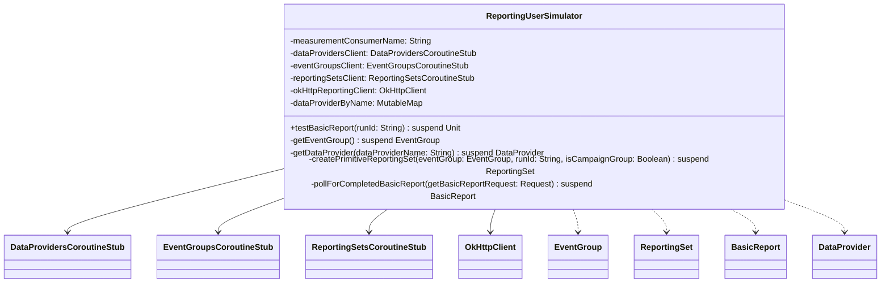

# org.wfanet.measurement.loadtest.reporting

## Overview
This package provides load testing capabilities for the Reporting public API. It simulates user operations to create and validate reporting workflows, including creation of reporting sets, event groups, and basic reports with polling for completion.

## Components

### ReportingUserSimulator
Simulator that executes end-to-end reporting workflows for load testing and validation of the reporting system.

**Constructor Parameters**

| Parameter | Type | Description |
|-----------|------|-------------|
| `measurementConsumerName` | `String` | Resource name of the measurement consumer |
| `dataProvidersClient` | `DataProvidersCoroutineStub` | gRPC client for data provider operations |
| `eventGroupsClient` | `EventGroupsCoroutineStub` | gRPC client for event group operations |
| `reportingSetsClient` | `ReportingSetsCoroutineStub` | gRPC client for reporting set operations |
| `okHttpReportingClient` | `OkHttpClient` | HTTP client for reporting gateway REST API |
| `reportingGatewayScheme` | `String` | URL scheme for reporting gateway (default: "https") |
| `reportingGatewayHost` | `String` | Hostname of the reporting gateway |
| `reportingGatewayPort` | `Int` | Port number for reporting gateway (default: 443) |
| `getReportingAccessToken` | `() -> String` | Lambda function to retrieve OAuth access token |
| `modelLineName` | `String` | Resource name of the model line to use |
| `initialResultPollingDelay` | `Duration` | Initial delay between polling attempts (default: 1s) |
| `maximumResultPollingDelay` | `Duration` | Maximum delay between polling attempts (default: 1m) |

**Public Methods**

| Method | Parameters | Returns | Description |
|--------|------------|---------|-------------|
| `testBasicReport` | `runId: String` | `suspend Unit` | Creates and validates a complete basic report workflow |

**Private Methods**

| Method | Parameters | Returns | Description |
|--------|------------|---------|-------------|
| `getEventGroup` | - | `suspend EventGroup` | Retrieves a valid event group supporting HMSS protocol |
| `getDataProvider` | `dataProviderName: String` | `suspend DataProvider` | Fetches data provider details by resource name |
| `createPrimitiveReportingSet` | `eventGroup: EventGroup, runId: String, isCampaignGroup: Boolean` | `suspend ReportingSet` | Creates a primitive reporting set from event group |
| `pollForCompletedBasicReport` | `getBasicReportRequest: Request` | `suspend BasicReport` | Polls until basic report reaches terminal state |

## Workflow Details

### testBasicReport Workflow
1. Retrieves a valid event group with HMSS support
2. Creates a primitive reporting set marked as campaign group
3. Constructs a basic report with:
   - Reporting interval (March 14-15, 2021, America/New_York timezone)
   - Result group with population size, reach, impressions, and k+5 reach metrics
   - Weekly metric frequency (Monday)
4. Submits report via HTTP POST to reporting gateway
5. Polls for report completion using exponential backoff
6. Validates created report against expected structure

### Event Group Selection
Filters event groups by:
- Reference ID prefix matching test simulator identifiers
- Data provider capability: `honestMajorityShareShuffleSupported`

### Polling Strategy
- Uses exponential backoff starting at 1 second
- Caps maximum delay at 1 minute
- No randomness factor in backoff calculation
- Continues until report state is `SUCCEEDED`, `FAILED`, or `INVALID`

## Dependencies

- `org.wfanet.measurement.api.v2alpha` - CMMS v2alpha API for data providers and measurement consumers
- `org.wfanet.measurement.reporting.v2alpha` - Reporting v2alpha API for reports, sets, and event groups
- `org.wfanet.measurement.common` - Common utilities including exponential backoff and resource listing
- `org.wfanet.measurement.loadtest.config` - Test configuration including simulator identifiers
- `com.google.protobuf.util.JsonFormat` - Protocol buffer JSON serialization for HTTP API
- `okhttp3` - HTTP client for REST API communication
- `kotlinx.coroutines` - Coroutine support for asynchronous operations

## Usage Example

```kotlin
val simulator = ReportingUserSimulator(
  measurementConsumerName = "measurementConsumers/123",
  dataProvidersClient = dataProvidersStub,
  eventGroupsClient = eventGroupsStub,
  reportingSetsClient = reportingSetsStub,
  okHttpReportingClient = OkHttpClient(),
  reportingGatewayHost = "reporting.example.com",
  getReportingAccessToken = { "oauth-token" },
  modelLineName = "measurementConsumers/123/modelLines/ml-1"
)

// Execute complete basic report test
simulator.testBasicReport(runId = "test-run-001")
```

## Class Diagram


