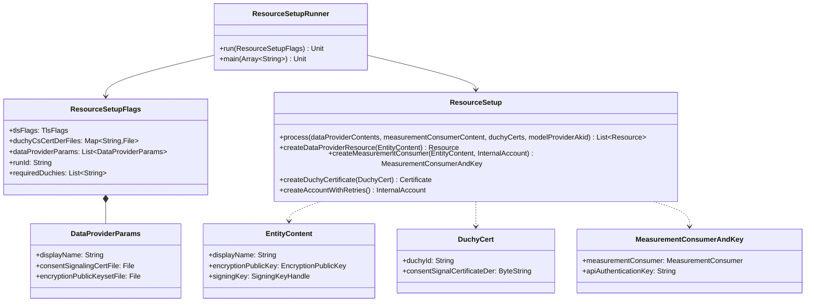

# org.wfanet.measurement.loadtest.resourcesetup

## Overview
This package provides infrastructure for setting up test resources in the Cross-Media Measurement system's load testing environment. It orchestrates the creation of DataProviders, MeasurementConsumers, Duchies, ModelProviders, and ModelLines by communicating with Kingdom's public and internal APIs, generating configuration files for Bazel-based test execution.

## Components

### ResourceSetup
Core orchestration class that manages resource creation workflow and outputs configuration artifacts.

| Method | Parameters | Returns | Description |
|--------|------------|---------|-------------|
| process | `dataProviderContents: List<EntityContent>`, `measurementConsumerContent: EntityContent`, `duchyCerts: List<DuchyCert>`, `modelProviderAkid: ByteString` | `List<Resources.Resource>` | Orchestrates complete resource setup workflow |
| createDataProviderResource | `dataProviderContent: EntityContent` | `Resources.Resource` | Creates DataProvider resource with signing certificate |
| createInternalDataProvider | `dataProviderContent: EntityContent` | `InternalDataProvider` | Creates internal DataProvider via Kingdom API |
| createModelProviderResource | `modelProviderAkid: ByteString` | `Resources.Resource` | Creates ModelProvider resource with authority key identifier |
| createModelLineResource | `externalModelProviderId: Long` | `Resources.Resource` | Creates ModelLine within ModelSuite hierarchy |
| createAccountWithRetries | None | `InternalAccount` | Creates initial account with retry logic for Kingdom startup |
| createMeasurementConsumer | `measurementConsumerContent: EntityContent`, `internalAccount: InternalAccount` | `MeasurementConsumerAndKey` | Creates MeasurementConsumer with API authentication key |
| createDuchyCertificate | `duchyCert: DuchyCert` | `Certificate` | Registers Duchy's consent signaling certificate |

**Constructor Parameters:**
- `internalAccountsClient: AccountsCoroutineStub` - Kingdom internal accounts service
- `internalDataProvidersClient: DataProvidersCoroutineStub` - Kingdom internal data providers service
- `internalCertificatesClient: CertificatesCoroutineStub` - Kingdom internal certificates service
- `accountsClient: AccountsCoroutineStub` - Kingdom public accounts service
- `apiKeysClient: ApiKeysCoroutineStub` - Kingdom public API keys service
- `measurementConsumersClient: MeasurementConsumersCoroutineStub` - Kingdom public measurement consumers service
- `runId: String` - Unique identifier for this setup run
- `requiredDuchies: List<String>` - Duchy IDs required for measurements
- `internalModelProvidersClient: ModelProvidersCoroutineStub?` - Optional model providers service
- `internalModelSuitesClient: ModelSuitesCoroutineStub?` - Optional model suites service
- `internalModelLinesClient: ModelLinesCoroutineStub?` - Optional model lines service
- `bazelConfigName: String` - Name for generated Bazel configuration
- `outputDir: File?` - Directory for output files, null for stdout

**Key Constants:**
- `DEFAULT_BAZEL_CONFIG_NAME = "halo"` - Default Bazel config name
- `MAX_RETRY_COUNT = 30` - Maximum Kingdom connection retries
- `SLEEP_INTERVAL_MILLIS = 10000` - Retry interval in milliseconds
- `RESOURCES_OUTPUT_FILE = "resources.textproto"` - Resource list output file
- `AKID_PRINCIPAL_MAP_FILE = "authority_key_identifier_to_principal_map.textproto"` - AKID mapping file
- `BAZEL_RC_FILE = "resource-setup.bazelrc"` - Bazel configuration file
- `MEASUREMENT_CONSUMER_CONFIG_FILE = "measurement_consumer_config.textproto"` - MC config file
- `ENCRYPTION_KEY_PAIR_CONFIG_FILE = "encryption_key_pair_config.textproto"` - Encryption config file

### ResourceSetupRunner
Command-line entry point that configures gRPC channels and executes the setup workflow.

| Method | Parameters | Returns | Description |
|--------|------------|---------|-------------|
| run | `flags: ResourceSetupFlags` | `Unit` | Builds gRPC stubs and executes resource setup |
| main | `args: Array<String>` | `Unit` | Command-line entry point with argument parsing |

**Annotations:**
- `@CommandLine.Command(name = "RunResourceSetupJob")` - Picocli command configuration

### ResourceSetupFlags
Picocli-based command-line flag definitions for resource setup configuration.

| Property | Type | Description |
|----------|------|-------------|
| tlsFlags | `TlsFlags` | TLS certificates for mutual authentication |
| duchyCsCertDerFiles | `Map<String, File>` | Map of Duchy ID to consent signaling cert files |
| mcCsCertDerFile | `File` | MeasurementConsumer consent signaling cert file |
| dataProviderParams | `List<DataProviderParams>` | DataProvider configuration parameters |
| modelProviderRootCertFile | `File` | ModelProvider root CA certificate |
| mcCsKeyDerFile | `File` | MeasurementConsumer signing private key file |
| mcEncryptionPublicKeyset | `File` | MeasurementConsumer encryption public keyset |
| bazelConfigName | `String` | Name for Bazel configuration output |
| outputDir | `File?` | Optional output directory, null for stdout |
| kingdomPublicApiFlags | `KingdomPublicApiFlags` | Kingdom public API connection flags |
| kingdomInternalApiFlags | `KingdomInternalApiFlags` | Kingdom internal API connection flags |
| runId | `String` | Unique run identifier, defaults to timestamp |
| requiredDuchies | `List<String>` | Duchy IDs required for measurements |

### ResourceSetupFlags.DataProviderParams
Nested class containing DataProvider-specific configuration parameters.

| Property | Type | Description |
|----------|------|-------------|
| displayName | `String` | DataProvider display name |
| consentSignalingCertFile | `File` | Consent signaling certificate in DER format |
| consentSignalingKeyFile | `File` | Consent signaling private key in DER format |
| encryptionPublicKeysetFile | `File` | Encryption public key in Tink Keyset format |

## Data Structures

### EntityContent
| Property | Type | Description |
|----------|------|-------------|
| displayName | `String` | Display name of the entity |
| encryptionPublicKey | `EncryptionPublicKey` | Consent signaling encryption public key |
| signingKey | `SigningKeyHandle` | Consent signaling signing key with certificate |

### DuchyCert
| Property | Type | Description |
|----------|------|-------------|
| duchyId | `String` | External Duchy identifier |
| consentSignalCertificateDer | `ByteString` | Consent signaling certificate in DER encoding |

### MeasurementConsumerAndKey
| Property | Type | Description |
|----------|------|-------------|
| measurementConsumer | `MeasurementConsumer` | Created MeasurementConsumer resource |
| apiAuthenticationKey | `String` | API key for authenticating MC requests |

## Dependencies
- `org.wfanet.measurement.api.v2alpha` - Kingdom public API protobuf services (Accounts, ApiKeys, MeasurementConsumers)
- `org.wfanet.measurement.internal.kingdom` - Kingdom internal API protobuf services (DataProviders, Certificates, ModelProviders)
- `org.wfanet.measurement.common.grpc` - gRPC channel builders and TLS configuration
- `org.wfanet.measurement.common.crypto` - Certificate parsing, signing key handling, and Tink encryption
- `org.wfanet.measurement.consent.client` - Encryption public key signing utilities
- `org.wfanet.measurement.loadtest.common` - Output handling (FileOutput, ConsoleOutput)
- `picocli.CommandLine` - Command-line argument parsing framework
- `kotlinx.coroutines` - Asynchronous operation support with retry logic
- `com.google.protobuf` - Protocol buffer serialization and TextFormat output

## Usage Example
```kotlin
// Command-line execution
fun main(args: Array<String>) {
  commandLineMain(::run, args)
}

// Programmatic setup
val resourceSetup = ResourceSetup(
  internalAccountsClient = internalAccountsStub,
  internalDataProvidersClient = internalDataProvidersStub,
  internalCertificatesClient = internalCertificatesStub,
  accountsClient = accountsStub,
  apiKeysClient = apiKeysStub,
  measurementConsumersClient = measurementConsumersStub,
  runId = "2025-01-16-12-30-45",
  requiredDuchies = listOf("duchy1", "duchy2"),
  bazelConfigName = "halo",
  outputDir = File("/output")
)

val resources = resourceSetup.process(
  dataProviderContents = listOf(edpContent1, edpContent2),
  measurementConsumerContent = mcContent,
  duchyCerts = listOf(duchyCert1, duchyCert2),
  modelProviderAkid = modelProviderAkid
)
```

## Workflow Overview
The resource setup follows this sequential process:

1. **Account Creation** - Creates initial account with retry logic to handle Kingdom startup delays
2. **MeasurementConsumer Setup** - Activates account, creates MC with certificates and encryption keys
3. **DataProvider Creation** - Creates multiple DataProviders with signing/encryption credentials
4. **Duchy Registration** - Registers consent signaling certificates for each Duchy
5. **ModelProvider Setup** - Creates ModelProvider and associated ModelLine within ModelSuite
6. **Output Generation** - Writes configuration files:
   - `resources.textproto` - All created resource identifiers
   - `authority_key_identifier_to_principal_map.textproto` - AKID to principal mappings
   - `resource-setup.bazelrc` - Bazel build variables
   - `measurement_consumer_config.textproto` - MC authentication configuration
   - `encryption_key_pair_config.textproto` - Encryption key paths

## Error Handling
- **Kingdom Unavailability** - Retries initial account creation up to 30 times with 10-second intervals
- **gRPC Status Exceptions** - Wrapped with context-specific error messages indicating operation type
- **Missing Certificates** - Validates required certificate extensions (AKID, SKID) with null checks
- **File I/O** - Uses Kotlin's `use` blocks for automatic resource cleanup during output writing

## Class Diagram

