# org.wfanet.measurement.measurementconsumer.stats

## Overview
This package provides statistical analysis capabilities for cross-media measurements, including variance and covariance calculations for reach, frequency, impression, and watch duration metrics. It supports multiple measurement methodologies including deterministic count distinct, Liquid Legions sketch-based approaches, frequency vector-based methods, and custom direct methodologies with differential privacy noise mechanisms.

## Components

### Covariances
Computes covariances between reach measurements using different methodologies.

| Method | Parameters | Returns | Description |
|--------|------------|---------|-------------|
| computeDeterministicCovariance | `reachMeasurementCovarianceParams: ReachMeasurementCovarianceParams` | `Double` | Calculates covariance for deterministic count distinct measurements |
| computeLiquidLegionsCovariance | `sketchParams: LiquidLegionsSketchParams`, `reachMeasurementCovarianceParams: ReachMeasurementCovarianceParams` | `Double` | Calculates covariance for Liquid Legions sketch measurements |
| computeMeasurementCovariance | `weightedMeasurementVarianceParams: WeightedReachMeasurementVarianceParams`, `otherWeightedMeasurementVarianceParams: WeightedReachMeasurementVarianceParams`, `unionWeightedMeasurementVarianceParams: WeightedReachMeasurementVarianceParams` | `Double` | Selects appropriate covariance method based on methodology |
| computeUnionSamplingWidth | `vidSamplingInterval: VidSamplingInterval`, `otherVidSamplingInterval: VidSamplingInterval` | `Double` | Computes width of union of two sampling intervals |

### FrequencyVectorBasedVariance
Computes statistics for frequency vector-based measurements (HMSS/TrusTEE).

| Method | Parameters | Returns | Description |
|--------|------------|---------|-------------|
| reachVariance | `frequencyVectorSize: Long`, `vidSamplingIntervalWidth: Double`, `reach: Long`, `reachNoiseVariance: Double` | `Double` | Calculates variance of reach measurement |
| frequencyCountVariance | `frequencyVectorSize: Long`, `frequency: Int`, `frequencyNoiseVariance: Double`, `relativeFrequencyMeasurementVarianceParams: RelativeFrequencyMeasurementVarianceParams` | `Double` | Computes variance of kReach (exact frequency count) |
| kPlusFrequencyCountVariance | `frequencyVectorSize: Long`, `frequency: Int`, `frequencyNoiseVariance: Double`, `relativeFrequencyMeasurementVarianceParams: RelativeFrequencyMeasurementVarianceParams` | `Double` | Computes variance of kPlusReach (k or more frequency) |
| frequencyRelativeVariance | `frequencyVectorSize: Long`, `frequency: Int`, `frequencyNoiseVariance: Double`, `relativeFrequencyMeasurementVarianceParams: RelativeFrequencyMeasurementVarianceParams` | `Double` | Computes variance of relative frequency ratio |
| kPlusFrequencyRelativeVariance | `frequencyVectorSize: Long`, `frequency: Int`, `frequencyNoiseVariance: Double`, `relativeFrequencyMeasurementVarianceParams: RelativeFrequencyMeasurementVarianceParams` | `Double` | Computes variance of k-plus relative frequency ratio |

### LiquidLegions
Computes statistics for Liquid Legions sketch-based measurements.

| Method | Parameters | Returns | Description |
|--------|------------|---------|-------------|
| inflatedReachCovariance | `sketchParams: LiquidLegionsSketchParams`, `reach: Long`, `otherReach: Long`, `overlapReach: Long`, `samplingWidth: Double`, `otherSamplingWidth: Double`, `overlapSamplingWidth: Double`, `inflation: Double` | `Double` | Calculates covariance between Liquid Legions reach measurements with inflation |
| liquidLegionsFrequencyRelativeVariance | `sketchParams: LiquidLegionsSketchParams`, `collisionResolution: Boolean`, `frequencyNoiseVariance: Double`, `relativeFrequencyMeasurementVarianceParams: RelativeFrequencyMeasurementVarianceParams` | `Double` | Computes variance of relative frequency from Liquid Legions distribution |

### Variances (Interface)
Interface defining variance computation operations.

| Method | Parameters | Returns | Description |
|--------|------------|---------|-------------|
| computeMetricVariance | `params: ReachMetricVarianceParams` | `Double` | Computes variance of reach metric |
| computeMeasurementVariance | `methodology: Methodology`, `measurementVarianceParams: ReachMeasurementVarianceParams` | `Double` | Computes reach measurement variance by methodology |
| computeMetricVariance | `params: FrequencyMetricVarianceParams` | `FrequencyVariances` | Computes variance of frequency metric |
| computeMeasurementVariance | `methodology: Methodology`, `measurementVarianceParams: FrequencyMeasurementVarianceParams` | `FrequencyVariances` | Computes frequency measurement variance by methodology |
| computeMetricVariance | `params: ImpressionMetricVarianceParams` | `Double` | Computes variance of impression metric |
| computeMeasurementVariance | `methodology: Methodology`, `measurementVarianceParams: ImpressionMeasurementVarianceParams` | `Double` | Computes impression measurement variance by methodology |
| computeMetricVariance | `params: WatchDurationMetricVarianceParams` | `Double` | Computes variance of watch duration metric |
| computeMeasurementVariance | `methodology: Methodology`, `measurementVarianceParams: WatchDurationMeasurementVarianceParams` | `Double` | Computes watch duration measurement variance by methodology |

### VariancesImpl
Default implementation of the Variances interface with support for all measurement types and methodologies.

## Data Structures

### Methodology Hierarchies

#### Methodology (sealed interface)
Base interface for all measurement methodologies.

**Implementations:**
- **CustomDirectScalarMethodology**: Custom methodology with direct variance specification
- **CustomDirectFrequencyMethodology**: Custom methodology with frequency-specific variances
- **DeterministicMethodology**: Deterministic count distinct methodology
- **LiquidLegionsSketchMethodology**: Liquid Legions sketch-based methodology
- **LiquidLegionsV2Methodology**: Liquid Legions V2 with sampling indicator
- **HonestMajorityShareShuffleMethodology**: HMSS frequency vector-based methodology
- **TrusTeeMethodology**: TrusTEE frequency vector-based methodology

### Measurement Parameters

| Data Class | Properties | Description |
|------------|------------|-------------|
| VidSamplingInterval | `start: Double`, `width: Double` | Defines virtual ID sampling interval |
| ReachMeasurementParams | `vidSamplingInterval: VidSamplingInterval`, `dpParams: DpParams`, `noiseMechanism: NoiseMechanism` | Parameters for reach measurement computation |
| FrequencyMeasurementParams | `vidSamplingInterval: VidSamplingInterval`, `dpParams: DpParams`, `noiseMechanism: NoiseMechanism`, `maximumFrequency: Int` | Parameters for frequency measurement computation |
| ImpressionMeasurementParams | `vidSamplingInterval: VidSamplingInterval`, `dpParams: DpParams`, `maximumFrequencyPerUser: Int`, `noiseMechanism: NoiseMechanism` | Parameters for impression measurement computation |
| WatchDurationMeasurementParams | `vidSamplingInterval: VidSamplingInterval`, `dpParams: DpParams`, `maximumDurationPerUser: Double`, `noiseMechanism: NoiseMechanism` | Parameters for watch duration measurement computation |

### Variance Parameters

| Data Class | Properties | Description |
|------------|------------|-------------|
| ReachMeasurementVarianceParams | `reach: Long`, `measurementParams: ReachMeasurementParams` | Parameters for reach variance computation |
| FrequencyMeasurementVarianceParams | `totalReach: Long`, `reachMeasurementVariance: Double`, `relativeFrequencyDistribution: Map<Int, Double>`, `measurementParams: FrequencyMeasurementParams` | Parameters for frequency variance computation |
| RelativeFrequencyMeasurementVarianceParams | `totalReach: Long`, `reachMeasurementVariance: Double`, `reachRatio: Double`, `measurementParams: FrequencyMeasurementParams`, `multiplier: Int` | Parameters for relative frequency variance computation |
| ImpressionMeasurementVarianceParams | `impression: Long`, `measurementParams: ImpressionMeasurementParams` | Parameters for impression variance computation |
| WatchDurationMeasurementVarianceParams | `duration: Double`, `measurementParams: WatchDurationMeasurementParams` | Parameters for watch duration variance computation |

### Weighted Variance Parameters

| Data Class | Properties | Description |
|------------|------------|-------------|
| WeightedReachMeasurementVarianceParams | `binaryRepresentation: Int`, `weight: Int`, `measurementVarianceParams: ReachMeasurementVarianceParams`, `methodology: Methodology` | Weighted reach measurement for set operations |
| WeightedFrequencyMeasurementVarianceParams | `binaryRepresentation: Int`, `weight: Int`, `measurementVarianceParams: FrequencyMeasurementVarianceParams`, `methodology: Methodology` | Weighted frequency measurement for set operations |
| WeightedImpressionMeasurementVarianceParams | `binaryRepresentation: Int`, `weight: Int`, `measurementVarianceParams: ImpressionMeasurementVarianceParams`, `methodology: Methodology` | Weighted impression measurement for set operations |
| WeightedWatchDurationMeasurementVarianceParams | `binaryRepresentation: Int`, `weight: Int`, `measurementVarianceParams: WatchDurationMeasurementVarianceParams`, `methodology: Methodology` | Weighted watch duration measurement for set operations |

### Metric Variance Parameters

| Data Class | Properties | Description |
|------------|------------|-------------|
| ReachMetricVarianceParams | `weightedMeasurementVarianceParamsList: List<WeightedReachMeasurementVarianceParams>` | Parameters for reach metric variance with set expressions |
| FrequencyMetricVarianceParams | `weightedMeasurementVarianceParamsList: List<WeightedFrequencyMeasurementVarianceParams>` | Parameters for frequency metric variance (union-only) |
| ImpressionMetricVarianceParams | `weightedMeasurementVarianceParamsList: List<WeightedImpressionMeasurementVarianceParams>` | Parameters for impression metric variance (union-only) |
| WatchDurationMetricVarianceParams | `weightedMeasurementVarianceParamsList: List<WeightedWatchDurationMeasurementVarianceParams>` | Parameters for watch duration metric variance (union-only) |

### Result Structures

| Data Class | Properties | Description |
|------------|------------|-------------|
| FrequencyVariances | `relativeVariances: FrequencyVariance`, `kPlusRelativeVariances: FrequencyVariance`, `countVariances: FrequencyVariance`, `kPlusCountVariances: FrequencyVariance` | Container for all frequency variance types |
| ReachMeasurementCovarianceParams | `reach: Long`, `otherReach: Long`, `unionReach: Long`, `samplingWidth: Double`, `otherSamplingWidth: Double`, `unionSamplingWidth: Double` | Parameters for covariance computation |
| LiquidLegionsSketchParams | `decayRate: Double`, `sketchSize: Long` | Liquid Legions sketch configuration with computed constant |

### Enumerations

| Enum | Values | Description |
|------|--------|-------------|
| NoiseMechanism | `NONE`, `LAPLACE`, `GAUSSIAN` | Differential privacy noise mechanisms |

### Type Aliases

| Alias | Type | Description |
|-------|------|-------------|
| FrequencyVariance | `Map<Int, Double>` | Maps frequency level to variance value |

### Exceptions

| Exception | Description |
|-----------|-------------|
| UnsupportedMethodologyUsageException | Thrown when methodology is incompatible with measurement type |

## Dependencies

- `org.wfanet.measurement.eventdataprovider.noiser` - Differential privacy noise generation (DpParams, LaplaceNoiser, GaussianNoiser)
- `org.wfanet.measurement.eventdataprovider.privacybudgetmanagement` - Privacy budget parameter conversion (AcdpParamsConverter)
- `org.apache.commons.numbers.gamma` - Mathematical functions (IncompleteBeta, IncompleteGamma)
- `org.apache.commons.numbers.core` - Numerical precision utilities (Precision)
- `kotlin.math` - Mathematical operations (exp, sqrt, pow, max, min, ceil)
- `kotlin.random` - Random number generation for noise variance calculation

## Key Functionality

### Variance Calculation
The package supports variance calculation for four measurement types:
1. **Reach**: Number of unique individuals reached
2. **Frequency**: Distribution of how many times individuals were reached
3. **Impression**: Total number of ad impressions
4. **Watch Duration**: Total time spent watching content

### Supported Methodologies
- **Deterministic**: Count distinct with sampling and DP noise
- **Liquid Legions Sketch**: Probabilistic sketch-based cardinality estimation
- **Liquid Legions V2**: Enhanced version with sampling indicators and distributed noise
- **Honest Majority Share Shuffle (HMSS)**: Secure multi-party computation with frequency vectors
- **TrusTEE**: Trusted execution environment with frequency vectors
- **Custom Direct**: User-provided variance values

### Covariance Computation
Supports computing covariances between reach measurements for set expression evaluation (union, intersection, difference). The methodology-aware computation handles:
- Deterministic measurements with sampling overlap
- Liquid Legions sketch pairs with matching parameters
- Independence guarantee for custom direct methodologies

### Differential Privacy
Integrates noise variance from Laplace and Gaussian mechanisms with configurable epsilon and delta parameters. Distinguishes between direct noise (single-party) and distributed noise (multi-party computation).

## Usage Example

```kotlin
// Define sampling interval
val vidSamplingInterval = VidSamplingInterval(start = 0.0, width = 0.01)

// Configure differential privacy
val dpParams = DpParams(epsilon = 1.0, delta = 1e-9)

// Create reach measurement parameters
val reachParams = ReachMeasurementParams(
    vidSamplingInterval = vidSamplingInterval,
    dpParams = dpParams,
    noiseMechanism = NoiseMechanism.GAUSSIAN
)

// Define variance parameters
val varianceParams = ReachMeasurementVarianceParams(
    reach = 1_000_000L,
    measurementParams = reachParams
)

// Compute variance using Liquid Legions V2
val methodology = LiquidLegionsV2Methodology(
    decayRate = 12.0,
    sketchSize = 100_000L,
    samplingIndicatorSize = 100_000L
)

val variance = VariancesImpl.computeMeasurementVariance(
    methodology = methodology,
    measurementVarianceParams = varianceParams
)

// For frequency measurements
val frequencyParams = FrequencyMeasurementParams(
    vidSamplingInterval = vidSamplingInterval,
    dpParams = dpParams,
    noiseMechanism = NoiseMechanism.GAUSSIAN,
    maximumFrequency = 10
)

val frequencyVarianceParams = FrequencyMeasurementVarianceParams(
    totalReach = 1_000_000L,
    reachMeasurementVariance = variance,
    relativeFrequencyDistribution = mapOf(
        1 to 0.5,
        2 to 0.3,
        3 to 0.2
    ),
    measurementParams = frequencyParams
)

val frequencyVariances = VariancesImpl.computeMeasurementVariance(
    methodology = methodology,
    measurementVarianceParams = frequencyVarianceParams
)
```

## Class Diagram

```mermaid
classDiagram
    class Variances {
        <<interface>>
        +computeMetricVariance(ReachMetricVarianceParams) Double
        +computeMeasurementVariance(Methodology, ReachMeasurementVarianceParams) Double
        +computeMetricVariance(FrequencyMetricVarianceParams) FrequencyVariances
        +computeMeasurementVariance(Methodology, FrequencyMeasurementVarianceParams) FrequencyVariances
        +computeMetricVariance(ImpressionMetricVarianceParams) Double
        +computeMeasurementVariance(Methodology, ImpressionMeasurementVarianceParams) Double
        +computeMetricVariance(WatchDurationMetricVarianceParams) Double
        +computeMeasurementVariance(Methodology, WatchDurationMeasurementVarianceParams) Double
    }

    class VariancesImpl {
        +computeMetricVariance(ReachMetricVarianceParams) Double
        +computeMeasurementVariance(Methodology, ReachMeasurementVarianceParams) Double
        +computeMetricVariance(FrequencyMetricVarianceParams) FrequencyVariances
        +computeMeasurementVariance(Methodology, FrequencyMeasurementVarianceParams) FrequencyVariances
    }

    class Covariances {
        +computeDeterministicCovariance(ReachMeasurementCovarianceParams) Double
        +computeLiquidLegionsCovariance(LiquidLegionsSketchParams, ReachMeasurementCovarianceParams) Double
        +computeMeasurementCovariance(WeightedReachMeasurementVarianceParams, WeightedReachMeasurementVarianceParams, WeightedReachMeasurementVarianceParams) Double
        +computeUnionSamplingWidth(VidSamplingInterval, VidSamplingInterval) Double
    }

    class LiquidLegions {
        +inflatedReachCovariance(LiquidLegionsSketchParams, Long, Long, Long, Double, Double, Double, Double) Double
        +liquidLegionsFrequencyRelativeVariance(LiquidLegionsSketchParams, Boolean, Double, RelativeFrequencyMeasurementVarianceParams) Double
    }

    class FrequencyVectorBasedVariance {
        +reachVariance(Long, Double, Long, Double) Double
        +frequencyCountVariance(Long, Int, Double, RelativeFrequencyMeasurementVarianceParams) Double
        +kPlusFrequencyCountVariance(Long, Int, Double, RelativeFrequencyMeasurementVarianceParams) Double
        +frequencyRelativeVariance(Long, Int, Double, RelativeFrequencyMeasurementVarianceParams) Double
        +kPlusFrequencyRelativeVariance(Long, Int, Double, RelativeFrequencyMeasurementVarianceParams) Double
    }

    class Methodology {
        <<interface>>
    }

    class DeterministicMethodology {
    }

    class LiquidLegionsSketchMethodology {
        +decayRate: Double
        +sketchSize: Long
    }

    class LiquidLegionsV2Methodology {
        +decayRate: Double
        +sketchSize: Long
        +samplingIndicatorSize: Long
    }

    class HonestMajorityShareShuffleMethodology {
        +frequencyVectorSize: Long
    }

    class TrusTeeMethodology {
        +frequencyVectorSize: Long
    }

    class FrequencyVariances {
        +relativeVariances: FrequencyVariance
        +kPlusRelativeVariances: FrequencyVariance
        +countVariances: FrequencyVariance
        +kPlusCountVariances: FrequencyVariance
    }

    class ReachMeasurementVarianceParams {
        +reach: Long
        +measurementParams: ReachMeasurementParams
    }

    class FrequencyMeasurementVarianceParams {
        +totalReach: Long
        +reachMeasurementVariance: Double
        +relativeFrequencyDistribution: Map~Int, Double~
        +measurementParams: FrequencyMeasurementParams
    }

    VariancesImpl ..|> Variances
    VariancesImpl --> Covariances
    VariancesImpl --> LiquidLegions
    VariancesImpl --> FrequencyVectorBasedVariance
    Covariances --> LiquidLegions
    DeterministicMethodology ..|> Methodology
    LiquidLegionsSketchMethodology ..|> Methodology
    LiquidLegionsV2Methodology ..|> Methodology
    HonestMajorityShareShuffleMethodology ..|> Methodology
    TrusTeeMethodology ..|> Methodology
    VariancesImpl --> Methodology
    VariancesImpl --> ReachMeasurementVarianceParams
    VariancesImpl --> FrequencyMeasurementVarianceParams
    VariancesImpl --> FrequencyVariances
```


