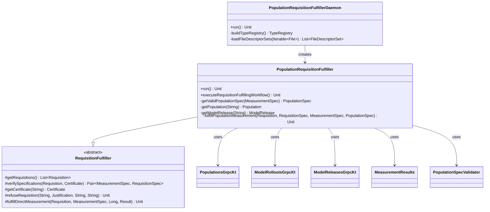

# org.wfanet.measurement.populationdataprovider

## Overview
This package provides requisition fulfillment capabilities for Population Data Providers (PDPs) within the Cross-Media Measurement System. It processes measurement requisitions by validating population specifications, retrieving model releases, computing population values, and fulfilling measurements through the Kingdom public API.

## Components

### PopulationRequisitionFulfiller
Extends `RequisitionFulfiller` to handle population-specific measurement requisitions. Supports a single CMMS instance with validation of population specifications, model release management, and direct measurement fulfillment.

| Method | Parameters | Returns | Description |
|--------|------------|---------|-------------|
| run | - | `suspend Unit` | Continuously executes fulfillment workflow via throttler |
| executeRequisitionFulfillingWorkflow | - | `suspend Unit` | Retrieves and processes unfulfilled requisitions |
| getValidPopulationSpec | `measurementSpec: MeasurementSpec` | `suspend PopulationSpec` | Validates and returns PopulationSpec for measurement |
| getPopulation | `populationName: String` | `suspend Population` | Retrieves Population resource from public API |
| getModelRelease | `modelLineName: String` | `suspend ModelRelease` | Returns ModelRelease from latest ModelRollout |
| fulfillPopulationMeasurement | `requisition: Requisition, requisitionSpec: RequisitionSpec, measurementSpec: MeasurementSpec, populationSpec: PopulationSpec` | `suspend Unit` | Computes population value and fulfills measurement |

**Constructor Parameters:**
| Parameter | Type | Description |
|-----------|------|-------------|
| pdpData | `DataProviderData` | PDP credentials and encryption keys |
| certificatesStub | `CertificatesCoroutineStub` | gRPC stub for certificate operations |
| requisitionsStub | `RequisitionsCoroutineStub` | gRPC stub for requisition operations |
| throttler | `Throttler` | Rate limiting for polling operations |
| trustedCertificates | `Map<ByteString, X509Certificate>` | Trusted certificate collection |
| modelRolloutsStub | `ModelRolloutsCoroutineStub` | gRPC stub for model rollout operations |
| modelReleasesStub | `ModelReleasesCoroutineStub` | gRPC stub for model release operations |
| populationsStub | `PopulationsCoroutineStub` | gRPC stub for population operations |
| eventMessageDescriptor | `Descriptors.Descriptor` | Protobuf descriptor for event messages |

**Exception Handling:**
- Throws `RequisitionRefusalException` when consent signal is invalid or PopulationSpec validation fails
- Throws `UnfulfillableRequisitionException` when Population lacks PopulationSpec or is not found
- Throws `InvalidRequisitionException` when ModelLine not found or population filter is invalid

### PopulationRequisitionFulfillerDaemon
Command-line application that initializes and runs the PopulationRequisitionFulfiller. Uses PicoCLI for configuration management and establishes mutual TLS connections to the Kingdom public API.

| Method | Parameters | Returns | Description |
|--------|------------|---------|-------------|
| run | - | `Unit` | Initializes services and starts requisition fulfiller |
| buildTypeRegistry | - | `TypeRegistry` | Constructs TypeRegistry from event descriptor sets |
| loadFileDescriptorSets | `files: Iterable<File>` | `List<FileDescriptorSet>` | Loads protobuf descriptors from files |
| main | `args: Array<String>` | `Unit` | Entry point for daemon execution |

**Command-Line Options:**
| Option | Required | Description |
|--------|----------|-------------|
| --kingdom-public-api-target | Yes | gRPC target authority for Kingdom API |
| --kingdom-public-api-cert-host | No | Expected TLS certificate hostname |
| --data-provider-resource-name | Yes | Public API resource name for PDP |
| --data-provider-certificate-resource-name | Yes | Resource name for consent signaling certificate |
| --data-provider-encryption-private-keyset | Yes | Tink keyset file for encryption |
| --data-provider-consent-signaling-private-key-der-file | Yes | Private key for consent signaling |
| --data-provider-consent-signaling-certificate-der-file | Yes | Certificate for consent signaling |
| --throttler-minimum-interval | No | Minimum throttle interval (default: 2s) |
| --event-message-descriptor-set | Yes | FileDescriptorSet for event messages |
| --event-message-type-url | Yes | Protobuf type URL for event messages |

## Dependencies

### External Dependencies
- `org.wfanet.measurement.api.v2alpha` - Kingdom public API resources (Requisition, Measurement, Population, ModelRelease, etc.)
- `org.wfanet.measurement.dataprovider` - Base RequisitionFulfiller and exception types
- `org.wfanet.measurement.common` - Cryptography, gRPC utilities, and throttling
- `org.wfanet.measurement.eventdataprovider.eventfiltration.validation` - Event filter validation
- `com.google.protobuf` - Protocol buffer support and descriptor handling
- `io.grpc` - gRPC communication framework
- `picocli` - Command-line interface framework

### Key Relationships
- Extends `org.wfanet.measurement.dataprovider.RequisitionFulfiller`
- Uses `MeasurementResults.computePopulation()` for population calculation
- Validates PopulationSpec via `PopulationSpecValidator`
- Interacts with Kingdom API via gRPC stubs for Populations, ModelRollouts, ModelReleases, Requisitions, and Certificates

## Usage Example

```kotlin
// Initialize PDP data with credentials
val pdpData = DataProviderData(
  dataProviderResourceName,
  encryptionPrivateKey,
  signingKeyHandle,
  certificateKey
)

// Build gRPC stubs
val publicApiChannel = buildMutualTlsChannel(target, clientCerts, certHost)
val certificatesStub = CertificatesCoroutineStub(publicApiChannel)
val requisitionsStub = RequisitionsCoroutineStub(publicApiChannel)
val modelRolloutsStub = ModelRolloutsCoroutineStub(publicApiChannel)
val modelReleasesStub = ModelReleasesCoroutineStub(publicApiChannel)
val populationsStub = PopulationsCoroutineStub(publicApiChannel)

// Create throttler for rate limiting
val throttler = MinimumIntervalThrottler(Clock.systemUTC(), throttlerInterval)

// Initialize fulfiller
val fulfiller = PopulationRequisitionFulfiller(
  pdpData,
  certificatesStub,
  requisitionsStub,
  throttler,
  trustedCertificates,
  modelRolloutsStub,
  modelReleasesStub,
  populationsStub,
  eventMessageDescriptor
)

// Run fulfillment loop
runBlocking { fulfiller.run() }
```

## Class Diagram


