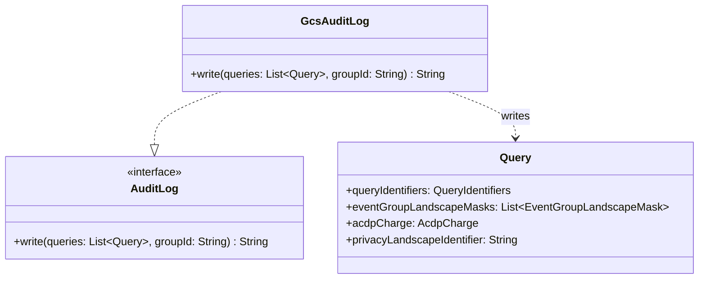

# org.wfanet.measurement.privacybudgetmanager.deploy.gcloud

## Overview
Google Cloud Storage implementation of the Privacy Budget Manager audit logging layer. This package provides GCS-backed persistent storage for charged PBM queries, enabling Event Data Providers to maintain an audit trail of all privacy budget expenditures for compliance and verification purposes.

## Components

### GcsAuditLog
Implementation of AuditLog interface using Google Cloud Storage as the persistence layer.

| Method | Parameters | Returns | Description |
|--------|------------|---------|-------------|
| write | `queries: List<Query>`, `groupId: String` | `String` | Writes queries to GCS audit log and returns blob URL |

**Implementation Status**: Stub implementation - marked with TODO for completion.

**Inheritance**: Implements `org.wfanet.measurement.privacybudgetmanager.AuditLog`

## Data Structures

This package contains no data classes. It relies on data structures defined in the parent package:

- `Query` (protobuf) - Represents a PBM query containing identifiers, landscape masks, and charges
- `QueryIdentifiers` - Top-level identifiers (EDP ID, reference ID, MC ID, refund flag, timestamp)
- `EventGroupLandscapeMask` - Filter criteria for targeting privacy buckets
- `AcdpCharge` - Differential privacy charge values (rho and theta)

## Dependencies

- `org.wfanet.measurement.privacybudgetmanager.AuditLog` - Interface defining audit log contract
- `org.wfanet.measurement.privacybudgetmanager.Query` - Protobuf message for PBM queries
- Google Cloud Storage (GCS) - Expected external dependency for blob storage (not yet imported)

## Usage Example

```kotlin
// Expected usage pattern once implemented
val auditLog = GcsAuditLog(bucketName = "edp-audit-logs", credentials = gcsCredentials)
val queries = listOf(
  query {
    queryIdentifiers = queryIdentifiers {
      eventDataProviderId = "edp-123"
      externalReferenceId = "requisition-456"
      measurementConsumerId = "mc-789"
      isRefund = false
    }
    acdpCharge = acdpCharge { rho = 0.1; theta = 0.01 }
  }
)
val groupId = "measurement-batch-001"
val auditReference = auditLog.write(queries, groupId)
// Returns: "gs://edp-audit-logs/2026/01/16/measurement-batch-001.jsonl"
```

## Class Diagram



## Architecture Context

### Role in Privacy Budget Manager

The `GcsAuditLog` serves as the EDP-owned persistent audit layer within the Privacy Budget Manager architecture:

1. **Write Path**: After PBM successfully commits charges to the ledger, it writes all processed queries to the audit log
2. **Idempotency**: Handles duplicate queries gracefully - if a charge operation is retried, previously committed queries are written again to maintain audit completeness
3. **Verification**: The returned GCS blob URL serves as a cryptographic reference that auditors can use to verify budget expenditures match ledger state

### Transaction Semantics

The audit log write occurs **after** the ledger transaction commits but **before** the PBM returns success to the caller. This ensures:
- No audit records for failed charges
- All successful charges have corresponding audit entries
- Duplicate entries are acceptable (idempotent replay support)

### Expected GCS Integration

When fully implemented, this component will likely:
- Serialize queries to JSON Lines format
- Generate deterministic blob paths using `groupId` and timestamp
- Return GCS URI (`gs://bucket/path`) as audit reference
- Handle authentication via service account credentials
- Implement retry logic for transient GCS failures
