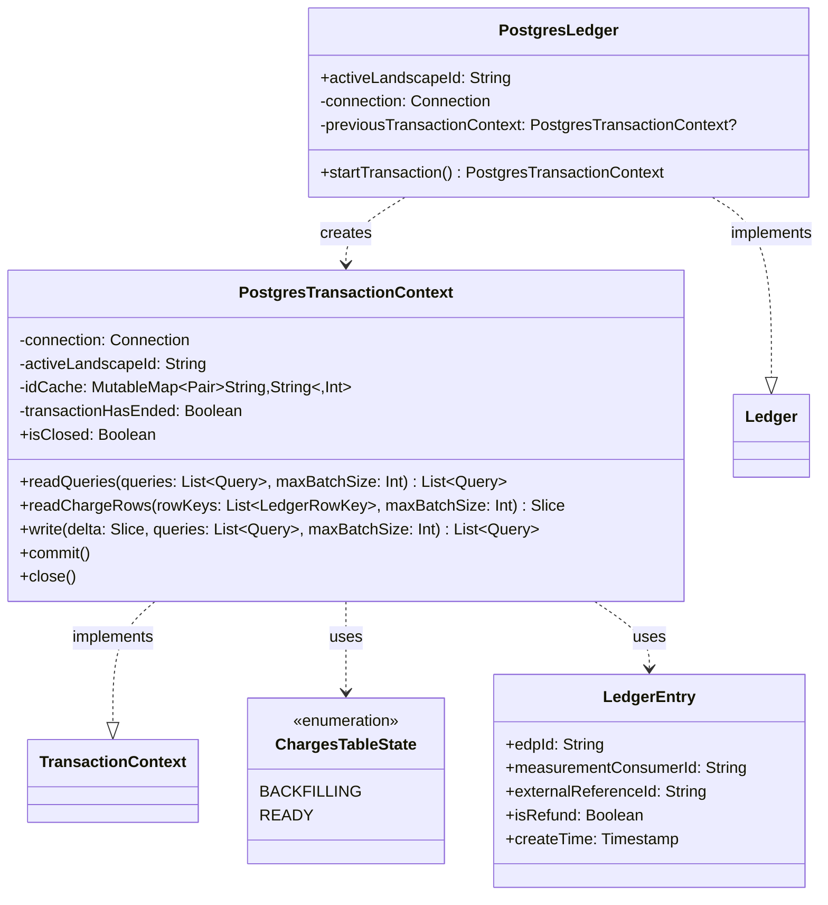

# org.wfanet.measurement.privacybudgetmanager.deploy.postgres

## Overview
PostgreSQL-based implementation of the Privacy Budget Manager ledger system. Provides transactional storage for privacy budget charges and ledger entries with support for batch operations, landscape migration, and ACID guarantees through PostgreSQL's native transaction management.

## Components

### PostgresLedger
Database-backed ledger implementation managing privacy budget tracking across event data providers and measurement consumers.

| Method | Parameters | Returns | Description |
|--------|------------|---------|-------------|
| startTransaction | - | `PostgresTransactionContext` | Creates new transaction context with validation checks |

**Constructor Parameters:**
- `createConnection: () -> Connection` - Factory function producing PostgreSQL JDBC connections
- `activeLandscapeId: String` - Identifier for the privacy landscape configuration

**Properties:**
- `activeLandscapeId: String` - Active privacy landscape identifier for all operations

### PostgresTransactionContext
Transaction-scoped context implementing ledger operations with batching and caching.

| Method | Parameters | Returns | Description |
|--------|------------|---------|-------------|
| readQueries | `queries: List<Query>`, `maxBatchSize: Int` | `List<Query>` | Retrieves queries from ledger with create times populated |
| readChargeRows | `rowKeys: List<LedgerRowKey>`, `maxBatchSize: Int` | `Slice` | Fetches charge data for specified row keys in batches |
| write | `delta: Slice`, `queries: List<Query>`, `maxBatchSize: Int` | `List<Query>` | Persists charge updates and ledger entries atomically |
| commit | - | `Unit` | Commits transaction and marks context as closed |
| close | - | `Unit` | Rolls back transaction and marks context as closed |
| getChargesTableState | - | `ChargesTableState` | Retrieves current state of PrivacyCharges table |
| checkTableState | - | `Unit` | Validates table is in READY state before operations |
| validateQueries | `queries: List<Query>` | `Unit` | Ensures all queries target the active landscape |
| getOrInsertEdpId | `eventDataProviderName: String` | `Int` | Retrieves or inserts EventDataProvider dimension ID |
| getOrInsertMeasurementConsumerId | `measurementConsumerName: String` | `Int` | Retrieves or inserts MeasurementConsumer dimension ID |
| getOrInsertEventGroupReferenceId | `eventGroupReferenceId: String` | `Int` | Retrieves or inserts EventGroupReference dimension ID |
| getOrInsertExternalReferenceId | `externalReferenceName: String` | `Int` | Retrieves or inserts LedgerEntryExternalReference dimension ID |
| getOrInsertResourceId | `tableName: String`, `value: String` | `Int` | Generic dimension table ID retrieval with caching |
| generateInClausePlaceholders | `batchSize: Int`, `clauseSize: Int` | `String` | Generates SQL IN clause placeholders for batch queries |

**Constructor Parameters:**
- `connection: Connection` - PostgreSQL JDBC connection instance
- `activeLandscapeId: String` - Privacy landscape identifier for validation

**Properties:**
- `isClosed: Boolean` - Indicates whether transaction has ended
- `idCache: MutableMap<Pair<String, String>, Int>` - Cache for dimension table integer IDs

### ChargesTableState (Enum)
Represents PrivacyCharges table operational state.

| Value | Description |
|-------|-------------|
| BACKFILLING | Table undergoing landscape migration, operations blocked |
| READY | Table ready for normal read/write operations |

### LedgerEntry (Data Class)
Internal representation of ledger entry row data.

| Property | Type | Description |
|----------|------|-------------|
| edpId | `String` | Event data provider identifier |
| measurementConsumerId | `String` | Measurement consumer identifier |
| externalReferenceId | `String` | External reference (requisition) identifier |
| isRefund | `Boolean` | Indicates if entry represents a refund |
| createTime | `Timestamp` | Timestamp when entry was created |

## Data Structures

### Database Schema (ledger.sql)

#### PrivacyChargesMetadata Table
| Column | Type | Description |
|--------|------|-------------|
| PrivacyLandscapeName | `TEXT` | Primary key, privacy landscape identifier |
| State | `ChargesTableState` | Current operational state of charges table |
| CreateTime | `TIMESTAMP` | Table creation timestamp |
| DeleteTime | `TIMESTAMP` | Table deletion timestamp (nullable) |

#### EventDataProviders Table
| Column | Type | Description |
|--------|------|-------------|
| id | `SERIAL` | Auto-incrementing primary key |
| EventDataProviderName | `TEXT` | Kingdom resource name (unique) |

#### MeasurementConsumers Table
| Column | Type | Description |
|--------|------|-------------|
| id | `SERIAL` | Auto-incrementing primary key |
| MeasurementConsumerName | `TEXT` | Kingdom resource name (unique) |

#### EventGroupReferences Table
| Column | Type | Description |
|--------|------|-------------|
| id | `SERIAL` | Auto-incrementing primary key |
| EventGroupReferenceId | `TEXT` | Event group reference identifier (unique) |

#### LedgerEntryExternalReferences Table
| Column | Type | Description |
|--------|------|-------------|
| id | `SERIAL` | Auto-incrementing primary key |
| LedgerEntryExternalReferenceName | `TEXT` | Kingdom requisition resource name (unique) |

#### PrivacyCharges Table
| Column | Type | Description |
|--------|------|-------------|
| id | `SERIAL` | Auto-incrementing primary key |
| EventDataProviderId | `INTEGER` | Foreign key to EventDataProviders |
| MeasurementConsumerId | `INTEGER` | Foreign key to MeasurementConsumers |
| EventGroupReferenceId | `INTEGER` | Foreign key to EventGroupReferences |
| Date | `DATE` | Date for privacy bucket (DD-MM-YYYY) |
| Charges | `BYTEA` | Serialized Charges protobuf |

**Unique Constraint:** (EventDataProviderId, MeasurementConsumerId, EventGroupReferenceId, Date)

#### LedgerEntries Table
| Column | Type | Description |
|--------|------|-------------|
| id | `SERIAL` | Auto-incrementing primary key |
| EventDataProviderId | `INTEGER` | Foreign key to EventDataProviders |
| MeasurementConsumerId | `INTEGER` | Foreign key to MeasurementConsumers |
| ExternalReferenceId | `INTEGER` | Foreign key to LedgerEntryExternalReferences |
| IsRefund | `BOOLEAN` | Refund indicator flag |
| CreateTime | `TIMESTAMP` | Row insertion timestamp |

**Unique Constraint:** (EventDataProviderId, MeasurementConsumerId, ExternalReferenceId, CreateTime)

## Testing Utilities

### Schemata.kt
Provides runtime access to schema definition file.

| Constant | Type | Description |
|----------|------|-------------|
| POSTGRES_LEDGER_SCHEMA_FILE | `File` | Reference to ledger.sql schema file |

## Dependencies

### Internal Dependencies
- `org.wfanet.measurement.privacybudgetmanager` - Core ledger abstractions (Ledger, TransactionContext, Slice, Query, Charges)
- `org.wfanet.measurement.privacybudgetmanager` - Domain models (LedgerRowKey, LedgerException)
- `org.wfanet.measurement.eventdataprovider.privacybudgetmanagement` - Exception types for privacy budget violations
- `org.wfanet.measurement.common` - Utility functions (toProtoTime for timestamp conversion)

### External Dependencies
- `java.sql` - JDBC connectivity (Connection, Statement, PreparedStatement, ResultSet)
- `kotlinx.coroutines` - Asynchronous execution context (Dispatchers.IO, withContext)
- Protocol Buffers - Serialization of Charges messages

## Configuration Constants

| Constant | Value | Purpose |
|----------|-------|---------|
| MAX_BATCH_INSERT | 1000 | Maximum insert batch size for write operations |
| MAX_BATCH_READ | 1000 | Maximum read batch size for query operations |

## Usage Example

```kotlin
// Initialize ledger with connection factory
val ledger = PostgresLedger(
    createConnection = { DriverManager.getConnection(jdbcUrl, user, password) },
    activeLandscapeId = "landscape_v1"
)

// Execute transactional operations
val transaction = ledger.startTransaction()
try {
    // Read existing queries
    val existingQueries = transaction.readQueries(queries, maxBatchSize = 100)

    // Read charge rows
    val rowKeys = listOf(
        LedgerRowKey("edp1", "mc1", "eventGroup1", LocalDate.now())
    )
    val charges = transaction.readChargeRows(rowKeys, maxBatchSize = 100)

    // Write updates
    val delta = Slice() // populated with charge deltas
    val newQueries = listOf(/* query list */)
    val writtenQueries = transaction.write(delta, newQueries, maxBatchSize = 100)

    // Commit transaction
    transaction.commit()
} catch (e: Exception) {
    transaction.close() // rollback
    throw e
}
```

## Class Diagram



## Operational Notes

### Landscape Migration
The system supports privacy landscape updates through a backfilling process:
1. PrivacyCharges table state set to BACKFILLING in PrivacyChargesMetadata
2. Offline job migrates existing charges to new landscape schema
3. State updated to READY after migration completes
4. All ledger operations validate READY state before execution

### Batch Processing
- Write operations process up to MAX_BATCH_INSERT (1000) rows per batch
- Read operations process up to MAX_BATCH_READ (1000) queries per batch
- Dimension table IDs cached per transaction to reduce lookup overhead

### Error Handling
| Exception Type | Trigger Condition |
|----------------|-------------------|
| NESTED_TRANSACTION | Attempted transaction start while previous not closed |
| BACKING_STORE_CLOSED | Connection closed when starting transaction |
| UPDATE_AFTER_COMMIT | Operation attempted after transaction ended |
| TABLE_METADATA_DOESNT_EXIST | Missing PrivacyChargesMetadata for landscape |
| TABLE_NOT_READY | PrivacyCharges table in BACKFILLING state |
| INVALID_PRIVACY_LANDSCAPE_IDS | Query landscape mismatch with active landscape |

### Transaction Guarantees
- Auto-commit disabled on connections
- commit() persists all changes atomically
- close() performs rollback, safe for exception handling
- Connection reuse prevented via previousTransactionContext tracking
