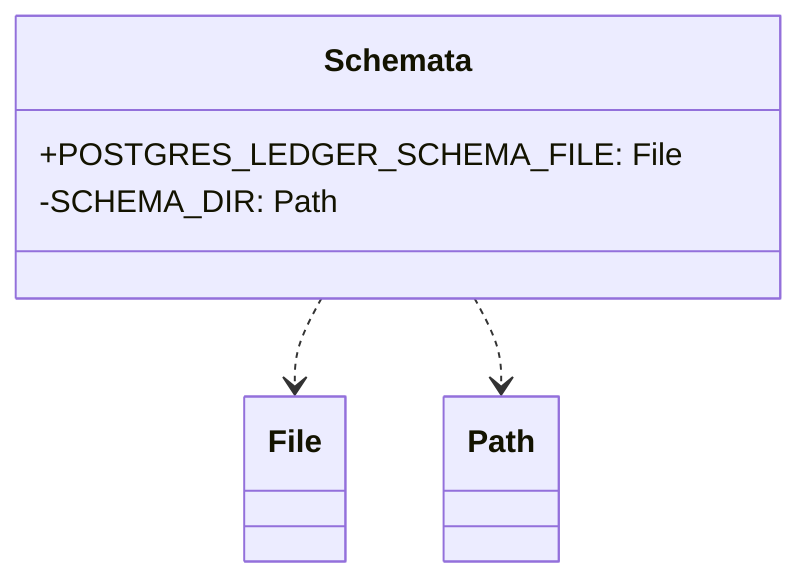

# org.wfanet.measurement.privacybudgetmanager.deploy.postgres.testing

## Overview
Provides testing utilities for PostgreSQL-based Privacy Budget Manager deployments. This package defines schema file references used in test environments to initialize and validate database structures for the ledger component.

## Components

### Schemata.kt

This file provides constant references to PostgreSQL schema files required for testing the Privacy Budget Manager ledger database.

| Constant | Type | Description |
|----------|------|-------------|
| POSTGRES_LEDGER_SCHEMA_FILE | `File` | Reference to the ledger.sql schema file resolved at runtime |
| SCHEMA_DIR | `Path` (private) | Base directory path to the postgres deployment schema files |

## Data Structures

No public data structures are defined in this package.

## Dependencies

- `java.io.File` - File system operations
- `java.nio.file.Paths` - Path construction
- `org.wfanet.measurement.common.getRuntimePath` - Resolves file paths at runtime from the project structure

## Usage Example

```kotlin
import org.wfanet.measurement.privacybudgetmanager.deploy.postgres.testing.POSTGRES_LEDGER_SCHEMA_FILE

// Use in test setup to initialize database schema
fun setupTestDatabase(connection: Connection) {
  val schemaContent = POSTGRES_LEDGER_SCHEMA_FILE.readText()
  connection.createStatement().execute(schemaContent)
}
```

## Class Diagram


