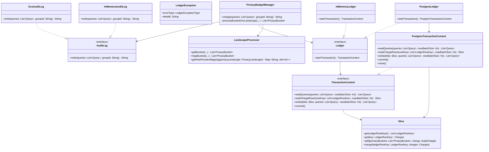

# org.wfanet.measurement.privacybudgetmanager

## Overview
The Privacy Budget Manager (PBM) package provides a comprehensive system for managing differential privacy budgets across measurement operations. It tracks privacy expenditures through a ledger-based architecture, processes privacy landscapes to generate privacy buckets, and maintains an audit log of all charged queries to ensure compliance with privacy budget constraints.

## Components

### PrivacyBudgetManager
Core manager that orchestrates privacy budget charging operations, landscape processing, and audit logging for differential privacy guarantees.

| Method | Parameters | Returns | Description |
|--------|------------|---------|-------------|
| charge | `queries: List<Query>`, `groupId: String` | `String` | Charges PBM with queries and writes to audit log |
| processBucketsForLandscape | `eventDataProviderId: String`, `measurementConsumerId: String`, `inactivelandscapeIdentifier: String`, `eventGroupLandscapeMasks: List<EventGroupLandscapeMask>` | `List<PrivacyBucket>` | Maps buckets from inactive landscape to active landscape |

**Constructor Parameters:**
| Parameter | Type | Description |
|-----------|------|-------------|
| auditLog | `AuditLog` | Transactional logger for charged queries |
| landscapeMappingChain | `List<MappingNode>` | Chain mapping older landscapes to active landscape |
| ledger | `Ledger` | Persistent store for charges and queries |
| landscapeProcessor | `LandscapeProcessor` | Processes landscape transformations |
| maximumPrivacyBudget | `Float` | Maximum privacy budget per bucket |
| maximumTotalDelta | `Float` | Maximum total delta parameter per bucket |
| eventTemplateDescriptor | `Descriptors.Descriptor` | Protobuf descriptor for event templates |

### LandscapeProcessor
Handles processing and transformation of privacy landscape definitions, generating privacy buckets and mapping between landscape versions.

| Method | Parameters | Returns | Description |
|--------|------------|---------|-------------|
| getBuckets | `eventDataProviderName: String`, `measurementConsumerName: String`, `eventGroupLandscapeMasks: List<EventGroupLandscapeMask>`, `privacyLandscape: PrivacyLandscape`, `eventTemplateDescriptor: Descriptors.Descriptor` | `List<PrivacyBucket>` | Generates privacy buckets from landscape and masks |
| mapBuckets | `buckets: List<PrivacyBucket>`, `mapping: PrivacyLandscapeMapping`, `source: PrivacyLandscape`, `target: PrivacyLandscape` | `List<PrivacyBucket>` | Maps buckets from source to target landscape |
| getFieldToIndexMapping | `privacyLandscape: PrivacyLandscape` | `Map<String, Set<Int>>` | Maps field paths to population indices |

**Constants:**
- `NUM_VID_INTERVALS = 300` - Number of VID intervals in [0,1) range

### AuditLog
Interface for managing persistent audit logs of charged privacy budget queries.

| Method | Parameters | Returns | Description |
|--------|------------|---------|-------------|
| write | `queries: List<Query>`, `groupId: String` | `String` | Writes queries to audit log, returns identifier |

### Ledger
Interface for managing persistent storage of privacy buckets, charges, and queries with ACID transaction support.

| Method | Parameters | Returns | Description |
|--------|------------|---------|-------------|
| startTransaction | - | `TransactionContext` | Starts atomic transaction for ledger operations |

### TransactionContext
Manages atomic read and write operations within a privacy budget ledger transaction.

| Method | Parameters | Returns | Description |
|--------|------------|---------|-------------|
| readQueries | `queries: List<Query>`, `maxBatchSize: Int = 1000` | `suspend List<Query>` | Reads queries with their create times from ledger |
| readChargeRows | `rowKeys: List<LedgerRowKey>`, `maxBatchSize: Int = 1000` | `suspend Slice` | Reads charge rows by row keys |
| write | `delta: Slice`, `queries: List<Query>`, `maxBatchSize: Int = 1000` | `suspend List<Query>` | Writes slice and queries to backing store |
| commit | - | `suspend Unit` | Commits transaction atomically |

### PostgresLedger
PostgreSQL-based implementation of the Ledger interface with batched operations and dimension table caching.

| Method | Parameters | Returns | Description |
|--------|------------|---------|-------------|
| startTransaction | - | `PostgresTransactionContext` | Initiates database transaction |

**Constructor Parameters:**
| Parameter | Type | Description |
|-----------|------|-------------|
| createConnection | `() -> Connection` | Factory creating JDBC connections |
| activeLandscapeId | `String` | Identifier of active privacy landscape |

### PostgresTransactionContext
PostgreSQL-specific transaction context with batched SQL operations and ID caching.

| Method | Parameters | Returns | Description |
|--------|------------|---------|-------------|
| readQueries | `queries: List<Query>`, `maxBatchSize: Int = 1000` | `suspend List<Query>` | Reads queries in batches from database |
| readChargeRows | `rowKeys: List<LedgerRowKey>`, `maxBatchSize: Int = 1000` | `suspend Slice` | Reads charge rows in batches |
| write | `delta: Slice`, `queries: List<Query>`, `maxBatchSize: Int = 1000` | `suspend List<Query>` | Writes charges and queries in batches |
| commit | - | `suspend Unit` | Commits PostgreSQL transaction |
| close | - | `Unit` | Rolls back transaction |

### Slice
Represents a set of privacy buckets with their associated charges, enabling aggregation and ledger interactions.

| Method | Parameters | Returns | Description |
|--------|------------|---------|-------------|
| getLedgerRowKeys | - | `List<LedgerRowKey>` | Returns all row keys in this slice |
| get | `key: LedgerRowKey` | `Charges?` | Returns charges for given row key |
| add | `privacyBuckets: List<PrivacyBucket>`, `charge: AcdpCharge` | `Unit` | Adds privacy buckets with charge to slice |
| merge | `ledgerRowKey: LedgerRowKey`, `charges: Charges` | `Unit` | Merges charges into slice at row key |

### LedgerException
Exception thrown by ledger operations with specific error types.

**Constructor Parameters:**
| Parameter | Type | Description |
|-----------|------|-------------|
| errorType | `LedgerExceptionType` | Type of ledger error |
| details | `String?` | Additional error details |
| cause | `Throwable?` | Underlying exception cause |

### GcsAuditLog
Google Cloud Storage-based implementation of AuditLog interface.

| Method | Parameters | Returns | Description |
|--------|------------|---------|-------------|
| write | `queries: List<Query>`, `groupId: String` | `String` | Writes queries to GCS blob storage |

### InMemoryAuditLog
In-memory implementation of AuditLog for testing purposes.

| Method | Parameters | Returns | Description |
|--------|------------|---------|-------------|
| write | `queries: List<Query>`, `groupId: String` | `String` | Writes queries to in-memory storage |

### InMemoryLedger
In-memory implementation of Ledger for testing purposes.

| Method | Parameters | Returns | Description |
|--------|------------|---------|-------------|
| startTransaction | - | `TransactionContext` | Creates in-memory transaction context |

### TestInMemoryLedgerTransactionContext
In-memory transaction context implementation for testing.

| Method | Parameters | Returns | Description |
|--------|------------|---------|-------------|
| readQueries | `queries: List<Query>`, `maxBatchSize: Int` | `suspend List<Query>` | Reads queries from in-memory storage |
| readChargeRows | `rowKeys: List<LedgerRowKey>`, `maxBatchSize: Int` | `suspend Slice` | Reads charge rows from memory |
| write | `delta: Slice`, `queries: List<Query>`, `maxBatchSize: Int` | `suspend List<Query>` | Writes to in-memory storage |
| commit | - | `suspend Unit` | Commits in-memory transaction |
| close | - | `Unit` | Closes in-memory context |

## Data Structures

### LedgerRowKey
Key for identifying a row in the privacy budget ledger.

| Property | Type | Description |
|----------|------|-------------|
| eventDataProviderName | `String` | Name of event data provider |
| measurementConsumerName | `String` | Name of measurement consumer |
| eventGroupReferenceId | `String` | Reference ID for event group |
| date | `LocalDate` | Date of the ledger entry |

### BucketIndex
Index identifying a specific privacy bucket within a landscape.

| Property | Type | Description |
|----------|------|-------------|
| populationIndex | `Int` | Index of population dimension combination |
| vidIntervalIndex | `Int` | Index of VID interval (0-299) |

### PrivacyBucket
Represents a single privacy bucket with its ledger location.

| Property | Type | Description |
|----------|------|-------------|
| rowKey | `LedgerRowKey` | Ledger row containing this bucket |
| bucketIndex | `BucketIndex` | Index within the landscape |

### LandscapeProcessor.LandscapeNode
Configuration of a privacy landscape with its event template.

| Property | Type | Description |
|----------|------|-------------|
| landscape | `PrivacyLandscape` | Privacy landscape definition |
| eventTemplateDescriptor | `Descriptors.Descriptor` | Protobuf descriptor for event template |

### LandscapeProcessor.MappingNode
Wrapper for landscape with its mapping to another landscape.

| Property | Type | Description |
|----------|------|-------------|
| source | `PrivacyLandscape` | Source privacy landscape |
| mapping | `PrivacyLandscapeMapping?` | Optional mapping to target landscape |

### LedgerExceptionType
Enumeration of ledger error types.

| Value | Error Message |
|-------|---------------|
| INVALID_PRIVACY_LANDSCAPE_IDS | Some queries are not targetting the active landscape |
| TABLE_NOT_READY | Database is not ready to receive queries for Given privacy landscape identifier |
| TABLE_METADATA_DOESNT_EXIST | Given privacy landscape identifier not found in PrivacyChargesMetadata table |

### PostgresTransactionContext.ChargesTableState
Enumeration of charges table states.

| Value | Description |
|-------|-------------|
| BACKFILLING | Table is being backfilled with data |
| READY | Table is ready for queries |

## Dependencies

- `com.google.protobuf` - Protocol buffer support for dynamic message handling and descriptors
- `org.wfanet.measurement.common` - Common utilities for date/time conversion
- `org.wfanet.measurement.eventdataprovider.eventfiltration` - Event filtering and CEL program compilation
- `org.wfanet.measurement.eventdataprovider.privacybudgetmanagement` - Exception types for privacy budget operations
- `java.sql` - JDBC connectivity for PostgreSQL ledger
- `kotlinx.coroutines` - Asynchronous coroutine support for suspend functions
- `java.time` - Date and time handling for ledger keys
- `java.util.concurrent` - Concurrent data structures for caching

## Usage Example

```kotlin
// Configure privacy budget manager
val auditLog: AuditLog = PostgresAuditLog(connectionFactory)
val ledger: Ledger = PostgresLedger(connectionFactory, "landscape-v1")
val landscapeProcessor = LandscapeProcessor()
val eventDescriptor: Descriptors.Descriptor = getEventTemplateDescriptor()

val landscapeChain = listOf(
    MappingNode(landscapeV1, null),
    MappingNode(landscapeV2, mappingV1toV2)
)

val pbm = PrivacyBudgetManager(
    auditLog = auditLog,
    landscapeMappingChain = landscapeChain,
    ledger = ledger,
    landscapeProcessor = landscapeProcessor,
    maximumPrivacyBudget = 1.0f,
    maximumTotalDelta = 0.5f,
    eventTemplateDescriptor = eventDescriptor
)

// Charge privacy budget
val queries: List<Query> = buildQueries(requisitions)
val auditReference = pbm.charge(queries, groupId = "report-123")
```

## Class Diagram


