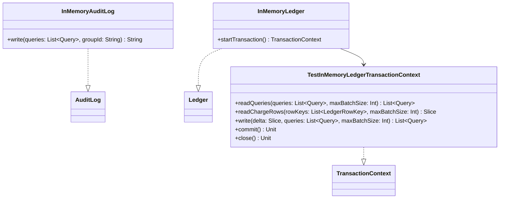

# org.wfanet.measurement.privacybudgetmanager.testing

## Overview
Provides in-memory test implementations of Privacy Budget Manager persistence layer interfaces. This testing package contains stub implementations of AuditLog and Ledger interfaces to support unit testing without requiring actual database or audit log infrastructure.

## Components

### InMemoryAuditLog
In-memory implementation of AuditLog interface for testing purposes.

| Method | Parameters | Returns | Description |
|--------|------------|---------|-------------|
| write | `queries: List<Query>`, `groupId: String` | `String` | Writes queries and group identifier to audit log |

### InMemoryLedger
In-memory implementation of Ledger interface for testing purposes.

| Method | Parameters | Returns | Description |
|--------|------------|---------|-------------|
| startTransaction | - | `TransactionContext` | Creates a new transaction context for ledger operations |

### TestInMemoryLedgerTransactionContext
In-memory transaction context implementation for testing ledger operations.

| Method | Parameters | Returns | Description |
|--------|------------|---------|-------------|
| readQueries | `queries: List<Query>`, `maxBatchSize: Int` | `List<Query>` | Reads existing queries from ledger with creation timestamps |
| readChargeRows | `rowKeys: List<LedgerRowKey>`, `maxBatchSize: Int` | `Slice` | Reads charge rows specified by row keys from ledger |
| write | `delta: Slice`, `queries: List<Query>`, `maxBatchSize: Int` | `List<Query>` | Writes slice and associated queries to ledger |
| commit | - | `Unit` | Commits the current transaction to persistent store |
| close | - | `Unit` | Closes transaction context and releases resources |

## Dependencies
- `org.wfanet.measurement.privacybudgetmanager.AuditLog` - Interface for audit logging operations
- `org.wfanet.measurement.privacybudgetmanager.Ledger` - Interface for privacy budget ledger storage
- `org.wfanet.measurement.privacybudgetmanager.TransactionContext` - Interface for transactional ledger operations
- `org.wfanet.measurement.privacybudgetmanager.Query` - Data structure representing privacy budget queries
- `org.wfanet.measurement.privacybudgetmanager.LedgerRowKey` - Key structure for ledger rows
- `org.wfanet.measurement.privacybudgetmanager.Slice` - Aggregated structure of privacy buckets and charges

## Usage Example
```kotlin
// Create in-memory audit log for testing
val auditLog = InMemoryAuditLog()
val logId = auditLog.write(listOf(query1, query2), "test-group-id")

// Create in-memory ledger for testing
val ledger = InMemoryLedger()
val transaction = ledger.startTransaction()

// Use transaction context for operations
val existingQueries = transaction.readQueries(queries)
val chargeData = transaction.readChargeRows(rowKeys)
val writtenQueries = transaction.write(deltaSlice, newQueries)
transaction.commit()
transaction.close()
```

## Class Diagram


## Implementation Status
Both classes contain TODO placeholders indicating they are currently under development. All public methods are not yet fully implemented and will throw NotImplementedError when invoked.
