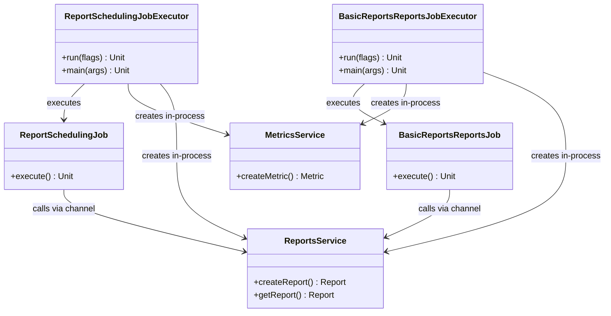

# org.wfanet.measurement.reporting.deploy.v2.common.job

## Overview
This package provides command-line executors for scheduled reporting jobs in the Cross-Media Measurement system. It contains entry points for processing report schedules and monitoring report completion status, orchestrating interactions between internal reporting services, external Kingdom API services, and access control systems.

## Components

### ReportSchedulingJobExecutor
Command-line application that executes scheduled report generation tasks by creating report iterations and managing their lifecycle.

**Main Function:**

| Method | Parameters | Returns | Description |
|--------|------------|---------|-------------|
| run | `reportingApiServerFlags: ReportingApiServerFlags`, `kingdomApiFlags: KingdomApiFlags`, `commonServerFlags: CommonServer.Flags`, `v2AlphaFlags: V2AlphaFlags`, `encryptionKeyPairMap: EncryptionKeyPairMap` | `Unit` | Initializes services and executes report scheduling job |
| main | `args: Array<String>` | `Unit` | Entry point for command-line execution |

**Key Responsibilities:**
- Establishes mutual TLS channels to Reporting API, Kingdom API, and Access API
- Configures in-process gRPC servers for MetricsService and ReportsService
- Instantiates ReportSchedulingJob with necessary dependencies
- Executes job synchronously and manages server lifecycle

### BasicReportsReportsJobExecutor
Command-line application that polls reports associated with BasicReports to verify successful completion and process results.

**Main Function:**

| Method | Parameters | Returns | Description |
|--------|------------|---------|-------------|
| run | `reportingApiServerFlags: ReportingApiServerFlags`, `kingdomApiFlags: KingdomApiFlags`, `commonServerFlags: CommonServer.Flags`, `v2AlphaFlags: V2AlphaFlags`, `encryptionKeyPairMap: EncryptionKeyPairMap`, `eventMessageFlags: EventMessageFlags` | `Unit` | Initializes services and executes basic reports polling job |
| main | `args: Array<String>` | `Unit` | Entry point for command-line execution |

**Key Responsibilities:**
- Establishes mutual TLS channels to Reporting API, Kingdom API, and Access API
- Configures in-process gRPC servers for MetricsService and ReportsService
- Instantiates BasicReportsReportsJob with event descriptor configuration
- Executes job synchronously with shutdown hook for graceful termination

## Architecture

### Service Initialization Pattern
Both executors follow a common pattern:
1. Load TLS certificates from PEM files
2. Build mutual TLS channels to external services
3. Parse configuration files for measurement consumers and metric specifications
4. Create in-process gRPC servers for internal service-to-service communication
5. Wire dependencies into the job implementation
6. Execute job in blocking coroutine context

### In-Process Server Design
Both executors use in-process gRPC servers to isolate service implementations:
- **MetricsService**: Handles metric creation and calculation via in-process channel
- **ReportsService**: Manages report lifecycle and status updates via in-process channel

This design allows job logic to interact with services through well-defined gRPC APIs while maintaining single-process deployment.

### Channel Configuration
All channels are configured with:
- 5-second shutdown timeout
- Optional verbose logging for debugging
- Mutual TLS authentication

## Dependencies

### Internal Reporting Services
- `org.wfanet.measurement.internal.reporting.v2` - Internal reporting API stubs (BasicReports, Measurements, MetricCalculationSpecs, Metrics, ReportScheduleIterations, ReportSchedules, ReportingSets, Reports, ReportResults)

### Kingdom Services
- `org.wfanet.measurement.api.v2alpha` - Kingdom/CMMS public API stubs (Certificates, DataProviders, EventGroups, MeasurementConsumers, Measurements, ModelLines)

### Access Control
- `org.wfanet.measurement.access.v1alpha` - Permissions and authorization services
- `org.wfanet.measurement.access.client.v1alpha.Authorization` - Client for authorization checks

### Reporting Services
- `org.wfanet.measurement.reporting.v2alpha` - Public reporting API stubs (Metrics, Reports)
- `org.wfanet.measurement.reporting.service.api.v2alpha.MetricsService` - Service implementation for metrics operations
- `org.wfanet.measurement.reporting.service.api.v2alpha.ReportsService` - Service implementation for report operations

### Job Implementations
- `org.wfanet.measurement.reporting.job.ReportSchedulingJob` - Core logic for scheduled report execution
- `org.wfanet.measurement.reporting.job.BasicReportsReportsJob` - Core logic for polling report completion

### Configuration
- `org.wfanet.measurement.config.reporting.MeasurementConsumerConfigs` - Measurement consumer configuration protobuf
- `org.wfanet.measurement.config.reporting.MetricSpecConfig` - Metric specification configuration protobuf
- `org.wfanet.measurement.reporting.deploy.v2.common.*` - Common flags and utilities (EncryptionKeyPairMap, EventMessageFlags, KingdomApiFlags, ReportingApiServerFlags, V2AlphaFlags)

### Statistics
- `org.wfanet.measurement.measurementconsumer.stats.VariancesImpl` - Statistical variance calculations for metrics

### gRPC Infrastructure
- `io.grpc.*` - gRPC channel, server, and in-process communication
- `org.wfanet.measurement.common.grpc.*` - Common gRPC utilities (CommonServer, channel builders, interceptors)

### Cryptography
- `org.wfanet.measurement.common.crypto.SigningCerts` - Certificate management
- `org.wfanet.measurement.reporting.service.api.InMemoryEncryptionKeyPairStore` - In-memory storage for encryption keys

### CLI Framework
- `picocli.CommandLine` - Command-line parsing and dependency injection

## Usage Example

```kotlin
// ReportSchedulingJobExecutor execution
fun main(args: Array<String>) {
  val executorArgs = arrayOf(
    "--tls-cert-file=/path/to/cert.pem",
    "--tls-key-file=/path/to/key.pem",
    "--cert-collection-file=/path/to/roots.pem",
    "--internal-api-target=reporting-server:8443",
    "--kingdom-api-target=kingdom-server:8443",
    "--measurement-consumer-config-file=/path/to/mc-config.textproto",
    "--metric-spec-config-file=/path/to/metric-spec.textproto"
  )
  commandLineMain(::run, executorArgs)
}

// BasicReportsReportsJobExecutor execution
fun main(args: Array<String>) {
  val executorArgs = arrayOf(
    "--tls-cert-file=/path/to/cert.pem",
    "--tls-key-file=/path/to/key.pem",
    "--cert-collection-file=/path/to/roots.pem",
    "--internal-api-target=reporting-server:8443",
    "--kingdom-api-target=kingdom-server:8443",
    "--event-descriptor=/path/to/event.desc"
  )
  commandLineMain(::run, executorArgs)
}
```

## Configuration Requirements

Both executors require:

1. **TLS Certificates**: Client certificate, private key, and trusted root certificates for mutual TLS
2. **Service Endpoints**: Target addresses for Reporting API, Kingdom API, and Access API
3. **Measurement Consumer Config**: TextProto file defining measurement consumer configurations
4. **Metric Spec Config**: TextProto file defining metric calculation specifications
5. **Encryption Key Pairs**: Mapping of encryption keys for secure metric computation
6. **Signing Private Keys**: Directory containing private keys for signing operations

Additionally:
- **BasicReportsReportsJobExecutor** requires event descriptor configuration
- Optional verbose gRPC logging can be enabled via flags
- Certificate and data provider caches are configured with 60-minute expiration

## Execution Model

Both executors:
1. Parse command-line arguments using PicoCLI annotations
2. Initialize gRPC infrastructure (channels, servers, services)
3. Execute job logic synchronously using `runBlocking`
4. Perform cleanup and shutdown of channels and servers

**ReportSchedulingJobExecutor**: Executes once and terminates after job completion

**BasicReportsReportsJobExecutor**: Includes shutdown hook to ensure graceful termination of in-process servers

## Class Diagram


