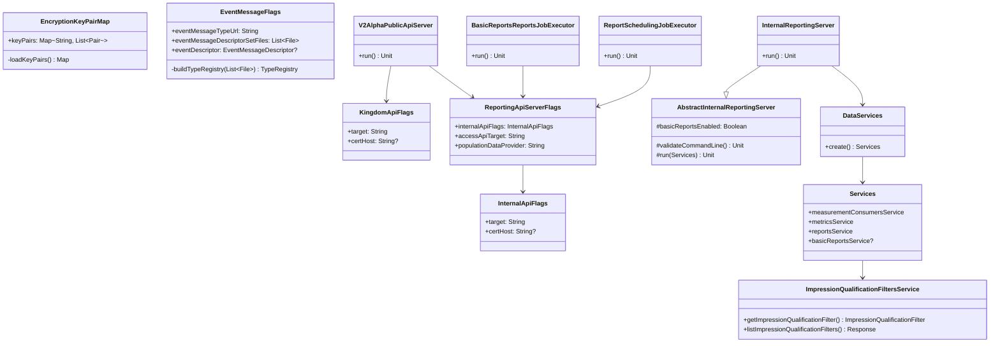

# org.wfanet.measurement.reporting.deploy.v2.common

## Overview
This package provides common deployment infrastructure for the Reporting v2 API system. It contains command-line flag definitions, server implementations, job executors, service factories, and configuration utilities that enable deployment of the reporting platform across different environments with support for both standard reporting and BasicReports functionality.

## Components

### EncryptionKeyPairMap
Manages encryption key pairs for MeasurementConsumers by loading public/private key pairs from disk based on configuration files.

| Property | Type | Description |
|----------|------|-------------|
| keyPairs | `Map<String, List<Pair<ByteString, PrivateKeyHandle>>>` | Lazy-loaded map of principal names to their encryption key pairs |

| Method | Parameters | Returns | Description |
|--------|------------|---------|-------------|
| loadKeyPairs | - | `Map<String, List<Pair<ByteString, PrivateKeyHandle>>>` | Loads encryption keys from configured directory and config file |

### EventMessageFlags
Provides command-line flags for configuring event message descriptors and type information required for BasicReports processing.

| Property | Type | Description |
|----------|------|-------------|
| eventMessageTypeUrl | `String` | Fully qualified name of event message type |
| eventMessageDescriptorSetFiles | `List<File>` | Serialized FileDescriptorSet files containing event message types |
| eventDescriptor | `EventMessageDescriptor?` | Lazy-loaded descriptor for event messages |

| Method | Parameters | Returns | Description |
|--------|------------|---------|-------------|
| buildTypeRegistry | `descriptorSetFiles: List<File>` | `TypeRegistry` | Constructs type registry from descriptor set files |

### InternalApiFlags
Defines connection parameters for the Reporting internal API server.

| Property | Type | Description |
|----------|------|-------------|
| target | `String` | gRPC target authority of internal API server |
| certHost | `String?` | Expected hostname in TLS certificate |

### KingdomApiFlags
Defines connection parameters for the Kingdom public API server.

| Property | Type | Description |
|----------|------|-------------|
| target | `String` | gRPC target authority of Kingdom API server |
| certHost | `String?` | Expected hostname in TLS certificate |

### ReportingApiServerFlags
Comprehensive configuration flags for Reporting API servers including access control, caching, model lines, and feature flags.

| Property | Type | Description |
|----------|------|-------------|
| internalApiFlags | `InternalApiFlags` | Internal API connection configuration |
| accessApiTarget | `String` | gRPC target of Access API server |
| accessApiCertHost | `String?` | TLS certificate hostname for Access API |
| debugVerboseGrpcClientLogging | `Boolean` | Enables detailed gRPC request/response logging |
| eventGroupMetadataDescriptorCacheDuration | `Duration` | Cache duration for event group metadata descriptors |
| defaultVidModelLine | `String` | Default VID model line for EDPs |
| measurementConsumerModelLines | `Map<String, String>` | MeasurementConsumer-specific VID model line overrides |
| baseImpressionQualificationFilters | `List<String>` | Always-applied filters in BasicReports |
| allowSamplingIntervalWrapping | `Boolean` | Enables random sampling interval wrapping |
| populationDataProvider | `String` | Population DataProvider resource name |
| defaultReportStart | `ReportStart?` | Default report start configuration |
| systemMeasurementConsumerName | `String?` | System MeasurementConsumer for API calls |

### SpannerFlags
Command-line flags for connecting to Google Cloud Spanner database, used when BasicReports is enabled.

| Property | Type | Description |
|----------|------|-------------|
| projectName | `String` | Spanner project name |
| instanceName | `String` | Spanner instance name |
| databaseName | `String` | Spanner database name |
| readyTimeout | `Duration` | Timeout for Spanner readiness check |
| emulatorHost | `String?` | Spanner emulator host and port |
| asyncThreadPoolSize | `Int` | Thread pool size for async operations |

### V2AlphaFlags
Configuration flags specific to V2Alpha API version including measurement consumer configs and metric specifications.

| Property | Type | Description |
|----------|------|-------------|
| measurementConsumerConfigFile | `File` | MeasurementConsumerConfig textproto file path |
| signingPrivateKeyStoreDir | `File` | Directory containing signing private keys |
| metricSpecConfigFile | `File` | MetricSpecConfig textproto file path |
| basicReportMetricSpecConfigFile | `File?` | Optional BasicReports-specific metric spec config |

## Subpackages

### job

#### BasicReportsReportsJobExecutor
Daemon process that polls Reports associated with BasicReports to check their completion status.

| Method | Parameters | Returns | Description |
|--------|------------|---------|-------------|
| run | `@Mixin` various flags | `Unit` | Executes BasicReports polling job with configured services |
| main | `args: Array<String>` | `Unit` | Entry point for command-line execution |

**Key Functionality:**
- Creates MetricsService and ReportsService with in-process gRPC servers
- Establishes mTLS channels to reporting, kingdom, and access APIs
- Configures encryption key pairs and event message descriptors
- Executes BasicReportsReportsJob to monitor report completion

#### ReportSchedulingJobExecutor
Process for executing V2Alpha report scheduling operations to create scheduled reports.

| Method | Parameters | Returns | Description |
|--------|------------|---------|-------------|
| run | `@Mixin` various flags | `Unit` | Executes report scheduling job with configured services |
| main | `args: Array<String>` | `Unit` | Entry point for command-line execution |

**Key Functionality:**
- Sets up in-process MetricsService and ReportsService
- Connects to Kingdom API for EventGroups and DataProviders
- Executes ReportSchedulingJob to create scheduled reports
- Cleanly shuts down in-process servers after execution

### server

#### AbstractInternalReportingServer
Abstract base class for internal reporting server implementations providing common configuration and service initialization.

| Method | Parameters | Returns | Description |
|--------|------------|---------|-------------|
| validateCommandLine | - | `Unit` | Validates required flags for BasicReports if enabled |
| getEventMessageDescriptor | - | `Descriptors.Descriptor` | Loads and returns event message descriptor |
| buildTypeRegistry | - | `TypeRegistry` | Builds TypeRegistry from descriptor set files |
| run | `services: Services` | `Unit` | Starts gRPC server with provided services |

| Property | Type | Description |
|----------|------|-------------|
| basicReportsEnabled | `Boolean` | Whether BasicReports service is enabled |
| disableMetricsReuse | `Boolean` | Flag to disable metrics reuse optimization |

#### InternalReportingServer
Concrete implementation that starts all internal Reporting data-layer services in a single blocking server.

| Method | Parameters | Returns | Description |
|--------|------------|---------|-------------|
| run | - | `Unit` | Initializes services with Postgres and optionally Spanner |
| main | `args: Array<String>` | `Unit` | Entry point for server execution |

**Key Functionality:**
- Integrates PostgreSQL for core reporting data
- Optionally enables Spanner for BasicReports when configured
- Creates impression qualification filter mapping from config
- Initializes all internal gRPC services via DataServices factory

#### V2AlphaPublicApiServer
Server daemon for Reporting v2alpha public API services with authentication, authorization, and full service routing.

| Method | Parameters | Returns | Description |
|--------|------------|---------|-------------|
| run | `@Mixin` various flags | `Unit` | Starts public API server with all v2alpha services |
| main | `args: Array<String>` | `Unit` | Entry point for server execution |

**Key Functionality:**
- Implements OpenID Connect authentication via PrincipalAuthInterceptor
- Provides authorization through Access API integration
- Creates in-process MetricsService and ReportsService
- Hosts comprehensive suite of public APIs: DataProviders, EventGroups, Metrics, Reports, ReportingSets, ReportSchedules, MetricCalculationSpecs, BasicReports, ModelLines
- Supports event group metadata descriptor caching with CEL environment
- Configures encryption key stores and certificate caching

### service

#### DataServices
Factory object that creates all internal gRPC service implementations with dependency injection.

| Method | Parameters | Returns | Description |
|--------|------------|---------|-------------|
| create | `idGenerator: IdGenerator`, `postgresClient: DatabaseClient`, `spannerClient: AsyncDatabaseClient?`, `impressionQualificationFilterMapping: ImpressionQualificationFilterMapping?`, `eventMessageDescriptor: Descriptors.Descriptor?`, `disableMetricsReuse: Boolean`, `coroutineContext: CoroutineContext` | `Services` | Creates all internal service implementations |

**Returned Services:**
- MeasurementConsumersService
- MeasurementsService
- MetricsService
- ReportingSetsService
- ReportsService
- ReportSchedulesService
- ReportScheduleIterationsService
- MetricCalculationSpecsService
- BasicReportsService (optional, requires Spanner)
- ImpressionQualificationFiltersService (optional)
- ReportResultsService (optional, requires Spanner)

#### ImpressionQualificationFiltersService
Internal service that provides impression qualification filters based on static configuration mapping.

| Method | Parameters | Returns | Description |
|--------|------------|---------|-------------|
| getImpressionQualificationFilter | `request: GetImpressionQualificationFilterRequest` | `ImpressionQualificationFilter` | Retrieves filter by external ID |
| listImpressionQualificationFilters | `request: ListImpressionQualificationFiltersRequest` | `ListImpressionQualificationFiltersResponse` | Lists filters with pagination |

## Data Structures

### Services
Container for all internal gRPC service implementations.

| Property | Type | Description |
|----------|------|-------------|
| measurementConsumersService | `MeasurementConsumersCoroutineImplBase` | Service for measurement consumer management |
| measurementsService | `MeasurementsCoroutineImplBase` | Service for measurement operations |
| metricsService | `MetricsCoroutineImplBase` | Service for metrics management |
| reportingSetsService | `ReportingSetsCoroutineImplBase` | Service for reporting sets |
| reportsService | `ReportsCoroutineImplBase` | Service for reports |
| reportSchedulesService | `ReportSchedulesCoroutineImplBase` | Service for report schedules |
| reportScheduleIterationsService | `ReportScheduleIterationsCoroutineImplBase` | Service for schedule iterations |
| metricCalculationSpecsService | `MetricCalculationSpecsCoroutineImplBase` | Service for metric calculation specs |
| basicReportsService | `BasicReportsCoroutineImplBase?` | Optional BasicReports service |
| impressionQualificationFiltersService | `ImpressionQualificationFiltersCoroutineImplBase?` | Optional filter service |
| reportResultsService | `ReportResultsCoroutineImplBase?` | Optional results service |

### ReportStart
Nested configuration for default report start times.

| Property | Type | Description |
|----------|------|-------------|
| timeOffset | `TimeOffset` | UTC offset or time zone configuration |
| hour | `Int` | Hour of day for report start |

## Dependencies
- `com.google.protobuf` - Protocol buffer support for message descriptors and type registries
- `io.grpc` - gRPC framework for service implementations and channels
- `org.wfanet.measurement.common` - Common utilities for crypto, database, and identity
- `org.wfanet.measurement.common.grpc` - gRPC utilities for mTLS, channels, and servers
- `org.wfanet.measurement.common.db.r2dbc.postgres` - PostgreSQL database client
- `org.wfanet.measurement.gcloud.spanner` - Google Cloud Spanner database connector
- `org.wfanet.measurement.access.client.v1alpha` - Access control authorization client
- `org.wfanet.measurement.api.v2alpha` - Kingdom API v2alpha protobuf stubs
- `org.wfanet.measurement.internal.reporting.v2` - Internal reporting API protobuf stubs
- `org.wfanet.measurement.reporting.v2alpha` - Public reporting API v2alpha protobuf stubs
- `org.wfanet.measurement.reporting.service.api.v2alpha` - Public API service implementations
- `org.wfanet.measurement.reporting.service.internal` - Internal service utilities
- `org.wfanet.measurement.reporting.job` - Background job implementations
- `org.wfanet.measurement.config.reporting` - Configuration protobuf definitions
- `picocli` - Command-line parsing framework

## Usage Example

```kotlin
// Starting the internal reporting server
fun main(args: Array<String>) {
  commandLineMain(InternalReportingServer(), args)
}

// Command-line invocation
// ./internal_reporting_server \
//   --postgres-host=localhost \
//   --postgres-port=5432 \
//   --postgres-database=reporting \
//   --basic-reports-enabled=true \
//   --spanner-project=my-project \
//   --spanner-instance=reporting-instance \
//   --spanner-database=basic-reports \
//   --impression-qualification-filter-config-file=/path/to/config.textproto \
//   --event-message-descriptor-set=/path/to/descriptors.pb \
//   --event-message-type-url=type.googleapis.com/example.Event

// Loading encryption key pairs
val keyPairMap = EncryptionKeyPairMap()
val keyPairs = keyPairMap.keyPairs
val mcKeyPairs = keyPairs["measurementConsumers/123"]

// Creating data services
val services = DataServices.create(
  idGenerator = RandomIdGenerator(),
  postgresClient = postgresClient,
  spannerClient = spannerClient,
  impressionQualificationFilterMapping = mapping,
  eventMessageDescriptor = descriptor,
  disableMetricsReuse = false,
  coroutineContext = Dispatchers.Default
)
```

## Class Diagram


