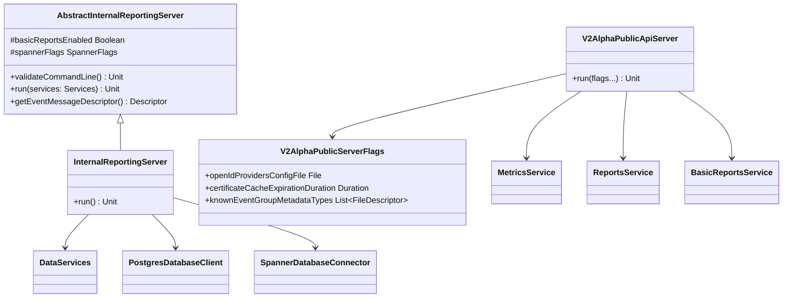

# org.wfanet.measurement.reporting.deploy.v2.common.server

## Overview
This package provides server implementations for the Reporting v2 API, including the internal data-layer server and the public v2alpha API server. These servers configure and deploy gRPC services for measurement reporting, integrating with Kingdom services, access control, and database backends.

## Components

### AbstractInternalReportingServer
Abstract base class for internal reporting server implementations with configurable database backends and optional BasicReports functionality.

| Method | Parameters | Returns | Description |
|--------|------------|---------|-------------|
| validateCommandLine | - | `Unit` | Validates required command-line parameters based on enabled features |
| run | `services: Services` | `suspend Unit` | Starts gRPC server with provided services and blocks until shutdown |
| getEventMessageDescriptor | - | `Descriptors.Descriptor` | Loads and returns event message descriptor from configured files |

**Properties:**
- `basicReportsEnabled: Boolean` - Enables BasicReports service and dependencies
- `impressionQualificationFilterConfigFile: File` - Configuration for impression qualification filtering
- `disableMetricsReuse: Boolean` - Feature flag to disable metrics reuse optimization

### InternalReportingServer
Concrete implementation of AbstractInternalReportingServer using PostgreSQL and optionally Cloud Spanner.

| Method | Parameters | Returns | Description |
|--------|------------|---------|-------------|
| run | - | `Unit` | Initializes database clients, creates services, and starts server |

**Configuration:**
- Mixes in ServiceFlags and PostgresFlags for service and database configuration
- Uses Spanner for BasicReports when enabled
- Creates DataServices with RandomIdGenerator and configured database clients

### V2AlphaPublicApiServer
Public API server exposing Reporting v2alpha gRPC services with authentication and authorization.

| Method | Parameters | Returns | Description |
|--------|------------|---------|-------------|
| run | Multiple flag mixins | `Unit` | Configures channels, clients, services, and starts public API server |

**Key Services Exposed:**
- DataProvidersService
- EventGroupsService
- EventGroupMetadataDescriptorsService
- MetricsService
- ReportsService
- ReportingSetsService
- ReportSchedulesService
- ReportScheduleIterationsService
- MetricCalculationSpecsService
- BasicReportsService
- ModelLinesService

### V2AlphaPublicServerFlags
Command-line flags for V2AlphaPublicApiServer configuration.

| Property | Type | Description |
|----------|------|-------------|
| authorityKeyIdentifierToPrincipalMapFile | `File` | Mapping file for authority key identifiers to principals |
| openIdProvidersConfigFile | `File` | OpenID Connect provider configuration in ProtoJSON |
| certificateCacheExpirationDuration | `Duration` | Expiration time for cached certificates |
| dataProviderCacheExpirationDuration | `Duration` | Expiration time for cached data provider information |
| knownEventGroupMetadataTypes | `List<Descriptors.FileDescriptor>` | File descriptors for known EventGroup metadata types |

## Data Structures

### Services Extension
| Method | Parameters | Returns | Description |
|--------|------------|---------|-------------|
| toList | - | `List<BindableService>` | Converts Services object to list of BindableService using reflection |

## Dependencies

### Internal Dependencies
- `org.wfanet.measurement.reporting.deploy.v2.common.service.DataServices` - Factory for internal data-layer services
- `org.wfanet.measurement.reporting.deploy.v2.common.service.Services` - Service container interface
- `org.wfanet.measurement.reporting.service.api.v2alpha.*` - Public API service implementations
- `org.wfanet.measurement.reporting.service.internal.ImpressionQualificationFilterMapping` - Maps impression qualification filters

### External Dependencies
- `org.wfanet.measurement.common.grpc.CommonServer` - Generic gRPC server infrastructure
- `org.wfanet.measurement.common.db.postgres.PostgresDatabaseClient` - PostgreSQL database client
- `org.wfanet.measurement.gcloud.spanner.SpannerDatabaseConnector` - Google Cloud Spanner client
- `org.wfanet.measurement.access.client.v1alpha.*` - Authentication and authorization clients
- `org.wfanet.measurement.api.v2alpha.*` - Kingdom API client stubs
- `com.google.protobuf.*` - Protocol buffer support for type reflection and parsing
- `io.grpc.*` - gRPC framework for service definitions and channels
- `picocli.*` - Command-line parsing framework

## Usage Example

```kotlin
// Start Internal Reporting Server
fun main(args: Array<String>) {
    commandLineMain(InternalReportingServer(), args)
}

// Example command-line invocation:
// java -jar server.jar \
//   --port=8080 \
//   --postgres-host=localhost \
//   --postgres-database=reporting \
//   --basic-reports-enabled=true \
//   --spanner-project=my-project \
//   --spanner-instance=my-instance \
//   --spanner-database=reporting \
//   --impression-qualification-filter-config-file=/path/to/config.textproto \
//   --event-message-descriptor-set=/path/to/descriptors.pb \
//   --event-message-type-url=type.googleapis.com/wfa.Event \
//   --disable-metrics-reuse=false
```

```kotlin
// Start V2Alpha Public API Server
fun main(args: Array<String>) {
    commandLineMain(V2AlphaPublicApiServer::run, args)
}

// Example command-line invocation:
// java -jar public-api-server.jar \
//   --port=8443 \
//   --tls-cert-file=/certs/server.pem \
//   --tls-key-file=/certs/server-key.pem \
//   --cert-collection-file=/certs/ca.pem \
//   --internal-api-target=internal-server:8080 \
//   --kingdom-api-target=kingdom:8443 \
//   --access-api-target=access:8443 \
//   --measurement-consumer-config-file=/config/mc-config.textproto \
//   --metric-spec-config-file=/config/metric-spec.textproto \
//   --open-id-providers-config-file=/config/oidc.json
```

## Class Diagram



## Architecture Notes

### InternalReportingServer
The internal server operates in two modes:
1. **Basic mode**: Uses only PostgreSQL for standard reporting services
2. **BasicReports mode**: Adds Cloud Spanner integration for advanced reporting with event-level data processing

When BasicReports is enabled, additional validation ensures:
- Spanner connection parameters are provided
- Impression qualification filter configuration is available
- Event message descriptors are loaded

### V2AlphaPublicApiServer
The public API server implements a multi-layer architecture:
1. **Channel Layer**: Establishes mutual TLS connections to internal services, Kingdom API, and access control
2. **Authentication Layer**: Integrates OpenID Connect with principal-based authorization
3. **Service Layer**: Exposes v2alpha gRPC services with authorization interceptors
4. **Cache Layer**: Implements caching for certificates and data providers
5. **In-Process Layer**: Uses in-process channels for internal service composition

The server automatically provisions measurement consumers from configuration on startup and validates impression qualification filters against the internal database.
