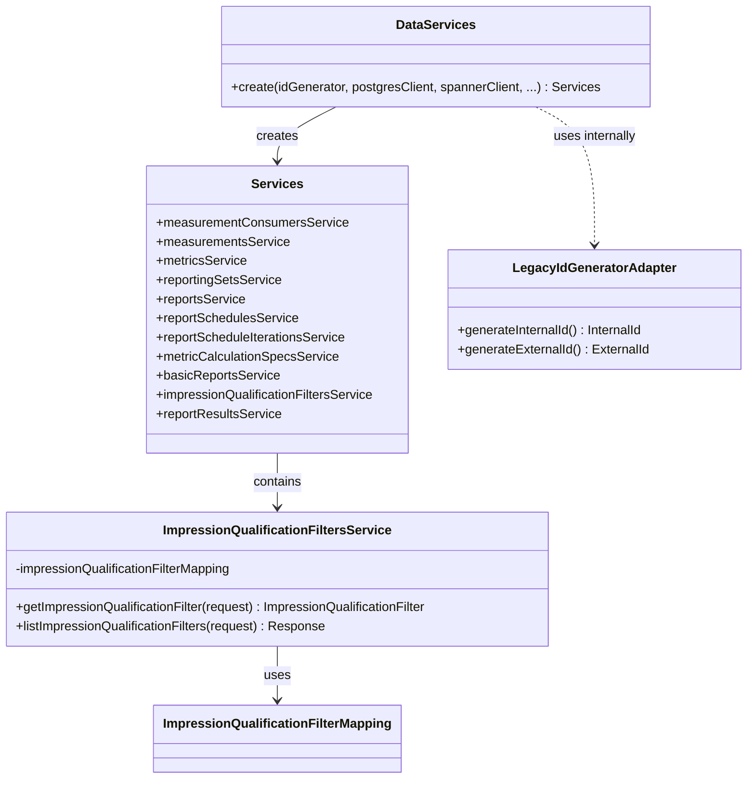

# org.wfanet.measurement.reporting.deploy.v2.common.service

## Overview
This package provides service factory infrastructure and common service implementations for the Reporting v2 deployment layer. It orchestrates the creation of gRPC service instances backed by either PostgreSQL or Google Cloud Spanner, and provides a configuration-based implementation for impression qualification filter management.

## Components

### DataServices
Factory object that creates and wires all internal reporting services with their respective database backends and dependencies.

| Method | Parameters | Returns | Description |
|--------|------------|---------|-------------|
| create | `idGenerator: IdGenerator`, `postgresClient: DatabaseClient`, `spannerClient: AsyncDatabaseClient?`, `impressionQualificationFilterMapping: ImpressionQualificationFilterMapping?`, `eventMessageDescriptor: Descriptors.Descriptor?`, `disableMetricsReuse: Boolean`, `coroutineContext: CoroutineContext` | `Services` | Instantiates all reporting services with configured backends |

### ImpressionQualificationFiltersService
Internal gRPC service implementation for managing impression qualification filters based on static configuration mappings.

| Method | Parameters | Returns | Description |
|--------|------------|---------|-------------|
| getImpressionQualificationFilter | `request: GetImpressionQualificationFilterRequest` | `ImpressionQualificationFilter` | Retrieves filter by external ID from mapping |
| listImpressionQualificationFilters | `request: ListImpressionQualificationFiltersRequest` | `ListImpressionQualificationFiltersResponse` | Returns paginated list of filters with token support |

**Constants:**
- `MAX_PAGE_SIZE`: 100
- `DEFAULT_PAGE_SIZE`: 50

## Data Structures

### Services
Container for all instantiated reporting service implementations.

| Property | Type | Description |
|----------|------|-------------|
| measurementConsumersService | `MeasurementConsumersCoroutineImplBase` | Manages measurement consumer entities |
| measurementsService | `MeasurementsCoroutineImplBase` | Handles measurement data operations |
| metricsService | `MetricsCoroutineImplBase` | Processes metric calculations and storage |
| reportingSetsService | `ReportingSetsCoroutineImplBase` | Manages reporting set configurations |
| reportsService | `ReportsCoroutineImplBase` | Orchestrates report generation workflow |
| reportSchedulesService | `ReportSchedulesCoroutineImplBase` | Handles scheduled report configurations |
| reportScheduleIterationsService | `ReportScheduleIterationsCoroutineImplBase` | Tracks individual schedule execution instances |
| metricCalculationSpecsService | `MetricCalculationSpecsCoroutineImplBase` | Manages metric calculation specifications |
| basicReportsService | `BasicReportsCoroutineImplBase?` | Spanner-backed basic reports (optional) |
| impressionQualificationFiltersService | `ImpressionQualificationFiltersCoroutineImplBase?` | Filter management service (optional) |
| reportResultsService | `ReportResultsCoroutineImplBase?` | Spanner-backed report results (optional) |

### LegacyIdGeneratorAdapter
Private adapter class that bridges new `IdGenerator` interface to legacy `LegacyIdGenerator` interface, wrapping generated IDs in `InternalId` and `ExternalId` types.

## Dependencies
- `com.google.protobuf` - Provides descriptor support for event message schemas
- `org.wfanet.measurement.common.db.r2dbc` - R2DBC database client for PostgreSQL access
- `org.wfanet.measurement.gcloud.spanner` - Async client for Google Cloud Spanner operations
- `org.wfanet.measurement.common` - ID generation utilities
- `org.wfanet.measurement.common.identity` - Internal/external ID type definitions
- `org.wfanet.measurement.internal.reporting.v2` - Internal gRPC service interfaces and messages
- `org.wfanet.measurement.reporting.deploy.v2.postgres` - PostgreSQL service implementations
- `org.wfanet.measurement.reporting.deploy.v2.gcloud.spanner` - Spanner service implementations
- `org.wfanet.measurement.reporting.service.internal` - Filter mapping and exception types
- `io.grpc` - gRPC status handling

## Usage Example
```kotlin
val services = DataServices.create(
  idGenerator = snowflakeIdGenerator,
  postgresClient = r2dbcDatabaseClient,
  spannerClient = asyncSpannerClient,
  impressionQualificationFilterMapping = filterConfig,
  eventMessageDescriptor = Event.getDescriptor(),
  disableMetricsReuse = false,
  coroutineContext = Dispatchers.Default
)

// Access individual services
val reports = services.reportsService
val metrics = services.metricsService

// Use optional Spanner services if available
services.basicReportsService?.let { basicReports ->
  // Process basic reports
}
```

## Class Diagram


## Key Design Patterns

### Conditional Service Instantiation
The `DataServices.create()` method conditionally creates Spanner-backed services (`basicReportsService`, `impressionQualificationFiltersService`, `reportResultsService`) only when all required dependencies are present. This allows the same factory to support deployments with or without Spanner.

### Adapter Pattern
The internal `LegacyIdGeneratorAdapter` class delegates to the new `IdGenerator` interface while implementing the legacy `LegacyIdGenerator` interface, wrapping primitive long IDs in type-safe `InternalId` and `ExternalId` wrappers.

### Config-Based Implementation
`ImpressionQualificationFiltersService` implements gRPC service methods by delegating to an immutable `ImpressionQualificationFilterMapping` configuration object, avoiding database lookups for static filter definitions.
